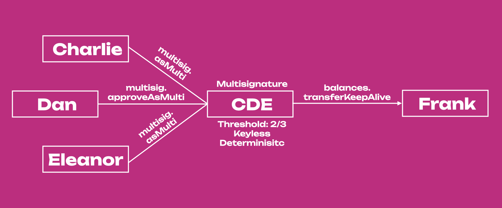

<!-- MessageBox -->
<div id="messageBox" class="floating-message-box">
  <p>
    Polkadot-JS is for developers and power users only. If you need help using the Polkadot-JS UI, you can contact the
    <a href="https://support.polkadot.network/support/home" target="_blank" rel="noopener noreferrer">
      Polkadot Support Team.
    </a>
  </p>
  <button class="close-messagebox" aria-label="Close message">✖</button>
</div>

## Creating a Multisig Account

Check the "How to create a multisig account" section on
[this support page](https://support.polkadot.network/support/solutions/articles/65000181826-how-to-create-and-use-a-multisig-account).
We recommend trying out the tutorial on
[Westend network](../maintain/maintain-networks.md#westend-test-network) - Polkadot's testnet.

## Multisig Transactions with Accounts Tab

!!!info "Walkthrough Video Tutorial"
    See [this video tutorial](https://www.youtube.com/watch?v=-cPiKMslZqI) to learn how to transact with a multisig account using the Accounts Tab in the [Polkadot-JS UI](https://polkadot.js.org/apps/#/accounts).

You can create a multisig account directly on the Accounts Tab of the
[Polkadot-JS UI](https://polkadot.js.org/apps/#/accounts), and use this account to send funds. See
[this support article](https://support.polkadot.network/support/solutions/articles/65000181826-how-to-create-and-use-a-multisig-account)
for more information.

## Multisig Transactions with Extrinsic Tab

See the video tutorial below to learn about multi-signature accounts and how you can transact with
them using the Polkadot-JS UI.

<div className="row">
<div className="col text--center">
    <a href="https://youtu.be/Qv_nJVcvQr8?t=2109">
      
    </a>
    <p>
      <a href="https://youtu.be/Qv_nJVcvQr8?t=2109">Transact with Multi-signature Accounts</a>
    </p>
  </div>
</div>

There are three types of actions you can take with a multisig account:

- Executing a call `asMulti`. This is used to begin or end a multisig transaction.
- Approving a call `approveAsMulti`. This is used to approve an extrinsic and pass-on to the next
  signatory (see [example below](#example-using-multisig-accounts) for more information).
- Cancelling a call `cancelAsMulti`.

!!!info
    Check out [this page](https://polkadot.js.org/docs/substrate/extrinsics#multisig) for more information about the actions you can take with a multi-signature account.

In scenarios where only a single approval is needed, a convenience method `as_multi_threshold_1`
should be used. This function takes only the other signatories and the raw call as arguments. Note
that the Polkadot-JS UI does not have integration for this call because it is not possible to create
multisig accounts with `threshold=1`. If you want to create a multisig with threshold 1, you can use
[txwrapper-core](https://github.com/paritytech/txwrapper-core), which is developed and supported by
Parity Technologies. There is a detailed
[multisig example](https://github.com/paritytech/txwrapper-core/tree/main/packages/txwrapper-examples/multisig)
that you can try out and change to see how it works.

However, in anything but the simple one approval case, you will likely need more than one of the
signatories to approve the call before finally executing it.

### Multisig Call Deposit

When you create a new multi-sig call, you will need to place a
[deposit](../general/chain-state-values.md#multisig-deposit-base). The deposit stays locked until
the call is executed. This deposit is to establish an economic cost on the storage space that the
multisig call takes up in the chain state and discourage users from creating multisig calls that
never get executed. The deposit will be reserved in the call initiator's account.

The deposit is dependent on the `threshold` parameter and is calculated as follows:

```
Deposit = depositBase + threshold * depositFactor
```

Where [`depositBase`](../general/chain-state-values.md#multisig-deposit-base) and
[`depositFactor`](../general/chain-state-values.md#multisig-deposit-factor) are chain constants set
in the runtime code.

The other signatory accounts should have enough funds to pay for the transaction fees associated
with approving the multisig call. The deposit is for the call; that is, other signatories will not
need to place additional deposits. Once the multisig call is executed or rejected, the deposit is
released on the account that initiated the call.

### Example using Multisig Accounts

!!!info "Walk-through video tutorial"
    See [this video tutorial](https://www.youtube.com/watch?v=T0vIuJcTJeQ) to learn how to transact with a multisig account using the Extrinsic Tab in the [Polkadot-JS UI](https://polkadot.js.org/apps/#/explorer).



Let's consider an example of a multisig on Polkadot with a threshold of 2 and 3 signers: Charlie,
Dan, and Eleanor. First, Charlie will create the call on-chain by calling the `multisig.asMulti`
extrinsic with the raw call, in this case, a balance transfer (`balances.transferKeepAlive`
extrinsic) from multisig CDE to Frank's account. When doing this, Charlie will have to deposit
`DepositBase + (2 * DepositFactor) = 20.152 DOT` while he waits for either Dan or Eleanor also to
approve the balance transfer call using the `multisig.approveAsMulti` or the `multisig.asMulti`
extrinsics.

If Dan submits the `multisig.approveAsMulti` extrinsic, he approves Charlie's call but he passes on
the final approval to Eleanor. So, although the multisig has threshold 2, in this case all 3/3
signatories need to participate in the transaction approval. Eleanor will need to submit a
`multisig.asMulti` or `multisig.approveAsMulti` extrinsic to transfer funds from CDE to Frank.

Alternatively, Dan or Eleanor can just submit a `multisig.asMulti` extrinsic after Charlie to
transfer the funds. In this case, 2/3 signatories will participate in the transaction approval. The
accounts approving Charlie's call will not need to place the deposit, and Charlie will receive his
deposit back once the transfer is successful or canceled. To cancel the transaction, Dan or Eleanor
can use the `multisig.cancelAsMulti` extrinsic.

Note that multisigs are **deterministic**, which means that multisig addresses are generated from
the addresses of signers and the threshold of the multisig wallet. No matter the order of the
signatories' accounts, the multisig will always have the same address because accounts' addresses
are sorted in ascending order.

!!!note "Addresses that are provided to the multisig wallet are sorted"
    Public keys of signers' wallets are compared byte-for-byte and sorted ascending before being used to generate the multisig address. For example, consider the scenario with three addresses, A, B, and C, starting with `5FUGT`, `5HMfS`, and `5GhKJ`. If we build the ABC multisig with the accounts in that specific order (i.e. first A, then B, and C), the real order of the accounts in the multisig will be ACB. If, in the Extrinsic tab, we initiate a multisig call with C, the order of the other signatories will be first A, then B. If we put first B, then A, the transaction will fail.

This has some implications when using the Extrinsics tab on the
[Polkadot-JS UI](https://polkadot.js.org/apps/#/accounts) to perform multisig transactions. If the
order of the _other signatories_ is wrong, the transaction will fail. This does not happen if the
multisig is executed directly from the Accounts tab (recommended). The Polkadot-JS UI supports
multisig accounts, as documented on the [Account Generation page](./learn-account-multisig.md). You
can see our video tutorials for more information about creating multisig accounts and transacting
with them using both the [Accounts Tab](https://www.youtube.com/watch?v=-cPiKMslZqI) and the
[Extrinsic Tab](https://www.youtube.com/watch?v=T0vIuJcTJeQ) in the Polkadot-JS UI.

## Decoding Multisig Call Data

!!!info
    Before signing a transaction, it is important to know the exact specifics of what is being signed. Check the ["How to use a multisig account"](https://support.polkadot.network/support/solutions/articles/65000181826-how-to-create-and-use-a-multisig-account) in the support docs on how to decode the multisig call data.
