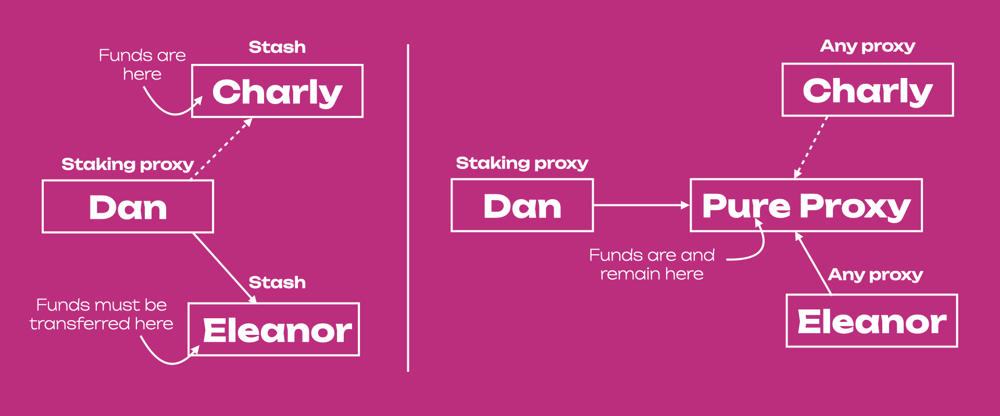
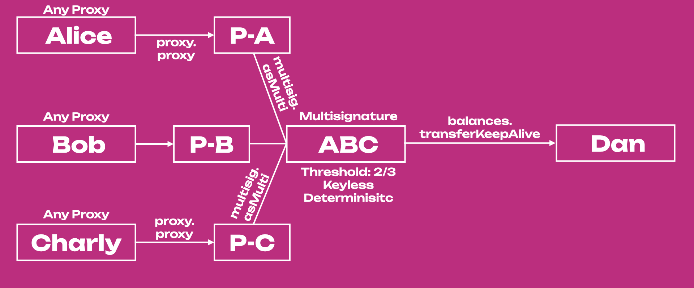

<!-- MessageBox -->

  

    Polkadot-JS is for developers and power users only. If you need help using the Polkadot-JS UI, you can contact the
    <a href="https://support.polkadot.network/support/home" target="_blank" rel="noopener noreferrer">
      Polkadot Support Team.
    </a>
  

  <button class="close-messagebox" aria-label="Close message">✖</button>

!!!caution "The Account Tab in the Polkadot-JS UI cannot handle complex proxy setups"
    The Accounts Tab in the Polkadot-JS UI cannot handle complex proxy setups (e.g. a proxy -> multisig -> a pure proxy which is part of another multisig). These complex setups must be done using the [Extrinsics Tab](https://polkadot.js.org/apps/#/extrinsics) directly.
        
    **We recommend to use the [Westend Testnet](learn-DOT.md#getting-tokens-on-the-westend-testnet) if you are testing features for the first time.** By performing the complex proxy setups on the testnet, you can comfortably replicate the procedure on the main networks.

!!!danger "Risk of loss of funds"
    Read carefully the text below and before performing any action using pure proxies, experiment on the Westend testnet.

## Create and Remove Pure Proxies with Polkadot-JS

To create a **pure proxy** see
[this support article](https://support.polkadot.network/support/solutions/articles/65000182196), or
watch [this technical explainer video](https://www.youtube.com/watch?v=T443RcCYP24).

!!!caution "Removing Pure Proxies"
    The procedure for removing a _pure_ proxy is different from the one used to remove other proxies. Visit the section "Removing an Anonymous Proxy" on [this support article](https://support.polkadot.network/support/solutions/articles/65000182196), or watch [this technical explainer video](https://www.youtube.com/watch?v=T443RcCYP24).

Learn more about pure proxies from our
[technical explainer video](https://www.youtube.com/watch?v=YkYApbhU3i0).

## Advanced Account Management with Pure Proxies

!!!info "Walk-through tutorial video of Account Management"
    You can see [this video tutorial](https://www.youtube.com/watch?v=YkYApbhU3i0) that goes through the example below. The tutorial requires some familiarity with the Extrinsic Tab of the Polkadot-JS UI.

Let's take for example 3 accounts belonging to Charlie, Dan and Eleanor working for Company X.
Charlie holds funds belonging to Company X, but he wants to leave the company and transfer the
economic responsibility to Eleanor. Dan is a staking proxy of Charlie.

**Without _Pure_ Proxy**, Charlie must (see _left_ side of the Figure below):

- Remove Dan as a staking proxy, this step requires 1 signature
- Stop nominating and unbound all funds , this step requires 2 signatures
- Transfer the funds to Eleanor, this step requires 1 signature

Then Eleanor adds Dan as a staking proxy (1 signature). The whole process requires 5 signatures.
Here we are presenting a simple example, in fact, with multi-signature accounts and multiple proxies
the procedure would be more time-consuming and labor-intensive.

**With _Pure_ Proxy** (see _right_ side of the Figure above), Charlie must add Eleanor as _any_
proxy of the _pure_ proxy, and remove himself (or Eleanor can remove him). The process requires just
2 signatures (1 signature to add the new _any_ proxy and 1 signature the remove the old one). The
funds remain in the _pure_ proxy, and it is not necessary to stop nominating or unbond funds. Also,
any proxy relationships with the _pure_ proxy stay in place. Thus, if we use the _pure_ proxy, with
an increasing number of proxies we will always have to sign twice (not necessarily true in
multi-signature accounts). While if we are not using the _pure_ proxy, the more the proxies the more
signatures we need to detach them from the old stash and attach them to the new stash (see Figure
below).

## Pure Proxies and Multisigs

### Scenario One: One Pure Proxy within a Multisig

!!!info "Walk-through tutorial video"
    You can see [this video tutorial](https://www.youtube.com/watch?v=iGRoGstB_pQ) that goes through this scenario. The tutorial requires some familiarity with the Extrinsic Tab of the Polkadot-JS UI.

It is possible to put a _pure_ proxy within a multisig, and then transactions will be signed by the
_any_ proxy on behalf of the _pure_ proxy (proxied account). Let's take for example the diagram
below. Alice, Bob and Anon are part of the multisig ABC, a multisig account with threshold 2. P-C is
a _pure_ proxy spawned by Charlie, who now acts as _any_ proxy and thus signs anything on behalf of
P-C. The _pure_ proxy cannot sign directly because it does not have a private key. So, for example,
to send funds from the multisig to Dan, Charly needs to submit a `proxy.proxy` extrinsic to P-C,
which in turn will submit a `multisig.asMulti` extrinsic to ABC containing the call data for the
`balances.transferKeepAlive` extrinsic about the transfer of some funds from ABC to Dan. Alice can
then approve the transfer by submitting a `multisig.asMulti` extrinsic also containing the call data
for the `balances.transferKeepAlive` extrinsic about the transfer of some funds from ABC to Dan.

If Charly wants to leave the multisig, a new _any_ proxy can be added to P-C and Charly can be
removed (by himself or by the new _any_ proxy). Note that the multisig also contains Bob that in
this specific example does not do anything.

!!!note "Proxy calls"
    To use a _pure_ proxy within a multisig you need to use the Extrinsic Tab and generate a `proxy.proxy` extrinsic. If you try to sign a multisig transaction using the _pure_ proxy you will be prompted with a warning. Remember, you cannot sign something directly if you do not have a private key.

### Scenario Two: Multisig made of Pure Proxies

!!!info "Walk-through Tutorial Video"
    You can see [this video tutorial](https://www.youtube.com/watch?v=F82C3zDNJyk) that goes through this scenario. The tutorial requires some familiarity with the Extrinsic Tab of the Polkadot-JS UI.

The diagram below shows a multisig that is made only with _pure_ proxies (P-A, P-B and P-C). In this
situation Alice, Bob or Charly can leave the multisig at any time without the requirement of
creating a new multisig. If for example, Bob leaves the multisig the procedure will require somebody
else to be added as _any_ proxy to P-B, and then Bob can remove himself (or the new _any_ proxy can
remove Bob).

In the diagram above, Alice submits the `proxy.proxy` extrinsic to P-A, which in turn submits the
`multisig.asMulti` extrinsic containing the `balances.transferKeepAlive` extrinsic about the
transfer of some tokens from ABC to Dan. Then, Charly does the same to confirm the transaction. Note
that Charly will need to pay for some weight, for the computation that is necessary to execute the
transaction.

### Scenario Three: Multisig controlling a Pure Proxy

This setup is used by the [MultiX](../general/multisig-apps.md#multix-by-chainsafe) tool.

After its creation, a multi-signature account creates a pure proxy that becomes the proxied account.
The multi-signature account behaves as _any_ proxy of the pure. If signatories of the
multi-signature account change, a new multisig can be created, assigned as _any_ proxy of the pure,
and then the old multisig can be removed as a proxy.

Compared to [Scenario Two](#scenario-two-multisig-made-of-pure-proxies), signatories do not need to
create pure proxies here. Multisig controlling a Pure Proxy is a more practical solution, where the
signatories, number of signatories and/or the threshold can be changed, which changes the multisig
address but does not impact the pure proxy address. In Scenario Two, if signatories behind the pure
proxies change, the address of the multisig stays the same. However, changing the number of
signatories and threshold would not be possible.
