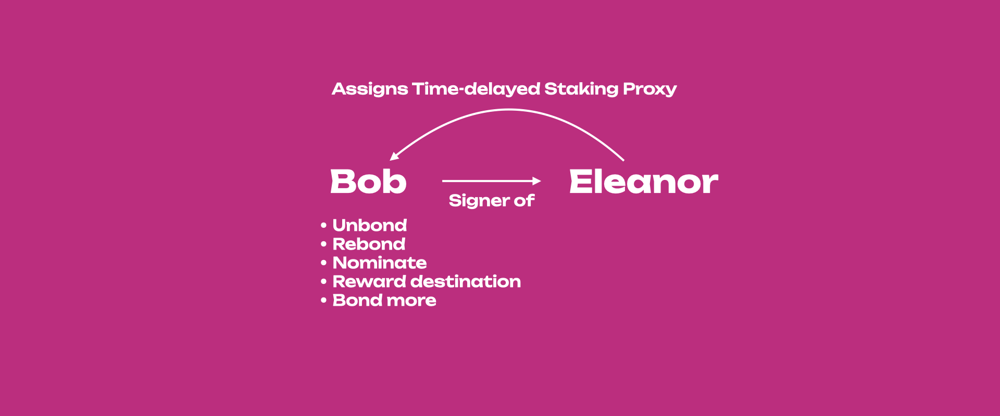

import RPC from "./../../components/RPC-Connection";

Proxies allow users to use an account (it can be in cold storage or a hot wallet) less frequently
but actively participate in the network with the weight of the tokens in that account. Proxies are
allowed to perform a limited amount of actions related to specific
[substrate pallets](https://docs.substrate.io/reference/frame-pallets/) on behalf of another
account. The video below contains more information about using proxies.

:::tip Know how to check the calls and pallets accessible by proxies

For the latest information on the calls and pallets that can be fully accessed by proxies, check the
[source code in the runtime folder](https://github.com/paritytech/polkadot-sdk/blob/153543b0c8c582e73f520e5c08cbe33bddfb5f69/runtime/polkadot/src/lib.rs#L1158)
on the [Polkadot repository](https://github.com/paritytech/polkadot-sdk)

:::

## Creating Proxy with Polkadot-JS

To create a proxy account with Polkadot-JS read
[this support article](https://support.polkadot.network/support/solutions/articles/65000182179-how-to-create-a-proxy-account).

## Removing Proxy with Polkadot-JS

Read the section "Removing Proxies" on
[this support page](https://support.polkadot.network/support/solutions/articles/65000182179-how-to-create-a-proxy-account)
to learn how to remove proxies.

## View your Proxy on Polkadot-JS

To view your proxy, just go on the _Accounts_ menu in the Polkadot-JS UI, next to the proxied
account you will notice a blue icon. Hover on it, and you will see _Proxy overview_. Click on it and
you will be presented with a list of all proxies for that account.

Additionally, you can head over to the _Chain State_ tab (underneath the _Developer_ menu) on
[Polkadot-JS Apps](https://polkadot.js.org/apps/?rpc=wss%3A%2F%2Frpc.polkadot.io#/chainstate). If
you've created your proxy on a {{ polkadot: Polkadot :polkadot }}{{ kusama: Kusama :kusama }}
account, it is required to change your network accordingly using the top left navigation button. On
this page, the proxy pallet should be selected, returning the announcements and proxies functions.
The proxies function will allow you to see your created proxies for either one account or for all
accounts (using the toggle will enable this). Proxy announcements are what time lock proxies do to
announce they are going to conduct an action.

## Set-up and Use of Time-delayed Proxies with Polkadot-JS

:::info

See [this video tutorial](https://youtu.be/3L7Vu2SX0PE) to learn how you can setup and use
time-delayed proxies. The video goes through the example below.

:::

Initially the time time-delayed proxy announces its intended action using the `proxy.announce`
extrinsic and will wait for the number of blocks defined in the delay time before executing it. The
proxy will include the hash of the intended function call in the announcement. Within this time
window, the intended action may be canceled by accounts that control the proxy. This can be done by
the proxy itself using the `proxy.removeAnnouncement` extrinsic or by the proxied account using the
the `proxy.rejectAnnouncement` extrinsic. Now we can use proxies knowing that any malicious actions
can be noticed and reverted within a delay period. After the time-delay, the proxy can use the
`proxy.proxyAnnounced` extrinsic to execute the announced call.

Let's take for example the stash account Eleanor setting Bob as a time-delayed staking proxy. In
this way, if Bob submits an extrinsic to change the reward destination, such extrinsic can be
rejected by Eleanor. This implies that Eleanor monitors Bob, and that within the time-delay she can
spot the announced extrinsic. Eleanor can check all the proxy call announcements made by her
account's proxies on-chain. On Polkadot-JS UI, go to Developer > Storage > Proxy > Announcements to
check the hashes for the calls made by the proxy accounts and the block height at which they are
enabled for execution.

:::info

If you try to use `proxy.proxyAnnounced` to execute the call within the time-delay window you will
get an error "Proxy unannounced" since the announcement will be done after the time delay. Also note
that regular `proxy.proxy` calls do not work with time-delayed proxies, you need to announce the
call first and then execute the announced call on a separate transaction.

:::
