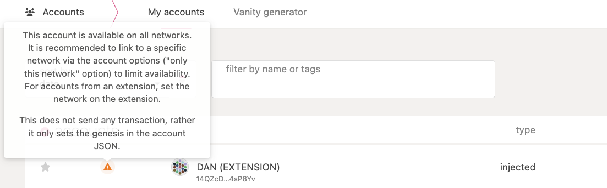
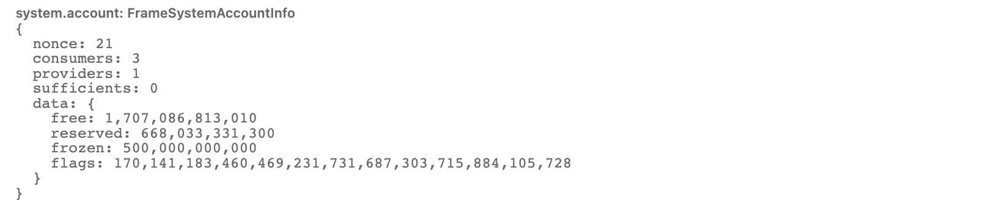

import Tabs from "@theme/Tabs"; import TabItem from "@theme/TabItem"; import DocCardList from
'@theme/DocCardList';

<!-- MessageBox -->
<div id="messageBox" class="floating-message-box">
  <p>
    Polkadot-JS is for developers and power users only. If you need help using the Polkadot-JS UI, you can contact the
    <a href="https://support.polkadot.network/support/home" target="_blank" rel="noopener noreferrer">
      Polkadot Support Team.
    </a>
  </p>
  <button class="close-messagebox" aria-label="Close message">✖</button>
</div>

<!-- TODO: INDEX CARDS -->

## Account Address Format

An account created on the relay chain can also be used on multiple chains in the ecosystem. More
specifically, the account of a chain that uses the `*25519` account address format (the latest list
can be accessed on the
[ss58 registry repository](https://github.com/paritytech/ss58-registry/blob/main/ss58-registry.json))
is cross-compatible with all the chains that use the similar format. To switch between the accounts
on different chains, you can follow the guidelines in
[this support article](https://support.polkadot.network/support/solutions/articles/65000103707-can-i-use-the-same-account-on-polkadot-kusama-and-parachains-).
[Subscan has a tool](https://polkadot.subscan.io/tools/format_transform) you can use to convert your
address between the different chain formats.

!!!info "Using the same account on multiple chains - Pros and Cons"
    The address format differs from chain to chain, but that difference is only visual. The same private
key can be used to sign transactions on behalf of the respective accounts on multiple chains. Using
a single account on multiple chains is convenient, as you do not have to deal with multiple mnemonic
phrases or private keys. But, if your account gets compromised on one chain, the attacker can gain
full access to the accounts on all other chains. This also has implications for the account holder's
privacy, as knowing the identity of an account on one chain can expose the account holder's identity
on all the chains. In the Accounts tab, the Polkadot-JS UI displays a warning message next to each
Account you are using on multiple chains and recommends using different Accounts on different chains
(see below).



On Polkadot-JS Extension, you can copy your address by clicking the account's icon while the desired
chain format is active. E.g. selecting "Substrate" as the format will change your address, and
clicking the colorful icon of your account will copy it in that format.

## Polkadot-JS Browser Extension

<div className="row">
  <div className="col text--center">
    <a href="https://www.youtube.com/watch?v=DNU0p5G0Gqc">
      
    </a>
    <p>
      <a href="https://www.youtube.com/watch?v=DNU0p5G0Gqc">Polkadot-JS Browser Extension Tutorial</a>
    </p>
  </div>
</div>

!!!info
    For guidelines about how to create an account using the Polkadot Extension, see
[**this video tutorial**](https://youtu.be/DNU0p5G0Gqc) and visit
[**this support article**](https://support.polkadot.network/support/solutions/articles/65000098878-how-to-create-a-dot-account).

The Polkadot-JS Browser Extension (the Polkadot Extension) provides a reasonable balance of security
and usability. It provides a separate local mechanism to generate your address and interact with
Polkadot.

This method involves installing the Polkadot Extension and using it as a “virtual vault," separate
from your browser, to store your private keys. It also allows the signing of transactions and
similar functionality.

It is still running on the same computer you use to connect to the internet and thus is less secure
than using Parity Signer or other air-gapped approaches.

### Account Backup using the Polkadot-JS Browser Extension

See [**this video tutorial**](https://youtu.be/DNU0p5G0Gqc) and visit
[**this support page**](https://support.polkadot.network/support/solutions/articles/65000177677-how-to-export-your-json-backup-file)
to know how to back up your account.

### Reset Password using the Polkadot-JS Browser Extension

!!!info
    See [**this video tutorial**](https://www.youtube.com/watch?v=DNU0p5G0Gqc&t=280s) to learn how to change the password for an account that has been created on the Polkadot-JS browser extension (i.e. an injected account).

!!!warning
    Before following the instructions below, make sure you have your mnemonic phrase stored in a safe place accessible to you.

Let's say you created `ACCOUNT 1` protected by password `PSW 1`. To reset the password of your
`ACCOUNT 1` using the browser extension, you must follow the following steps:

- Go to `ACCOUNT 1` on the browser extension and click "Forget account". This action will delete the
  access to your account. Note that your tokens are still in your account on the Polkadot network.
- On the browser extension click the "+" button in the top right corner and select the option
  "Import account from pre-existing seed". After entering the mnemonic phrase, you can choose a new
  password, `PSW 2`.

!!!info "JSON files do not allow changing account passwords"
    If you add the account to the extension using the option "Restore account from backup JSON file", this will allow you to restore access to your account using a JSON file protected by the password `PSW 1`, but does not let you set a new password. Thus, `PSW 1` will become the account password by default.

!!!info "Accounts on Cold wallets do not need passwords"
    For hardware wallets such as [Ledger](https://www.ledger.com/), you may have to set a PIN for accessing the accounts on the device, but you do not need to set a password for every individual account. When you need to make transactions with your account, you are required to sign using your Ledger device. Also, Ledger wallets let you generate multiple accounts for multiple blockchain networks without setting different passwords to access such accounts.

### Restore Account on the Polkadot-JS Browser Extension

!!!info
    See [**this video tutorial**](https://youtu.be/9ohp8k4Hz8c) and [**this support page**](https://support.polkadot.network/support/solutions/articles/65000169952-how-to-restore-your-account-in-the-polkadot-extension) to learn how to restore your account on the Polkadot-JS UI.

## Polkadot-JS UI

!!!info
    For guidelines about how to create an account using Polkadot-JS UI, see [**this video tutorial**](https://youtu.be/DNU0p5G0Gqc) and visit [**this support article**](https://support.polkadot.network/support/solutions/articles/65000180529).

!!!caution
    If you use this method to create your account and clear your cookies in your browser, your account will be lost forever if you do not [back it up](#restore-account-on-the-polkadot-js-ui). Make sure you store your seed phrase in a safe place or download the account's JSON file if using the Polkadot-JS browser extension. Learn more about account backup and restoration [here](#restore-account-on-the-polkadot-js-ui).

Local in-browser account storage is disabled by default on the Polkadot-JS UI. To create an account
using the Polkadot-JS UI, navigate to settings > account options and click on allow local in-browser
account storage in the drop-down menu. Using the Polkadot-JS user interface without a browser
extension is **not recommended**. It is the least secure way of generating an account. It should
only be used if all other methods are not feasible.

### Account Backup using the Polkadot-JS UI

!!!info
    See [**this video tutorial**](https://youtu.be/DNU0p5G0Gqc) and visit [**this support page**](https://support.polkadot.network/support/solutions/articles/65000177677-how-to-export-your-json-backup-file) to know how to back up your account.

### Reset password using the Polkadot-JS UI

To reset the password of an account created with Polkadot-JS Apps UI, you need to go to the
"Accounts" tab, click the icon with three vertical dots on your account and select "Change this
account's password".

See [**this video tutorial**](https://youtu.be/DNU0p5G0Gqc?t=261) to learn how to change the
password for an account created on the Polkadot-JS UI (i.e. a non-injected account).

!!!note
    If you create an account first using Polkadot-JS Apps UI and then add it to the browser extension, you need to follow the [guidelines for the browser extension](#restore-account-on-the-polkadot-js-browser-extension) to change the password of such an account.

### Restore Account on the Polkadot-JS UI

See [**this video tutorial**](https://youtu.be/cBsZqFpBANY) and
[**this support page**](https://support.polkadot.network/support/solutions/articles/65000180110-how-to-restore-your-account-in-polkadot-js-ui)
to learn how to restore your account on the Polkadot-JS UI.

### Unlocking Locks

!!!info "Locks do not stack!"
    The biggest lock decides the total amount of locked funds. See [**this walk-through video tutorial**](https://youtu.be/LHgY7ds_bZ0) that will guide you in the process of unlocking funds in the example above.

In the example, the locked balance is 0.55 KSM because the biggest lock is on democracy and is 0.55
KSM. As soon as the democracy lock is removed the next biggest lock is on staking 0.5 KSM (bonded
0.4 KSM + redeemable 0.1 KSM). This means that the locked balance will be 0.5 KSM, and 0.05 KSM will
be added to the transferrable balance. After redeeming the unbonded 0.1 KSM, the locked balance will
be 0.4 KSM, and an additional 0.1 KSM will be added to the transferrable balance. Now the biggest
lock is still the bonded one. This means that even if we remove the vested lock, the locked balance
will still be 0.4 KSM and no tokens will be added to the transferrable balance. To free those bonded
tokens we will need to unbond them and wait for the unbonding period to make them redeemable. If we
remove the proxy the reserved funds will be automatically added to the transferrable balance.

## Query Account Data in Polkadot-JS

In the Polkadot-JS UI, you can also query account data under
[Developer > Chain state](https://polkadot.js.org/apps/#/chainstate). Under `selected state query`
choose the system pallet followed by `account(AccountId32): FrameSystemAccountInfo`, under `Option`
choose an account, and then click on the "+" button on the right.



Account information include:

- `nonce`, the number of transactions the account sent.
- `consumers`, the number of other modules that currently depend on this account's existence. The
  account cannot be reaped until this is zero.
- `providers`, the number of other modules that allow this account to exist. The account may not be
  reaped until this and `sufficients` are both zero.
- `sufficients`, the number of modules that allow this account to exist for their own purposes. The
  account may not be reaped until this and `providers` are both zero.
- `data`, the additional data that belongs to this account. Used to store the balance(s) in a lot of
  chains.

More in-depth information about the above data can be found in the
[substrate code base](https://github.com/paritytech/substrate/blob/2e7fde832b77b242269b136f1c3b6fffef86f9b6/frame/system/src/lib.rs#LL767C1-L781C24).

The `AccountData` structure defines the balance types in Substrate. The three types of balances
include:

- `free`, is the balance that is free but not necessarily transferrable.
- `reserved`, is the balance that is not free, and it is put on hold for on-chain activity such as
  deposits for multi-signature calls, setting up proxies and identities, and other actions that hold
  state on the network.
- `frozen`, is the amount that is free to use for on-chain activity but is locked in staking,
  governance, or vesting.

The **usable** or transferrable balance of the account is currently calculated using the formula
below:

```
transferable = free - max(frozen - reserved, ED)
```

Where ED is the existential deposit. The **total** balance of the account is the sum of `free` and
`reserved` funds. The `flags` describe extra information about the account.

More in-depth information about the above data can be found in the
[balances pallet in the Substrate code base](https://github.com/paritytech/substrate/blob/2e7fde832b77b242269b136f1c3b6fffef86f9b6/frame/balances/src/types.rs#LL95-L114).

## Vanity Generator

The vanity generator is a tool on [Polkadot-JS UI](https://polkadot.js.org/apps/#/accounts/vanity)
that lets you generate addresses that contain a specific substring. For the tutorial on how to
create an account using Vanity Generator, visit
[this support article](https://support.polkadot.network/support/solutions/articles/65000171416).

## Encryption Enhancement

Some newly generated `JSON` account files cannot be imported (restored) into older wallet software.
This is due to an enhanced encryption method, noticeable in a slight delay when
encrypting/decrypting your wallet. If you cannot load a `JSON` file, please use the latest version
of the wallet software. If you cannot load it, ensure that the wallet software uses the newest
version of the [Polkadot API](https://polkadot.js.org/api/).
