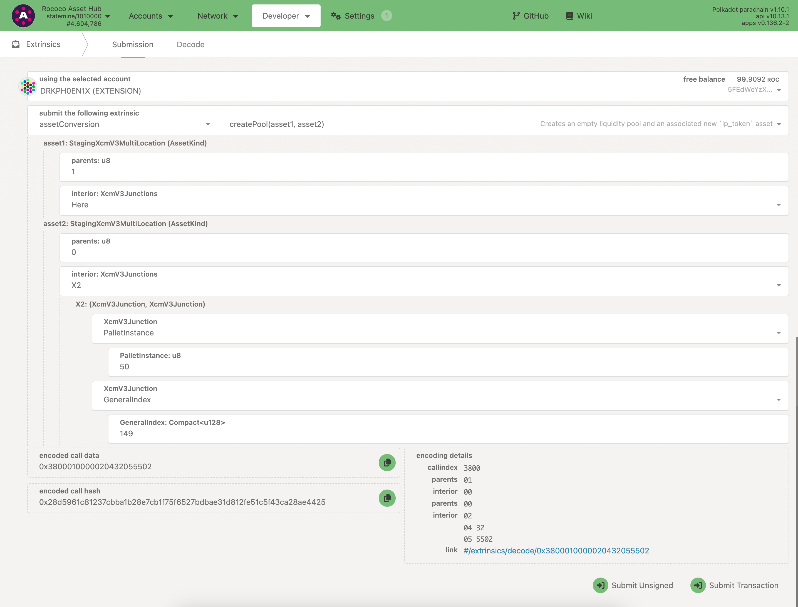
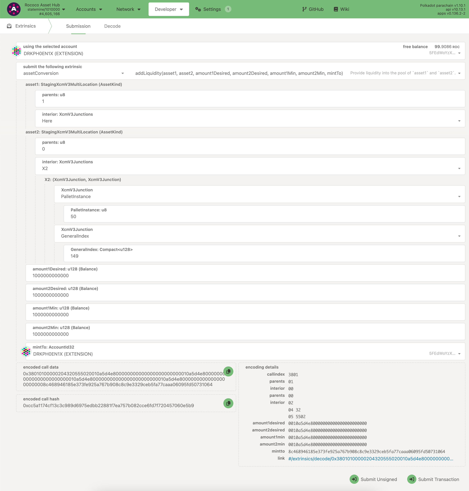
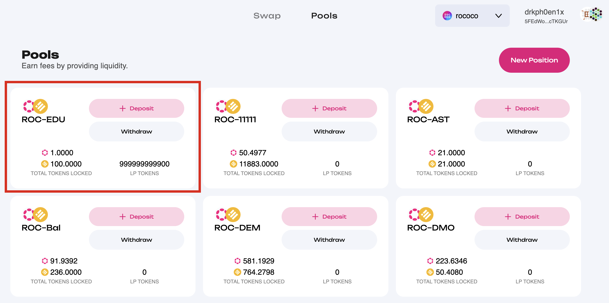
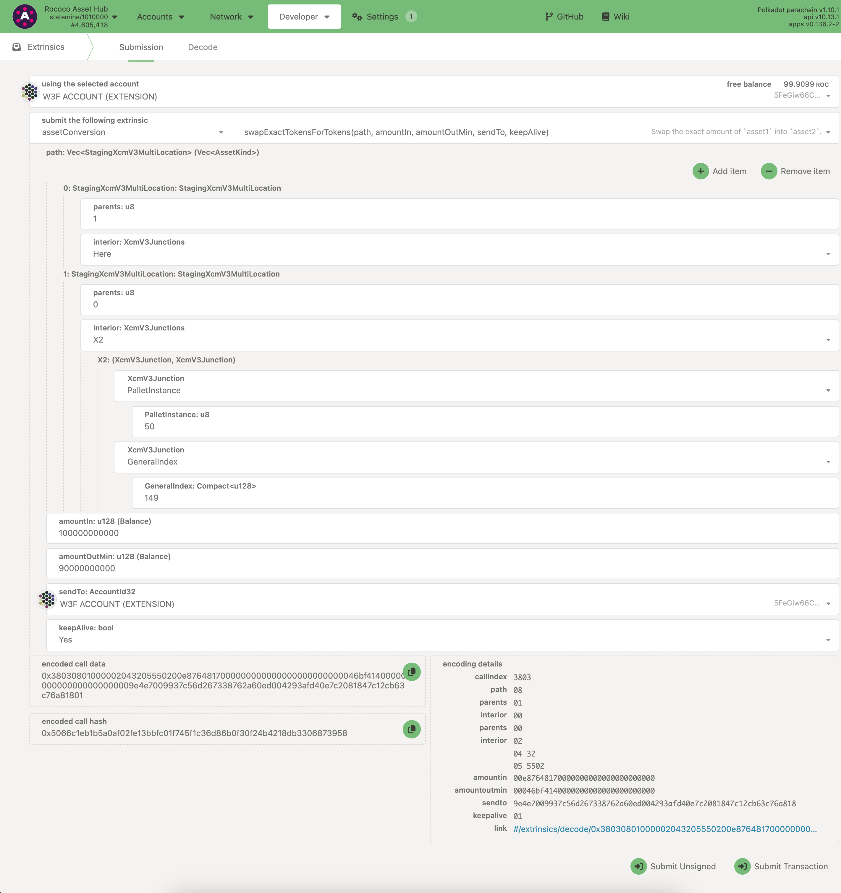
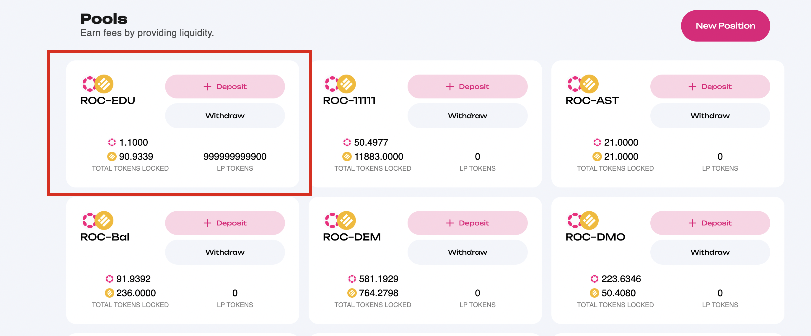
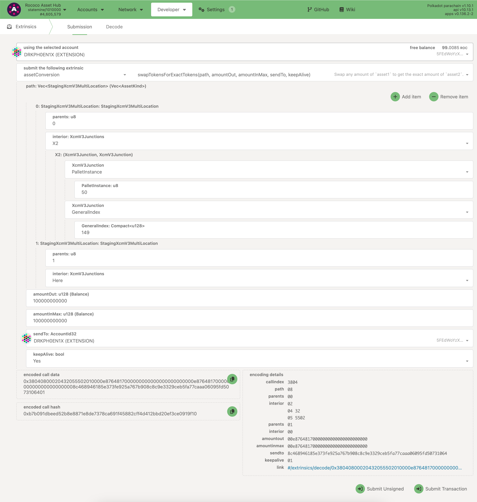
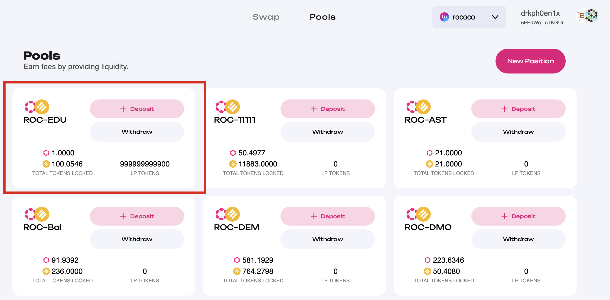
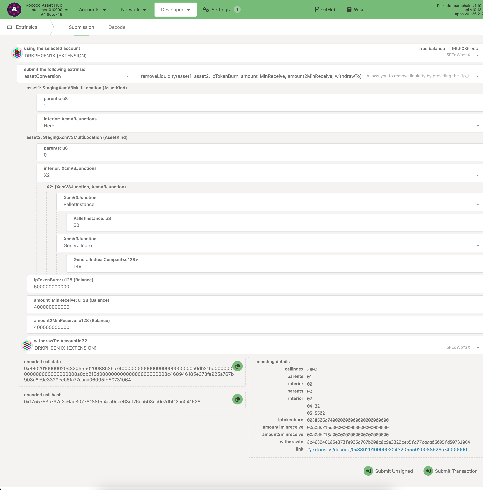
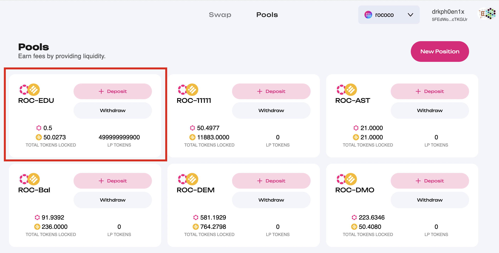

<!-- MessageBox -->
<div id="messageBox" class="floating-message-box">
  <p>
    Polkadot-JS is for developers and power users only. If you need help using the Polkadot-JS UI, you can contact the
    <a href="https://support.polkadot.network/support/home" target="_blank" rel="noopener noreferrer">
      Polkadot Support Team.
    </a>
  </p>
  <button class="close-messagebox" aria-label="Close message">✖</button>
</div>

!!!info "Wallet and UI Developers"
    The [DOT ACP UI](https://github.com/MVPWorkshop/dot-acp-ui) project is part of Polkadot initiative for building front-end and UI for Asset Conversion Pallet on Polkadot's Asset Hub. Currently, the app is deployed on Westend and Kusama [here](https://app.dotacp.mvpworkshop.co/swap).

The tutorial below demonstrates the complete journey from creating a liquidity pool on Paseo test
net and exploring all of the key functionalities of Asset Conversion pallet.

## Create a Liquidity Pool

If there is no existing liquidity pool for an asset on Asset Hub, the first step is to create a
liquidity pool. If you are looking for a guide on how to create an asset on Asset Hub, it is
available [here.](./learn-guides-assets-create.md)

The `create_pool` function is used to create an empty liquidity pool along with a new `lp_token`
asset. This asset's ID is announced in the `Event::PoolCreated` event. After creating a pool,
liquidity can be added to it via the `Pallet::add_liquidity` function.

For example, the snapshot below shows how to create liquidity pool with `PAS` tokens and `EDU`
tokens with the asset ID `149` on Paseo Asset Hub. Creating this extrinsic requires knowledge of
[XCM Multilocations](xcm/fundamentals/multilocation/summary.md). From the perspective of AssetHub,
an Asset Hub, the asset with an `AssetId` of `149` has a MultiLocation of

```
{
   parents: 0,
   interior: {
     X2: [{PalletInstance: 50}, {GeneralIndex: 149}]
   }
}
```

The PalletInstance of `50` represents the Assets pallet on Asset Hub and the `GeneralIndex` is the
`AssetId` of the asset.



The `lp_token` ID created for this pool is `24`, and
[here](https://assethub-rococo.subscan.io/extrinsic/4604922-2?event=4604922-8) is the event for
reference.

## Liquidity Provision

The `add_liquidity` function allows users to provide liquidity to a pool composed of two assets. It
requires specifying the desired amounts for both assets and minimum acceptable amounts. The function
calculates an optimal contribution of assets, which may differ from the desired amounts but will not
be less than the specified minimums. Liquidity providers receive liquidity tokens representing their
share of the pool.

For example, the snapshot below shows how to provide liquidity to the pool with `PAS` tokens and
`EDU` tokens with the asset ID `149` on Paseo Asset Hub. The intention is to provide liquidity of 1
`PAS` token (`u128` value of `1000000000000` as it has 12 decimals) and 100 `EDU` tokens (`u128`
value of `1000000000000` as it has 10 decimals).



After successful submission of the extrinsic above, LP tokens are minted to the specified account.
Below is the snapshot of the liquidity pool on the
[DOT ACP UI.](https://github.com/MVPWorkshop/dot-acp-ui)



## Swap Assets

### Swap from an exact amount of Tokens

The `swap_exact_tokens_for_tokens` function allows users to swap a precise amount of one asset for
another within a specified liquidity pool, ensuring the user receives at least a minimum expected
amount of the second asset in return. This function aims to provide predictability in trading
outcomes, allowing users to manage their asset exchanges with confidence regarding the minimum
return.

For example, the snapshot below shows how to swap `PAS` tokens to `EDU` tokens with the asset ID
`149` on Paseo Asset Hub. The intention is to swap 0.1 `PAS` tokens (`u128` value of `100000000000`
as it has 12 decimals) to at least 9 `EDU` tokens (`u128` value of `90000000000` as it has 10
decimals).



Below is the snapshot of the liquidity pool on the
[DOT ACP UI.](https://github.com/MVPWorkshop/dot-acp-ui) after successful submission of the
extrinsic above. It can be observed that the pool now has 1.1 `ROC` tokens and around 9.06 `EDU`
tokens are transferred out of it.



### Swap to an exact amount of Tokens

On the other hand, the `swap_tokens_for_exact_tokens` function allows users to trade a flexible
amount of one asset to precisely obtain a specified amount of another asset. It ensures that users
do not spend more than a predetermined maximum amount of the initial asset to acquire the exact
target amount of the second asset, providing a way to control the cost of the transaction while
achieving the desired outcome.

For example, the snapshot below shows how to swap `EDU` tokens with the asset ID `149` on Paseo
Asset Hub to `PAS` Tokens. The intention is to swap for obtaining 0.1 `PAS` tokens (`u128` value of
`100000000000` as it has 12 decimals) for a maximum of 10 `EDU` tokens (`u128` value of
`100000000000` as it has 10 decimals).



Below is the snapshot of the liquidity pool on the
[DOT ACP UI.](https://github.com/MVPWorkshop/dot-acp-ui) after successful submission of the
extrinsic above.



## Withdraw Provided Liquidity

The `remove_liquidity` function allows users to withdraw their provided liquidity from a pool,
receiving back the original assets. When calling this function, users specify the amount of
liquidity tokens (representing their share in the pool) they wish to burn. They also set minimum
acceptable amounts for the assets they expect to receive back. This mechanism ensures users can
control the minimum value they receive, protecting against unfavourable price movements during the
withdrawal process​.

For example, the snapshot below shows how to remove liquidity by specifying the number of LP tokens.
In exchange of removing around half of the liquidity of the pool, the expecation is that we receive
at least 0.4 `ROC` tokens (`u128` value of`400000000000` as it has 12 decimals) and 40 `EDU` tokens
(`u128` value of `400000000000` as it has 10 decimals).



Below is the snapshot of the liquidity pool on the
[DOT ACP UI.](https://github.com/MVPWorkshop/dot-acp-ui) after successful submission of the
extrinsic above.


