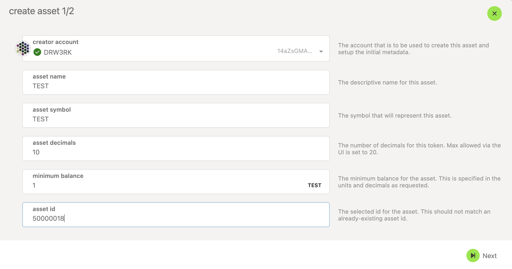

<!-- MessageBox -->

  

    Polkadot-JS is for developers and power users only. If you need help using the Polkadot-JS UI, you can contact the
    <a href="https://support.polkadot.network/support/home" target="_blank" rel="noopener noreferrer">
      Polkadot Support Team.
    </a>
  

  <button class="close-messagebox" aria-label="Close message">✖</button>

The Asset Hub is a generic assets system parachain which provides functionality for deploying and
transferring assets — both Fungible and Non-Fungible Tokens (NFTs). The native token of the Asset
hub is the same as the relay chain's native asset (DOT or KSM). The Existential Deposit (ED),
transaction fees, and the deposits for proxy/multisig operations are about
[1/10th of the values on the relay chains](../general/chain-state-values.md).
Apart from the native token, the assets held on the Asset Hub can be broadly categorized as

- Assets backed by an on-chain protocol’s utility
- Assets with off-chain backing
- Assets without any backing

For additional background on the Asset Hub check out
[this support article](https://support.polkadot.network/support/solutions/articles/65000181800-what-is-statemint-and-statemine-and-how-do-i-use-them-).

## Creating Assets on the Asset Hub with Polkadot-JS

!!!info
    Before minting assets on the Asset Hub, we recommend that you try out this tutorial on Westend Asset Hub, which is a system parachain on Westend test network. The WND tokens (Westies) can be teleported from Westend to Westend Asset Hub, are available for free through a [faucet](https://faucet.polkadot.io/).

**The images in the guides below are for Polkadot, but they also apply to Kusama.**

To create an asset on the Asset Hub, you would need to
[deposit some funds](../general/chain-state-values.md#asset-deposit). Before you create an asset on
the Asset Hub, ensure that your Asset Hub account balance is a bit more than the sum of those two
deposits, which should seamlessly account for the required deposits and transaction fees. You can
send the native token from a relay chain account to a the Asset Hub account using the teleport
functionality. For instructions on teleporting tokens, check this
[page on Teleports](../learn/learn-teleport.md).

Assuming you have the required balance on your Asset Hub account, the following instructions should
let you successfully create an asset on the Asset Hub

- Access the Asset Hub through [Polkadot-JS UI](https://polkadot.js.org/apps/#/explorer).
- Check the next available Asset ID. This can be queried on-chain by navigating to Developer > Chain
  State > Storage and then `assets.nextAssetId()`.

- Navigate to Network > Assets.

- Click on the create button and you will be presented with a pop-up window. Choose the creator
  account, name of the asset to be displayed on the Asset Hub, the asset's symbol, number of
  decimals for the asset, the minimum balance required to hold this asset on an Asset Hub account
  and the most important field of your asset - the unique asset ID. This has to be the value
  returned by the `assets.nextAssetId()` query shown earlier. After all the details are entered,
  click on the next button.

- Choose the admin, issuer and the freezer accounts for your asset and click on the create button.

- Sign and submit the transaction (If you like to verify the transaction details before signing, you
  can click on the dropdown button pointed by the arrow in the snapshot below).

If the transaction is successful, you should see the asset and its details displayed in the
Network > Assets page on the Asset Hub.
