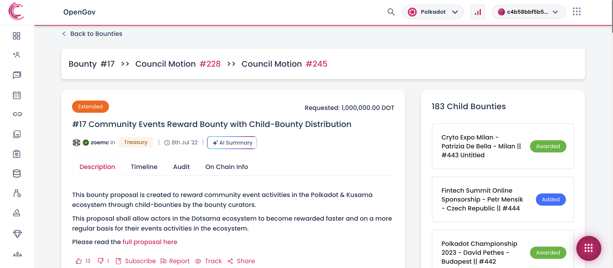

import RPC from "./../../components/RPC-Connection";

 
 

Polkadot-JS is for developers and power users only. If you need help using the
[Polkadot-JS UI](../general/polkadotjs-ui.md), you can contact the
[Polkadot Support Team](https://support.polkadot.network/support/home). For more user-friendly tools
see the [wallets](./wallets-index), [apps](./apps-index) and [dashboard](./dashboards-index) pages.

See [this page](./learn-polkadot-opengov-treasury.md#bounties) to learn about Bounties.

:::info Notify the Polkadot Direction Channel

Remember always to notify the
[Polkadot Direction Element Channel](https://matrix.to/#/#Polkadot-Direction:parity.io) about
[OpenGov referenda](./learn-polkadot-opengov.md#referenda) so that the community can start reviewing
them and voting on them.

:::

## Submit a Bounty Proposal

:::info Step-by-step written tutorial

See
[this written tutorial](https://scribehow.com/shared/How_to_Submit_a_Bounty_Proposal_on_Polkadotjs_Apps__Ps_zfmNXRbm6PuZaj28JBQ)
to learn more about how to submit a bounty proposal.

:::

See the video tutorial below to learn how you can create a bounty and submit it for approval through
an OpenGov referendum.

  

    
    

      <a href="https://www.youtube.com/watch?v=8Cft1-8RWmk">Submit a Bounty</a>
    

  

When you add a bounty, this will show as "proposed" in the main
[Bounties page](https://polkadot.js.org/apps/#/bounties). Once the community approves your bounty
proposal as an OpenGov referendum, the bounty will show as "funded" at the end of the
[spending period](../general/glossary.md#spend-period) on the main
[Bounties page](https://polkadot.js.org/apps/#/bounties). You can then proceed with assigning
curators to the bounty.

To minimize storage on chain in the same way as any proposal, bounties don't contain contextual
information. When a user submits a bounty spending proposal, they will need to find an off-chain
medium to explain the proposal, for example a bounty proposal document on
[Polkassembly](https://polkadot.polkassembly.io/opengov) or
[Subsquare](https://polkadot.subsquare.io/).
[This template](https://docs.google.com/document/d/1-IBz_owspV5OcvezWXpksWDQReWowschD0TFuaVKKcU/edit?usp=sharing)
can be used to submit all the information needed by OpenGov voters to make an informed decision.

Submitting a bounty proposal will reserve
{{ polkadot: <RPC network="polkadot" path="consts.bounties.bountyDepositBase" defaultValue={10000000000} filter="humanReadable"/> :polkadot }}{{ kusama: <RPC network="kusama" path="consts.bounties.bountyDepositBase" defaultValue={33333333300} filter="humanReadable"/> :kusama }}.

## Assign a Curator to a Bounty

:::info Step-by-step written tutorial

See
[this written tutorial](https://scribehow.com/shared/How_to_Assign_a_Curator_to_a_Bounty_on_Polkadotjs_Apps__JgK3eSfXQdm_PSvtz8TelQ)
to learn more about how to assign a curator to a bounty.

:::

Once your bounty is shown as "funded" on the main
[Bounties page](https://polkadot.js.org/apps/#/bounties), you can propose a bounty curator. See the
video tutorial below to learn how you can add a curator to a bounty and submit it for approval
through an OpenGov referendum.

  

    
    

      <a href="https://www.youtube.com/watch?v=TM7vk3oP9IA">Assign Curator to a Bounty</a>
    

  

Once your OpenGov referendum has been approved by the community and served the required
[spending period](../general/glossary.md#spend-period), the bounty will still show as "funded" on
the main [Bounties page](https://polkadot.js.org/apps/#/bounties) and await the curator's
acceptance. The curator must formally accept the curator role by signing a `bounties.acceptCurator`
extrinsic. More information about when to do this can be found on the main
[Bounties page](https://polkadot.js.org/apps/#/bounties). Only after the curators claim their
candidacy the bounty will show as "active" on the main Bounty page.

:::info Curator assignment call must be executed after bounty is funded

Curator assignment must take place after the bounty has been funded, and approved bounties are
funded after a spend period has been completed. A curator assignment referendum cannot be executed
during the same spend period when the bounty is funded.

If your bounty has been awarded but is not funded yet, you need to make sure that the curator
assignment referendum gets enacted in the subsequent spending period (you can set a delay in
[Polkadot-JS](./learn-guides-polkadot-opengov.md#submitting-a-proposal) when you submit the proposal
during the current spend period).

:::

## Create and Award Child Bounties

:::info Step-by-step written tutorial

See
[this written tutorial](https://scribehow.com/shared/How_to_Create_and_Award_a_Child_Bounty__Q-YFGkYAR3WxMnvYGHiU3Q)
to learn more about how to create and award child bounties.

:::

:::info Remember to add contextual information about child bounties

When you add child bounties, please add contextual information on the governance forums
[Polkassembly](https://polkassembly.io/) or [Subsquare](https://polkadot.subsquare.io/).

:::

See the video tutorial below to learn how to create a child bounty, assign a curator, and award a
child bounty.

The video will show how to create and award a child bounty using a batch call. We will also include
proposing and approving curator candidacy for the child bounty. The calls can be executed
separately, depending on the process curators consider appropriate for their bounty.

  

    
    

      <a href="https://www.youtube.com/watch?v=mLpvx0OQoyM">Create and Award Child Bounties</a>
    

  

Note that once a child bounty is awarded, awardees need to wait for the
{{ polkadot: 8 :polkadot }}{{ kusama: 4 :kusama }}-day delay to be complete before claiming the
child bounty.

## Claim a Child Bounty Reward

:::info Step-by-step written tutorial

See
[this written tutorial](https://scribehow.com/shared/How_to_claim_a_Child_Bounty_reward_on_Polkadotjs__t3V7NDUjQlus40EUjc-5Kw)
to learn more about how to claim a child bounty reward.

:::

The status of child bounties can be viewed on the
[Polkassembly Bounty page](https://polkadot.polkassembly.io/bounties) under the specific parent
bounty. A child bounty status can be "Added", "Awarded", or "Claimed". For example, the parent
bounty 17 refers to the Community Events Bounty, which has 183 child bounties.

After a child bounty has been awarded and the
{{ polkadot: <RPC network="polkadot" path="consts.bounties.bountyDepositPayoutDelay" defaultValue={115200} filter="blocksToDays"/> :polkadot }}{{ kusama: <RPC network="kusama" path="consts.bounties.bountyDepositPayoutDelay" defaultValue={57600} filter="blocksToDays"/> :kusama }}-day
delay elapsed, follow the guidelines in the video tutorial below to learn how to claim a child
bounty reward. Note that the extrinsic to claim the child bounty reward is permissionless, and
anyone can initiate the claim on behalf of the beneficiary.

  

    
    

      <a href="https://www.youtube.com/watch?v=db82aHgy23c">Claim Child Bounty Reward</a>
    

  

