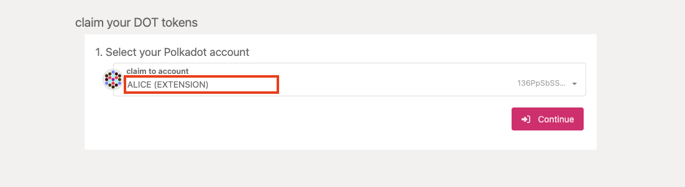
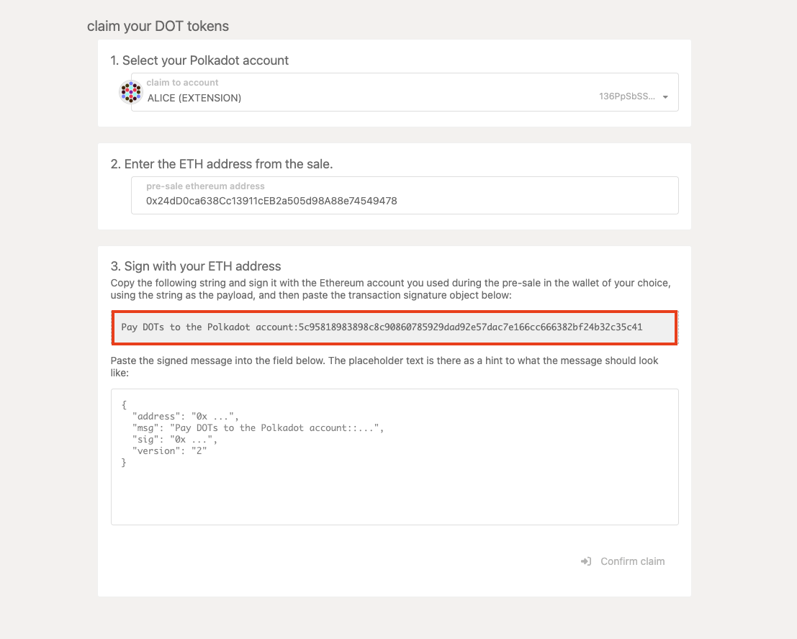
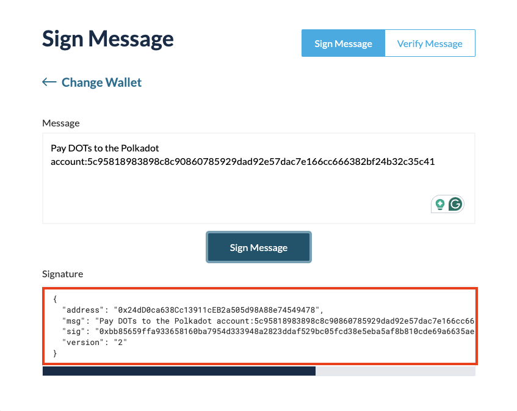

import MessageBox from "../../components/MessageBox"; import "../../components/MessageBox.css";

<MessageBox message="Polkadot-JS is for developers and power users only. If you need help using the
[Polkadot-JS UI](../general/polkadotjs-ui.md), you can contact the
[Polkadot Support Team](https://support.polkadot.network/support/home). For more user-friendly tools
see the [wallets](./wallets-index), [apps](./apps-index) and [dashboard](./dashboards-index) pages." />

<DocCardList />

If you participated in a previous DOT sale before 2020 and received your DOT allocation indicator
tokens, you can now claim your DOT (and a proportional amount of KSM on the Kusama network). The
claim process connects the address where your DOT indicators have been stored on Ethereum with a
native {{ polkadot: Polkadot :polkadot }}{{ kusama: Kusama :kusama }} address and, if your ETH
address is eligible, will pay the tokens to the
{{ polkadot: DOT :polkadot }}{{ kusama: KSM :kusama }} address.

To do this, you must sign a message on Ethereum containing the address of your
{{ polkadot: Polkadot :polkadot }}{{ kusama: Kusama :kusama }} account. You can do this by using the
Polkadot-JS UI [Claims app](https://polkadot.js.org/apps/#/claims). Ensure that you are connected to
the {{ polkadot: Polkadot :polkadot }}{{ kusama: Kusama :kusama }} network (displayed in the
upper-left-hand corner of the screen).

:::warning Third-party claim processes

Claiming using a third-party process can lead to losing your allocation; therefore, we cannot
recommend using any third-party apps. Manually specifying your transaction data, as specified in our
claims process below, is the only way to ensure you will receive your allocation.

:::

## Generate an Account

You will need to generate a {{ polkadot: Polkadot :polkadot }}{{ kusama: Kusama :kusama }} account
to claim {{ polkadot: DOT :polkadot }}{{ kusama: KSM :kusama }}. See the
[available wallets and extensions](../general/wallets-and-extensions.md) for more information about
wallets and browser extensions you can use to create an account. In terms of hardware wallet
support, you can use the [Ledger](../general/ledger.md) devices or
[Polkadot Vault](../general/polkadot-vault.md).

### Address Conversion

If you need to (most likely you don't), you can use
[this tool](https://www.shawntabrizi.com/substrate-js-utilities/) to convert the Substrate SS58
Address to the hexadecimal public key.

## Claiming Tokens

The Polkadot-JS [Claims app](https://polkadot.js.org/apps/#/claims) will guide you through the
process of claiming the tokens.

### Select Account on Polkadot

Select the account you would like to claim the
{{ polkadot: DOT :polkadot }}{{ kusama: KSM :kusama }} into and click the "Continue" button to
proceed. Your screen should look something like this:

### Select Account on Ethereum

Paste the Ethereum address with the DOT allocation indicator tokens and click the "Continue" button
to proceed.

### Sign Message on Ethereum & Claim

The hex-encoded string that follows the sentence: "Pay
{{ polkadot: DOTs :polkadot }}{{ kusama: KSMs :kusama }} to the
{{ polkadot: Polkadot :polkadot }}{{ kusama: Kusama :kusama }} account:" is the hex-encoded public
key of your {{ polkadot: Polkadot :polkadot }}{{ kusama: Kusama :kusama }} account, minus the `0x`
prefix.

Go to
[the "Sign & Verify Message" tab on the MyCrypto web application](https://app.mycrypto.com/sign-message).
MyCrypto is good to use if you have stored the key to the Ethereum account holding your DOT
indicator tokens on a hardware device like a Ledger Nano. It also supports raw private keys,
mnemonics, and the Polkadot Vault. After unlocking your Ethereum wallet, copy and paste the
outputted sentence on the Polkadot-JS UI into the message box on the MyCrypto app. When you click
"Sign Message" you will get a JSON output signature as shown below:

Copy and paste the JSON output of the signed message from MyCrypto into the input box on the
Polkadot-JS UI and click "Confirm Claim."

At this point, if you are eligible, you will see a success message if everything went right and your
{{ polkadot: DOT :polkadot }}{{ kusama: KSM :kusama }} will now be in the account that you claimed
to. Congratulations! You can now participate in aspects of the
{{ polkadot: Polkadot :polkadot }}{{ kusama: Kusama :kusama }} network such as
[governance](../learn/learn-polkadot-opengov.md) and [staking](../learn/learn-staking.md).

### Verifying your Claim

After you make an on-chain claim for {{ polkadot: DOT :polkadot }}{{ kusama: KSM :kusama }}, your
Your account balance should be updated immediately.
