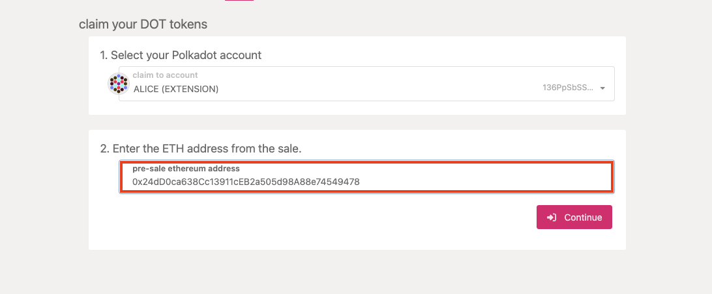
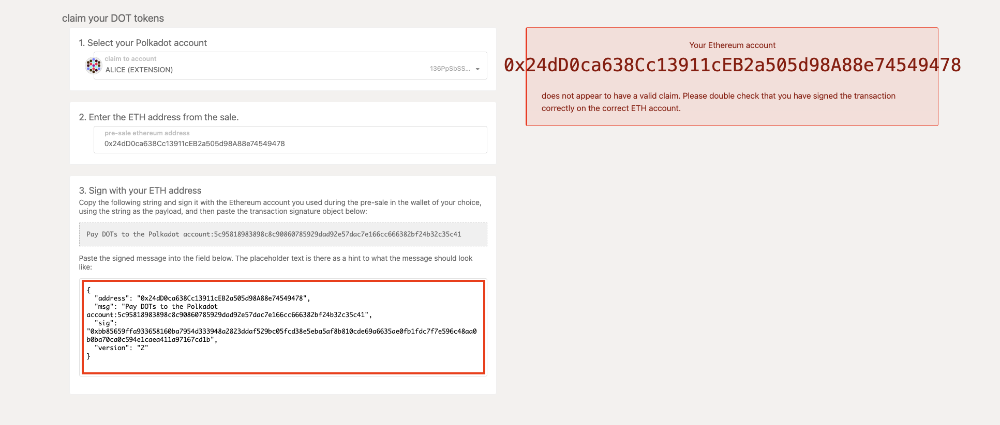

<!-- MessageBox -->

  

    Polkadot-JS is for developers and power users only. If you need help using the Polkadot-JS UI, you can contact the
    <a href="https://support.polkadot.network/support/home" target="_blank" rel="noopener noreferrer">
      Polkadot Support Team.
    </a>
  

  <button class="close-messagebox" aria-label="Close message">✖</button>

If you participated in a previous DOT sale before 2020 and received your DOT allocation indicator
tokens, you can now claim your DOT (and a proportional amount of KSM on the Kusama network). The
claim process connects the address where your DOT indicators have been stored on Ethereum with a
native Polkadot address and, if your ETH address is eligible, will pay the tokens to the Polkadot
address.

To do this, you must sign a message on Ethereum containing the address of your Polkadot account. You
can do this by using the Polkadot-JS UI [Claims app](https://polkadot.js.org/apps/#/claims). Ensure
that you are connected to the Polkadot network (displayed in the upper-left-hand corner of the
screen).

!!!warning "Third-party claim processes"
    Claiming using a third-party process can lead to losing your allocation; therefore, we cannot recommend using any third-party apps. Manually specifying your transaction data, as specified in our claims process below, is the only way to ensure you will receive your allocation.

## Generate an Account

You will need to generate an account on the relay chain to claim DOT (or KSM on Kusama). See the
[available wallets and extensions](../general/wallets-and-extensions.md) for more information about
wallets and browser extensions you can use to create an account. In terms of hardware wallet
support, you can use the [Ledger](../general/ledger.md) devices or
[Polkadot Vault](../general/polkadot-vault.md).

## Claiming Tokens

The Polkadot-JS [Claims app](https://polkadot.js.org/apps/#/claims) will guide you through the
process of claiming the tokens.

### Select Accounts

Select the account you would like to claim the tokens into and click the "Continue" button to
proceed. Your screen should look something like this:

#### Select Account on Ethereum

Paste the Ethereum address with the DOT allocation indicator tokens and click the "Continue" button
to proceed.

### Sign Message on Ethereum & Claim

The hex-encoded string that follows the sentence "Pay DOT to the Polkadot account:" is the
hex-encoded public key of your Polkadot account, minus the `0x` prefix.

Go to
[the "Sign & Verify Message" tab on the MyCrypto web application](https://app.mycrypto.com/sign-message).
MyCrypto is good to use if you have stored the key to the Ethereum account holding your DOT
indicator tokens on a hardware device like a Ledger Nano. It also supports raw private keys,
mnemonics, and the Polkadot Vault. After unlocking your Ethereum wallet, copy and paste the
outputted sentence on the Polkadot-JS UI into the message box on the MyCrypto app. When you click
"Sign Message" you will get a JSON output signature as shown below:

Copy and paste the JSON output of the signed message from MyCrypto into the input box on the
Polkadot-JS UI and click "Confirm Claim."

At this point, if you are eligible, you will see a success message if everything went right and your
tokens will now be in the account that you claimed to. Congratulations! You can now participate in
aspects of the network such as [governance](../learn/learn-polkadot-opengov.md) and
[staking](../learn/learn-staking.md).

### Verifying your Claim

After you make an on-chain claim, your Your account balance should be updated immediately.
