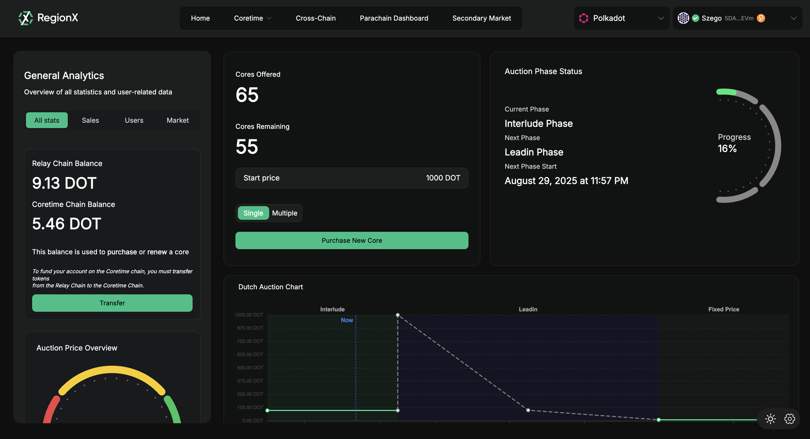
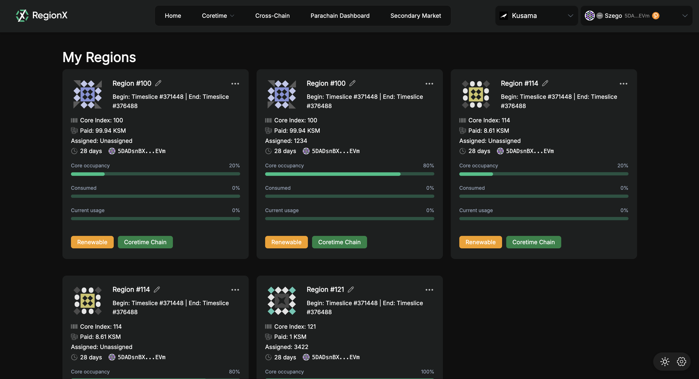

!!!info
    If you aren't sure what Agile Coretime is, be sure to read the [introduction](./learn-agile-coretime.md), [terminology](./learn-agile-coretime.md#agile-coretime-terminology), and [FAQ](./learn-agile-coretime.md#agile-coretime-faq).

The tutorials in this document utilize:

- [RegionX Hub](https://hub.regionx.tech/), a user interface for purchasing and managing
  Coretime regions.

- [Lastic](https://www.lastic.xyz/), a Coretime marketplace user interface.

## RegionX

The RegionX Hub is a UI developed for users to get an overview of the Agile Coretime system and interact with all its functionality.

RegionX Hub so the UI is dynamic and adapts to different use cases.

### RegionX Hub Overview

RegionX provides a different dashboard for different use cases:
- [Overview](https://hub.regionx.tech/?dashboard=overview&network=polkadot): The overview dashboard is for anyone who wants an overview of Coretime data and access to most functionalities from a single page.
- [Deploying a new project](https://hub.regionx.tech/?dashboard=deploying-new-project&network=polkadot): The dashboard is designed to show only the information relevant for teams deploying a new project on Polkadot.
- [Managing existing project](https://hub.regionx.tech/?dashboard=managing-existing-project&network=polkadot): Once a project is up and running on Polkadot, RegionX Hub provides a dashboard where teams can track their renewal status and compare the cost of renewing their core versus buying a new one in the sale.

### Purchasing Cores on RegionX Hub

After connecting their wallet, the user can track the current sale cycle and attempt to purchase a core.

This functionality is accessible from the *overview* and *deploying a new project* dashboards.

### Managing Cores with RegionX

The Regions dashboard lists all the cores purchased through the connected wallet account along with
the basic information of the respective core. It allows for partitioning, interlacing, transfers,
and assigning tasks.

## Lastic

Lastic is a marketplace for buying and selling blockspace. For more information, check
[Lastic's official documentation](https://docs.lastic.xyz/).

### Purchasing Cores with Lastic

Lastic allows for purchasing core with accounts hosted on wallets like Subwallet, Talisman, Nova
Wallet and Polkadot-JS Extension. Select the account to be used for the coretime purchase and then,
click on "buy core" button to sign and broadcast the transaction.

### Managing Cores with Lastic

Lastic enables you to transfer your core to another account, utilize it for a parachain, split it
up, change block production frequency, or assign it to a task.

