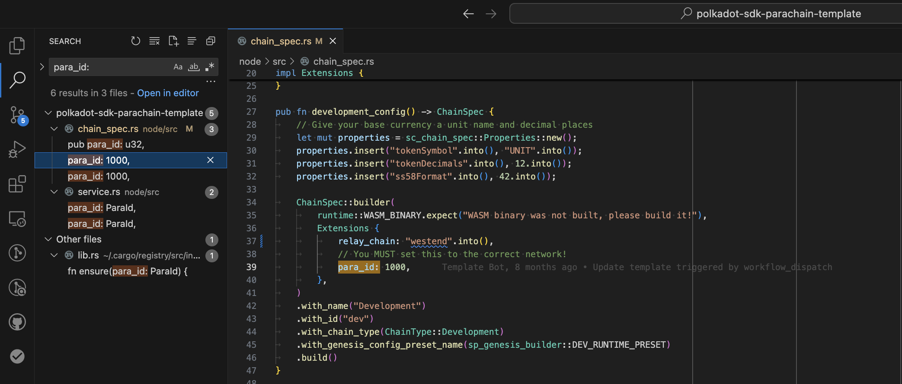

:::info

If you aren't sure what Agile Coretime is, be sure to read the
[introduction](./learn-agile-coretime.md),
[terminology](./learn-agile-coretime.md#agile-coretime-terminology), and
[FAQ](./learn-agile-coretime.md#agile-coretime-faq).

:::

The landscape for parachains changes with the rollout of
[Agile Coretime](./learn-agile-coretime.md). With [parachain auctions](./archive/learn-auction.md)
being phased out in favor of direct [coretime](./learn-agile-coretime.md#coretime) sales, the
existing parachains on the relaychain and the prospective parachains are presented with the
following scenarios:

- **Migrating** from a legacy parachain lease into a
  [bulk coretime](./learn-agile-coretime.md#bulk-coretime) model
- **Starting** with bulk coretime model from scratch
- **Running** a parachain with on-demand coretime purchases ("pay as you go")

The parachain lease auctions stopped on-chain with the enactment of the
[runtime upgrade 1.2.0](https://github.com/polkadot-fellows/runtimes/releases/tag/v1.2.0) on the
19th of September 2024, and the existing leases were migrated to bulk coretime automatically. Leases
that had not started were canceled, and the locked tokens were refunded. The existing parachains
benefit from [coretime renewals](https://docs.lastic.xyz/coretime/renewals.html), allowing for the
continued assignment of bulk coretime for a core without going through the regular purchasing
process.

## Reserve Your ParaID

The first thing we need to do to get started is reserve a [`ParaID`](../general/glossary.md#paraid) for our parachain.

This can be done through Polkadot-JS UI by navigating to [Network > Parachains > Parathreads](https://polkadot.js.org/apps/#/parachains/parathreads) and clicking on ParaID button.

Reserving a `ParaID` requires a [deposit](../general/chain-state-values.md#parachain-id-registration-deposit), so make sure that you have sufficient tokens to reserve the displayed `ParaID`
successfully.


Keep track of the `ParaID` you registered, as you will need it throughout the tutorial.

## Use the Parachain Template

In this tutorial, we use the [`polkadot-sdk-parachain-template`] to represent our parachain.

Clone this project in a working directory:

```sh
git clone https://github.com/paritytech/polkadot-sdk-parachain-template.git
cd polkadot-sdk-parachain-template
```

We need to update the `para_id` of this template to match the `ParaID` we registered.

If you search in the code for `para_id:`, you will find the spots you need to update:



Save your changes, and then compile the parachain collator:

```sh
cargo build --release
```

After the test parachain collator node is successfully compiled, export its genesis state and the
code for the `--dev` chain using the following commands. If the export succeeds, these two files (`genesis-state` and `genesis-code`) should appear in your working directory.

```sh
./target/release/adder-collator export-genesis-state genesis-state --dev
```

```sh
./target/release/adder-collator export-genesis-wasm genesis-code --dev
```

## Register Your Parachain State and Code

Next we will register this `genesis-state` and `genesis-code` on the relay chain.

For this we have two test networks, Paseo and Westend, and two production networks, Kusama and Polkadot.

:::info Deposit requirements for registering a parachain

On **Kusama**, the deposit required to register a parachain is **~1100 KSM** and an estimated fee of
**~5 KSM**.

On **Polkadot**, the deposit required to register a parachain is **~3300 DOT** and an estimated fee
of **~150 DOT**.

It is possible to deregister the parachain and withdraw the deposit if the parachain has not
produced any blocks. If the parachain produced blocks, then the parachain can only be deregistered
through the relay chain's governance.

:::

Back in the [Network > Parachains > Parathreads](https://polkadot.js.org/apps/#/parachains/parathreads) section of the Polkadot-JS UI, click on the ParaThread button.

You should see fields for:

- Your Parachain ID
- Your Genesis Code
- Your Genesis State


After successful registration, the parachain starts onboarding as a parathread.

Depending on the network you are registering the parachain, this could take a few minutes to a few hours. This ensures that all validators have the required information about your parachain, and that the relay chain is ready to produce blocks for your parachain.

## Run Your Parachain Collator

In order for your parachain to start producing blocks, you need to have access to a fully synchronized node for the relay chain you want to access.

You can synchronize the chain locally using the following command:

```sh
# You may need to update the `--chain` flag based on which relay chain you are targeting.
./target/release/parachain-template-node --dev -- --chain=westend --sync warp
```

If synchronizing the relay chain is too slow for you, you can use a public RPC of an already synchronized node:

```sh
# You may need to update the `--relay-chain-rpc-urls` flag based on which relay chain you are targeting.
./target/release/parachain-template-node --dev --relay-chain-rpc-urls=wss://westend-rpc.polkadot.io
```

In either case, you should eventually see that your relay chain is fully synced, and your parachain has not built any blocks yet.

```sh
2024-12-03 16:16:00 [Relaychain] Received imported block via RPC: #23720021 (0x944b…b392 -> 0xe8cb…291f)
2024-12-03 16:16:03 [Parachain] 💤 Idle (0 peers), best: #0 (0x8fa4…8c34), finalized #0 (0x8fa4…8c34), ⬇ 0 ⬆ 0
2024-12-03 16:16:04 [Relaychain] Received finalized block via RPC: #23720019 (0xa46f…51cb -> 0x9133…d918)
2024-12-03 16:16:06 [Relaychain] Received imported block via RPC: #23720022 (0xe8cb…291f -> 0xb457…a74a)
2024-12-03 16:16:08 [Parachain] 💤 Idle (0 peers), best: #0 (0x8fa4…8c34), finalized #0 (0x8fa4…8c34), ⬇ 0 ⬆ 0
2024-12-03 16:16:08 [Relaychain] Received finalized block via RPC: #23720020 (0x9133…d918 -> 0x944b…b392)
2024-12-03 16:16:11 [Relaychain] Received imported block via RPC: #23720023 (0xb457…a74a -> 0xe299…a05a)
2024-12-03 16:16:13 [Parachain] 💤 Idle (0 peers), best: #0 (0x8fa4…8c34), finalized #0 (0x8fa4…8c34), ⬇ 0 ⬆ 0
```

## Purchase Coretime

We have two options for purchasing coretime for our parachain: **on-demand coretime** and **bulk coretime**.

On-demand coretime is ordered via the `OnDemandAssignment` pallet/module, which is located on the respective
relay chain.

Bulk coretime is purchased via the `broker` pallet, which is on the respective Coretime system parachain.

## Run a Parachain with On-demand Coretime

After the collator node is fully synced with the relay chain, navigate to
[Developer > Extrinsics](https://polkadot.js.org/apps/#/extrinsics) on the relay chain and issue
`onDemandAssignmentProvider.placeOrderAllowDeath` extrinsic from the account that registered the
`ParaID` by specifying sufficient `maxAmount`for the transaction to go through successfully.


:::info

There are two extrinsics which allow you to place orders for on-demand coretime:

- `onDemandAssignmentProvider.placeOrderAllowDeath` will
  [reap](./learn-accounts.md#existential-deposit-and-reaping) the account once the provided funds
  run out.

- `onDemandAssignmentProvider.placeOrderKeepAlive` includes a check which will **not** reap the
  account if the provided funds will run out, ensuring the account is kept alive.

:::

With each successful on-demand extrinsic, the parachain head changes (you may have to zoom out on
the browser for parachain head details to show up on Polkadot-JS UI).


The successful collation can also be verified in the parachain collator logs. It can be noticed that
with each parachain block, the state of `adder-collator` is incremented by `2`.


## Run a Parachain with Bulk Coretime

You can purchase bulk coretime on [Coretime chain](./learn-guides-coretime-marketplaces.md) and
assign the purchased core to the registered `ParaID`. The snapshot below is from
[Lastic](https://test.lastic.xyz/) interface.


After successful assignment of the core, the `adder-collator` logs show new collations at regular
intervals, gradually incrementing the state by `2`.


