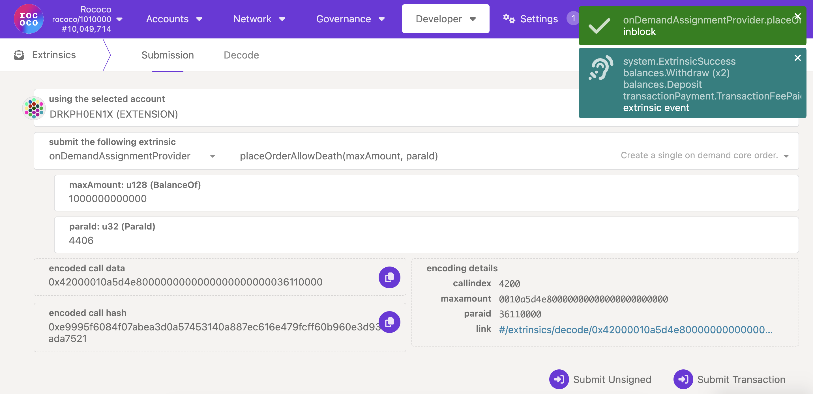

!!!info
    If you aren't sure what Agile Coretime is, be sure to read the [introduction](./learn-agile-coretime.md), [terminology](./learn-agile-coretime.md#agile-coretime-terminology), and [FAQ](./learn-agile-coretime.md#agile-coretime-faq).

The landscape for parachains changes with the rollout of
[Agile Coretime](./learn-agile-coretime.md). With [parachain auctions](./archive/learn-auction.md)
being phased out in favor of direct [coretime](./learn-agile-coretime.md#coretime) sales, the
existing parachains on the relaychain and the prospective parachains are presented with the
following scenarios:

- **Migrating** from a legacy parachain lease into a
  [bulk coretime](./learn-agile-coretime.md#bulk-coretime) model
- **Starting** with bulk coretime model from scratch
- **Running** a parachain with on-demand coretime purchases ("pay as you go")

The parachain lease auctions stopped on-chain with the enactment of the
[runtime upgrade 1.2.0](https://github.com/polkadot-fellows/runtimes/releases/tag/v1.2.0) on the
19th of September 2024, and the existing leases were migrated to bulk coretime automatically. Leases
that had not started were canceled, and the locked tokens were refunded. The existing parachains
benefit from [coretime renewals](https://docs.lastic.xyz/coretime/renewals.html), allowing for the
continued assignment of bulk coretime for a core without going through the regular purchasing
process.

!!!info
    The tutorials below assume that you have already developed the parachain runtime and a fully configured parachain [collator](./learn-collator.md) for the target relay chain using the Polkadot SDK.

For the tutorials below,
[the adder test parachain](https://github.com/paritytech/polkadot-sdk/tree/6f3d890ed35bfdee3e3f7d59018345635a62d1cd/polkadot/parachain/test-parachains/adder)
on the Polkadot SDK has been used. To compile the `adder-collator`, run the command below in the
_root_ of the Polkadot SDK repository. You must have [Rust](https://www.rust-lang.org/tools/install)
and its associated tooling installed before following along.

Ensure the Polkadot SDK is cloned, and you are within the root directory (`cd polkadot-sdk`)

```sh
cargo build -r -p test-parachain-adder-collator
```

After the test parachain collator node is successfully compiled, export its genesis state and the
code using the following commands. If the export succeeds, these two files should appear in the
Polkadot-SDK repository.

```sh
./target/release/adder-collator export-genesis-state genesis
```

```sh
./target/release/adder-collator export-genesis-wasm genesis-wasm
```

## Reserve ParaID

Reserving a `ParaID` requires a
[deposit](../general/chain-state-values.md#parachain-id-registration-deposit). The first step is to
register a [`ParaID`](../general/glossary.md#paraid) for the parachain. This can be done through
Polkadot-JS UI by navigating to
[Network > Parachains > Parathreads](https://polkadot.js.org/apps/#/parachains/parathreads) and
clicking on ParaID button. Ensure that you have sufficient tokens to reserve the displayed `ParaID`
successfully.


## Register Parachain State and Code

!!!info "Deposit requirements for registering a parachain"
    Due to the reasons [discussed here](https://github.com/paritytech/polkadot-sdk/pull/2372), instead of the usual per-byte method of charging for storing validation and genesis code upon registration, the cost is fixed to the maximum possible code size (`MAX_CODE_SIZE`), regardless of the actual size.

On **Kusama**, the deposit required to register a parachain is **~1100 KSM** and an estimated fee of
**~5 KSM**.

On **Polkadot**, the deposit required to register a parachain is **~3300 DOT** and an estimated fee
of **~150 DOT**.

It is possible to deregister the parachain and withdraw the deposit if the parachain has not
produced any blocks. If the parachain produced blocks, then the parachain can only be deregistered
through the relay chain's governance.

The next step is to register the parachain's genesis wasm and state, which you should have generated
earlier. Note that for this example, we are using `adder-collator`, but in theory a custom runtime
compiled from a
[template](https://github.com/paritytech/polkadot-sdk/tree/88a2f360238787bf5256cfdd14b40c08f519b38e/templates/parachain)
would work as well.

<!-- prettier-ignore -->
<!-- !!!info
    Registering the genesis state and WASM code of the parachain requires a [deposit](../general/chain-state-values.md#genesis-state-registration-deposit) that is computed based on the size (a deposit is paid per byte uploaded).

<!-- The deposit used for registering `ParaID` is already counted in for this deposit, the total deposit requirement for registering `ParaID`, state and code for `adder-collator` is around 46 KSM on Kusama and 116 DOT on Polkadot. -->


After successful registration, the parachain starts onboarding as a parathread.

## Run Parachain Collator

While the parachain is onboarding, start syncing the [collator](./learn-collator.md) using the
following command to rapidly sync with the specified relay chain.

```
./target/release/adder-collator --parachain-id= $ParaID --chain=paseo --sync warp
```

## Run a Parachain with Bulk Coretime

!!!info
    Note that we have two options: **bulk coretime** and **on-demand coretime**. Bulk coretime is purchased via the `broker` pallet, which is on the respective Coretime system parachain. On-demand coretime is ordered via the `OnDemandAssignment` pallet/module, which is located on the respective relay chain.

You can purchase bulk coretime on [Coretime chain](./learn-guides-coretime-marketplaces.md) and
assign the purchased core to the registered `ParaID`. The snapshot below is from
[Lastic](https://test.lastic.xyz/) interface.


After successful assignment of the core, the `adder-collator` logs show new collations at regular
intervals, gradually incrementing the state by `2`.


## Run a Parachain with On-demand Coretime

After the collator node is fully synced with the relay chain, navigate to
[Developer > Extrinsics](https://polkadot.js.org/apps/#/extrinsics) on the relay chain and issue
`onDemandAssignmentProvider.placeOrderAllowDeath` extrinsic from the account that registered the
`ParaID` by specifying sufficient `maxAmount`for the transaction to go through successfully.



!!!info 
    There are two extrinsics which allow you to place orders for on-demand coretime:
    - `onDemandAssignmentProvider.placeOrderAllowDeath` will [reap](./learn-accounts.md#existential-deposit-and-reaping) the account once the provided funds run out.
    - `onDemandAssignmentProvider.placeOrderKeepAlive` includes a check which will **not** reap the account if the provided funds will run out, ensuring the account is kept alive.

With each successful on-demand extrinsic, the parachain head changes (you may have to zoom out on
the browser for parachain head details to show up on Polkadot-JS UI).


The successful collation can also be verified in the parachain collator logs. It can be noticed that
with each parachain block, the state of `adder-collator` is incremented by `2`.


