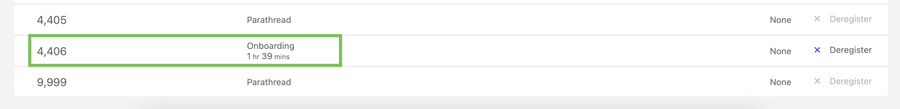

The landscape for parachains on {{ polkadot: Polkadot :polkadot }}{{ kusama: Kusama :kusama }}
changes with the rollout of [Agile Coretime](./learn-agile-coretime.md). With
[auctions](./learn-auction.md) being phased out in favor of direct coretime sales, the existing
parachains on the relaychain and the prospective parachains are presented with the following
scenarios:

- Migrating from a legacy lease into a bulk coretime model
- Starting with bulk coretime model from scratch
- Running a parachain with on-demand coretime purchases

The parachain lease auctions will stop on-chain with the enactment of the
[runtime upgrade 1.2.0](https://github.com/polkadot-fellows/runtimes/releases/tag/v1.2.0) and the
existing leases will be migrated to bulk coretime automatically. Leases that are yet to be started
will be cancelled and the locked {{ polkadot: DOT :polkadot }}{{ kusama: KSM :kusama }}  
will be refunded. The existing parachains benefit from
[coretime renewals](https://docs.lastic.xyz/coretime/renewals.html) which allows for the continued
assignment of bulk coretime for a core without going through the regular purchasing process.

For the tutorials below,
[the adder test parachain](https://github.com/paritytech/polkadot-sdk/tree/6f3d890ed35bfdee3e3f7d59018345635a62d1cd/polkadot/parachain/test-parachains/adder)
on Polkadot-SDK has been used. To compile the `adder-collator`, run the command below in the
Polkadot-SDK repository.

```
cargo build -r -p test-parachain-adder-collator
```

After the test parachain collator node is successfully compiled, export its genesis state and the
code by using the following commands. If the export is successful, these two files should show up in
the Polkadot-SDK repository.

```
./target/release/adder-collator export-genesis-state genesis
```

```
./target/release/adder-collator export-genesis-wasm genesis-wasm
```

## Reserve ParaID

The first step is to register a `ParaID`for the on-demand parachain. This can be done through
Polkadot-JS UI by navigating to Network > Parachains > Parathreads and clicking on ParaID button.
Ensure that you have sufficient tokens to successfully reserve the displayed `ParaID`

:::info

Reserving a `ParaID` requires a deposit of 40 KSM on Kusama and 100 DOT on Polkadot.

:::


## Register Parachain State and Code

The next step is to register the parachain's genesis wasm and state.

:::info

Registering the state and wasm code of the parachain requires a deposit that is computed based on
the size. For the `adder-collator` example here, it turns out to be around 46 KSM on Kusama and 116
DOT on Polkadot. As, the deposit used for registering `ParaID` is already counted in for this
deposit, the total deposit requirement for registering `ParaID`, state and code is 46 KSM on Kusama
and 116 DOT on Polkadot.

:::


After successful registration, the parachain starts onboarding as a parathread.



## Run Parachain Collator

While the parachain is onboarding, start syncing the collator using the following command to rapidly
sync with the specified relaychain.

```
./target/release/adder-collator --parachain-id= $ParaID --chain=rococo --sync fast-unsafe
```

## Run a Parachain with Bulk Coretime

Now, you can purchase bulk coretime on [Coretime chain](./learn-guides-coretime-marketplaces.md) and
assign the purchased core to the registered `ParaID`. The snapshot below is from
[Lastic](https://test.lastic.xyz/) interface.


After successful assignment of the core, the `adder-collator` logs show new collations at regular
intervals, gradually incrementing the state by `2`.


## Run a Parachain with On-demand Coretime

After the collator node is fully synced with the relay chain, navigate to Developer > Extrinsics on
the relay chain and issue `onDemandAssignmentProvider.placeOrderAllowDeath` extrinsic from the
account that registered the `ParaID` by specifying sufficient `maxAmount`for the transaction to go
through successfully.


With each successful on-demand extrinsic, the parachain head changes (you may have to zoom out on
the browser for parachain head details to show up on Polkadot-JS UI).


The successful collation can also be verified in the logs of the parachain collator. It can be
noticed that with each parachain block, the state of `adder-collator` is incremented by `2`.


