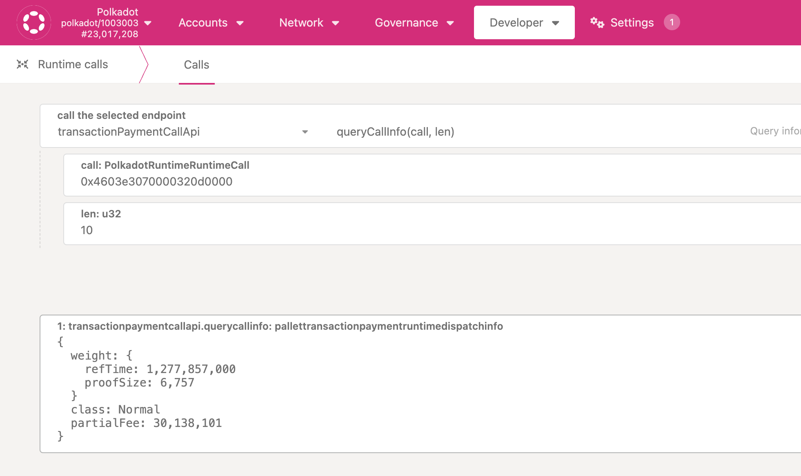
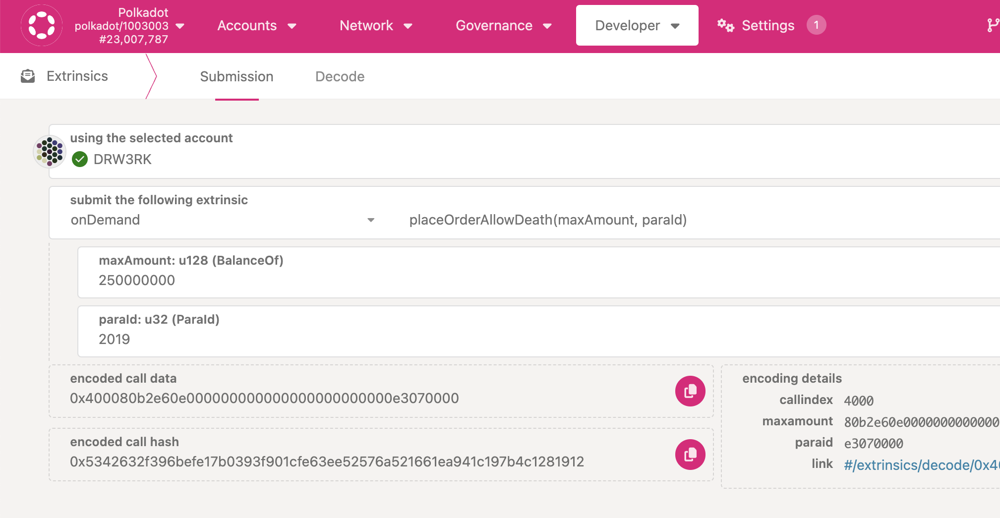

The following is a guide to leverage the swap functionality to change leases between different
paraIDs. This allows parachain teams to swap existing leases.

Coretime swapping requires two chains to send a `swap` instruction from an origin with Root
privileges. Depending on whether the parachain is locked or not, this can either be the manager
account of the parachain on the relay chain (if parachain is not locked), or the governance system
in place for the parachain (can be sudo) if the parachain is locked.

In order to check if a parachain is locked or not, teams need to query `registrar.paras` with the
corresponding paraID on the relay chain. It's important to note that since
[RFC #14](https://github.com/polkadot-fellows/RFCs/pull/14), if a parachain never produced a block
the it's by default unlocked.

## Initiate Swap from the Parachain

To swap from a parachain, an XCM message needs to be sent from the parachain to the relay chain.
This XCM message must be a send instruction that wraps the `registrar.swap` extrinsic that needs to
be executed on the relay chain.

Below, you can find an example hex encoded call for Composable Finance, assuming the team is still
operating under SUDO.

[0x0200290003010003140004000000000700e876481713000000000700e87648170006000700e40b540282380100284603e3070000320d0000140d01000001008d1f](https://polkadot.js.org/apps/?rpc=wss%3A%2F%2Fcomposable-rpc.dwellir.com#/extrinsics/decode/0x0200290003010003140004000000000700e876481713000000000700e87648170006000700e40b540282380100284603e3070000320d0000140d01000001008d1f)

As for weights (size and time), we use an overestimate compared with those returned by the Polkadot
Relay Runtime API.

To check the exact weights, you can navigate to Polkadot JS UI > Developer > Runtime Calls and then
select `transactionPaymentCallInfo` and `queryCallInfo` and include the extrinsic being sent in the
`send` instruction of the XCM message:
[0x4603e3070000320d0000](https://polkadot.js.org/apps/?rpc=wss%3A%2F%2Frpc.ibp.network%2Fpolkadot#/extrinsics/decode/0x4603e3070000320d0000)

## Perform Swap on the Relay chain for an unlocked Parachain

In the case a parachain is unlocked, then the manager of the parachain on the relaychain must send
the extrinsic directly on the relaychain.

In the case of paraID 3378 wanting to swap with Composable Finance, the extrinsic to send from its
manager account `13B8Tdhi4EuruwzVt3gdcTopXpqbUzmncutiQKKNbd8cpU91` is:

[0x4603320d0000e3070000](https://polkadot.js.org/apps/?rpc=wss%3A%2F%2Frpc.ibp.network%2Fpolkadot#/extrinsics/decode/0x4603320d0000e3070000)

## Coretime Swap Prerequisites

We need to ensure the parachains have a valid cores to execute the swap instruction. This can be
achieved either by getting a core in bulk from the coretime system chain, or by leveraging the
onDemand functionality on relay chain. Assuming that teams have a working parachain (with a valid
core) and a stalled parachain, the following instructions explain how to get a core `onDemand` for
the stalled parachain.

### Swap through an OnDemand Core

This functionality exists on the relay chain and allows users to request for 1 block of validation
of their parachain. In order to place an order for on demand, any account must call the
`onDemand.placeOrderAllowDeath` extrinsic.

This extrinsic takes two parameters:

- Amount: the amount the user is willing to pay for the parachain block to be validated by a core.
  The minimum amount the system allows is 250,000,000 planckDOT (0.025 DOT) and the actual amount is
  dynamic as it depends on the on-demand block production requests queued.

- paraID: This refers to the `paraID` of the on-demand Parachain whose block must be  
  validated by a core.

### Core Swap Execution Steps

If you are a team with two parachains, one that has a lease with a fresh paraID, and an old one that
doesn't have a lease but contains the history of the chain then below is a list of steps to execute
to swap these leases.

Assumptions

- Your new paraID is unlocked and your old paraID is locked.
- You have access to the manager account on the relay chain for the new paraID
- You have your collators running on your old paraID and you can execute upward XCM messages from
  that parachain.
- The sovereign account for the locked paraID has enough available funds to execute transactions on
  the relay chain.
- The account that owns the unlocked paraID has enough available funds to execute transactions on
  the relay chain. transactions on the relay chain.

Steps

- Have the collator running for your original paraID.
- Send the [XCM instruction detailed before](#initiate-swap-from-the-parachain).
- Get a onDemandCore for your original paraID. Once this gets executed, your XCM message should be
  dispatched to the relay chain and you should see a pending swap.
- Use the manager account on your new paraID to send the
  [swap instruction](#perform-swap-on-the-relay-chain-for-an-unlocked-parachain) directly on the
  relay chain.

### Coretime Swap - Time for Effect

The swap of leases is effective immediately, however the Coretime chain communicates the changes of
these leases to the relay chain with every new coretime cycle. Thus, the change will come into
effect in the following coretime cycle. For information on when the new coretime cycle, you can view
the [coretime sales](https://coretime-polkadot.subscan.io/coretime_dashboard) page.
