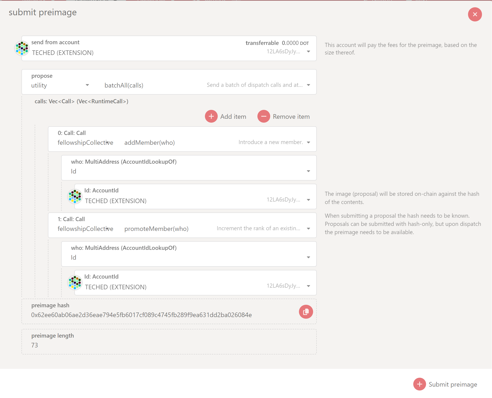
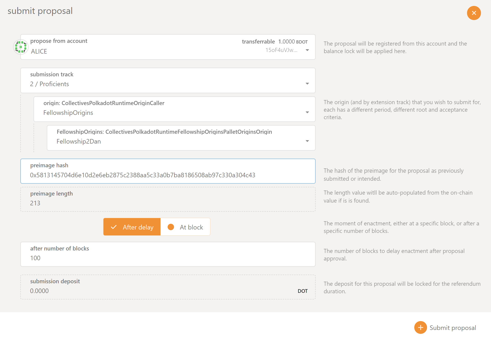

## Becoming a Polkadot Technical Fellowship Member

Currently, the only way to become a fellowship member is through a referenda. To get added as a
member of "Rank 1", an existing member of the fellowship needs to submit a referendum with the
preimage of a batch call that has `fellowshipCollective.addMember` and
`fellowshipCollective.promoteMember` on "2/Proficients" track. On Polkadot-JS UI for Polkadot
Collectives, navigate to Governance > Fellowship > Referenda and click on "Add Preimage". This
preimage can be submitted by anyone.

After the preimage is successfully noted, navigate to Governance > Fellowship > Referenda and click
on "Submit Proposal" (This button is active on the UI only if you have an account that belongs to
the Fellowship). Choose the appropriate track and the origin, and enter the preimage hash of the
batch call that adds and promotes the member.

After the referendum is successfully executed, the member is added to the fellowship with "rank 1".
For example, check the [Referenda 23](https://collectives.subsquare.io/fellowship/referenda/23) on
the Collectives parachain. If a member has to be added and promoted to “rank 5”, the proposal has to
be submitted through track “6/Senior Experts” (Always a track with a rank higher). For example,
check the [Referenda 25](https://collectives.subsquare.io/fellowship/referenda/25) on the
Collectives parachain.

Future plans include that public members can apply to become a Fellowship candidate by placing a
small deposit (which will be returned once they become members). Their candidacy will go through a
referendum to be approved to become a member.
