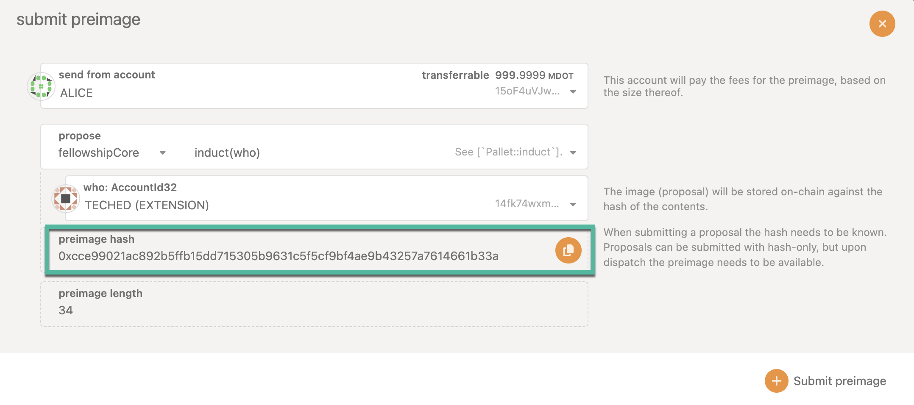
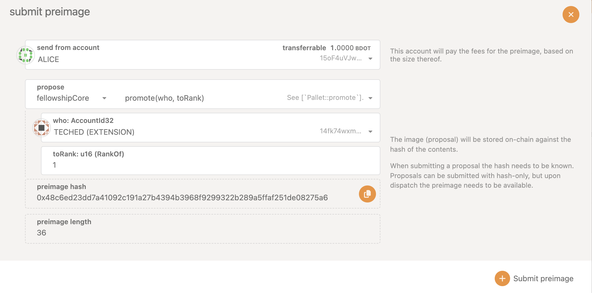
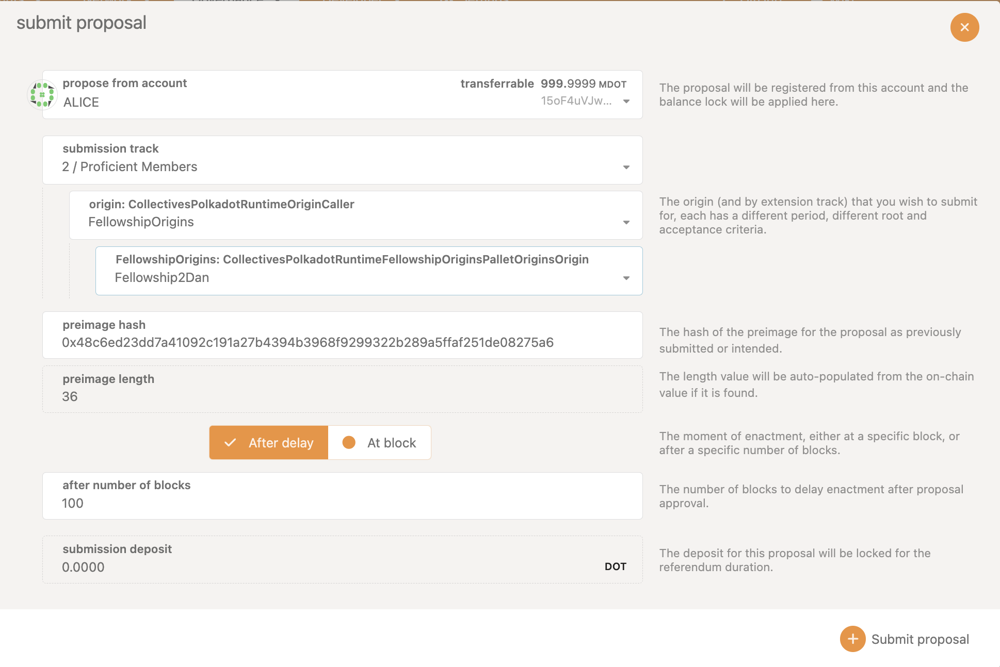

## Becoming a Member of the Polkadot Technical Fellowship

:::info

Currently, only members of the fellowship can add new members. For more information about the
Polkadot Technical Fellowship see [this page](./learn-polkadot-technical-fellowship.md).

:::

Before starting the candidate induction process, please ensure the candidate account is active and
has a balance greater than the existential deposit of the collectives system chain (0.1 DOT). It is
recommended that the candidate account also has a verified identity.

The first step is to add a preimage on the collectives system chain. This preimage should include
the call to `induct` a candidate account, as shown below. The preimage can be added by any account
on the collectives system chain. The preimage hash of this call will later be used for creating a
fellowship referenda with an approriate origin and track.

The next step is to create a fellowship referenda, which can only be done by a pre-existing
Technical Fellowship member. When a fellowship member navigates to Governance > Fellowship >
Referenda, they should be able to see a submit proposal button. In the example below,submission
track is chosen as `1/members`, origin as `FellowshipOrigins` and fellowship origins as `Members`.
This selection should work for inducting an account without any rank to the fellowship as a
candidate with rank 0. After copying the preimage hash in the designated field, the preimage length
will automatically be populated.

After submitting the proposal, the voting can commence. A decision deposit needs to be placed for
this fellowship referendum to be decided. After the fellowship referenda successfully passes, the
candidate is successfully inducted into the Polkadot Fellowship with rank 0.

### Technical Fellowship Rank Updates

The Polkadot Technical Fellowship members are expected to provide a periodic evidence to request for
retaining their rank or to get promoted to a higher rank. Any fellowship member upto rank 4 can be
promoted to the next rank through a fellowship referenda that can be voted by the members who are 2
ranks higher. For instance, the fellowship
[referenda 64](https://collectives.subsquare.io/fellowship/referenda/64) which promotes a member
from rank 1 to rank 2 can only be voted by members whose ranks are greater than or equal to 3.
Promotion of the Polkadot Fellowship members from rank 5 needs to be done through an OpenGov
referendum.

This preimage example should include the call to `promote` an account to a specific rank, as shown
below. This preimage can be added by any account on the collectives system chain.

In the snapshot below, the submission track is chosen as `21/Promote to I Dan`, origin as
`FellowshipOrigins` and fellowship origins as `PromoteTo1Dan`. This selection should work for
promoting a candidate with rank 0 to a member with rank 1.

For promoting a member from Rank 1 to Rank 2, the submission track can be chosen as
`22/Promote to  II Dan`, origin as `FellowshipOrigins` and fellowship origins as `PromoteTo2Dan`.
Only the members with Rank >= 3 can vote on this proposal.
