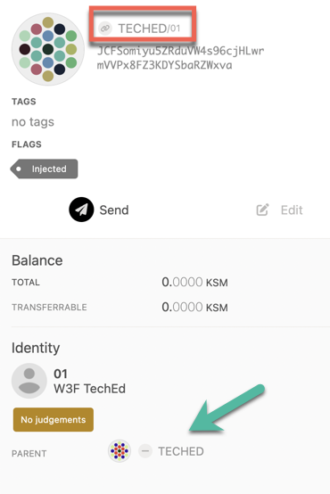

This is an advanced guide that is relevant for entities that would like to become registrars or would
like to set sub-identities to an existing account with an identity. The [learn identity](https://wiki.polkadot.network/docs/learn-identity)
page provides information on how to set an identity and have it verified.

## Registrars

### Becoming a Registrar

To become a registrar, submit a pre-image and proposal into
[Democracy](../maintain/maintain-guides-democracy.md), then wait for people to vote on it. For best
results, write a post about your identity and intentions beforehand, and once the proposal is in the
queue ask people to endorse it so that it gets ahead in the referendum queue.

Here's how to submit a proposal to become a registrar:

Go to the Democracy tab, select "Submit preimage", and input the information for this motion -
notably which account you're nominating to be a registrar in the `identity.setRegistrar` function.

Copy the preimage hash. In the above image, that's
`0x90a1b2f648fc4eaff4f236b9af9ead77c89ecac953225c5fafb069d27b7131b7`. Submit the preimage by signing
a transaction.

Next, select "Submit Proposal" and enter the previously copied preimage hash. The `locked balance`
field needs to be at least
{{ polkadot: <RPC network="polkadot" path="consts.identity.basicDeposit" defaultValue={202580000000} filter="humanReadable"/>. :polkadot }}
{{ kusama: <RPC network="kusama" path="consts.identity.basicDeposit" defaultValue={33333000000} filter="humanReadable"/>. :kusama }}
You can find out the minimum by querying the chain state under
[Chain State](https://polkadot.js.org/apps/#/chainstate) -> Constants -> democracy ->
minimumDeposit.

At this point, DOT holders can endorse the motion. With enough endorsements, the motion will become
a referendum, which is then voted on. If it passes, users will be able to request judgement from
this registrar.

## Setting Sub-Identity (Sub-ID) for your Ledger Account

Setting an Identity is not possible on Ledger app yet, but as a workaround, you can
[set the identity for an on-chain account ](../learn/learn-identity.md#setting-an-identity) and then
use it to set a sub-identity to your Ledger account.

- Go to https://polkadot.js.org/apps/#/accounts. Click on the three vertical dots correponding to
  the account to which you already set identity. You should see an option to set onchain
  sub-identities. Click on it.

  

- In the pop-up window, select your Ledger account from the dropdown and enter text in sub name
  field. Then, click on set subs button.
  
- Sign and submit the transaction from the parent account with the identity

You should now see the sub-identity displayed on-chain. You need to be aware that
{{ polkadot: <RPC network="kusama" path="consts.identity.basicDeposit" defaultValue={33333000000} filter="humanReadable"/> :polkadot }}
{{ kusama: <RPC network="kusama" path="consts.identity.basicDeposit" defaultValue={33333000000} filter="humanReadable"/> :kusama }}
is reserved for setting identity and
{{ polkadot: <RPC network="kusama" path="consts.identity.subAccountDeposit" defaultValue={6666000000} filter="humanReadable"/> :polkadot }}
{{ kusama: <RPC network="kusama" path="consts.identity.subAccountDeposit" defaultValue={6666000000} filter="humanReadable"/> :kusama }}
for each sub-identity. This reserved account balance is freed once you
[clear the identities](../learn/learn-identity.md#clearing-and-killing-an-identity) on the account.

