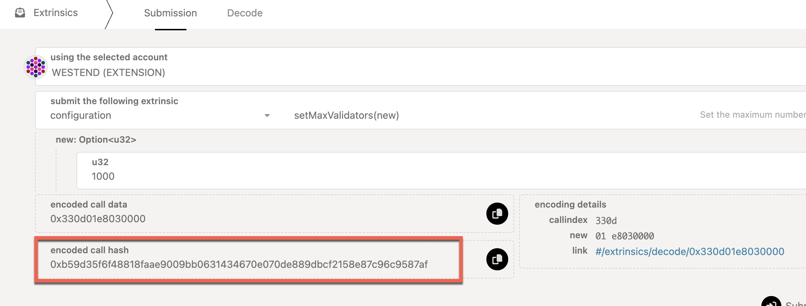

import RPC from "./../../components/RPC-Connection"; import MessageBox from
"../../components/MessageBox"; import "../../components/MessageBox.css";

<MessageBox message="Polkadot-JS is for developers and power users only. If you need help using the
[Polkadot-JS UI](../general/polkadotjs-ui.md), you can contact the
[Polkadot Support Team](https://support.polkadot.network/support/home). For more user-friendly tools
see the [wallets](./wallets-index), [apps](./apps-index) and [dashboard](./dashboards-index) pages." />

See [this page](./learn-polkadot-opengov.md) to learn about Polkadot OpenGov.

This guide will instruct token holders how to propose and vote on public referenda using the
Referenda module (OpenGov). Below are a few links to stay informed and directly engage with the
community.

- [Polkadot Direction](https://matrix.to/#/#Polkadot-Direction:parity.io) - a place to discuss
  governance and the future of Polkadot.
- [Kusama Direction](https://matrix.to/#/#Kusama-Direction:parity.io) - a place to discuss
  governance and the future of Kusama.
- [Polkadot](https://polkadot.polkassembly.io) and [Kusama](https://kusama.polkassembly.io)
  Polkassembly - for current referenda, latest proposals, motions, treasury proposals, tips,
  bounties, and more.
- [Polkadot Daily Digest](https://matrix.to/#/#dailydigest:web3.foundation) - News about what is
  happening in the Polkadot ecosystem, published every weekday except holidays.

## Create a Referenda Proposal

Before submitting a referendum, identify the right track and origin for it. For instance, if the
referendum is for requesting funds from treasury, select the treasury track with appropriate spend
limits. If the referendum is for a suggestion to make changes to the protocol, select the "Wish for
Change" track. For more info, check the
[tracks and origins](learn-polkadot-opengov.md#origins-and-tracks) of Polkadot OpenGov.

### Submitting a Preimage

The act of creating a proposal is split from submitting the preimage for the proposal since the
storage cost of submitting a large preimage could be expensive. Allowing the preimage submission to
come as a separate transaction means that another account could submit the preimage for you and pay
the fee. The example below demonstrates the creation of a preimage to propose and approve a spend of
treasury funds.


Follow the steps below to submit a preimage as shown in the screenshot above.

1. Navigate to Governance -> Referenda.
2. Click on the "Add preimage" button.
3. From the _propose_ drop-down field, select `treasury`.
4. From the unlabeled drop-down field to the right of the _propose_ drop-down field, select
   `spendLocal(amount, beneficiary)`.
5. In the `amount: Compact<u128> (BalanceOf)` text field, enter the spend amount in
   [plancks](learn-DOT.md#the-planck-unit).
6. The `beneficiary: MultiAddress (AccountIdLookupOf)` drop-down field will have `Id` selected by
   default. Select the beneficiary from the `Id: AccountId` drop-down field.

:::info

Copy the `preimage hash` value before clicking the "Submit preimage" button.

:::

7. Click the "Submit preimage" button.

After the preimage is submitted successfully on-chain, Polkadot-JS UI lists it under the tab of
Governance -> Preimages.

### Submitting a Proposal

Submitting a proposal requires you to bond some tokens. On Polkadot-JS UI, you can navigate to the
Governance -> Referenda to make a new proposal. In order to submit a proposal, you will need to
submit what's called the preimage hash. The preimage hash is simply the hash of the proposal to be
enacted. The easiest way to get the preimage hash is by clicking on the "Submit preimage" button as
shown in the previous section.


The proposal will be registered from the account selected and the balance lock will be applied to
it. An appropriate origin must be chosen, as each origin has different privileges, and acceptance
criteria. After entering the hash of the preimage for the proposal, the preimage length field is
automatically populated. The enactment delay can be specified either as a block number, or as a
specific number of blocks after the referendum is approved. The deposit for this proposal will be
locked for the referendum duration.

### Submitting a Referendum on the Whitelisted Caller Track

Let's consider increasing the number of validators participating in parachain consensus. You could
[submit a preimage](#submitting-a-preimage) with the call that sets the number of validators to
1,000 and submit a referendum to the Root track directly. However, this requires a large decision
deposit and has very conservative passing parameters such that it will probably need the entire
28-day voting period to pass.

Operations that are deemed safe or time critical by the Polkadot Technical Fellowship can use the
Whitelisted Caller track. This track requires less turnout in the first half of the decision period
so that it can pass more quickly. This track is typically used for more neutral, technical proposals
like runtime upgrades or changing the system's parachain validation configuration.

Using the Whitelisted Caller track requires some special calls. Submitting a referendum in the same
form as other tracks will not work. Namely, rather than voting on a particular `proposal`, the
Whitelisted Caller track requires a vote to `dispatch` the `proposal` via the Whitelist pallet.
Before opening a referendum on this track, you should also attempt to get a positive signal from the
Fellowship that they will whitelist the proposal. If they do not, then even if the public referendum
passes, it will not execute.

Below are the steps to follow when submitting a proposal to the Whitelist track.

- [Submit a preimage](#submitting-a-preimage) with the call to _dispatch_ the proposal (`call`) you
  want to submit -- `whitelist.dispatchWhitelistedCallWithPreimage(call)` -- and obtain the preimage
  hash. This is the preimage for the _public referendum_ on the Whitelisted Caller track.


- Obtain the hash of `call`. The Polkadot Fellowship needs to start a Fellowship referendum to
  whitelist the call with `whitelist.whitelistCall(callHash)`. The Fellowship referendum gets voted
  on by the Polkadot Fellowship members only.

  

- The public now votes on the referendum. Someone must place a decision deposit to go into the
  deciding phase.
- Once passed, it gets enacted successfully as long as the call has been whitelisted by the
  Fellowship.

Note that the public referendum and Fellowship referendum can happen simultaneously. However, if the
Fellowship does not whitelist the call, you must submit it directly to the Root origin.

## Voting on Referenda

As Polkadot OpenGov takes both the approval and support into account, there are four options to
choose from when voting on a referendum:

- Aye
- Nay
- Split
- Abstain

Also, you have to specify the conviction multiplier for this vote. The longer you are willing to
lock your tokens, the stronger your vote will be weighted. Unwillingness to lock your tokens means
that your vote only counts for 10% of the tokens that you hold.

For detailed instructions on how to vote on Polkadot OpenGov referenda, check
[this support guide.](https://support.polkadot.network/support/solutions/articles/65000184120-polkadot-opengov-how-to-vote)

:::caution Polkadot OpenGov uses Conviction Voting Pallet (Not Democracy Pallet)

Use `convictionVoting.vote` for voting on Referenda in Polkadot OpenGov instead of `democracy.vote`
(which only works for the old version of governance).

:::

### Removing Votes

To remove votes, you need to use the [Extrinsics tab](https://polkadot.js.org/apps/#/extrinsics) and
call the `removeVote` function through the `convictionVoting` pallet.


The `class` is the [OpenGov track](./learn-polkadot-opengov-origins.md) of the referendum you voted
on and the `index` is the referendum number.

### Removing Expired Voting Locks

To remove an expired lock, you need to use the
[Extrinsics tab](https://polkadot.js.org/apps/#/extrinsics) and call the `unlock` function through
the `convictionVoting` pallet. Note that if you voted on referenda in multiple tracks, the tokens
will be unlocked after removing votes and unlocking on all the tracks. Similarly, if you you
[delegated](#delegations) on multiple tracks, the funds will be unlocked after
[undelegating](#undelegate-votes) and unlocking on all the tracks.


The `class` is the [OpenGov track](./learn-polkadot-opengov-origins.md) where you have the lock.

For additional instructions, check
[this support guide.](https://support.polkadot.network/support/solutions/articles/65000184129-polkadot-js-ui-how-to-remove-expired-referenda-locks)

## Delegations

:::info Video Tutorial about Delegations using the Polkadot-JS UI

See [this video tutorial](https://youtu.be/PNGs11EvCB0) to learn about how to delegate, modify
delegations and remove delegations using the Polkadot-JS UI.

:::

For an overview of how delegation works in Polkadot OpenGov, check out the
[Multirole Delegation](../learn/learn-polkadot-opengov.md#multirole-delegation) section on the
[Learn Polkadot OpenGov](../learn/learn-polkadot-opengov.md) page.

Instructions to do delegations with Polkadot-JS are also available on the
[Support Pages](https://support.polkadot.network/support/solutions/articles/65000184776-polkadot-js-ui-how-to-delegate-your-voting-power-on-polkadot-opengov).

### Delegate Votes

You can start delegating your votes by clicking the "Delegate" button on
[Governance > Referenda](https://polkadot.js.org/apps/#/referenda).


If it is the first time you delegate or vote, there will be a banner message. You can delegate on a
single track or all the tracks. You have an option to specify the number of votes (i.e., the number
of tokens) and the [conviction multiplier](./learn-polkadot-opengov.md#voluntary-locking). After
clicking "Next", you will need to specify the account to delegate your votes to, and after clicking
"Delegate" and "Sign and Submit" your delegations will appear for each track (see below).


Note that if you want to delegate just a few tracks, you have two options:

- Repeat the process using the "Delegate" button multiple times
- Issue a batch call with multiple `convictionVoting.delegate` extrinsics under
  [Developer > Extrinsics](https://polkadot.js.org/apps/#/extrinsics)


By clicking on "Add item" you can add new extrinsics for multiple tracks.

### Undelegate Votes

The "Delegate" button on [Governance > Referenda](https://polkadot.js.org/apps/#/referenda) is only
for delegating votes. You cannot undelegate or modify your delegations. If you wish to undelegate,
you will need to go to [Developer > Extrinsics](https://polkadot.js.org/apps/#/extrinsics) and
submit a `convictionVoting.undelegate` extrinsic, specifying the track you wish to undelegate.


Undelegated tracks will show up as "0 votes" on the Delegate tab.


After you undelegated, the conviction lock will start the countdown, and your funds will be
available for unlocking after the countdown ends.

### Remove Expired Locks from Delegations

To remove expired locks from delegations, you can
[follow the same procedure as how to remove expired voting locks](#removing-expired-voting-locks).

### Modify your Delegations

The "Delegate" button on [Governance > Referenda](https://polkadot.js.org/apps/#/referenda) is only
for delegating votes. You cannot undelegate or modify your delegations. If you wish to update the
delegated account, the conviction, and the number of votes you will need to go to
[Developer > Extrinsics](https://polkadot.js.org/apps/#/extrinsics), [undelegate](#undelegate-votes)
the track and [delegate](#delegate-votes) again with updated information.

## Claiming OpenGov Deposits

:::info Video Tutorial about OpenGov deposits using the Polkadot-JS UI

See [this video tutorial](https://youtu.be/kkEq5cqW2Pk) to learn about how to claim OpenGov deposits
using the Polkadot-JS UI.

:::

### Claiming the Preimage and Decision Deposits

After a referendum finishes its life cycle (and gets approved or rejected or timed out), the
preimage and decision deposits can be claimed. For claiming the preimage deposit, navigate to
[Polkadot-JS UI > Governance > Preimages](https://polkadot.js.org/apps/#/preimages) and click on
unnote button shown on the preimage you submitted.


Similarly, to claim the decision deposit, navigate to
[Polkadot-JS UI > Governance > Referenda](https://polkadot.js.org/apps/#/referenda) and scroll down
to the end of the page to click on the referenda with the decision deposit and claim it.


### Claiming the Referendum Submission Deposit

The submission deposit for a referendum can be claimed
[only if the referendum was `Approved` or `Canceled`](https://github.com/paritytech/polkadot-sdk/blob/cfb29254f74412cea35e8048d8aea94bc789fcb1/substrate/frame/referenda/src/types.rs#L261).
The submission deposit can be claimed by issuing the `refundSubmissionDeposit` extrinsic.

Users can not refund their submission deposit while the referendum is `Ongoing` or `Rejected`.
Similarly, users cannot refund their submission deposit if the proposal has `TimedOut` (failing to
submit the decision deposit within a
{{ polkadot: <RPC network="polkadot" path="const.referenda.undecidingTimeout" defaultValue={201600} filter="blocksToDays"/> :polkadot }}{{ kusama: <RPC network="kusama" path="const.referenda.undecidingTimeout" defaultValue={201600} filter="blocksToDays"/> :kusama }}-day
period will lead to a referendum timeout). This behavior exists so that users can refrain from
spamming the chain with proposals that have no interest from the community. If a proposal is in the
`TimedOut` state, any user can call `slash_proposal_deposit`, which will move the funds from the
user to a runtime-configured account, like the treasury.

To refund your slashed deposit, you can start a new referendum and specifically request a refund
from the treasury. You need to make sure you have enough balance for a new submission and decision
deposit, and you will need to select the right track to ask for a refund. For example, the
[Small Tipper Track](./learn-polkadot-opengov-origins.md#small-tipper) would be fine for any kind of
deposit refund up to {{ polkadot: 250 DOT :polkadot }}{{ kusama: 8.25 KSM KSM :kusama }}.

## Cancel or Kill a Referendum

:::info

Anybody can cancel an ongoing referendum (i.e., a referendum within the Lead-in or
voting/confirmation period). For more information about the referenda timeline in Polkadot OpenGov,
see the [dedicated page](../learn/learn-polkadot-opengov.md#referenda-timeline).

To successfully cancel a referendum through the track `20 / Referendum Canceller`, you will need to
attain
[specific approval and support levels](./learn-polkadot-opengov-origins.md#referendum-canceller).

:::

To cancel a referendum, you need first to submit a preimage with the `referenda.cancel` extrinsic.
Go to the [Polkadot-JS UI > Governance > Referenda](https://polkadot.js.org/apps/#/referenda) and
click on the "Add Preimage" button. You must specify the `referenda.cancel` extrinsic with the index
equal to the ongoing Referendum you wish to cancel. In the screenshot below, the Referendum to be
cancelled is 249.


This call will cancel the referendum and return the deposit. You can also kill a referendum using
the `referenda.kill` extrinsic. This will cancel the referendum and slash the deposit.

:::info Preimage Submission Deposit

A deposit is required for the preimage to be stored on chain. The preimage deposit is proportional
to the amount of information stored within the preimage. The deposit amount required for a preimage
with a treasury spend transaction is around
{{ polkadot: 41 DOT :polkadot }}{{ kusama:  1.4 KSM  :kusama }}. Ensure you have enough account
balance to pay for this submission deposit as well as the transaction fees.

:::

Once a preimage is submitted, it can be checked under
[Governance > Preimages](https://polkadot.js.org/apps/#/preimages).


You must copy the preimage to use it when you submit your proposal. To submit the proposal to cancel
referendum 249, for example, you need to go under
[Governance > Referenda](https://polkadot.js.org/apps/#/referenda) and click the "Submit Proposal"
button.


You must specify the account to submit the proposal (this can differ from the account used to create
the preimage). Then you will need to specify the track `20 / Referendum Canceller` and add the
preimage hash containing the specific action that will be enacted if the referendum passes. Note
that a submission deposit of
{{ polkadot: <RPC network="polkadot" path="consts.referenda.submissionDeposit" defaultValue={10000000000} filter="humanReadable"/> :polkadot }}{{ kusama: <RPC network="kusama" path="consts.referenda.submissionDeposit" defaultValue={33333333333} filter="humanReadable"/> :kusama }}
will be reserved for submitting the proposal.

Once the proposal has been submitted, it will stay in the Lead-in period until there is enough space
within the track, and a
[track-dependent preparation period and decision deposit](./learn-polkadot-opengov-origins.md#polkadot-opengov-terminology-and-parameters)
have been met. Failing to submit the decision deposit within a
{{ polkadot: <RPC network="polkadot" path="consts.referenda.undecidingTimeout" defaultValue={201600} filter="blocksToDays"/> :polkadot }}{{ kusama: <RPC network="kusama" path="consts.referenda.undecidingTimeout" defaultValue={201600} filter="blocksToDays"/> :kusama }}-day
period will lead to a referendum timeout.

## Interpreting On-Chain Voting Data

Below is the numeric conversion of the type of vote and conviction displayed in a block explorer.

```
Nay 0.1x => 0
Nay 1x => 1
Nay 2x => 2
Nay 3x => 3
Nay 4x => 4
Nay 5x => 5
Nay 6x => 6

Aye 0.1x => 128
Aye 1x => 129
Aye 2x => 130
Aye 3x => 131
Aye 4x => 132
Aye 5x => 133
Aye 6x => 134
```

Take, for example, the information provided for
[this vote](https://kusama.subscan.io/extrinsic/22460598-2). The vote `131` means the account voted
Aye with 3x conviction.


At first glance, it may not be easy to interpret what you voted on. We need to take a step back and
consider the "voting data" at the binary level.

The vote is stored as a byte using a bitfield data structure and displayed on the block explorer as
a decimal integer. The bitfield stores both the conviction and aye/nay boolean, where the boolean is
represented using the MSB of the byte. This would mean that the seven remaining bits are grouped to
store the conviction.
