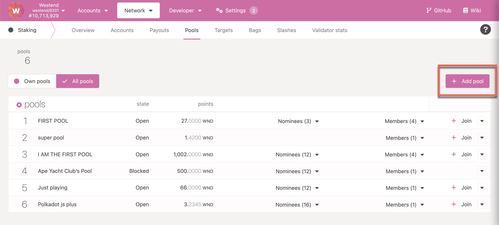
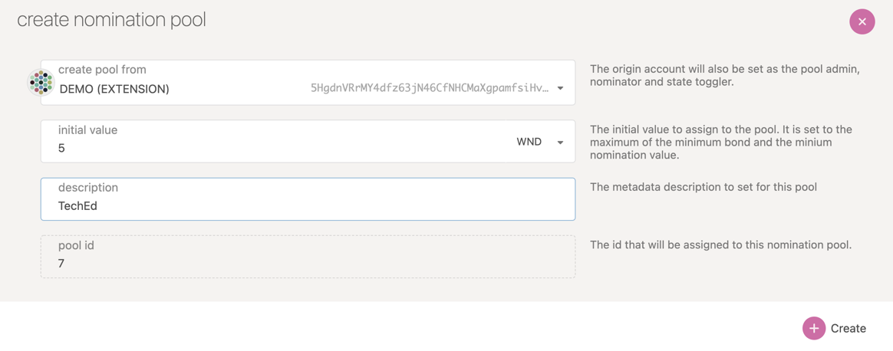
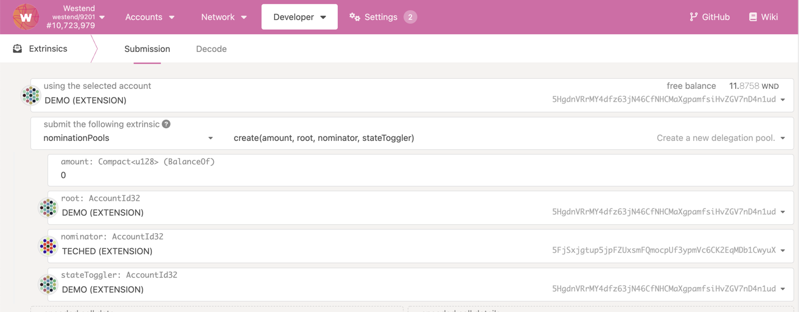
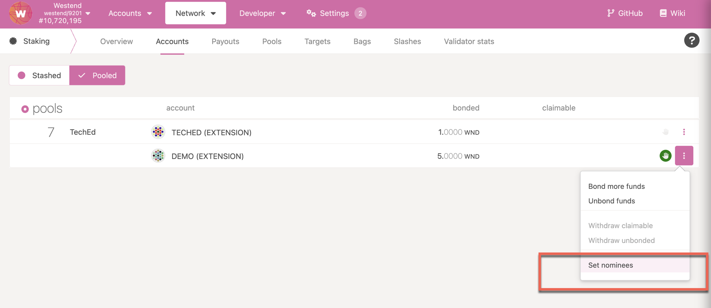
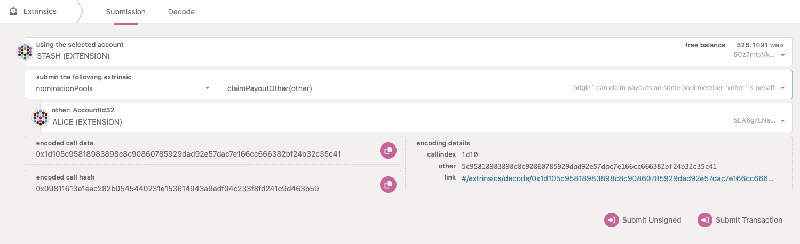
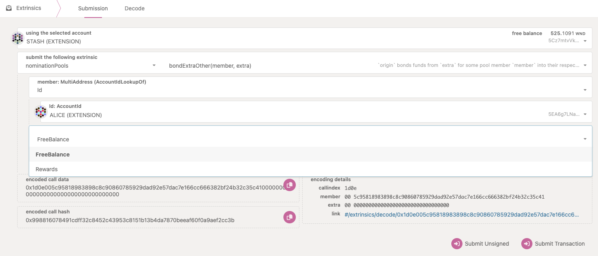

<!-- MessageBox -->

  

    Polkadot-JS is for developers and power users only. If you need help using the Polkadot-JS UI, you can contact the
    <a href="https://support.polkadot.network/support/home" target="_blank" rel="noopener noreferrer">
      Polkadot Support Team.
    </a>
  

  <button class="close-messagebox" aria-label="Close message">✖</button>

See [this page](./learn-nomination-pools.md) to learn about nomination pools.

## Pool Creation with Polkadot-JS

!!!info
    You easily create a pool using the [Polkadot Staking Dashboard](../general/dashboards/staking-dashboard.md#pools). See [this support article](https://support.polkadot.network/support/solutions/articles/65000182388-staking-dashboard-how-to-create-a-nomination-pool#How-to-create-a-pool) for more information.

The depositor calls the `create` extrinsic, setting the administrative roles and transferring some
funds to the pool to add themselves as the first member. As stated above, the depositor must always
be a member as long as the pool exists; they will be the last member to leave, ensuring they always
have some skin in the game. A significant stake from the depositor is always a good indicator of the
pool's credibility.

The current minimum bond to create a pool can be found
[here](../general/chain-state-values.md#minimum-bond-to-create-a-nomination-pool).

The pool’s ‘nominator role’ selects validators with the nominate extrinsic. On Polkadot JS Apps UI,
navigate to Network > Staking > Pools and click on Add Pool button.

The UI automatically assigns an ID to the pool and allows for entering the name of the pools and the
deposit to be bonded.

When creating a pool using Polkadot JS Apps UI, all the roles are mapped to the Depositor account by
default. If any of these roles need to be assigned to a different account, create the pool using
`create` extrinsic available in
[Developer > Extrinsics > nominationPools](https://polkadot.js.org/apps/#/extrinsics) on Polkadot JS
Apps UI.

## Pool Upkeep with Polkadot-JS

The nominator can update the pool’s validator selection. On Polkadot JS Apps UI, navigate to
[Network > Staking > Accounts page](https://polkadot.js.org/apps/#/staking/actions) and click on
Pooled button. If you have any pooled accounts with the role of nominator, you will notice the
option to set nominees. Select the validators to nominate like you would normally using a nominator
account.

The root and bouncer can update the pool’s state to blocked through `setState` extrinsic and kick
members by calling `unbond` and `withdrawUnbonded`. (The state can also be toggled back to open).

## Pool Destruction with Polkadot-JS

!!!info
    As a pool admin, you can easily destroy a pool and permissionlessly remove all members using the [Polkadot Staking Dashboard](../general/dashboards/staking-dashboard.md#pools). See [this support article](https://support.polkadot.network/support/solutions/articles/65000182388-staking-dashboard-how-to-create-a-nomination-pool#How-to-destroy-a-pool) for more information.

A pool can be pushed into the “destroying” state via one of:

- The root and bouncer set the pool to “destroying”. This can be done by submitting the
  `nominationPools.setState(poolId, state)` extrinsic using the
  [Polkadot-JS UI extrinsic tab](https://polkadot.js.org/apps/#/extrinsics). Where `poolId` is the
  specific ID of the pool and `state` is the pool's state that must be set to "destroying". Other
  possible states are "open" and "blocked".
- Any account can set the pool to destroying if over 90% of the pool's active bonded balance has
  been [slashed](./learn-offenses.md).

When a pool is in ‘destroying’ state, `unbond` and `withdrawUnbonded` become permissionless, so
anyone can help all the members exit.

The pool is destroyed once the depositor withdraws, no members belong to the pool, and all the
pool’s resources are wiped from the state.

## Claim Rewards for Other Pool Members with Polkadot-JS

As a pool member you can claim rewards for any other members who set their
[claim permissions](./learn-nomination-pools.md#claim-permissions) to one of the _permissionless_
options.

Let's take the example of ALICE setting the claim permissions to `PermissionlessAll`. Another
account STASH can now claim ALICE's rewards (as a free balance or compound them to the existing
bonded balance). To do so, STASH can go to the
[Polkadot-JS UI Extrinsic Tab](https://polkadot.js.org/apps/#/extrinsics) and issue the following
extrisics:

- `nominationPools.claimPayoutOthers` extrinsic specifying ALICE's account. This will claim the
  rewards as a free balance on ALICE's account.

- `nominationPools.bondExtraOthers` extrinsic specifying ALICE's account and the option to bond:
  - the free balance currently available in ALICE's account (`FreeBalance`) or
  - the pool rewards (`Rewards`) unclaimed by ALICE.

