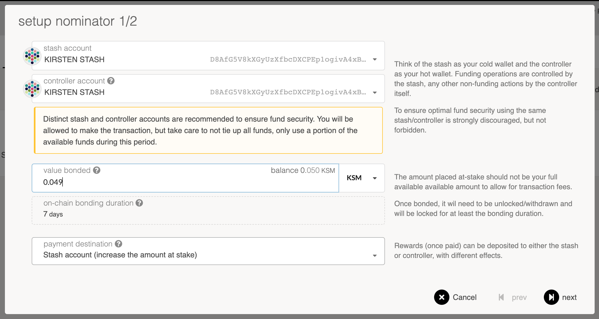
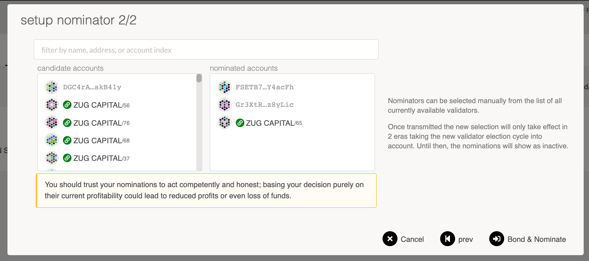

import RPC from "./../../components/RPC-Connection";

See [this page](./learn-staking.md) to learn about staking.

## Nominate Using Polkadot-JS

### Step 1: Bond your tokens

On the [Polkadot-JS UI](https://polkadot.js.org/apps) navigate to the "Staking" tab (within the
"Network" menu).

The "Staking Overview" subsection will show you all the active validators and their information -
their identities, the amount of KSM that are staking for them, amount that is their own provided
stake, how much they charge in commission, the era points they've earned in the current era, and the
last block number that they produced. If you click on the chart button it will take you to the
"Validator Stats" page for that validator that shows you more detailed and historical information
about the validator's stake, rewards and slashes.

The "Account actions" subsection ([link](https://polkadot.js.org/apps/#/staking/actions)) allows you
to stake and nominate.

The "Payouts" subsection ([link](https://polkadot.js.org/apps/#/staking/payouts)) allows you to
claim rewards from staking.

The "Targets" subsection ([link](https://polkadot.js.org/apps/#/staking/targets)) will help you
estimate your earnings and this is where it's good to start picking favorites.

The "Waiting" subsection ([link](https://polkadot.js.org/apps/#/staking/waiting)) lists all pending
validators that are awaiting more nominations to enter the active validator set. Validators will
stay in the waiting queue until they have enough KSM backing them (as allocated through the
[Phragmén election mechanism](../../learn/learn-phragmen.md)). It is possible validator can remain
in the queue for a very long time if they never get enough backing.

The "Validator Stats" subsection ([link](https://polkadot.js.org/apps/#/staking/query)) allows you
to query a validator's stash address and see historical charts on era points, elected stake,
rewards, and slashes.

Pick "Account actions" underneath "Network" > "Staking", then click the "+ Nominator" button.

You will see a modal window that looks like the below:

Select a "value bonded" that is **less** than the total amount of KSM you have, so you have some
left over to pay transaction fees. Transaction fees are currently at least 0.01 KSM, but they are
dynamic based on a variety of factors including the load of recent blocks.

Also be mindful of the reaping threshold - the amount that must remain in an account lest it be
burned. That amount is 0.01 in Kusama, so it's recommended to keep at least 0.1 KSM in your account
to be on the safe side.

Choose whatever payment destination that makes sense to you. If you're unsure, you can choose "Stash
account (increase amount at stake)" to simply accrue the rewards into the amount you're staking and
earn compound interest.

:::note Explainer video on using the Polkadot-JS UI

These concepts have been further explained in Polkadot's
[UI Walkthrough Video](https://www.youtube.com/watch?v=mNStMPZjiHM&list=PLOyWqupZ-WGuAuS00rK-pebTMAOxW41W8)

:::

### Step 2: Nominate a validator

You are now bonded. Being bonded means your tokens are locked and could be
[slashed](../../learn/learn-staking.md#slashing) if the validators you nominate misbehave. All
bonded funds can now be distributed to up to {{ polkadot: 16 :polkadot }} {{ kusama: 24 :kusama }}
validators. Be careful about the validators you choose since you will be slashed if your validator
commits an offence.

Click on "Nominate" on an account you've bonded and you will be presented with another popup asking
you to select some validators.

Select them, confirm the transaction, and you're done - you are now nominating. Your nominations
will become active in the next era. Eras last six hours on Kusama - depending on when you do this,
your nominations may become active almost immediately, or you may have to wait almost the entire six
hours before your nominations are active. You can check how far along Kusama is in the current era
on the [Staking page](https://polkadot.js.org/apps/#/staking).

Assuming at least one of your nominations ends up in the active validator set, you will start to get
rewards allocated to you. In order to claim them (i.e., add them to your account), you must manually
claim them. To initiate a claim, you can do it yourself or have the validator that you staked for
initiate a claim. This is to help optimize the effectiveness and storage of payouts on Kusama. See
the [Claiming Rewards](../../learn/learn-staking.md#claiming-rewards) section of the Staking wiki
page for more details.

### Step 3: Stop nominating

At some point, you might decide to stop nominating one or more validators. You can always change who
you're nominating, but you cannot withdraw your tokens unless you unbond them. Detailed instructions
are available [here](../maintain-guides-how-to-nominate-polkadot.md).

## Claiming Rewards with Polkadot-JS

Anyone can trigger a payout for any validator, as long as they are willing to pay the transaction
fee. Someone must submit a transaction with a validator ID and an era index.
{{ polkadot: Polkadot :polkadot }}{{ kusama: Kusama :kusama }} will automatically calculate that
validator's reward, find the top
{{ polkadot: <RPC network="polkadot" path="consts.staking.maxNominatorRewardedPerValidator" defaultValue={512}/> :polkadot }}
{{ kusama: <RPC network="kusama" path="consts.staking.maxNominatorRewardedPerValidator" defaultValue={512}/> :kusama }}
nominators for that era, and distribute the rewards pro rata.

:::note

The Staking system only applies the highest
{{ polkadot: <RPC network="polkadot" path="consts.staking.maxNominatorRewardedPerValidator" defaultValue={512}/> :polkadot }}
{{ kusama: <RPC network="kusama" path="consts.staking.maxNominatorRewardedPerValidator" defaultValue={512}/> :kusama }}
nominations to each validator to reduce the complexity of the staking set.

:::

These details are handled for you automatically if you use the
[Polkadot-JS UI](https://polkadot.js.org/apps/#/staking/payout), which also allows you to submit
batches of eras at once.

To claim rewards on Polkadot-JS UI, you will need to be in the "Payouts" tab underneath "Staking",
which will list all the pending payouts for your stashes.

To then claim your reward, select the "Payout all" button. This will prompt you to select your stash
accounts for payout.

Once you are done with payout, another screen will appear asking for you to sign and submit the
transaction.

