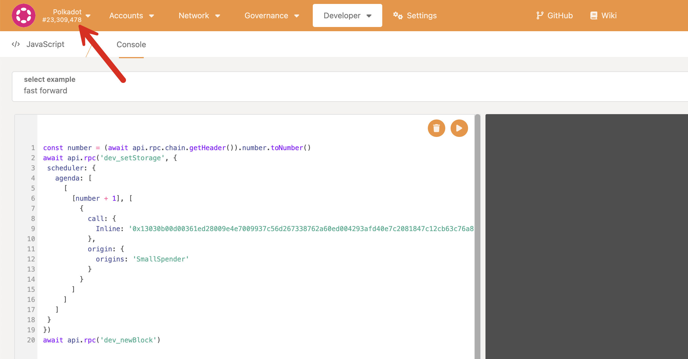

A Polkadot OpenGov referendum always contains a call that will be executed after the referendum is
voted in successfully. The referendum proposer is responsible for checking if the call gets executed
successfully on-chain and whether an appropriate origin and track have been chosen. In the case of
referenda that send a cross-chain call to the system chains, it is important to check whether the
XCM call gets dispatched successfully from Polkadot and is received/executed as expected on the
system chain.

This tutorial aims to show how to test the calls to be submitted with the referendum and ensure they
work as expected. Let us consider the two examples below:

- Submitting a Treasury referendum that requests 4500 DOT
- Submitting a referendum to remove ambassadors
  ([Referendum 1247](https://polkadot.subsquare.io/referenda/1247))

## Test a Polkadot OpenGov Referendum

To request 4500 DOT from the treasury, you must create a pre-image with the call
`treasury.spendLocal(amount,beneficiary)`. The guide for creating pre-images for treasury proposals
and submitting them is available [here](learn-guides-polkadot-opengov.md) on the Wiki. The proposer
needs to know the exact origin and track to submit this proposal. As this is a treasury proposal, it
would be one of the treasury tracks -
[SmallSpender](learn-polkadot-opengov-origins.md#small-spender) in the case of 4500 DOT.

`0x13030b00d00361ed28009e4e7009937c56d267338762a60ed004293afd40e7c2081847c12cb63c76a818`


### Fork a Network Locally using Chopsticks

If you like to check whether the call above will get executed successfully, you can check that by
performing a dry run using [Chopsticks](https://github.com/AcalaNetwork/chopsticks), which is
embedded in Polkadot JS UI. You can run a Chopsticks instance of any Polkadot SDK based chain by
clicking "fork locally" on the UI. The snapshot below shows it for Polkadot.


After forking locally, the Polkadot JS UI displays a local instance of the Polkadot network, which
does not produce any blocks by default. You will notice a few test accounts with DOT balance that
can interact with the network and test out Polkadot protocol features accessible through regular
accounts. However, the treasury spend call cannot be submitted through a signed account origin, so
it has to be tested with a treasury track origin. It can be tested by navigating to Developer >
Javascript tab on Polkadot JS UI, which dispatches the call on the next block via the scheduler with
the specified origin.

```
const number = (await api.rpc.chain.getHeader()).number.toNumber()
await api.rpc('dev_setStorage', {
 scheduler: {
   agenda: [
     [
       [number + 1], [
         {
           call: {
             Inline: '0x13030b00d00361ed28009e4e7009937c56d267338762a60ed004293afd40e7c2081847c12cb63c76a818'
           },
           origin: {
             origins: 'SmallSpender'
           }
         }
       ]
     ]
   ]
 }
})
await api.rpc('dev_newBlock')
```



After clicking the play button in the Javascript console, the block number visible on the top left
of the Polkadot JS UI should be incremented by 1. You can navigate to Polkadot JS UI Network >
Explorer to check the emitted events and see if the call was executed successfully. You should see
the errors displayed here if the call is unsuccessful.


## Test a Polkadot OpenGov Referendum with Cross-chain Calls

Take the example of removing a member of the ambassador collective on the Collectives system chain
through a Polkadot OpenGov referendum. Obtain the call data to remove a member from the ambassador
collective in the Collectives system chain runtime.


Note down the call data and navigate to Developer > Runtime calls and fetch the weights for
execution of the call through `transactionPaymentCallApi.queryCallInfo`. Here is the call info used
in our example for your reference:
`0x4603000c691601793de060491dab143dfae19f5f6413d4ce4c363637e5ceacb2836a4e0300`


Now you have all the information you need to create an XCM call that needs to be sent from Polkadot.
No fee payment is required for an XCM call dispatched through OpenGov. The Collectives chain
`ParaID` is 1001. With this information, we can construct the XCM call shown below.

`0x630004000100a50f04082f0000060303e3c4cc9589ad944603000c691601793de060491dab143dfae19f5f6413d4ce4c363637e5ceacb2836a4e0300`


### Cross-chain Testing setup using Chopsticks

Testing this cross-chain call by [forking locally](#fork-a-network-locally-using-chopsticks) will
only perform the required checks on the sending chain, not the receiving chain. To do cross-chain
testing, download and install [Chopsticks](https://github.com/AcalaNetwork/chopsticks) on your
machine and run the command below:

`npx @acala-network/chopsticks@latest xcm -r polkadot -p polkadot-collectives`

This should start the Polkadot and the Collectives instances available at ports 8001 and 8000
respectively. Connect to both these instances using Polkadot JS UI on two separate browser windows.
To connect to these local machine instances at the designated ports, edit the custom endpoint for
Polkadot JS UI as shown in the picture below and click on Switch button at the top.


Navigate to the Polkadot instance and open Javascript console to run the code below.

```
const number = (await api.rpc.chain.getHeader()).number.toNumber()
await api.rpc('dev_setStorage', {
 scheduler: {
   agenda: [
     [
       [number + 1], [
         {
           call: {
             Inline: '0x630004000100a50f04082f0000060303e3c4cc9589ad944603000c691601793de060491dab143dfae19f5f6413d4ce4c363637e5ceacb2836a4e0300'
           },
           origin: {
             origins: 'FellowshipAdmin'
           }
         }
       ]
     ]
   ]
 }
})
await api.rpc('dev_newBlock')
```


After clicking on the play button in the Javascript console, the block number visible on the top
left of the Polkadot JS UI should be incremented by 1. You can navigate to Polkadot JS UI Network >
Explorer to check the emitted events and see if the call got executed successfully. If the call is
unsuccessful, you should see the respective errors displayed here.

**Successful XCM call dispatch shown on the Polkadot network:**


You can then navigate to the local Collectives instance and check the events to confirm the call is
executed as expected.

**Successful XCM call receipt shown on the Collectives system chain:**


Now, take the example of [Referendum 1247](https://polkadot.subsquare.io/referenda/1247) which
executes a call that tries to remove 19 ambassadors from the collective at once. This is a very long
call and exceeds the Javascript console `inLine` character limit. In that case, the code can be
modified instead to lookup the preimage of call with the specified length and check if it is
successfully executes.

`0x630004000100a50f04082f0000060307005847f80d824f12009d0b28045046030090bd3d091b8837f2f41c38b6e3bebd28a31ee280f82d15e687f95d798ef41c1703004603000c7f10142a81fedec753f7c556f5b93a400c280805e7fcdff668719637b13434030046030062d8c4e1c6fbab57ba4df15b8120db4cec5c150371d0755d8ee5312382f47f09030046030094c860705264b96854acc3cb307365132bd131524ef83a7c014378ed793737230300460300aeb6173b1b6d5933c79992954d1469e845a89a5c754f91a9cb2f7589d78b9970030046030018bd4fb6b90f5088bdc825c3d674bd72e705c6f1163e86f960eeb7969ab4833a03004603002add0af948eba3b1fcd5cacde1f6fcc70f11ef75056f88ca4d11dcc5b080220e03004603009a3a7fc4a0eba9a8bd47c96aedfb5436ecc4d39536af5fca275fbf88104eae070300460300f4792917b47917519e2c05619763a4e7b45b84815f902f62e16f23e9f2b2265303004603008e156836bd7dc0639ea54540eb6ec55aec2a3793876208bf5d71ff89eb746a07030046030008b712a589f5cb71cd7094809785ab0a924358d3cb52b27efd4933b6efc149630300460300cc10dd1946b0fc65c8993ff7f47052713e9aa4b1cb72c913bd397c34adf4f9490300460300d6b8ec23dc68f20b5d315007d9c1a6706f9bd5c883319181129e76a89e97815503004603000c691601793de060491dab143dfae19f5f6413d4ce4c363637e5ceacb2836a4e03004603000ef2cc1000f878a3880a09d698b5375f20c4ab3d8b3a1b783c8150faca3da65a03004603001eb38b0d5178bc680c10a204f81164946a25078c6d3b5f6813cef61c3aef48430300460300568191edc1aaf4bea93b17cf53ea49ab78e2d25d83dec8581854be93d3bc9609030046030088f28e17671ba1808d7b02cd3caaf80113066a467127666f4d80afc50bfbc1270300460300b430a1d38186a28164facec9010e36b1289eb6d3ad0f03f328188fd52bcb333a0300460300ce2490656709c33bdd50d72dc0ec562bb72db84945ef7a1be45be14bbc6fc8770300`

The preimage hash of this call is
`0x82802c62d52a2431e422b58fff1fbdd0efc648e7c98351bd26048d169b94f956` and its length is `733`
(obtained from Polkadot JS UI Governance > Preimgaes tab for that lists the preimages that are
already submitted).

```
const number = (await api.rpc.chain.getHeader()).number.toNumber()
await api.rpc('dev_setStorage', {
 scheduler: {
   agenda: [
     [
       [number + 1], [
         {
           call: {
             Lookup: {
               hash: "0x82802c62d52a2431e422b58fff1fbdd0efc648e7c98351bd26048d169b94f956",
               len: 733
             }
           },
           origin: {
             origins: 'FellowshipAdmin'
           }
         }
       ]
     ]
   ]
 }
})
await api.rpc('dev_newBlock')
```

If there are referenda that are to be submitted on Root track and you like to test it, you can use
the same template as above and replace

```
           origin: {
             origins: 'FellowshipAdmin'
           }
```

with

```
           system: {
             origin: 'Root'
           }
```
