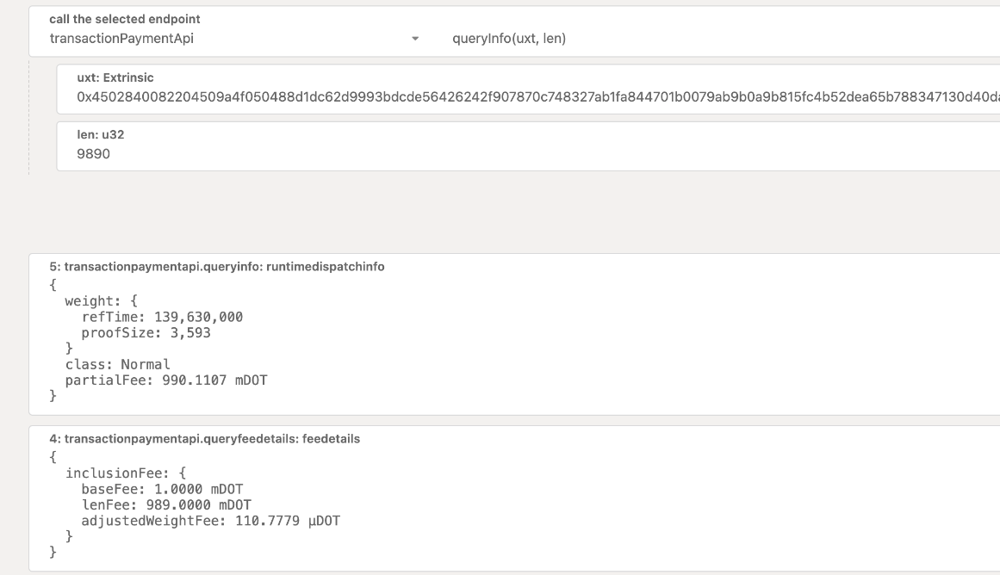

<!-- MessageBox -->
<div id="messageBox" class="floating-message-box">
  <p>
    Polkadot-JS is for developers and power users only. If you need help using the Polkadot-JS UI, you can contact the
    <a href="https://support.polkadot.network/support/home" target="_blank" rel="noopener noreferrer">
      Polkadot Support Team.
    </a>
  </p>
  <button class="close-messagebox" aria-label="Close message">✖</button>
</div>

## Metadata Updates with the Polkadot-JS Browser Extension

Before signing extrinsics with the Polkadot-JS Browser Extension, always check for metadata updates.
[**This video tutorial**](https://youtu.be/gbvrHzr4EDY?t=84) will explain how to do it.

!!!info "Polkadot Vault vs Polkadot-JS Browser Extension"
    The Polkadot Vault app updates the full metadata through the QR fountain while the extension updates the metadata index (the metadata is not loaded into it). As a consequence the process of updating metadata is different in this two cases (you will notice that on the Vault app the update takes longer for example). Having outdated metadata on the Vault app will prevent you from signing, while on the extension you will be able to click the sign button but the extrinsic will likely fail (similarly of having an outdated Ledger app). In general, failing to update metadata will most likely result in you not being able to sign extrinsics.

## Transfers using the Polkadot-JS UI and Browser Extension

See [this video tutorial](https://www.youtube.com/watch?v=gbvrHzr4EDY) to learn how to send funds
using the Polkadot-JS UI and Browser Extension. See also the Polkadot Support pages for detailed
information about signing transactions using
[the Polkadot-JS UI](https://support.polkadot.network/support/solutions/articles/65000181993-how-to-sign-a-transaction-directly-on-polkadot-js-ui)
and
[the Polkadot-JS browser extension](https://support.polkadot.network/support/solutions/articles/65000181989).

### Verify Extrinsics with the Polkadot-JS Browser Extension

Visit the
[**dedicated support page**](https://support.polkadot.network/support/solutions/articles/65000179161-how-can-i-verify-what-extrinsic-i-m-signing-#Verify-an-extrinsic-in-the-Polkadot-extension)
and see [**this video tutorial**](https://youtu.be/bxMs-9fBtFk?t=261) tutorial to learn about how to
verify extrinsics before signing them. The video will also mention potential attacks that can happen
to you while signing for transactions.

### Verify Extrinsics with the Polkadot-JS UI

Visit the
[**dedicated support page**](https://support.polkadot.network/support/solutions/articles/65000179161-how-can-i-verify-what-extrinsic-i-m-signing-#Verify-an-extrinsic-in-the-Polkadot-JS-UI)
and see [**this video tutorial**](https://youtu.be/bxMs-9fBtFk?t=163) tutorial to learn about how to
verify extrinsics before signing them. The video will also mention potential attacks that can happen
to you while signing for transactions.

### Keep-Alive Checks with the Polkadot-JS UI

!!!info
    See [**this video tutorial**](https://youtu.be/mgPHVztHJWk) and [**this support page**](https://support.polkadot.network/support/solutions/articles/65000168651-what-is-the-existential-deposit-) to learn about keep-alive checks and existential deposit.

In Polkadot there are two main ways to transfer funds from one account to another:

- `transfer keep-alive` (default option) will not allow you to send an amount that would allow the
  sending account to be removed due to it going below the
  [existential deposit](../general/chain-state-values.md#existential-deposit).
- `transfer allow-death` will allow you to send tokens regardless of the consequence. If the balance
  drops below the existential deposit your account will be reaped. It may be that you do not want to
  keep the account alive (for example, because you are moving all of your funds to a different
  address). To switch the keep-alive check off visit
  [this support article](https://support.polkadot.network/support/solutions/articles/65000169248).

!!!info
    Attempting to send less than the [existential deposit](../general/chain-state-values.md#existential-deposit) to an account with zero balance will always fail, no matter if the keep-alive check is on or not.

Even if the transfer fails due to a keep-alive check, the transaction fee will be deducted from the
sending account if you attempt to transfer.

### Vested Transfers with the Polkadot-JS UI

You can watch [**this video tutorial**](https://youtu.be/JVlwTQBwNGc) to understand how to do vested
transfers using the Polkadot-JS UI, including linear and cliff vesting. Note the tutorial uses the
Westend Testnet, but the same applies to Polkadot and Kusama.

There are two ways that vesting schedules can be created.

- One way is through an extrinsic type available in the Vesting pallet, `vested_transfer`. The
  vested transfer function allows anyone to create a vesting schedule with a transfer of funds, as
  long as the account for which the vesting schedule will be created does not already have one and
  the transfer moves at least `MinVestedTransfer` funds, which is specified as a chain constant.
- A second way is as part of the genesis configuration of the chain. In the case of Polkadot, the
  chain specification genesis script reads the state of the Claims contract that exists on the
  Ethereum blockchain and creates vesting schedules in genesis for all the allocations registered as
  being vested.

Vesting schedules have three parameters:

- **locked**, the amount of tokens to be transferred in
  [Planck units](../learn/learn-DOT.md#the-planck-unit)
- **per block**, the number of tokens that are released per block
- **starting block**, the block number after which the vesting schedule starts

The configuration of these three fields dictates the amount of funds that are originally locked, the
slope of the unlock line and the block number for when the unlocking begins.

#### Lazy Vesting

Like [simple payouts](learn-staking-advanced.md), vesting is _lazy_, which means that someone must
explicitly call an extrinsic to update the lock that is placed on an account.

- The `vest` extrinsic will update the lock that is placed on the caller.
- The `vest_other` will update the lock that is placed on another "target" account's funds.

These extrinsics are exposed from the Vesting pallet.

If you are using [the Polkadot-JS UI](./learn-polkadotjs.md), when there are tokens available to
vest for an account, you can unlock tokens that have already been vested from the
[Accounts](https://polkadot.js.org/apps/#/accounts) page.


#### Calculating When Vesting DOT Will Be Available

Generally, you should be able to see from the [Accounts](https://polkadot.js.org/apps/#/accounts) by
looking at your accounts and seeing when the vesting will finish. However, some DOT vest with
"cliffs" - a single block where all the DOT are released, instead of vesting over time. In this
case, you will have to query the chain state directly to see when they will be available (since
technically, the vesting has not yet started - all of the vesting will occur in a single block in
the future).

1. Navigate to the
   [Chain State](https://polkadot.js.org/apps/?rpc=wss%3A%2F%2Frpc.polkadot.io#/chainstate) page on
   Polkadot-JS.
2. Query chain state for `vesting.vesting(ACCOUNT_ID)`
3. Note the `startingBlock` where the unlock starts, and how much DOT is unlocked per block
   (`perBlock`).
4. You will have to calculate the result into “human time". To do this, remember that there are
   approximately 14’400 blocks per day, and you can see what the latest block is shown on the
   [Explorer](https://polkadot.js.org/apps/?rpc=wss%3A%2F%2Frpc.polkadot.io#/explorer) page.

### Batch Transfers with the Polkadot-JS UI

Batch transfers are balances transfers to multiple accounts executed by one account. In order to
construct a batch transfer you need to:

- Create a `utility.batch(calls)` extrinsic using the
  [utility pallet](https://paritytech.github.io/substrate/master/pallet_utility/index.html), and
- Within the batch call you can create multiple `balances.transferKeepAlive` extrinsics using the
  [balances pallet](https://paritytech.github.io/substrate/master/pallet_balances/index.html). You
  can specify as many receivers as you desire.

!!!info
    You can watch [**this video tutorial**](https://youtu.be/uoUC2K8muvw) to learn how to do batch transfers. Note the tutorial uses the Westend Testnet, but the same applies to both Polkadot and Kusama.

### Teleporting Tokens using the Polkadot-JS UI

See [this video tutorial](https://youtu.be/3tE9ouub5Tg) and
[this additional support article](https://support.polkadot.network/support/solutions/articles/65000181119-how-to-teleport-dot-or-ksm-between-statemint-or-statemine)
to learn more about how to teleport tokens.

!!!info
    If you do not see "Accounts > Teleport" in the Polkadot-JS UI, the source chain that you have selected does not support teleportation yet.

## Calculating Fees with Polkadot-JS

To calculate fees you can go to Developer > Runtime Calls and select the following extrinsics:

- `transactionPaymentApi.queryInfo`
- `transactionPaymentApi.queryFeeDetails`

and specify the `0x` prefixed hex call data and its length.



The sum of `baseFee`, `lenFee` and `adjustedWeightFee` will yield the `partialFee`.

One useful utility for estimating transaction fees programmatically is the via the
[@polkadot/api](https://www.npmjs.com/package/@polkadot/api). Check out the following script that
logs some relevant fee information:

```js
// Estimate the fees as RuntimeDispatchInfo using the signer
const info = await api.tx.balances.transfer(recipient, 123).paymentInfo(sender);

// Log relevant info, partialFee is Balance, estimated for current
console.log(`
  class=${info.class.toString()},
  weight=${info.weight.toString()},
  partialFee=${info.partialFee.toHuman()}
`);
```

For additional information on interacting with the API, checkout
[Polkadot-JS](../general/polkadotjs.md).

## Existing Reference Error

If you are trying to reap an account and you receive an error similar to
`"There is an existing reference count on the sender account. As such the account cannot be reaped from the state"`,
then you have existing references to this account that must be first removed before it can be
reaped. References may still exist from:

- Bonded tokens (most likely)
- Unpurged session keys (if you were previously a validator)
- Token locks
- Existing recovery info
- Existing assets

### Bonded Tokens

If you have tokens that are bonded, you will need to unbond them before you can reap your account.
Follow the instructions at [Unbonding and Rebonding](./learn-guides-nominator.md#bond-your-tokens)
to check if you have bonded tokens, stop nominating (if necessary) and unbond your tokens.

### Checking for Locks

!!!info
    See [this video tutorial](https://youtu.be/LHgY7ds_bZ0) and [this support page](https://support.polkadot.network/support/solutions/articles/65000169437-why-can-t-i-transfer-tokens-) to learn how to check for locks and remove them.

You can also check for locks by querying `system.account(AccountId)` in
[`Chain state` tab under the `Developer` drop-down menu in the Polkadot-JS UI](https://polkadot.js.org/apps/#/chainstate).
Select your account, then click the "+" button next to the dropdowns, and check the relative `data`
JSON object. If you see a non-zero value for anything other than `free`, you have locks on your
account that need to get resolved.

### Purging Session Keys

If you used this account to set up a validator and you did not purge your keys before unbonding your
tokens, you need to purge your keys. You can do this by seeing the
[How to Stop Validating](../maintain/maintain-guides-how-to-stop-validating.md) page. This can also
be checked by checking `session.nextKeys` in the chain state for an existing key.

### Existing Recovery Info

Currently, Polkadot does not use the
[Recovery Pallet](https://github.com/paritytech/polkadot-sdk/blob/master/substrate/frame/recovery/),
so this is probably not the reason for your tokens having existing references.

On Kusama, you can check if recovery has been set up by checking the
`recovery.recoverable(AccountId)` chain state. This can be found under `Developer > Chain state` in
[PolkadotJS Apps](https://polkadot.js.org/apps/).

### Existing Non-Native Assets

Currently, Polkadot does not use the
[Assets Pallet](https://github.com/paritytech/polkadot-sdk/tree/master/substrate/frame/assets), so
this is probably not the reason for your tokens having existing references.
