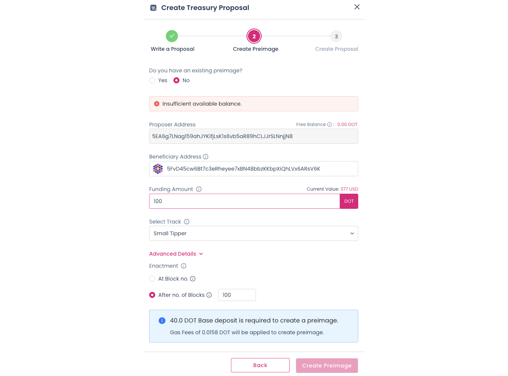

<!-- MessageBox -->

  

    Polkadot-JS is for developers and power users only. If you need help using the Polkadot-JS UI, you can contact the
    <a href="https://support.polkadot.network/support/home" target="_blank" rel="noopener noreferrer">
      Polkadot Support Team.
    </a>
  

  <button class="close-messagebox" aria-label="Close message">✖</button>

See [this page](./learn-polkadot-opengov-treasury.md) to learn about the Polkadot Treasury.

## Creating a Treasury Proposal

Your proposal should address a problem, outline a goal, give a detailed account of how you will
reach that goal, and include any ongoing maintenance needs. As much as possible, you should itemize
the tasks to be completed so fees can be evaluated and milestones can be followed. You can check the
guidelines below:

- Guidelines for a successful proposal on
  [Polkadot](https://docs.google.com/document/d/1IZykdp2cyQavcRyZd_dgNj5DcgxgZR6kAqGdcNARu1w) and
  [Kusama](https://docs.google.com/document/d/1CzEnurqwqLBOGrJI9CQORiGW9m6QyPOSshhzJdR57Pk)
- [Treasury proposal template for Polkadot](https://docs.google.com/document/d/1O_84mXYFERCavmnJyxbIPKFkG0bVBySRjCVy-d-VKcc)

### Announcing the Proposal

To minimize storage on-chain, proposals don't contain contextual information. When a user submits a
proposal, they will need to find an off-chain way to explain the proposal via
[community channels](../general/community.md).

Spreading the word about the proposal's explanation to the community is ultimately up to the
proposer.

!!!tip "Use Accounts with Verified On-Chain Identity for Treasury Proposals"
    To ensure legitimacy, it is required that the account linked to the Treasury proposal has an [identity set](https://support.polkadot.network/support/solutions/articles/65000181981-how-to-set-and-clear-an-identity) and is [verified by an on-chain registrar](https://support.polkadot.network/support/solutions/articles/65000181990-how-to-request-and-cancel-identity-judgement).

## Creating a Treasury Proposal - Spend Local

!!!info ""Spend" vs. "Spend Local""
    You may notice that the Treasury pallet contains two extrinsics - `treasury.spend` and `treasury.spendLocal`. `treasury.spendLocal` (formally called `treasury.spend`) refers to a spend of DOT that is locally available, i.e., DOT from the relay chain's treasury account. `spend` actually allows the caller to specify an asset other than DOT, or even assets in other locations, e.g. [Asset Hub](../general/glossary.md#asset-hub).

Unlike `treasury.spendLocal`, `treasury.spend` is **not** bound by a spend period, and must be
claimed manually via the `treasury.payout` extrinsic. `treasuy.spendLocal` behavior remains
unchanged.

### Submit Treasury Proposal Preimage

The example below shows how to create a [preimage](../general/glossary.md#preimage) for a
transaction that requests 100 DOT from Treasury.

- Navigate to [Polkadot-JS UI > Governance > Preimages](https://polkadot.js.org/apps/#/preimages)
  and then click on Add Preimage.
- Select the account which will be used to submit the preimage.
- Choose `treasury` pallet in the "propose" dropdown and the `spendLocal(amount, beneficiary)`call
- Enter the DOT amount.
- Enter the AccountID of the beneficiary (which has a verified on-chain identity).
- Submit preimage
- Sign and submit the transaction by paying the specified transaction fees.

!!!info "Preimage Submission Deposit"
    A deposit is required for the preimage to be stored on chain. The preimage deposit is proportional to the amount of information stored within the preimage. The deposit amount required for a preimage with a treasury spend transaction is around 41 DOT (1.4 KSM on Kusama). Ensure you have enough account balance to pay for the submission deposit and the transaction fees.

Here is the preimage requesting for 100 DOT.

!!!info "Balance entered is in Plancks"
    Polkadot JS UI is for developers and the UI takes input of the balance in [plancks](learn-DOT.md#the-planck-unit). DOT has 10 decimals, which is 10000000000 plancks per DOT.

After successful submission of the preimage, it is displayed on Polkadot-JS UI > Governance >
Preimages page. Every preimage is associated with a unique preimage hash (highlighted in a box in
the image below). Take a note of this preimage hash, which is required to submit a referendum.

### Submit a Treasury Track Referendum

The example below shows how to submit a Treasury track referendum.

- Navigate to [Polkadot-JS UI > Governance > Referenda](https://polkadot.js.org/apps/#/referenda)
  and then click on Submit proposal.
- Select the account which will be used to submit the proposal.
- Choose the appropriate submission track (The example below selected Small Spender track).
- Enter the preimage hash of the treasury spend transaction.(If the preimage exists on-chain, the
  preimage length box is automatically populated)
- Click on Submit proposal.
- Sign and submit the transaction.

Once your submission is executed, your referendum will appear under your chosen track on the
Polkadot-JS UI [referenda page](https://polkadot.js.org/apps/#/referenda).

### Place a Decision Deposit for the Treasury Track Referendum

For the referendum to move from preparing phase to the deciding phase, a decision deposit needs to
be placed. The decision deposit values for each individual
[Treasury Tracks](./learn-polkadot-opengov-treasury.md#treasury-tracks) are listed in a section above
in this document.

The preimage and decision deposits
[can be claimed once the referendum ends](./learn-guides-polkadot-opengov.md#claiming-the-preimage-and-decision-deposits).

## Creating a Multistage Payout Proposal with `validFrom`

Staged proposals are similar to a tranche or milestone-based funding model; instead of all spends
being paid simultaneously, each portion is redeemable at a certain block height. This is done by
specifying each milestone, set at its respective amount and block height at which it becomes
redeemable.

For example, take the following "staged" proposal, which has three milestones, each at 100 DOT, and
is redeemable at the following block heights. Usually, block heights correspond to a date in the
future:

- 100 DOT paid out at block height 1000
- 200 DOT paid out at block height 2000
- 500 DOT paid out at block height 4000

Governance can also propose to **void** a staged proposal before it has completed all of its
payouts.

!!!info "Calculating dates from block heights"
    Although not the most accurate form of measurement, block heights can be used to correspond to certain dates in the future.

### Using `batch` for Multi-Spend Proposals

Using the Utility pallet, one can batch multiple `treasury.spend` calls together. Each of these
calls can have its own `validFrom` block height, which allows for scenarios such as the above to be
possible.

!!!tip "Multistage payout proposal example"
    For reference on how to create a multistage payout proposal, please check [Referendum 382](https://kusama.subsquare.io/referenda/382?tab=call) on Kusama.

### Using `validFrom` for a Milestone-Based Proposal

Once each spend is defined within the batched call, the `validFrom` field can be utilized to specify
the "date", or block height, at which each spend will be executed.

!!!info "Treasury Spends have to be claimed manually. Spends can expire!"
    Keep in mind that once the `validFrom` block height has been reached, you will have to claim the spend within 30 days. Check the claiming process for treasury spends [here](#manually-claiming-payouts)

## Creating a USDT Treasury Proposal - Spend (with AssetHub)

The following tutorial mostly goes over how to utilize the `spend` extrinsic, which, unlike
`spendLocal`, is able to specify assets besides the native asset in other locations, such as
[Asset Hub](../general/glossary.md#asset-hub).

### Creating a Preimage

The example below shows how to create a [preimage](../general/glossary.md#preimage) for a transaction
that requests 100 USDT from AssetHub.

- Navigate to [Polkadot-JS UI > Governance > Referenda](https://polkadot.js.org/apps/#/preimages)
  and then click on Add Preimage.
- Select the account to submit the preimage.
- Choose the `treasury` pallet in the "propose" dropdown and the
  `spend(assetKind, amount, beneficiary, validFrom)` call.

Now, let's go through each field one-by-one and fill them in accordingly:

### Specifying Asset Kind

`assetKind` refers to the asset to be used, specified via XCM. In short, we need to be able to find:

- The relative location of the asset, and
- How it is identified within this location.

For this example, we are using USDT, which from the perspective of the relay chain would be:

`Parachain 1000 (AssetHub) > AssetId (Concrete) > PalletInstance 50 > General Index 1984`

First, we specify the location - in this case, Asset Hub (parachain 1,000). `PalletInstance 50`
refers to the Assets pallet instance on Asset Hub. The general index is `1984`, which is the ID of
USDT in this instance of the Assets pallet.

!!!caution "Bug on Polkadot-JS UI"
    As the Polkadot-JS UI is interpreting the general index in DOT, it multiplies the entered values with `10000000000` (As DOT token has 10 decimals) and places it in the `u128` argument. As we would like to have `1984` as the input argument, we can offset this UI induced error by entering `0.0000001984`.
    
    The issue on Polkadot-JS repo can be tracked [here](https://github.com/polkadot-js/apps/issues/10430).

Here is how the final `assetKind` field should look:

### Specifying the Amount

The amount should be simply the amount of USDT, where each `1` USDT is `1000000`. Because we are
asking for 100 USDT, we put `100000000` as the input for the amount.

!!!caution "Bug on Polkadot-JS UI"
    As the Polkadot-JS UI is interpreting the asset balance in DOT, it multiplies the entered values with `10000000000` (As DOT token has 10 decimals) and places it in the `u128` argument. As we would like to have `100000000` as the input argument, we can offset this UI induced error by entering `0.01` for this particular example where we like to input 100 USDT.
    
    The issue on Polkadot-JS repo can be tracked [here](https://github.com/polkadot-js/apps/issues/10430).

### Specifying the Beneficiary

The beneficiary account will be one on Asset Hub. For this reason, the XCM junction must be
specified as follows, with one junction (`X1`) and the beneficiary account (`AccountId32`), which is
an account address on the chain.

### Specifying `validFrom` (optional)

The `validFrom` field is optional, and refers to the block height of the relay chain upon which the
payout can be issued. If the `validFrom` parameter is not set, the spend can be paid out immediately
after approval. For more information on this field, refer to the
[guide below](#creating-a-multistage-payout-proposal-with-validfrom).

The final call should look like the following, where we:

- Specify our asset as **USDT** on **Asset Hub**.
- Specify the **amount** of **USDT** (100).
- Specify the beneficiary address.
- If applicable, use the `validFrom` field to specify a block number upon which the payout becomes
  valid.

The next steps are to:

- Copy the preimage (and its length)
- Sign and submit the preimage

Once this is finished, one may submit a proposal
[as stated above](#submit-a-treasury-track-referendum). Keep in mind one will also need to
[provide the decision deposit as well](#place-a-decision-deposit-for-the-treasury-track-referendum).

### Manually Claiming Payouts

In order to claim the spend, you must manually call the `treasury.payout` extrinsic via a `Signed`
origin. The `spendID` for the pending payout can be queried on-chain through Polkadot-JS UI >
Developer > Chain State > Storage > treasury > spends and unselect the include option and then click
on the plus button to the right.

From the list of spends, find the `spendID` of your respetive payout and issue the payout extrinsic.

!!!tip "payout example"
    To claim the first payout of [Referendum 382](https://kusama.subsquare.io/referenda/382?tab=call) on Kusama, [this payout extrinsic](https://kusama.subscan.io/extrinsic/23061444-2) was issued. After issuing the payout extrinsic, the status of the payout changes from `pending` to `Attempted` with a reference to a payment ID. If the payout is successful, the balance on Asset Hub should be updated. [Here](https://assethub-kusama.subscan.io/extrinsic/6923602-0) is the transfer extrinsic on Asset Hub for the first payout of [Referendum 382](https://kusama.subscan.io/referenda_v2/382).

To clear the on-chain storage of a successful or expired spend, Treasury pallet's `checkStatus`
extrinsic can be used. The transaction fees paid for issuing this extrinsic will be refunded.

### Proposing a "Void" for a Staged Proposal

If a proposal that hasn't completed all of its spends needs to be voided, the `treasury.voidSpend`
extrinsic can be utilized via a governance proposal.

!!!tip "Example proposal - Voiding a Treasury Spend"
    For reference, check the referenda on Kusama that [tests VoidSpend functionality for Treasury Payouts](https://kusama.subsquare.io/referenda/391). Through this referenda, a treasury spend was [successfully voided](https://kusama.subscan.io/event?page=1&time_dimension=date&module=treasury&event_id=assetspendvoided).

## Submit Treasury Proposal via Polkassembly

To submit a treasury track referendum via [Polkassembly](https://polkadot.polkassembly.io/opengov)
click on the FAB button in the bottom right corner. Then,

- Click on "Create Treasury Proposal" and choose an address for the proposer.
- After choosing an address, you will enter a three-stage guideline:

  - Write a proposal: you can add a detailed description for the proposal, which will be stored on
    Polkassembly. Alternatively, you can link an existing discussion post.

  

  - Create a preimage: an existing preimage can be linked, or a new one can be created. To create a
    preimage, add the beneficiary address and the token amount. The track will be auto-selected and
    the user can proceed with the creation of a preimage.

  

  - Create a proposal: final confirmation about the proposal creation. The description of the
    proposal and the preimage are automatically linked to the proposal.

## Requesting Tips from the Treasury

To request a tip funded by the treasury, you can follow the above steps for
[creating a treasury proposal](#creating-a-treasury-proposal) but instead of submitting the proposal
to the `32 / Small Spender` track, you will need to submit it to the `30 / Small Tipper` or
`31 / Big Tipper` tracks depending on the number of tokens to be requested.

Briefly, you will need to:

- Create a preimage using the `treasury.spendLocal` extrinsic and specifying the number of tokens
  and the beneficiary of the tip
- Submit a proposal to the right track (i.e. `30` or `31`) using the preimage hash
- Once you started the referendum go to [Polkassembly](https://polkassembly.io/), log in with the
  proposer account and edit the referendum details
- Notify [the Polkadot Direction Element Channel](https://matrix.to/#/#Polkadot-Direction:parity.io)
  or [the Kusama Direction Element Channel](https://matrix.to/#/#Polkadot-Direction:parity.io) about
  your referendum
- Place the decision deposit
  [before the timeout](../general/chain-state-values.md#opengov-referendum-timeout)
- Once the referendum ends you can
  [claim the preimage and decision deposits back](./learn-guides-polkadot-opengov.md#claiming-the-preimage-and-decision-deposits)
