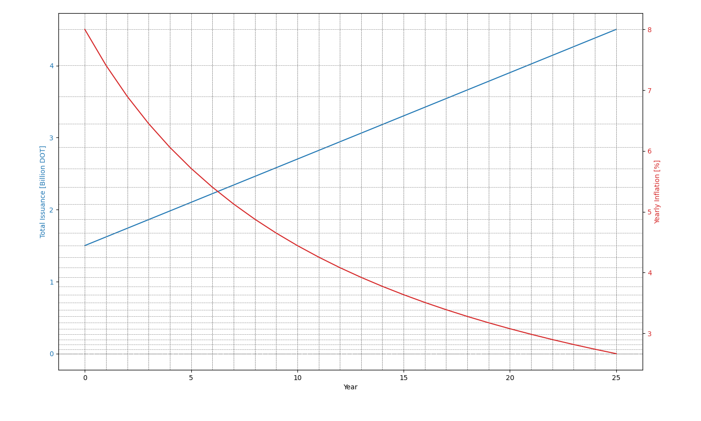

<!-- MessageBox -->
<div id="messageBox" class="floating-message-box">
  <p>
    <a href="https://forum.polkadot.network/t/proposal-for-adjusting-polkadots-inflation-system-reducing-issuance-and-complexity/9157" target="_blank" rel="noopener noreferrer">
      In November 2024, Polkadot transitioned from a model that led to exponential growth in the token supply (but with a constant inflation rate) to one with linear growth (with a decreasing inflation rate).
    </a>
    The constant inflation rate model is still in use for
    <a href="./learn-kusama-inflation.md" target="_blank" rel="noopener noreferrer">
      Kusama.
    </a>
  </p>
  <button class="close-messagebox" aria-label="Close message">✖</button>
</div>

DOT is an inflationary token, with
[**fixed annual expansion of the token supply of 120,000,000 DOT**](https://github.com/polkadot-fellows/runtimes/pull/471),
of which 15% goes to the [treasury](./learn-polkadot-opengov-treasury.md) and 85% to
[stakers](./learn-staking.md).

It is essential to understand that the primary objective of inflation is to incentivize network
participants through
[Nominated Proof of Stake (NPoS)](./learn-consensus.md#nominated-proof-of-stake) and to grow the
network through funding the on-chain treasury. The token inflation rate can be updated through
[on-chain governance](./learn-polkadot-opengov.md) based on thorough tokenomics research.

Below is a 25-year prediction of DOT gross annual inflation (red line) and DOT total issuance (blue
line), assuming the current fixed inflation rate.



The total issuance takes into account the gross DOT inflation and thus does not consider tokens that
are burned.

Net DOT inflation depends on [treasury burns](./learn-polkadot-opengov-treasury.md) and
[coretime sales](./learn-agile-coretime.md#agile-coretime-implementation) that are variables and
thus cannot be predicted. Net inflation can be defined as follows:

```

Net Inflation = Gross fixed inflation - burned supply (treasury + coretime sales)

```

Where `Gross fixed inflation` is the annual inflation of 120M DOT and the `burned supply` is the
annual burn supply due to treasury burns and coretime sale burns.
