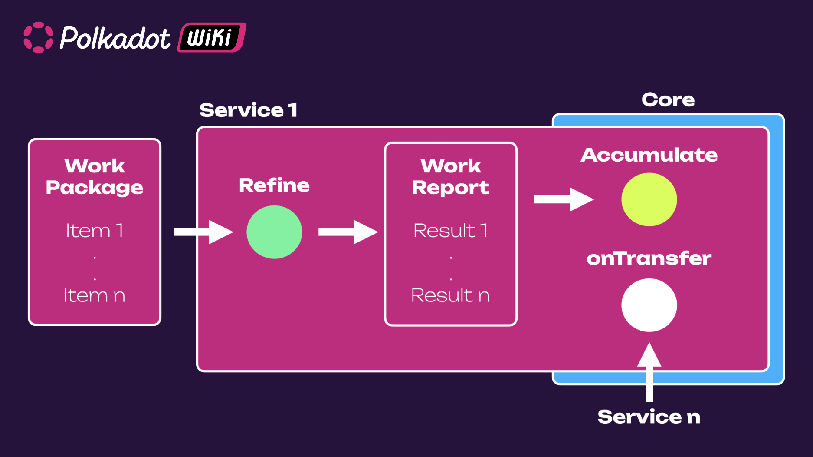

!!!info
    JAM paper is available at [graypaper.com](https://graypaper.com/) and the information regarding JAM prize is available at [jam.web3.foundation](https://jam.web3.foundation/). Download the printable version of the graypaper [here](../assets/graypaper_inverted_no_background.pdf).

JAM, short for Join-Accumulate Machine, represents a prospective design to succeed the relay chain.
Its name originates from CoreJAM, denoting Collect Refine Join Accumulate, which outlines the
computation model the machine embodies and that was
[first described in an RFC by Gavin Wood](https://github.com/polkadot-fellows/RFCs/blob/006a9ff07c3d3bc5316c6bf63b05e966e694cc2d/text/corejam.md).
However, within the actual chain, only the Join and Accumulate functions are executed, while the
Collect and Refine processes occur off-chain.

Unlike the current iterative approach, JAM will be introduced as a comprehensive singular upgrade.
Several factors contribute to this decision:

- A unified upgrade allows for precise restriction of post-upgrade actions, which is challenging
  with an iterative approach.
- It mitigates the constant stream of minor upgrades and breaking changes that occur regularly over
  weeks or months.

While this shift entails a significant breaking change, efforts will be made to minimize its impact
to manageable levels. Consolidating multiple smaller breaking changes into a single transition is
deemed preferable, introducing a novel blockchain concept that uniquely integrates various existing
ideas.

## A Rollup Chain

JAM will be a domain-specific chain that handles one particular domain of problems. In this case,
roll-ups. JAM's rollups are heavily bounded in terms of their security. This is what Polkadot has
been doing for the last five years, it is already a highly domain-specific roll-up chain. JAM
essentially makes it less opinionated and more generic.

The JAM chain accepts outputs of roll-ups, in more general terms, bits of computation done
elsewhere, and integrates the outputs into a shared state, similarly to how the Polkadot relay chain
functions.

The job of the JAM chain is to provide the necessary apparatus to ensure that the output correctly
reflects the input when it goes through the transformation it's meant to have undergone.

## Smart Contract Similarity

JAM exhibits several similarities with a smart contract chain:

- Permissionless code execution occurs directly on the JAM chain itself.
- The state of the JAM chain is organized into distinct encapsulations.
- Alongside state, encapsulations encompass code and balance.

These encapsulations of state are termed **services**. Thus, the JAM state is partitioned into
services. The creation of a new service is permissionless, akin to deploying a smart contract on a
smart contract chain. Consequently, adding a new service to the JAM chain does not necessitate
approval from any authority or adherence to governance mechanisms, unlike Substrate-based chains
that mandate governance approval for adding new pallets. Services encompass code, balance, and
certain state components, resembling the structure commonly observed on a smart contract chain.

## Service Entry Points

JAM services' code is split into three different entry points:

- **Refine** is the function that does the mostly stateless computation. It defines the
  transformation for the rollup for a specific service.
- **Accumulate** is the function that takes the output of that and folds it into the overall state
  of the service
- **OnTransfer** handles information coming from other services.

**Work packages** are the input to a service. Work packages can have many **work items** in them.
Every work item is associated with a service, and it reflects the actual input to the service. For
the parachains service, this is where the transactions and all of the blockchain inputs are entered.

The JAM security apparatus consists a two-stage processing where the Refine function accepts a work
item as an input and yields a work result as an output, which gets fed into the Accumulate function
(first Refine, then Accumulate). Work items are refined into **work results**, and therefore, a work
package containing many work items is refined into a **work report**, which is the corresponding
results of several items. A work package can be assigned that uses one core for a specific time slot
(typically a period of 6 seconds).

### JAM is Transactionless

JAM distinguishes itself from smart contract chains by operating transactionlessly. There are no
transactions within JAM; all actions are permissionless and initially undergo a Refine stage. During
this stage, the service pre-refines input data, transforming it into work reports consisting of work
results. Subsequently, these work results are transferred onto the chain.

Despite the absence of transactions, JAM still accommodates extrinsic information of a specific
format. There are five types of extrinsic information:

- Guarantees
- Assurances
- Judgments
- Preimages
- Tickets

The first three types form part of the JAM chain's security framework. Guarantees and assurances
involve validators collectively attesting that a work result accurately reflects the outcome of its
corresponding work item after transformation through the service's refine function.

Judgments occur when then integrity of a work result is considered uncertain and a large plurality
of validators attest to its validity or lack thereof. In this case an invalid work item may already
have been integrated into the service’s state and a rollback may need to happen. Judgments must
occur within one hour of submitting the work report to the chain, during which finality is
temporarily paused.

Preimages represent a feature provided by the JAM chain for the refine function. While the refine
function is typically stateless, it can perform one stateful operation: looking up the preimage of a
hash. This feature is the only opinionated aspect of the refine function.

Tickets serve as anonymous entries into the block production mechanism. They are not immediately
required for block production; instead, the system operates two epochs in advance. This mechanism is
part of the SAFROLE algorithm, a refined version of the original [SASSAFRAS](./learn-safrole.md)
algorithm.

### Refine Function

In the Refine processing stage within JAM, up to 15 MB of data can be accepted during each time
slot, which lasts 6 seconds. However, Refine yields a maximum of 90 kB of data, resulting in
significant data compaction that is necessary due to the distributed nature of
[the availability system](./learn-parachains-protocol.md#availability-and-validity-anv-protocol).
For instance, in the context of a parachain, the 15 MB of data represents the
[Proof of Validity (PoV)](./learn-parachains-protocol.md#protocols-summary), while the 90 kB of data
corresponds to the [candidate receipt](./learn-parachains-protocol.md#candidate-receipts).

Refine can execute for up to 6 seconds of [PVM](#polkadot-virtual-machine-pvm) gas, equivalent to
the full block period of the relay chain. This extended execution time, compared to the current
limit of two seconds for PVFs, is facilitated by [secure metering](#benchmarks-vs-metering) and
other optimizations inherent to PVM.

Preimage lookups can also be conducted within Refine. If a hash and its associated preimage are
believed to be available on the JAM chain, the preimage can be requested by providing the hash. This
capability enables efficient storage and retrieval of code, such as parachain code, by storing the
code on the JAM chain and referencing its hash in the work package.

Refine is the primary processing workhorse, handling tasks with largely stateless operations.

### Accumulate Function

The accumulate function is responsible for integrating the output generated by the Refine function
into the chain state. Accumulate can accept multiple outputs from Refine, all originating from the
same service. Both Refine and Accumulate serve as entry points from a service-specific code blob.

Accumulate's execution time per output is considerably shorter than Refine’s, typically around 10
milliseconds at most. However, the duration depends on factors such as the number of work items in
the work package. If a work package contains multiple items, the available time is divided among
them.

Unlike Refine, Accumulate is stateful, granting it access to the JAM chain's state. It can read
storage from any service, write to its key-value store, transfer funds, and include a memo with fund
transfers. Additionally, Accumulate can create new services, upgrade its code, and request preimage
availability, among other functionalities.

Moreover, Refine can invoke child instances of the PVM. This allows for creating sub-instances, or
virtual machines, where code and data can be deployed, memory and stack configurations can be
customized, and computations can be executed within a flexible framework.

### On-transfer Function

The onTransfer function within the JAM system is also stateful, enabling it to modify the service's
state. It has the capability to inspect the state of other services and make changes to its own
state. This functionality facilitates communication between services, albeit in an asynchronous
manner.

Unlike many smart contract platforms, where interactions occur synchronously, in JAM the interaction
between encapsulated components, such as smart contracts or services in this case, happens
asynchronously. Messages, along with tokens, are sent, and at some point later during the same
six-second execution period, the receiving service processes them. There is no immediate return
path; if a return path is needed, the sending service must initiate another transfer or modify its
state in a way that the receiving service can later interpret.

Both Accumulate and onTransfer are designed to be executed in parallel, allowing different services'
accumulation and transfers to occur simultaneously. This design opens the possibility for future
enhancements, such as allocating more than the current 10 milliseconds of gas input. In theory, a
secondary core could be utilized to execute certain accumulations, providing them with significantly
more gas to utilize.

## JAM Chain's Generalization

Polkadot, as outlined in the original Polkadot white paper, is primarily tailored to a specific
service profile: delivering parachains. In pursuit of this service, Polkadot has developed two
essential subcomponents:

- the distributed data availability system
- the auditing and guarantees system for computation (i.e. a roll-up system with robust security
  guarantees)

JAM represents a reduction in the level of opinionation compared to Polkadot, offering a higher
level of abstraction and generalization. This facilitates easier utilization of underlying
components according to individual preferences.

JAM operates in a permissionless manner, akin to smart contract chains, allowing individuals to
upload and expect the execution of code. Additionally, it hosts data, enables preimage lookup, and
manages state, resembling a key-value pair system. The genesis block of JAM includes a service to
facilitate the creation of new services since JAM lacks a mechanism for accepting transactions
directly.

Services within JAM have no predefined limits on the amount of code, data, or state they can
accommodate. Their capabilities are determined by crypto-economic factors; the more DOT tokens
deposited, the greater capacity for data and state. For instance, **the parachains service**
consolidates all Polkadot 1.1 functionality within a single service on JAM, with the potential for
additional services to leverage Polkadot's distributed availability system, and auditing and
guarantees system for computation.

## Polkadot Virtual Machine (PVM)

The PVM design is rooted in the RISC-V ISA (Instruction Set Architecture), known for its simplicity
and versatility. The RISC-V ISA offers several advantages:

- It is easy to transpile into common hardware formats such as x86, x64, and ARM.
- It is well-supported by tooling like [LLVM](https://llvm.org/)

The PVM itself embodies simplicity and security, being sandboxable and offering various execution
guarantees. It is deterministic, consensus-sensitive, and friendly to metering. Unlike other VMs,
the PVM lacks complexity and excessive opinionation.

WASM, while optimized for web use cases, presents challenges with stack management, particularly in
handling continuations. RISC-V addresses this issue by placing the stack in memory, facilitating
continuations handling naturally without additional complexity.

Additionally, the PVM demonstrates exceptional execution speeds, especially when run on conventional
hardware like X64 and ARM, offering advantages such as free metering compared to WASM.

The incorporation of RISC-V-enabled continuations is poised to establish a new standard for scalable
coding across multi-core platforms like JAM. Asynchronous, parallelized architectures are
increasingly essential for scalability in both hardware and software platforms, a trend that is
expected to extend to blockchain and consensus algorithms.

## SAFROLE

[SAFROLE](./learn-safrole.md) is a block production algorithm, a simplification of
[SASSAFRAS](https://research.web3.foundation/Polkadot/protocols/block-production/SASSAFRAS). It
excludes some components that may be useful for parachains. So parachains may probably stick with
SASSAFRAS rather SAFROLE. SAFROLE will be as simple as possible to:

- Ensure that it is as minimally opinionated as possible to maximize the potential future use cases
- To follow in the footsteps of Ethereum yellow paper, and really try to get as many implementations
  as possible to try and spread the expertise.

Understanding how Polkadot 1.0 works end-to-end is challenging. With JAM, someone who is capable of
reading and understanding the yellow paper would be able to read and understand fairly quickly how
JAM works. So simplicity is crucial.

## Networking

Networking for JAM uses the [QUIC protocol](https://en.wikipedia.org/wiki/QUIC). This allows direct
point-to-point connections between a large numbers of validators. So essentially all 1,000-plus
validators on Polkadot can have a persistent connection to each other without potential issues with
sockets. Gossip is avoided, mostly because it is not needed, because JAM will not handle
transactions. In case of distributing something that's not point-to-point or within a very small
subset validators, grid-diffusal will be used, in which validators are arranged into a grid, and
packages are sent by a row, and then each node on the row sends it to all members of its column.

## Pipelining for Efficient Block Processing

In state-based blockchains like Ethereum, the header of blocks typically contains the posterior
state root, summarizing the state after all block computations. Consequently, the header cannot be
sent until all computations are complete. However, some computations can be performed before sending
the header, as their outcomes determine the block's validity.

In JAM, a different approach is adopted by placing the prior state root in the header instead of the
posterior state root. This means that the state roots featured in the header lag by one block. As a
result, lightweight computations, comprising approximately 5% of the block's workload or execution
time, can be executed, and the block can be distributed immediately afterward. The remaining 95% of
the block's computation, primarily accumulation tasks, can be completed subsequently. This enables
the next block to be started before the execution of the current block is finished.

This approach allows for more efficient utilization of time between blocks. In traditional setups
like Polkadot's six-second block time, where the posterior state root must be provided, only a
portion of the time can be used for computation. However, with pipelining in JAM, the entire block
time can be effectively utilized for computations, maximizing efficiency.

While using the full block time for computation may not be ideal, as it could lead to perpetual
catching up and delayed block imports, JAM's approach enables significantly more time for
computation compared to traditional setups. This means that approximately three to three and a half
seconds of effective block computation time can be achieved, a substantial improvement over the
current setup.

## Architectural Differences: JAM vs. Relay Chain

One of the architectural distinctions between JAM and the relay chain lies in the degree to which
functionality is fixed. While the relay chain fixes certain elements, such as the language used to
define the protocol (WASM), JAM goes further in this regard. For instance, it dictates the type used
for encoding the block header and the hashing scheme, making alterations to these aspects
challenging.

However, flexibility comparable to that enabled by the WebAssembly meta-protocol in the relay chain
is preserved in JAM through its service model. In this model, upgradability responsibility is
shifted to services, freeing the chain itself from the burden of being upgradable. Three primary
reasons support this decision:

- Simplicity is prioritized. Maintaining a non-upgradable chain significantly reduces complexity.
- The relay chain's tendency to introduce complex functionalities without removing older ones
  complicates matters. Because upgrades are easily implemented, there's little incentive to simplify
  the Substrate SDK. Consequently, replicating Polkadot becomes impractical.
- The potential for optimization afforded by JAM's fixed parameters. With a clear understanding of
  the specific tasks the JAM chain must perform and the ability to set fixed parameters,
  optimizations in areas like network topology and timing become feasible. This contrasts with the
  challenges posed by the relay chain's highly upgradable nature, where such optimizations are more
  complex due to the frequent alterations possible with each upgrade.

Despite these differences, JAM retains flexibility in application-level functionalities, such as
coretime sales, staking, and governance, all managed within services. Additionally, JAM introduces a
novel concept by associating a token balance with a service, providing opportunities for economic
model adjustments that are not easily achievable in purely upgradable chains like the relay chain.

## JAM Toaster

One of the ongoing efforts in ensuring that JAM meets its original expectations involves
establishing a comprehensive test environment for the JAM chain. Unlike small-scale test networks
running on unreliable hardware to manage cloud computing costs, this initiative entails a
substantial investment. Introducing the JAM toaster, essentially a test platform designed for
conducting large-scale trials and performance assessments of JAM. This addresses a prior challenge
encountered during the development of the Polkadot relay chain, where understanding the emergent
effects and dynamics of operating a network at such scale proved difficult. Previous attempts were
limited to a few dozen nodes on a test network and the Kusama network, which lacks comprehensive
monitoring capabilities due to restrictions on accessing validator nodes. Conversely, the
small-scale test network failed to accurately simulate the network dynamics of a larger-scale
deployment. The JAM toaster aims to bridge this gap by enabling in-depth research at the scale of
the entire JAM network, comprising 1,023 nodes. This platform facilitates the investigation of
network behavior and performance characteristics, providing valuable insights for developers
regarding the expected performance of their parachains.

## JAM and Substrate

### Benchmarks vs. Metering

Benchmarks, or performance tests, can be optional when working with JAM. While they may still be
necessary on occasion, JAM's metered system can often obviate the need for frequent benchmarking.
JAM operates on a metered system, allowing users to assess computational workload after completion.
Additionally, there's a theoretical mechanism to control computation, typically implemented at block
construction time.

However, there are scenarios where benchmarking remains relevant. For instance, when metering is
deemed too conservative for certain use cases, benchmarking might be necessary to enhance
performance. Additionally, benchmarking could be useful for tasks requiring extended execution
times, ensuring they aren't run excessively long.

### XCMP

Moving on to Cross-Chain Message Passing (XCMP), JAM mandates full XCMP support. This is because
within the relay chain, there's a provision for passing more data via a candidate receipt than would
be practical if all parachains transmitted all data all the time. JAM adheres strictly to rules,
even for parachain services, including limitations on data transmission between the "refine" and
"accumulate" phases. Currently, with
[Horizontal relay chain Message Passing (HRMP)](./learn-xcm-transport.md#hrmp-xcmp-lite), all
messages traverse the relay chain, constraining the data payload to 4 kB or less, which might not be
realistic. Thus, XCMP, where only message headers are relayed via the chain while the actual message
data is transmitted off-chain, emerges as a necessary and overdue improvement.

### Accords

[Accords](../general/polkadot-direction.md#xcm-and-accords) essentially encapsulate state and logic,
resembling smart contracts, with multiple instances residing alongside each parachain. They
facilitate message exchange between instances and enable synchronous interactions with parachains.
Accords find utility in scenarios where trust between parachains is lacking, such as token
transfers. Unlike the existing method involving a reserve intermediary, Accords streamline direct
token teleportation between parachains, eliminating the need for trust-compromising intermediaries.
Moreover, Accords could function as XCM forwarding mechanisms, ensuring message integrity even when
relayed through third-party intermediaries, thus eliminating the need for explicit origin markers.

### Boosting Efficiency

Lastly, JAM's broader, less opinionated approach to leveraging underlying consensus mechanisms makes
it conducive to implementing more innovative solutions. For instance, distributed availability for
complex tasks like zero-knowledge proofs becomes more practical and efficient with JAM.
Additionally, JAM supports a mixed resource consumption model, wherein work packages can contain
both computationally intensive tasks and data-heavy operations. By pairing services with diverse
resource requirements, such as those needing extensive computation with those necessitating high
data availability, JAM optimizes the utilization of validators' resources, thereby reducing costs.
This flexible approach enables the combination of tasks like distributed availability and SNARK
verification with parachain workloads, driving down costs while enhancing efficiency.

## Enhancements and Compatibility in JAM

JAM's design prioritizes compatibility with existing Polkadot 1 parachains. While it maintains
compatibility with the Polkadot SDK, the Polkadot Validator Function (PVF) undergoes retargeting.
Instead of WebAssembly, it will target the Polkadot Virtual Machine (PVM). This transition is
facilitated by the fact that PVM is a minor modification of RISC-V, which has already been
established as an official LLVM target. Consequently, PVM could become an official LLVM target
before the deployment of JAM.

Beyond serving as a host for parachains, JAM introduces significant enhancements. It offers the
potential to streamline benchmarking efforts and alleviate future benchmarking requirements.
Additionally, JAM introduces the concept of accords, multi-instance, multi-sharded smart contracts
that govern and enforce specific interaction protocols between parachains. Furthermore, full
Cross-Chain Message Passing (XCMP) support is essential, enabling the removal of limitations on
information transfer between parachains, typically facilitated by Cross-Chain Messages (XCM).

Regarding Agile Coretime, JAM retains compatibility with existing setups. However, it introduces the
capability to target coretime not only at parachains but also at arbitrary sets of work packages.
This flexibility enhances the versatility and efficiency of resource allocation within the JAM
ecosystem.
