JAM is a new blockchain design centered on bringing rollups together, hosting them, and combining
them concisely and effectively.

## A Rollup Reactor

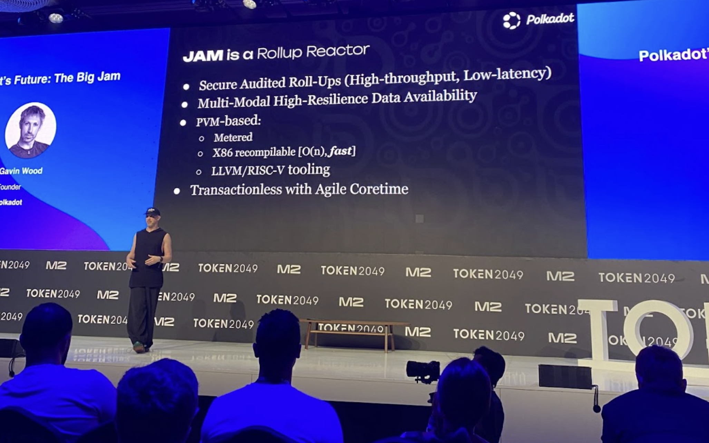

JAM is characterized as a rollup reactor. JAM will serve to process large amounts of data and
computation without causing congestion on the main blockchain. High resilience data availability
will be incorporated, along with the development of a new virtual machine called PVM, replacing the
original WebAssembly-based framework of Polkadot. RISC-V architecture forms the foundation of this
new base, enabling inherent recompilability to x86 code. JAM will integrate metering, aiding tasks
related to consensus. Given its RISC-V and RISC-V derivative nature, tooling is readily available,
with LLVM already compatible, offering support for numerous languages to target PVM.

The transactionless nature of JAM is a key aspect to understand. Transactions do not directly flow
onto the JAM chain; instead, a concept known as Agile Coretime has been introduced and pioneered in
Polkadot. Essentially, users purchase chunks of blockchain or block space at a time.

## JAM Data Topology

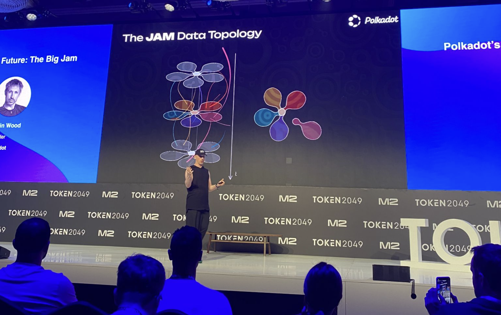

The JAM data topology resembles a series of flowers. Each flower is akin to a slice of time or a
block. Down the middle of the flower, the center is traversed by all the petals. These petals (or
cores) are subject to being accessed by flying bees (rollups). This structure mirrors the typical
progression of state in conventional blockchains, where transactions usually flow directly into the
center. In JAM, transactions or external data traverse via the petals. These petals are the
blockchain equivalent of supercomputers, capable of high-speed processing and computation. Unlike
designs such as Polkadot and certain Ethereum proposals, where petals have a one-to-one mapping, in
JAM, petals are versatile, stateless machines capable of adapting their functions and data
processing across different time slices. Let's examine one of these cores by extracting a petal and
observing its characteristics.

## JAM Core Anatomy: A Semi-coherent Model

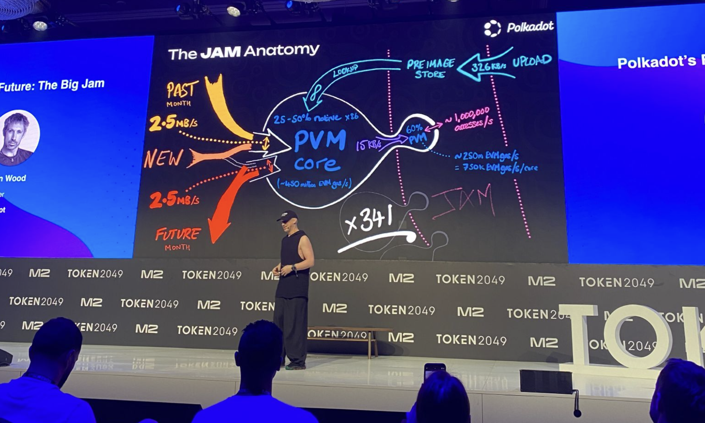

Here is the anatomy of a JAM core, one of these petals. The core, or this petal, can process a
target of 2.5 MB in and 2.5 MB out. It can handle data previously processed by other cores, perform
operations on it, and then pass it on to future cores for further processing. There is a limit to
the data it retains from the past; specifically, it only stores data for a month. Consequently, any
data left for future processing will only be available for a month. Additionally, it can transmit
some information into the middle of the flower. However, due to scalability concerns, this
transmission is limited to 15 kB/s into the middle, where it can be integrated with the data from
other petals and incorporated into the machine state, forming a single shared state machine. This
results in a semi-coherent model. It's not fully coherent, like a single-state environment where
everything interacts continuously. Nor is it persistently fragmented, like having separate
blockchains bridged together. This model contrasts with designs like Polkadot and ZK Rollup
Ethereum, where distinct chains maintain their states and occasionally send messages to the middle.

## Performance Target

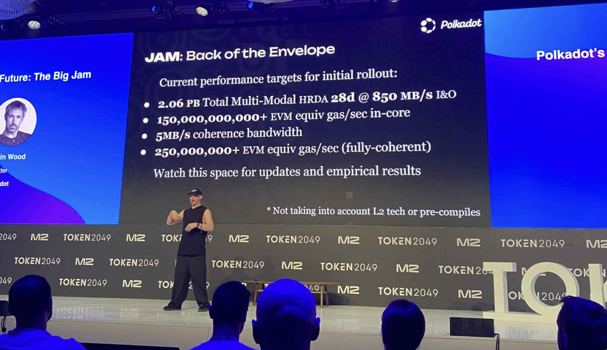

The performance targets being pursued for JAM include the storage capacity of over 2 PB for
high-resolution distributed availability. This signifies the maximum data storage capability of the
system at any given time. Additionally, JAM aims to handle data input and output at a rate of 850
MB/s, with this volume retained for 28 days.

Estimating computational capabilities within JAM's in-core processing presents challenges due to the
significant architectural differences between the PVM and EVM. Despite these complexities,
conservative estimations suggest a processing capacity of around 150 billion gas per second across
all cores.

The estimated rate for coherence bandwidth, which refers to data transmission from cores to the
central point, is approximately 5 MB/s. Once integrated into the central system, this data flow
enables a processing capacity of around 250 billion PVM gas per second.

While these estimates provide a preliminary understanding, further testing and analysis are expected
to refine these figures.

## JAM Approach

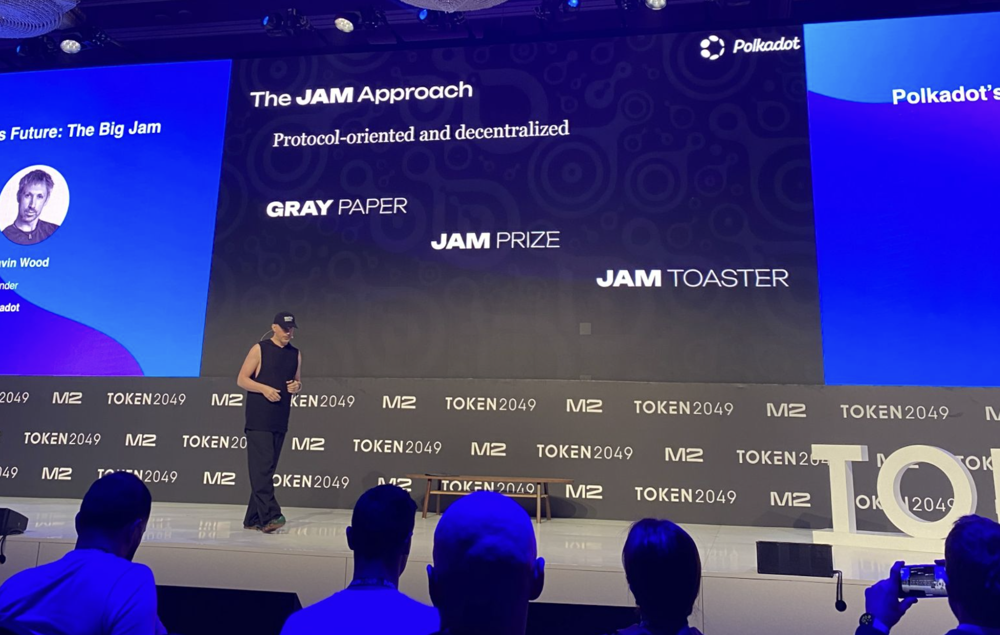

Achieving a decentralized protocol requires not only decentralizing the network but also
distributing expertise on the protocol itself across various entities rather than concentrating it
within a single group or company. In pursuit of this goal, JAM is introducing several initiatives.

### Gray Paper

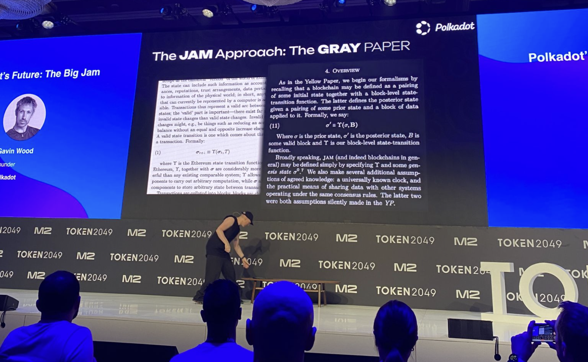

One of the initiatives is the gray paper, which serves as a follow-up to the yellow paper, drawing
upon many of its concepts. Similar to the yellow paper, the gray paper adopts a formal, pure
mathematical specification format for the JAM protocol. This specification avoids being tied to a
specific implementation or programming language, emphasizing the protocol's essence.

The gray paper has been in development for approximately six or seven months, with ongoing
refinements expected in the coming months, akin to the evolution of the Ethereum protocol after the
publication of its yellow paper in April 2014. The purpose of having a formal specification is to
underscore that JAM is a protocol distinct from mere software. Designing a protocol as software can
inadvertently prioritize the implementation over the protocol itself, leading to centralized
expertise contrary to the goals of decentralization.

For further details on the gray paper, visit greypaper.com.

### Gray Paper Tour

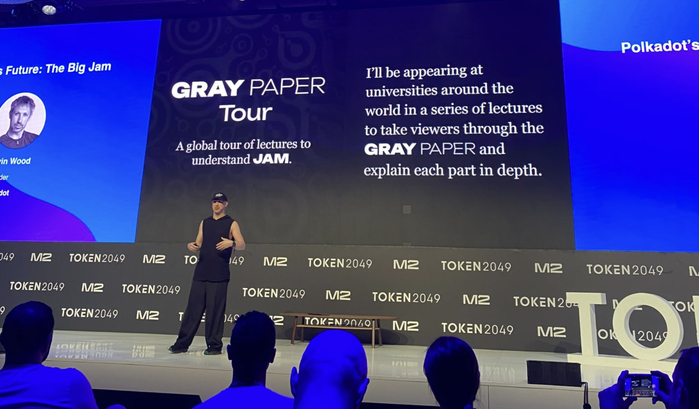

A series of tours around universities will be conducted to describe and teach how to interpret the
gray paper. While acknowledging that it may not be the easiest read and is not akin to a light
bedtime story, it remains comprehensible for individuals with a reasonable technical background.
Ensuring adequate teaching materials are available for those interested in understanding the
protocol is a priority.

Dates and locations for the university tours will be posted on the gray paper website for those
interested in attending.

### JAM Prize

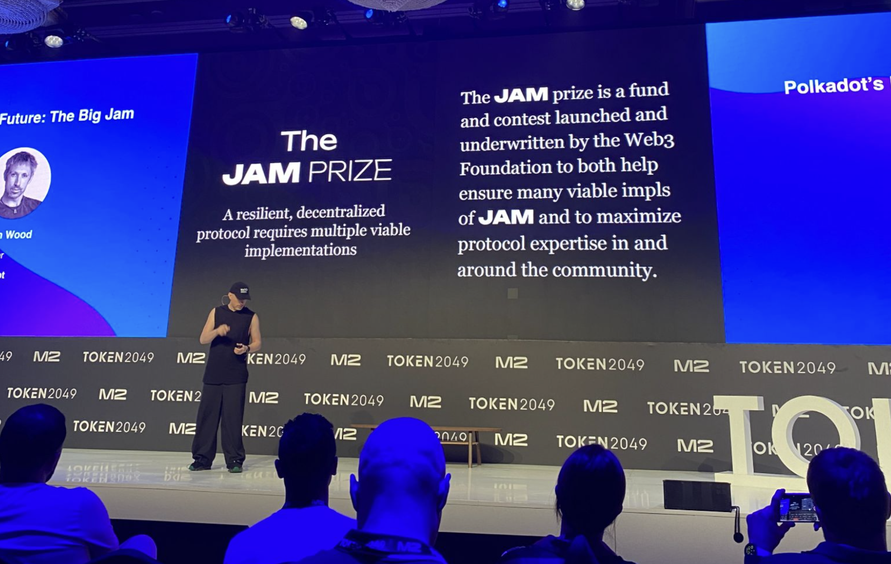

In addition to the gray paper, which defines correctness, there is the JAM prize, funded by the Web3
Foundation. Its purpose is to incentivize various individuals and teams to implement the JAM
protocol in various ways. The goal is to encourage diverse implementations in different languages
and protocol levels.

The prize structure entails four implementation tiers and four sets of implementation languages. It
will be awarded to individuals or teams that successfully implement the JAM protocol and meet
specific performance test criteria for each tier.

The tiers include options such as synchronization with the chain, validation capabilities, and
contribution to the chain extension. Further details, including specific criteria and timelines,
will likely be announced within the next month.

### JAM Toaster

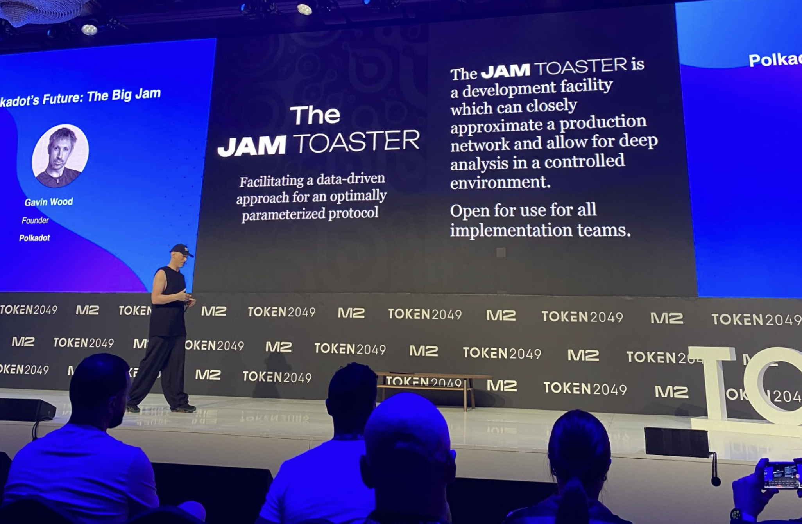

During the development of the Polkadot protocol, one challenge was understanding why certain
processes did not meet the expected performance levels. This issue often arose when individual nodes
appeared to function correctly, but a combination of nodes exhibited unexpected behavior, leading to
emergent effects that were challenging to analyze.

An approach to optimization, trialing, and testing is considered to address this challenge. As part
of this initiative, we are launching the JAM toaster, a comprehensive network emulator for the final
JAM network. The JAM toaster consists of 1,023 nodes, reflecting the scale of the JAM network, with
each node operating at near full capacity.

The JAM toaster enables in-depth introspection into the network's operations, facilitated by
high-quality logging and robust infrastructure. Implementation teams are encouraged to leverage the
JAM toaster to optimize and debug their implementations, ensuring the final JAM network achieves
optimal performance.

In terms of infrastructure, the JAM toaster boasts impressive specifications, including 16,500 AMD's
RedRig reports, 16 gigabytes of L2 cache, 32 terabytes of RAM, and substantial storage and
networking capabilities.

## Rollout Proposal

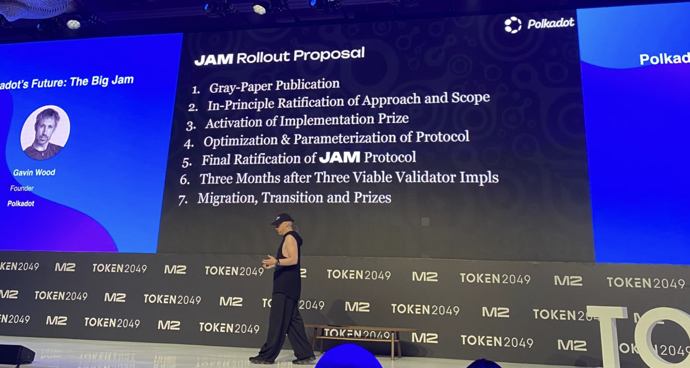 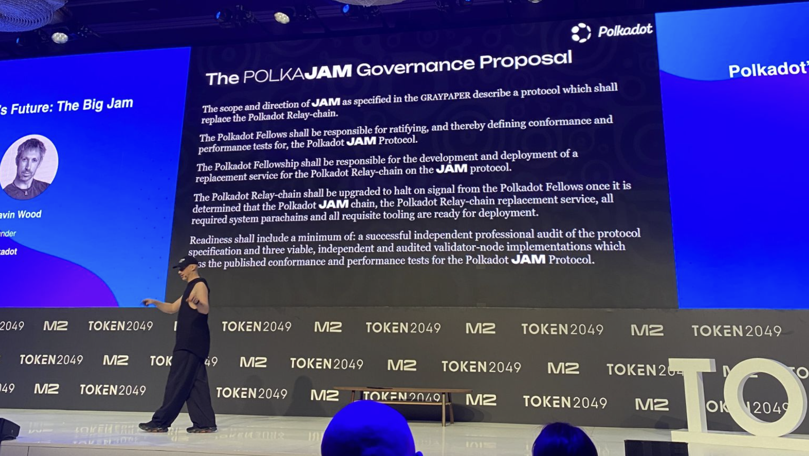

The process of bringing JAM to fruition involves several key steps. First, the grey paper outlining
the specifications of JAM has been completed. Next, the proposed approach and scope outlined in the
grey paper need to be ratified. This step is currently underway, with a governance proposal set to
be presented by the Web3 Foundation.

Once the ratification process is completed, the Web3 Foundation will activate the implementation
prize associated with the grey paper. Following this, several months of protocol optimization,
ratification, and evolution are expected. By the end of the year, a reasonably final protocol
proposal should be in place.

Subsequently, a final ratification and the finalization of validator implementations will occur.
This will pave the way for migrating from the Polkadot relay chain to the JAM chain. The governance
proposal outlines the responsibility of the Polkadot Fellowship and the technical minds behind the
Polkadot protocol in this process.

The Polkadot Fellowship will be tasked with finalizing the JAM specification, developing the
necessary tooling and software for the transition, and determining the readiness of the JAM chain to
go live. This readiness will only be declared once there is a successful independent audit of the
protocol and three viable implementations that can effectively operate within the network.

This approach departs from the expedited launch strategy employed with Polkadot. With JAM, the
emphasis is on taking the necessary time to ensure resilience and decentralization from the outset.
