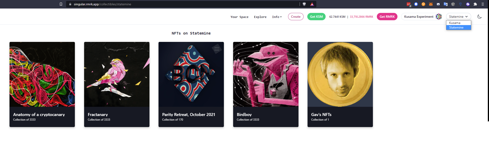

NFT [pallets](./learn-transactions.md#pallets-and-extrinsics) allow developers to easily implement
NFT-related actions within their dApp.

Polkadot as a decentralized ecosystem currently has 5 NFT Pallets for developers to choose from:

1. **Uniques**: It is compact, simple and therefore a good candidate for parachains that want native NFT functionality for a  limited number of use cases.  
2. **NFTs**: Utilized among others by [AssetHub](./learn-assets.md) and [Mythical Games](https://mythicalgames.com/). Has the largest number of NFTs and transactions. It is fairly rich in functionalities and is the pallet of choice for use in a wide range of use cases by dApps that deploy to AssetHub (see [KodaDot](./learn-nft-projects.md#kodadot) for example).  
3. **Uniques**: The first NFT pallet created for Polkadot. It includes features like Nested NFTs, Dynamic NFTs, Re-Fungibile (fractionalised) NFTs, transaction fee sponsoring as well as full interoperability between it's EVM and Substrate. See [https://unique.network/developer/\#why-unique](https://unique.network/developer/#why-unique) for a more comprehensive overview.  
4. **ORML**: It was nitially created to serve as a simple pallet for NFTs, but was overtaken by the Uniques pallet in adoption and is currently only used by the [Acala parachain](https://acala.network/).  
5. **NFT Manager**: It is another simple NFT pallet used only by its creator \- the [Aventus Network](https://aventus.io/).  

For detailed comparison of pallets see [NFT Pallets in the Polkadot ecosystem](https://docs.google.com/presentation/d/1J6kJ5lQSAnHTre3j7-J6fH34kk8TQ4apif-CCHjQo3o/edit?usp=sharing)  

Below are the introductory technical descriptions of the two main pallets \- NFTs pallet, used on AssetHub, and Uniques pallet. These two pallets are used by many parachains to date that may wish to implement NFTs. For further information on Unique Network see [NFT Pallets in the Polkadot Ecosystem](https://unique.network/learn/). **ORML** and **NFT Managers** are examples of custom-built NFT pallets for parachain-specific use cases.

## NFTs Pallet

!!!info "For Developers Only"
    The information presented here below is for developers. A user-friendly portal for NFTs, DEX and Assets is under construction.

NFTs is a
[FRAME pallet](https://github.com/paritytech/polkadot-sdk/tree/master/substrate/frame/nfts#readme)
that provides a multitude of functions to interact with NFTs and configure them.

The pallet comes with a new way to configure NFTs, as well as configure collections and items.
Pallet-level [feature flags](https://github.com/paritytech/substrate/pull/12367) allow disabling
functionalities not needed in the runtime.

Polkadot JS API for NFTs FRAME pallet can be found
[here](https://polkadot.js.org/docs/substrate/extrinsics#nfts).

### Roles

Setting up a collection implies different roles with different permissions:

- Owner:

    - destroy collection (to destroy the collection, there should be 0 items left).
    - redeposit: re-evaluate the deposit on some items.
    - set team: change the collection’s Issuer, Admin, Freezer.
    - set collection max supply: set the maximum number of items for a collection.
    - lock collection: this can include making a collection’s items non-transferable, fixing its max
    supply, and locking collection metadata and attributes.

- Admin:

    - set attributes and metadata of a collection.
    - set attributes pre-signed: set attributes for an item by providing the Admin pre-signed
    approval.
    - lock item properties: lock item metadata and [attributes](#attributes).

- Freezer:

    - lock item transfer: disallow further item transfers.
    - unlock item transfer: lift a previous lock to transfer an item.

- Issuer
    - mint
    - force mint (with custom item configuration).
    - mint pre-signed: mint an item by providing the Issuer pre-signed approval.
    - update mint settings.

Those roles can also be set to `none` without the ability to change them back. This is useful when a
collection is created and all the items are minted. Now, by setting roles to `none` we remove the
possibility of minting any more items, changing the metadata, or disallowing some item's transfer.

### Attributes

An item can hold the following types of attributes:

- **System attributes.** These attributes can only be set or unset by the pallet. Examples include
  locking an item for runtimes that use the fractionalization pallet. This is also how users can
  mint from a collection if they hold a valid item from another collection (the system attribute
  `UsedToClaim` is set).
- **Collection owner’s attributes.** These are attributes that can only be set or unset by the
  collection's admin.
- **User attributes.** These are attributes used to store various user-defined settings/values that
  can only be changed by the NFT's owner. No other account can restrict modifying those attributes.
- **External attributes.** These are attributes that an NFT owner can use to allow external services
  (e.g. oracles, smart contracts on another chain, etc..) to set or modify.

### Creating a Collection

You can use the NFTs pallet to create NFT collections. In the Polkadot-JS UI, go to Developer >
Extrinsic and select the `nfts.create` extrinsic. When you create a collection, you must specify who
the admin is. Then, under `config: PalletNftsCollectionConfig`, you can configure your collection by
specifying different settings:

- `settings` you can specify (in a bitflag-format) settings for your collection:

  - `Transferrable items`: When disabled, the items will be non-transferrable (good for soul-bound
    NFTs),
  - `Unlocked metadata`: When disabled, the metadata will be locked,
  - `Unlocked attributes`: When disabled, the attributes in the `CollectionOwner` namespace will be
    locked,
  - `Unlocked max supply`: allows to change the max supply until it gets locked (i.e. the
    possibility to change the supply for a limited amount of time),
  - `Deposit required`: when disabled, no mint deposit will be taken for items. This option can be
    set by a super-user only.

!!!info
    Note that currently, Polkadot-JS UI does not support bitflags. Leave the settings field as it is. Everything is unlocked by default (bitflag value `0`).

- `maxSupply` (toggle option) allows you to specify the maximum number of items that can be minted.
- `mintSettings: PalletNftsMintSettings` allows you to specify different settings for your
  collection.
  - `mintType` gives you the possibility to specify who can mint in your collection:
    - `Ìssuer`: only you can mint in your collection.
    - `Public`: everyone can mint in your collection.
    - `HoderOf`: only holders of items in another collection can mint in your collection. This
      requires knowledge about the ID of the other collection. This avoids looping through all
      existing collections and spamming RPC nodes with requests to find available IDs.
  - `price` (toggle option) allows you to specify the price of the items.
  - `startBlock`and `endBlock` give you the possibility to specify a time frame during which the
    collection's configuration is valid (i.e. all options within
    `config: PalletNftsCollectionConfig`).
  - [other mint settings](https://github.com/paritytech/substrate/pull/12483) include:
    - wave minting, for example mint X number of items that go to collection owners and Y number of
      items for the public
    - force mint: minting bypassing mint settings

!!!info
    The user can decide to lock an item or collection’s metadata, attributes, and settings. Also, a locking mechanism can prevent unauthorized and unprivileged transfers (unprivileged actions can be re-allowed anytime).

With all these options, one can decide to modify the price of the collection's items and who can
mint, receive or buy items in that collection. Time constraints are available with `startBlock` and
`endBlock` parameters. It is thus possible, for example, to create a schedule in which holders of
items in collection A (`HolderOf` parameter) will be able to claim a limited number of NFTs from
Collection X (`maxSupply` parameter) only within a specific time frame.

In Collection X, people can mint the number of NFTs they have in Collection A. It's a one-to-one
ratio. So if they have 3 nfts in collection A, they can mint 3 nfts in collection X. Each time they
use one nft in Collection A, the said NFT will have an attribute that will block its further use to
mint in Collection X. But it will be possible to mint in another collection Y if it also uses
collection A as a `HolderOf`.

You can modify the parameters, so anyone can buy more NFTs from Collection X. To buy an NFT you must
pay the item price + transaction fee. Even if the item is free, the transaction fee always apply.

This can be useful for events such as Hackathons where participants who bought a ticket receive the
NFT ticket from Collection A. Then, all holders of at least one item in Collection A (i.e. all
ticket holders) will be given free avatar NFT from Collection X within the event schedule. After the
event, any additional remaining items in Collection X can be made available to the public through a
marketplace.

The requirement to get the free avatar is to hold at least one NFT in Collection A. One can only
claim the avatar specifying which NFT (i.e. the ID) they own in Collection A. The same NFT cannot be
used twice. Holders of multiple NFTs in Collection A (for example, participants in multiple
Hackathons) can claim multiple avatars specific to each event.

!!!warning "Time frame must be updated"
    Someone trying to mint an NFT outside the specified time frame will trigger a `NoConfig` error, as the collection’s admin has specified no configuration after the time frame ends. The collection's admin must call the `updateMintSettings` extrinsic and add a new schedule or disable the block number option.

After you minted an NFT, check which NFT IDs you own under which collection. In the Polkadot-JS UI
go to Developer > Chain State > Storage, select the `nfts.account` extrinsic, and specify the
account owning the NFT and the collection ID. You can also see all your collections by selecting the
`collectionAccount` extrinsic.

When a new collection is created, a new ID will be generated and assigned to it. When a collection
is destroyed, no one can pick up the collection ID again (including the owner).

### Minting an NFT

You can mint an NFT using the `nfts.mint` extrinsic. You must then specify the following:

- `collection`, the collection ID where you want to mint
- `item`, the item ID
- `mintTo`, the account
- `witnessData` (toggle option), you can specify if you own an NFT in another collection

Creating an item usually involves setting some attributes specific to that item.

### Uploading Files and Metadata

#### Using Apillon

When you have a collection ID and an item ID you need to:

- Open an account on [Apillon](https://app.apillon.io/) and create a new project.
- Navigate to [the Apillon Storage service](https://app.apillon.io/dashboard/service/storage) and
  create a new storage bucket. Upload the file you want to mint to the bucket.
- After the file has been uploaded and pinned to IPFS, click on the file to open its details and
  copy the
  [Content Identifier (CID)](https://docs.ipfs.tech/concepts/content-addressing/#what-is-a-cid).
  This unique string of letters and numbers will act as a marker to link the data uploaded onto
  [IPFS](https://ipfs.tech/#how) to the collection or item ID you own.
- Prepare the JSON metadata file and add your CID (see below):

```
{
    "name":"Your Collection Name",
    "description":"Collection's Description",
    "image":"Your Collection CID"
}
```

- Upload the metadata file to Apillon Storage and get the updated CID.

#### Alternative - Using Pinata

- Open an account on [Pinata](https://www.pinata.cloud/).
- Follow
  [these steps](https://docs.pinata.cloud/what-can-i-learn-here/pinning-your-first-file-with-pinata)
  to upload the file you want to mint.
- After uploading your file, get the
  [Content Identifier (CID)](https://docs.ipfs.tech/concepts/content-addressing/#what-is-a-cid).
  This unique string of letters and numbers will act as a marker to link the data uploaded onto
  [IPFS](https://ipfs.tech/#how) to the collection or item ID you own.
- Prepare the metadata file and add your CID (see below):

```
{
    "name":"Your Collection Name",
    "description":"Collection's Description",
    "image":"Your Collection CID"
}
```

- Upload the metadata file to Pinata and get the updated CID.

After minting your NFT on the Polkadot-JS UI, you can add the CID. Go to Developer > Extrinsics and
select the `nfts.setCollectionMetadata` (for collections) or `nfts.setMetadata` (for single NFTs)
extrinsic. Under the `data: Bytes` field you can enter the CID or upload the metadata file.

The collection can be created and its item minted before uploading the NFT file and related
metadata. The minting process on-chain will assign a collection and item ID to your account. Those
IDs will later be populated with NFT files, metadata, and attributes. Once you upload the NFT files
and related data, the above-mentioned extrinsics can be used to update a collection or item.

!!!info "NFT/DEX/Asset Portal"
    With the new NFT/DEX/Asset portal, all the above steps will be executed "under the hood" and the user will not have to worry about all technicalities.

### Other Actions

- Buying an item up for sale.
- Burning (i.e., destroy) items or a single item (burning must be signed either by the admin of the
  collection or the owner).
- [Smart attributes](https://github.com/paritytech/substrate/pull/12702) allow an NFT owner to grant
  permission to other entities (another account, an application, an oracle, etc.) to update
  attributes of an NFT. An example could be that all Polkadot fellowship members have an NFT badge
  that gets updated over time (sort of a rank) with a consequent upgrade in membership permissions.
- A collection is managed by the
  [Issuer, the Admin, and the Freezer](./learn-assets.md#create-and-manage-assets). Those roles can
  be changed anytime.
- Setting metadata for an item or collection (metadata includes all essential information about the
  item or the collection). Metadata could consist of any arbitrary data like the IPFS hash.
- Setting or re-setting the price of an item.
- Clearing attributes and metadata of a collection or an item.
- Changing the owner of an item or a collection.
- Transferring an item, as well as creating and canceling transfer approvals of a specific item, or
  an [atomic swap](https://github.com/paritytech/substrate/pull/12285).
- Transferring ownership of an item.
- Delegating accounts: Delegated accounts can approve changes to an item's attributes and transfer
  an item. The item owner always has control and can decide to cancel approvals from a delegated
  account.
- One can also execute pending atomic swaps created by a counterpart.

### Work in Progress

[NFTs fractionalization](https://github.com/paritytech/substrate/pull/12565) will allow the user to:

- Take ownership of an NFT from the [pallet-nfts](#nfts-pallet)
- Create a new asset in [pallet-assets](https://polkadot.js.org/docs/substrate/extrinsics#assets)
- Mint the input amount to the previous owner of the NFT as the beneficiary
- Mass minting: Minting multiple items in one single transaction. This will require the user to
  provide a .csv file with two columns: NFT ID and CID of metadata.

## Uniques Pallet

!!!info
    The Uniques Pallet is deprecated. Everything related to NFTs will be covered by the [NFTs Pallet](#nfts-pallet).

Uniques is a
[FRAME pallet](https://github.com/paritytech/polkadot-sdk/tree/master/substrate/frame/uniques)
deployed on the Asset Hub system parachain. It implements the most basic kind of NFT -- a data
record referencing some metadata. This metadata reference is mutable until frozen, so NFTs and their
classes (entities derived from) are mutable unless specifically made immutable by the issuer.

Uniques takes a very bare-bones approach on purpose to keep the Asset Hub chain a simple
balance-keeping chain for both fungible and non-fungibles.

These NFTs can be viewed and interacted with on [RMRK's Singular platform](https://singular.app), by
switching the top right menu from Kusama to the Asset Hub.



They can also be interacted with directly through the
[extrinsics tab of the Asset Hub](https://polkadot.js.org/apps/?rpc=wss%3A%2F%2Fkusama-asset-hub-rpc.polkadot.io#/extrinsics):


