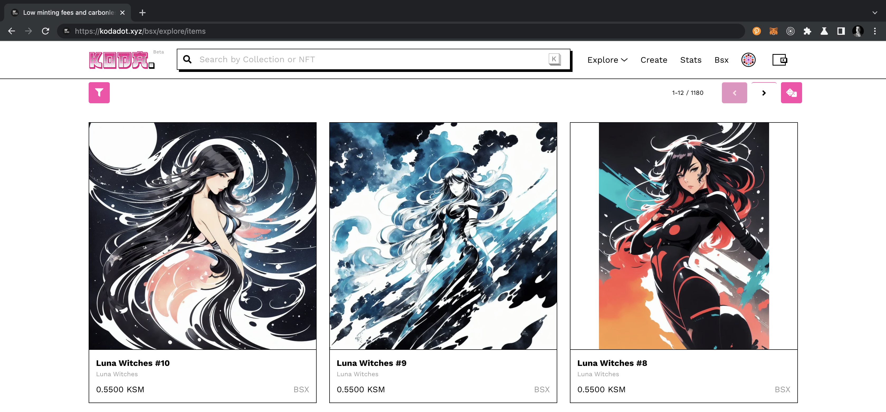

!!!info "Community Page"
    This page is open to contributions from the community. Please follow the [Wiki contribution guidelines](https://github.com/w3f/polkadot-wiki#contributing-to-documentation) and add your NFT app to this page.

## List of NFT Projects

<!-- prettier-ignore -->
<!-- no toc -->

- [List of NFT Projects](#list-of-nft-projects)
- [Asset Hub](#asset-hub)
- [Astar](#astar)
- [Basilisk](#basilisk)
- [Crust](#crust)
- [Darwinia Network](#darwinia-network)
- [KodaDot](#kodadot)
  - [History of KodaDot](#history-of-kodadot)
  - [Ecosystem Tools by KodaDot](#ecosystem-tools-by-kodadot)
- [MNet Continuum](#mnet-continuum)
- [Moonbeam](#moonbeam)
- [Mythical](#mythical)
- [NFTMozaic](#nftmozaic)
- [Nodle](#nodle)
- [Unique Network](#unique-network)

## Asset Hub

The Asset Hub is a [system chain](./learn-system-chains.md) which provides functionality for deploying
and transferring assets — both Fungible and Non-Fungible Tokens (NFTs). The Asset Hub currently
hosts [Uniques pallet](./learn-nft-pallets.md#uniques-pallet) (its use on AssetHub is not encouraged)
and the [NFTs pallet](./learn-nft-pallets.md#nfts-pallet).

A more in-depth overview of the Asset Hub pallets and developer resources available to the
developers can be found in the dedicated [section about NFT pallets](./learn-nft-pallets.md).

## Astar

[Astar Network](https://astar.network/) and its sister network
[Shiden Network](https://shiden.astar.network/) are smart contract infrastructure in the Polkadot
Ecosystem, i.e. they are rollups that support EVM smart contracts. Astar supports NFTs developed
with EVM smart contracts and Wasm smart contracts.

Astar has all the toolings available that every EVM NFT developer knows. The availability of those
toolings makes the onboarding to Astar networks desirable to any developer looking to explore the
Polkadot Ecosystem. Astar has an active community of artists and NFT enthusiasts. Besides supporting
all EVM toolings, Astar also bootstrapped the Wasm smart contract environment for NFT developers
writing smart contracts with [ink!](https://use.ink/) based on
[PSP34](https://github.com/w3f/PSPs/blob/master/PSPs/psp-34.md) (Polkadot Standards Proposals).

The main advantage of having a multi-virtual machine environment for NFT developers is that it gives
builders more possibilities for the use cases they are developing. With the support of Wasm smart
contracts, developers can create solutions like RMRK with smart contracts.

Developer tools and documentation links:

- [General information](https://astar.network/blog/An-introduction-to-NFTs-on-Astar-38359)
- [Generating PSP34 NFTs via ink! contracts](https://docs.astar.network/docs/tutorials/from-zero-to-ink-hero/nft/)
- [EVM NFT management example](https://docs.astar.network/docs/build/EVM/astarbase/#example-use-case-discount-price-on-an-nft)

## Basilisk

[Basilisk](https://bsx.fi/) is a Kusama parachain that provides liquidity for the ecosystem. It also
has a full-featured NFT platform based on the
[Uniques pallet](https://github.com/paritytech/polkadot-sdk/tree/master/substrate/frame/uniques).
One of the key features of Basilisk is that it allows minting NFTs with a royalty fee. This royalty
fee is distributed to the original creator of the NFT via the runtime pallet. Additionally
[Basilisk offers a feature](https://github.com/galacticcouncil/Basilisk-node/tree/master/pallets/marketplace)
that allows creating a buy order for a specific NFT.

These NFTs can be viewed and interacted instantly on [KodaDot](https://kodadot.xyz/).

## Crust

Crust is primarily a storage solution. A
[separate section](https://wiki.crust.network/docs/en/buildIntegrationNFTDataStorage) is dedicated
to NFT storage solutions.

## Darwinia Network

Darwinia Network is a decentralized heterogeneous cross-chain bridge protocol built on Substrate. It
focuses on decentralized cross-chain token swap, exchange, and market and it is an EVM-compatible
blockchain.

NFT marketplace available [here](https://nft.io/collection/darwinia/assets).

## KodaDot

[KodaDot](https://kodadot.xyz/) is an open-source NFT marketplace that operates on the Polkadot
Ecosystem and beyond (Polkadot and Kusama Asset Hubs, Mantle, Base, and Immutable zkEVM), striving
to aggregate various NFT standards and enhancing user experience.

KodaDot's strength lies in its commitment to open-source collaboration. It has transformed into a
collaborative hub where creators, developers, and community members work collectively for decision
making, amassing an extensive network of over
[90 open-source contributors](https://hello.kodadot.xyz/about-us/who-are-we/achievements). This
robust collaboration has earned KodaDot the
[number one rank as a dApp in the Polkadot ecosystem on Github](https://github.com/topics/polkadot).

See below a video tutorial about how to mint your NFT on [the Polkadot Asset Hub](#asset-hub) using
KodaDot.

  

    
    

      <a href="https://www.youtube.com/watch?v=SKdx4pTgL04">KodaDot Tutorial on Minting NFTs</a>
    

  

For more information about minting using KodaDot see
[this step-by-step tutorial](https://hello.kodadot.xyz/tutorial/minting/how-to-mint-nfts-on-polkadot-asset-hub-using-kodadot).

### History of KodaDot

KodaDot began as the first
[unofficial explorer for RMRKv0.0.1](https://kusama.polkassembly.io/motion/256)
[contributing to RMRK protocol](https://github.com/rmrk-team/rmrk-spec/issues/10). It later
[received Kusama Treasury funding](https://kusama.polkassembly.io/motion/349), which propelled the
team to create
[great end-user experience on the Asset hub](https://kusama.polkassembly.io/motion/349).

In the summer of 2022, KodaDot won the first prize at the
[Polkadot North American event](https://devpost.com/software/kodadot-moonsama) for implementing
MoonBeam and MoonRiver NFT EVM smart contracts and enabling read-only access to existing components
for seamless end-user interaction.

The team successfully
[launched with Basilisk NFT Marketplace pallet in Fall 2022](https://github.com/kodadot/nft-gallery/issues/660),
where an increasing number of artist collections are emerging, providing artists the opportunity to
receive offers on unlisted NFTs and earn on-chain royalties.

KodaDot's upcoming integrations are based on
[PSP-34](https://github.com/w3f/PSPs/blob/master/PSPs/psp-34.md), leveraging
[smart contracts written with ink!](https://use.ink/).

### Ecosystem Tools by KodaDot

KodaDot has enriched the Polkadot ecosystem by
[offering a comprehensive API interface for builders](https://github.com/kodadot/uniquery), based on
the SubSquid indexer. This platform also presents searchable items and collections, translating
on-chain transactions into deep insights about collection ownership dynamics for end-users. For more
info about KodaDot check out [link](https://hello.kodadot.xyz/).

## MNet Continuum

MNet Continuum (ex BitCountry) specializes in providing Metaverse as a Service (MaaS) to all
networks. Their decentralized application (dApp) offers users the tools to create and customize a
metaverse, run and reward a community through immersive quests, and mint and trade NFTs. Users can
enjoy metaverse gaming, learning and networking.

[Minting And NFT Generators](https://metaversenw.gitbook.io/user-manual/nfts/what-is-an-nft)

## Moonbeam

[Moonbeam](https://moonbeam.network/) and its Kusama counterpart Moonriver are full EVM deployments
with Ethereum RPC endpoints.

This means that the entire toolkit offered to other EVM chains (stacks like Hardhat, Remix, Truffle,
Metamask, etc.) are available to Moonriver / Moonbeam users and developers, giving it a noticeable
head start in attracting existing userbases.

Several dozen high profile teams are launching their products (or re-launching) on Moonriver /
Moonbeam, however, it is essential to note that Moonbeam is an EVM chain and will therefore suffer
from the same limitations as any other EVM chain in regards to customization and feature-richness of
NFTs.

A notable advantage, however, is that Moonriver / Moonbeam is still a Substrate chain, meaning
integration of custom pallets into the runtime is still possible, making NFT specific optimizations
at the chain runtime level a reliable way to keep EVM compatibility of tools while at the same time
optimizing storage and interactions for rich NFTs.

A convenient directory of Moonbeam dApps can be found here:
[Moonbeam dApps](https://apps.moonbeam.network/moonbeam/app-dir&sa=D&source=docs&ust=1738885283203398&usg=AOvVaw1bnTE-WD_mIwe8VvoUxlmh)

Developer tools and documentation links:

[Minting a Cross-Chain NFT with Axelar SDK](https://docs.moonbeam.network/tutorials/interoperability/using-axelar-sdk/)
[Deploying an ERC-721 Contract Example](https://docs.moonbeam.network/tutorials/eth-api/thirdweb/)

## Mythical

[Mythical Games](https://mythicalgames.com/) is an online gaming platform that implements NFTs in
its gaming ecosystem. Mythical Games has Mythos Chain, an L1 rollup in the Polkadot ecosystem that
implements the Polkadot NFTs pallet to provide advanced NFT functionalities.

Mythical offers a platform for game developers with comprehensive documentation and onboarding
guides, to ensure anyone can get up and running in time. The primary integration path is REST APIs,
but SDKs are also available upon request.

Developer tools and documentation links:

- [The Mythical Platform API](https://docs.mythicalgames.com/mythical-platform-api)

## NFTMozaic

NFTMozaic is a Polkadot project created with a goal to establish Polkadot as the leading ecosystem
for NFT-related applications by providing effective technology, support, business development and
marketing efforts focused on this market segment.

Its efforts are focused on strengthening the positioning of Polkadot’s NFT ecosystem through
strategic content, alliances, and growth programs. It aims to launch a grants program for
consumer-facing MVPs, an NFT-focused website, educational journals, and more.

NFTMozaic aims to provide a comprehensive entry-point for both business and development aspects of
the NFT technology. To achieve this it brings together all interested members of the Polkadot
ecosystem that provide NFT functionality in their projects to the table and strives to establish a
common guidance and cooperation platform as a way to ensure that all the contributors benefit from a
joint effort and the best possible solution is sought.

NFTMozaic links:

- [X link](https://x.com/nftmozaic)
- [Telegram NFTMozaic general topics group](https://t.me/NFTMozaic)
- [Telegram NFTMozaic Tech Support group](https://t.me/https://t.me/nft%5C_moz%5C_support)

## Nodle

The Nodle Network is a decentralized wireless network, composed of Nodle Edge Nodes, powered by the
Nodle Chain, and the NODL token.

[Nodle NFT Minting Tool](https://docs.nodle.com/nft-minting-tool)

## Unique Network

[**Unique Network**](https://unique.network) is a specialized Polkadot parachain offering **advanced
“NFT 2.0”** capabilities—including dynamic, nested, fractionalized and composable NFTs—coupled with
a **hybrid** environment that blends **EVM and Substrate**. Positioned as a **front-runner** for
innovative NFT solutions, Unique Network streamlines creation, management, and cross-chain
functionality via sophisticated developer tools and an in-house **NFT SDK** that substantially
simplifies implementation of advanced NFT features and shortens the time-to-deployment. This
approach allows dApps to harness both **advanced Substrate logic, security and native speed** and
**EVM** compatibility, which aligns with Polkadot’s emerging “Cloud + Hub” framework.

Unique Network focuses on B2B use cases, aiming to be an infrastructure provider for others to build
on, rather than entering the NFT space themselves as an end-product.

Unique Network is spearheading the effort to develop the XCM utility towards accomplishing a
bridgeless and secure cross-chain interoperability and transfer mechanism for NFTs in the Polkadot
ecosystem.

The Unique Network blockchain is specifically designed to support advanced NFT features. One very
successful example of how this approach resolves complexities is demonstrated in the following
unique way to create NFTs. In the Unique Network blockchain implementation builds NFTs as
independent addressable objects instead of enumerated entities of a contract (ERC-721, Ethereum, EVM
approach.) Since they are addressable, they can explicitly become recipients of a transfer. This
means that they can receive and contain another NFT just like a wallet does and in this the
receiving NFT becomes a container to the contained/received NFT thus forming an object tree with a
parent/child relationship. As a result the nesting mechanism stems from the nature of
transferability of blockchain objects, requires no additional contracts and is intrinsically a fast
operation managed by simple transfers instead of dedicated nesting operations.

These are the additional advantages of Unique Network dedicated NFT 2.0 blockchain:

- Nested NFTs can be organised into structured bundles
- NFT bundles can contain NFTs, RFTs and fungible tokens
- The metadata format of an NFT can have arbitrary attribute structure and complexity
- An NFT is intrinsically multi-asset
- Mutability of attributes can be limited to only specific addresses or contracts providing access
  control to metadata modification
- Management rights capability allows for management roles i.e. separation of application and owner
  rights to metadata management
- Intrinsic mutability of metadata provides out-of-the box, contractless dynamic NFT capabilities
- NFTs can be fractionalised (RFTs - refungible tokens)
- Due to metadata format flexibility and mutability, it is possible and very simple to implement
  on-chain data obfuscation for enhanced privacy

Unique Network provides a fully featured EVM with a few perks:

- The EVM address space (0x…) is mapped to the corresponding Substrate address space which
  simplifies object and contract access between the EVM and Substrate objects via CrossAddressing
  mechanism. This means that you can mix and match technologies. For example you can have a native
  NFT call an EVM contract. This is the core mechanism for extending and customising NFTs for
  specific use cases.
- This also means that a native Substrate object is addressable in EVM applications without an
  intermediary address handling contract, i.e. applications like the Metamask wallet can address
  Unique Network Substrate objects directly. This greatly improves efficiency.
- Unique network EVM utilities contain interfaces to the blockchain’s core Substrate pallet
  functions which allows Solidity contracts to directly invoke them.
- This interoperability is fully supported by the JS/TS SDK allowing rapid development even in the
  mix-and-match scenario.

The recommended and most efficient way to build on Unique Network is via the JS/TS SDK version 2.0.
The SDK interacts with the blockchain via an RPC eliminating the need to build and maintain a
complex development environment. It fully implements the
[Unique Metadata Schema 2.0](https://docs.unique.network/reference/schemas/). The Unique SDK allows
the creation of NFT assets on the Asset Hub as well which makes it a very versatile tool for NFT
management and creation on the Polkadot ecosystem.

Developer tools and documentation links:

- [General information](https://docs.unique.network/about)
- [Substrate native advanced NFTs (NFT 2.0)](https://docs.unique.network/build/sdk/v2/quick-start.html)
- [Building NFTs in an EVM](https://docs.unique.network/build/evm/)
- [Tutorials/Cookbook](https://docs.unique.network/tutorials)
- [Youtube Workshops and Tutorials](https://www.youtube.com/watch?v=StfRap-dvks&list=PLFSU2-RmX858vLu9a5bukOTpJ1dYzsE4o)
- [Reference Documentation](https://docs.unique.network/reference)
- [NFT Marketplace](https://unqnft.io/market?filterState=)
- [Indexer/Block Explorer](https://uniquescan.io/unique/)

The most prominent projects that currently implement Unique Network’s advanced NFT capabilities are

- [TapNation](https://www.tap-nation.io/)
- [ForeverHasFallen](https://foreverhasfallen.com/)

A more comprehensive list can be found on the pages of the
[official website](https://unique.network).