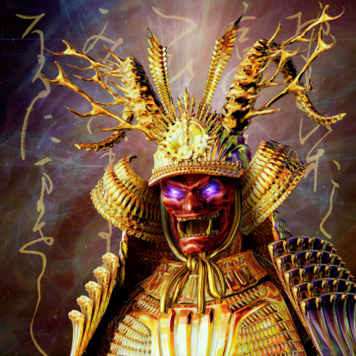

This page is a high-level overview of NFTs and the various approaches to NFTs within the
{{ polkadot: Polkadot :polkadot }}{{ kusama: Kusama :kusama }} network.

## Fungibility

NFT stands for _non-fungible token_. Fungibility means interchangeability inside of a group. In
theory, a $20 bill is always worth $20 in a store and identical in value to any other $20 bill. It
is not, however, fungible with a $1 or $100 dollar bill (outside its group).

A Pokemon™ trading card of a Charizard is non-fungible with a card of Squirtle, whereas editions of
Charizard are fungible with each other.

Fungibility is a spectrum - what is fungible to some might not be fungible to others. In reality,
Pokemon™ cards, the canonical example of non-fungible assets are more fungible than US dollar bills,
each of which has a unique serial number that may be important to a government agency. The cards
have no serial numbers [1].

/Clipboard01-d20f6eb9351e4f36a46e11fd87b53b2d.jpg>)

Additionally, a digital item like a "purple magic sword" in a game may be fungible with another
visually identical sword if all the player cares about is the looks of their character. But if the
other sword has a different function, and that function influences the outcome of an adventure the
player is about to embark on, then visually identical swords are absolutely non-fungible.

Bearing that in mind, the simplest explanation of NFTs is that **NFTs are rows of arbitrary,
project-specific, and non-interchangeable data that can be cryptographically proven to "belong" to
someone**. This data can be anything - concert tickets, attendance badges, simple words, avatars,
plots of land in a metaverse, audio clips, house deeds, mortgages, and more.

## NFT Standards

A general-purpose blockchain is not built to natively understand the concept of NFTs. It is only
natively aware and optimized for its own native tokens, but implementations built on such a chain
are essentially "hacks".

For example, Ethereum is a general-purpose blockchain that does not have the concept of "tokens"
(fungible or not) built-in. Tokens in Ethereum are essentially spreadsheets of information to be
interpreted and read in a certain way by various user interfaces. This _way_ in which they should
read them is called a _standard_.

The most widespread fungible token standard you may have heard of is ERC20, while the most
widespread NFT standard is ERC721, followed closely by ERC1155. The downside of having to define
these standards is that they are always instructions for how to read a spreadsheet pretending to
serve information in a certain way, which by definition cannot be optimized. For this reason, even
on a good day of extremely low network congestion, interactions with NFTs on any EVM chain will cost
a few dollars but were on average around $100 per interaction (transfer, mint, sale) in 2021 on
Ethereum.

This prevents use cases that go beyond the current craze of _digital dust gathering NFTs_ on
Ethereum - profile pictures, generative "look once and then put away" art, [ENS](ens) addresses, and
[proof of attendance badges](https://poap.xyz/) (which have since moved to the xDAI chain to save on
gas fees).

#### A typical [NFT on Ethereum](https://opensea.io/assets/ethereum/0x2127fe7ffce4380459cced92f2d4793f3af094a4/12598)

For the sake of comparison, we can refer to these as NFTs 1.0: static NFTs that are almost
exclusively image-based collectibles of varying rarity.

---

## NFTs 2.0: NFTs in Polkadot & Kusama

This is where {{ polkadot: Polkadot :polkadot }}{{ kusama: Kusama :kusama }}'s technology shines and
where NFTs 2.0 come into play. By allowing
[heterogeneous application-specific shards](learn-parachains.md) to exist, builders can natively
optimize for complex NFT use cases without tradeoffs that would make interacting with the system
prohibitively inefficient and expensive in other environments.

The following NFT solutions exist and are under development in the Polkadot and/or Kusama
ecosystems:

### Unique network

[Unique network](https://unique.network/), an NFT-specific blockchain offering innovations such as
sponsored transactions, bundling fungible tokens with non-fungibles, and splitting NFTs into
fungible tokens for partial ownership.

Unique Network have launched two NFT projects to date: Substrapunks as part of
[Hackusama](https://hackusama.devpost.com/), and Chelobricks as a promotion during
[Polkadot Decoded](https://decoded.polkadot.network/).

Unique Network focuses on B2B use cases, aiming to be an infrastructure provider for others to build
on, rather than entering the NFT space themselves as an end-product.

Unique Network aims to make their marketplace technology open-source and whitelabel-friendly. In
theory, it should be trivial to set up a new marketplace for your project using Unique's technology.
Unique network aims to be a parachain on Polkadot, and Quartz is their Kusama counterpart.

### RMRK

[RMRK](https://rmrk.app) is a set of NFT 2.0 standards developed in three distinct code flavors:

1. ["Colored coins"](https://en.bitcoin.it/wiki/Colored_Coins) approach, as on Bitcoin, originally
   developed as a "hack" on the Kusama chain. This is now deprecated, and it is recommended
   implementers use any of the other options.
2. Solidity contracts, compatible with any EVM blockchain in and outside the Polkadot ecosystem.
   Documented [here](https://evm.rmrk.app)
3. Rust code (Substrate pallets), compatible with any Substrate chain. Code is available
   [here](https://github.com/rmrk-team/rmrk-substrate).

Additionally, two more flavors are in development:

1. Astar (see below) are developing the ink! version of RMRK:
   [code here](https://github.com/rmrk-team/rmrk-ink).
2. [Gear Technologies](https://www.gear-tech.io/) are developing the Gear implementation:
   [code and docs here](https://wiki.gear-tech.io/docs/examples/rmrk/).

The RMRK NFT 2.0 standards are a set of "NFT legos", primitives that, when put together, allow a
builder to compose an NFT system of arbitrary complexity without smart contracts.

#### NFT Legos

1. NFTs can own other NFTs, NFTs can equip other NFTs for visual change
2. NFTs can have multiple resources (different outputs based on context and resource priority)
3. NFTs can have on-chain emotes (reactions) for price discovery and social mechanics
4. NFTs have conditional rendering (e.g. show Mona Lisa as blushing if she got 50 kissy 😘 emoji)
5. NFTs can be governed by the community via fungible shareholder-tokens (fractionalization of NFTs)

#### NFT from [Kanaria](https://kanaria.rmrk.app)

:::note Multi-resource NFTs

A multi-resource NFT (gif of statue, and SVG-composable dynamic NFT in one) that can also equip
other NFTs from within its "inventory".

:::

Two marketplaces for RMRK-based NFTs exist with hundreds of projects already launched:

- [Singular](https://singular.rmrk.app), the official marketplace

For a complete introduction into RMRK, see [this presentation](https://url.rmrk.app/wasmconf) or
read [the non-technical docs](https://docs.rmrk.app).

### Efinity

Spearheaded by [Enjin](https://enjin.io), the authors of Ethereum's ERC1155 standard and makers of
the Enjin wallet and Unity plugin, which allows easy implementation of NFTs into 3D games, Efinity
is an NFT bridging chain coming to Kusama and Polkadot in 2022.

They plan to build a _paratoken_ which would be a standard for token migration across different
parachains in the Polkadot ecosystem, but also into and out of Ethereum and other EVM systems.

### Astar

[Astar Network](https://astar.network) and its sister network
[Shiden Network](https://shiden.astar.network) are the smart contract infrastructure in the Polkadot
Ecosystem. Astar Ecosystem ("Astar") supports NFTs developed with EVM smart contracts and WASM smart
contracts.

Astar has all toolings available that every EVM NFT developer knows. The availability of those
toolings makes the onboarding to Astar networks very attractive to any developer looking to explore
the Polkadot Ecosystem. Astar has an active community of artists and NFT enthusiasts. Besides
supporting all EVM toolings, Astar also bootstrapped the WASM smart contract environment for NFT
developers writing smart contracts with [ink!](https://use.ink) based on
[PSP34](https://github.com/w3f/PSPs/blob/master/PSPs/psp-34.md) (Polkadot Standards Proposals).

The main advantage of having a multi-virtual machine environment for NFT developers is that it will
give more possibilities to the builders for the use case they are developing. With the support of
WASM smart contracts, developers can develop solutions like [RMRK](./learn-nft#rmrk) with smart
contracts.

### Moonbeam

[Moonbeam](https://moonbeam.network) and its Kusama counterpart Moonriver are full EVM deployments
with Ethereum RPC endpoints.

This means that the entire toolkit offered to other EVM chains (stacks like Hardhat, Remix, Truffle,
Metamask, etc.) are available to Moonriver / Moonbeam users and developers, giving it a noticeable
head start in attracting existing userbases.

Several dozen high profile teams are launching their products (or re-launching) on Moonriver /
Moonbeam, however, it is essential to note that Moonbeam is an EVM chain and will therefore suffer
from the same limitations as any other EVM chain in regards to customization and feature-richness of
NFTs.

A notable advantage, however, is that Moonriver / Moonbeam is still a Substrate chain, meaning
integration of custom pallets into the runtime is still possible, making NFT specific optimizations
at the chain runtime level a reliable way to keep EVM compatibility of tools while at the same time
optimizing storage and interactions for rich NFTs.

### Uniques

Uniques is a [FRAME pallet](https://github.com/paritytech/substrate/tree/master/frame/uniques)
deployed on the Statemint and Statemine system parachains. It implements the most basic kind of NFT
-- a data record referencing some metadata. This metadata reference is mutable until frozen, so NFTs
and their classes (entities derived from) are mutable unless specifically made immutable by the
issuer.

Uniques takes a very bare-bones approach on purpose, to keep the Statemine / Statemint chain a
simple balance-keeping chain for both fungible and non-fungibles.

These NFTs can be viewed and interacted with on [RMRK's Singular platform](https://singular.app), by
switching the top right menu from Kusama to Statemine or Statemint.

The can also be interacted with directly through the
[extrinsics tab of Statemine](https://polkadot.js.org/apps/?rpc=wss%3A%2F%2Fkusama-statemine-rpc.paritytech.net#/extrinsics):

---

## Bridging

Bridging to and from Substrate chains and EVM chains takes much effort but is a highly desired
feature in the NFT industry. Merging the collector and customer base has significant implications,
so multiple projects focus on making this possible.

Apart from RMRK (Substrate-to-Substrate seamless teleportation natively with [XCMP](learn-xcm.md))
and Efinity (Paratoken), the following efforts are underway:

- [**MyNFT**](https://mynft.com/): an EVM to EVM bridging effort.
- **RMRK <-> EVM** Simplification bridge: a bridge developed during the
  [RMRK hackathon](https://rmrk.devpost.com) for porting RMRK NFTs into simplified IOUs on EVM
  chains

### References

- [1]: [Investopedia](https://www.investopedia.com/terms/l/liars-poker.asp)
- [2]:
  [Unique Network's Chelobrick](https://unique.network/blog/chelobricks-making-waves-with-10-000-substrate-based-nfts/)
