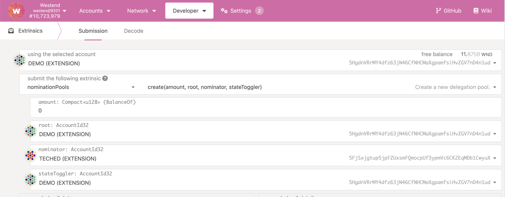

import RPC from "./../../components/RPC-Connection";

## Creation

The depositor calls the `create` extrinsic, setting the administrative roles and transferring some
funds to the pool to add themselves as the first member. As stated above, the depositor must always
be a member as long as the pool exists; they will be the last member to leave, ensuring they always
have some skin in the game. A significant stake from the depositor is always a good indicator of the
pool's credibility.

**The current minimum bond to create a pool on**
{{ polkadot: **Polkadot** :polkadot }}{{ kusama: **Kusama** :kusama }}
{{ polkadot: **is <RPC network="polkadot" path="query.nominationPools.minCreateBond" defaultValue={2000000000000} filter="humanReadable" />.** :polkadot }}
{{ kusama: **is <RPC network="kusama" path="query.nominationPools.minCreateBond" defaultValue={1000000000000} filter="humanReadable" />.** :kusama }}

The pool’s ‘nominator role’ selects validators with the nominate extrinsic. On Polkadot JS Apps UI,
navigate to Network > Staking > Pools and click on Add Pool button.

The UI automatically assigns ID to the pool and allows for entering the name of the pools as well as
the deposit to be bonded.

When creating a pool using Polkadot JS Apps UI, all the roles are mapped to the Depositor account by
default. If any of these roles need to be assigned to a different account, create the pool using
`create` extrinsic available on Developer > Extrinsics > nominationPools on Polkadot JS Apps UI.

## Upkeep

The `nominator` can update the pool’s validator selection. On Polkadot JS Apps UI, navigate to
Network > Staking > Accounts page and click on Pooled button. If you have any pooled accounts with
the role of `nominator`, you will notice the option to set nominees. Select the validators to
nominate like you would normally using a nominator account.

The `state-toggler` can update the pool’s state to blocked through `setState` extrinsic and kick
members by calling `unbond` and `withdrawUnbonded`. (The state can also be toggled back to open).

## Destruction

A pool can be pushed into the “destroying” state via one of:

- The state-toggler sets the pool to “destroying”.
- Any account can set the pool to destroying if over 90% of the pool's active bonded balance has
  been slashed.
- When a pool is in ‘destroying’ state, `unbond` and `withdrawUnbonded` become permissionless, so
  anyone can help all the members exit.
- Once the depositor withdraws, no members belong to the pool, and all the pool’s resources are
  wiped from the state.
