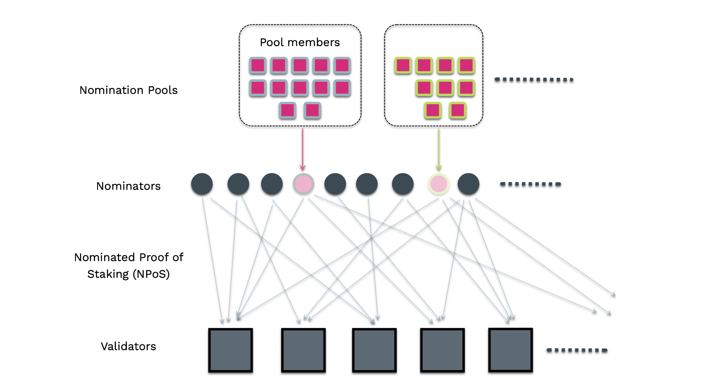

[Nomination pools](https://github.com/paritytech/substrate/pull/10694) are one of the key
(expertimental) features from the roadmap of
[Staking improvements](https://gist.github.com/kianenigma/aa835946455b9a3f167821b9d05ba376) on
Polkadot. They are designed to permissionlessly allow members to pool their funds
together and act as a single nominator account. Due to the current runtime constraints, Polkadot can
only handle {{ max_active_nominator_count }} nominators comfortably in the
[electing set](learn-nominator.md#staking-election-stages). As one of the objectives of the
[NPoS algorithm](learn-phragmen.md) is to maximize the overall stake on the network, it can be
inferred that the staking system on Polkadot favors nominators with a larger stake. Only the
nomiator accounts which back the Validators in the active set are eligible for receiving staking
rewards. This leaves out nomination intents from the accounts with lower DOT balance than the
min-active nomination and places them in a waiting queue to enter electing set. Nomination pools
will be handy to the members who would like to participate in the staking system with a
stake much lower than the dynamic min-active nomination threshold on the network. All operations are
constant space and time complexity relative to the number of members, eliminating any theoretical
upper bound on the quantity of members the system can handle and thus scaling the number of
accounts that can participate and earn rewards in the staking system on Polkadot. In summary, each
nomination pool is viewed as a single nominator from the NPoS system point of view.

:::info Why aren't the members in the nomination pools called delegators?

The term `delegator` is associated too much with Delegated Proof of Staking (DPoS) and since Polkadot 
implements Nominated Proof of Staking (NPoS), naming them as delegators would be misleading. 
`member` is our generic replacement for `delegator`. In action, members are actually quite similar to 
delegators and do delegate their nomination power to the pool.

:::

The earnings of the pool are split pro rata to a member's stake in the bonded pool (and thus the
staking rewards for members will be the same as if they were a nominator). Importantly, slashes
are also applied proportionally to members who may have been actively bonded when a validator
committed a slashable offence.

## Key Components of Nomination Pools

- Bonded Pool: Tracks the distribution of actively staked funds.
- Reward Pool: Tracks rewards earned by actively staked funds.
- Unbonding Sub Pools: Collection of pools at different phases (i.e. eras) of the unbonding
  lifecycle.
- Members: Accounts that nominate to the pools.
- Point: A unit of measure for a member’s portion of a pool's funds. All pools start with a point to plank 
ratio of 1, and over time if they receive rewards they increase in value, and if they get slashed they 
decrease in value.

## Pool Member Lifecycle

### Join a pool

A member nominates funds to a pool by transferring some amount to the pool’s bonded account with the
`join` extrinsic. The pool then increases its bond with the new funds. A member is afforded the
ability to bond additional funds, or re-stake rewards as long as they are already actively bonded. Note that
a member may only belong to one pool at a time.

### Claim rewards

The member can claim their portion of any rewards that have accumulated since the previous time
they claimed (or in the case that they have never claimed, any rewards that have accumulated since
the era after they joined). Rewards are split pro rata among the actively bonded members.

### Unbond funds

At any point in time after joining the pool, a member can start the process of exiting by
unbonding. `unbond_other` will unbond all of the members funds. Once this call is made, the
member will no longer be eligible to claim rewards.

### Withdraw unbonded funds

After `unbond_other` has been called and the unbonding duration has passed (e.g. 28 days on Polkadot),
a member may withdraw their funds with `withdraw_unbonded_other`. Withdrawing effectively ends a
member's relationship with their pool, allowing them to join a different pool if desired.

### Limitations

- A member cannot vote with their nominated funds. This can be changed in the future once
  accounts are afforded the ability to split votes.
- In order for a member to switch pools they must wait for the normal 28 day unbonding process.
- A member cannot partially unbond funds. This functionality may be added in the future.

## Pool Administration

### States

- Open: The pool is open to be joined by anyone.
- Blocked: The pool is blocked; no joiners are permitted.
- Destroying: The pool is in the process of being destroyed. Once in this state the pool may never
  revert to any other state; it can only proceed to being destroyed. All members can be
  permissionlesly unbonded; this allows the pool to be dismantled regardless of any individual
  member’s proactivity.

### Roles:

- Depositor: Creates the pool and is the initial member. The depositor can only leave the pool
  once all other members have left. Once they leave by withdrawing, the pool is fully removed
  from the system.
- Nominator: Can select the validators the pool nominates.
- State-Toggler: Can change the pool’s state and kick (permissionlessly unbond/withdraw) members
  if the pool is blocked.
- Root: Can change the nominator, state-toggler, or itself. Further, it can perform any of the
  actions the nominator or state-toggler can.

## Pool Lifecycle

### Creation

The depositor calls the create extrinsic, setting the administrative roles and transferring some
funds to the pool in order to add themselves as the first member. As stated above, the depositor
must always be a member as long as the pool exists; they will be the last member to leave,
ensuring they always have some skin in the game. The pool’s ‘nominator role’ selects validators with
the nominate extrinsic.

### Upkeep

The nominator can update the pool’s validator selection. The state-toggler can update the pool’s
state to blocked, then kick members by calling `unbond_other` and `withdraw_unbonded_other`. (The
state can also be toggled back to open). The root can change itself, the state-toggler or the
nominator at any time.

### Destruction

A pool can be pushed into the “destroying” state via one of:

- The state-toggler sets the pool to “destroying”.
- Any account can set the pool to destroying if over 90% of the pool's active bonded balance has
  been slashed. Dismantling a destroying pool:
- When a pool is in ‘destroying’ state, `unbond_other` and `withdraw_unbonded_other` become
  permissionless, so anyone can help all the members exit.
- Once the depositor withdraws, no members belong to the pool, and all the pool’s resources are
  wiped from state.

## Slashing

If a pool’s underlying nomination account is slashed by the staking system, then the slash is
distributed evenly across the bonded pool and the unbonding pools from slash era+1 through the slash
apply era. Thus, any member who either a) was unbonding or b) was actively bonded in the
aforementioned range of eras will be affected by the slash. In other words, a member who may have
been actively bonded during the offence is slashed pro rata based on its stake relative to the total
slash amount.

Unbonding pools need to be slashed to ensure all nominators who were in the bonded pool while it was
backing a validator that committed an offence are punished. Without these measures a nominator could
unbond right after a validator equivocated with no consequences.

This strategy is unfair to members who joined after the slash, because they get slashed as well,
but spares members who unbond. The latter is much more important for security: if a pool's
validators are attacking the network, their members need to unbond fast! Avoiding additional
slashes gives them an incentive to do that if validators get repeatedly slashed.
