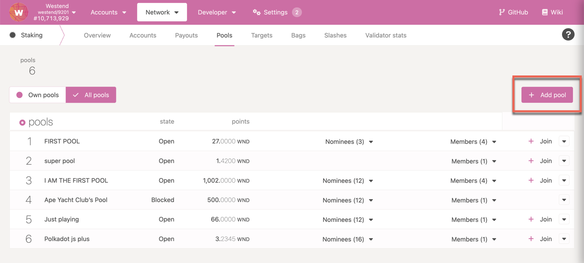
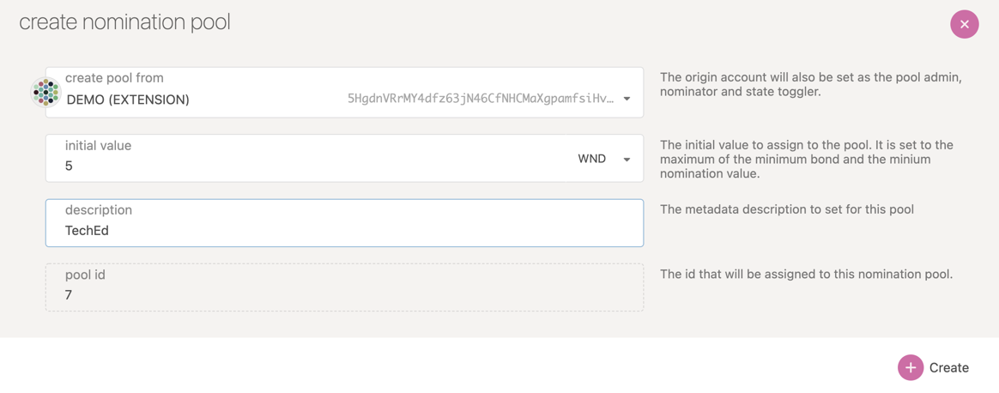
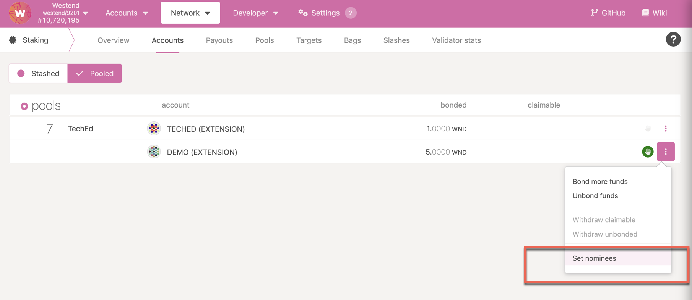

import RPC from "./../../components/RPC-Connection";

:::info Nomination Pools are live on Polkadot!

Nomination pools are a new feature for Polkadot’s staking system that allows users to pool their DOT
tokens together on-chain to nominate validators and receive rewards, significantly improving the
system’s scalability. Now, anyone with as little as
[1 DOT can receive rewards for staking natively on Polkadot](https://polkadot.network/blog/nomination-pools-are-live-stake-natively-with-just-1-dot/).

- There are currently
  {{ polkadot: <RPC network="polkadot" path="query.nominationPools.counterForPoolMembers" defaultValue={4376} /> :polkadot }}
  {{ kusama: <RPC network="kusama" path="query.nominationPools.counterForPoolMembers" defaultValue={389} /> :kusama }}
  members. (There can be a maximum of
  {{ polkadot: <RPC network="polkadot" path="query.nominationPools.maxPoolMembers" defaultValue={16384} /> :polkadot }}
  {{ kusama: <RPC network="kusama" path="query.nominationPools.maxPoolMembers" defaultValue={65536} /> :kusama }}
  members.)
- There are currently
  {{ polkadot: <RPC network="polkadot" path="query.nominationPools.lastPoolId" defaultValue={80} /> :polkadot }}
  {{ kusama: <RPC network="kusama" path="query.nominationPools.lastPoolId" defaultValue={115} /> :kusama }}
  pools. (There can be a maximum of
  {{ polkadot: <RPC network="polkadot" path="query.nominationPools.maxPools" defaultValue={64} /> :polkadot }}
  {{ kusama: <RPC network="kusama" path="query.nominationPools.maxPools" defaultValue={256} /> :kusama }}
  pools)
- {{ polkadot: No limit on :polkadot }}
  {{ kusama: There can be a maximum of <RPC network="kusama" path="query.nominationPools.maxPoolMembersPerPool" defaultValue={1024} /> :kusama }}
  members per pool.

:::

:::note

Learn the key differences between
[**Staking directly vs Joining a Nomination Pool**](#nominating-vs-joining-a-pool).

**For Ledger users:** Joining a nomination pool is possible only with the XL version of the Polkadot
Ledger App. This should be installed by default on Ledger Nano X and S Plus, but not on the Nano S.

:::

:::tip Have questions on Nomination Pools?

Please join the [Polkadot Discord](https://dot.li/discord) for asking general questions about
Nomination Pools. If you are a developer, please join our
[nomination pools support channel](https://matrix.to/#/#nompools-support:matrix.parity.io).

:::

Nomination pools are one of the key features from the roadmap of staking improvements on
{{ kusama: Kusama :kusama }}{{ polkadot: Polkadot :polkadot }}. They are designed to
permissionlessly allow members to pool their funds together and act as a single nominator account.

Due to the current runtime constraints,
{{ polkadot: Polkadot :polkadot }}{{ kusama: Kusama :kusama }} can only handle
{{ polkadot: <RPC network="polkadot" path="consts.electionProviderMultiPhase.maxElectingVoters" defaultValue={22500}/> :polkadot }}
{{ kusama: <RPC network="kusama" path="consts.electionProviderMultiPhase.maxElectingVoters" defaultValue={12500}/> :kusama }}
nominators comfortably in the [electing set](learn-nominator.md#staking-election-stages). As one of
the objectives of the [NPoS algorithm](learn-phragmen.md) is to maximize the overall stake on the
network, it can be inferred that the staking system on
{{ polkadot: Polkadot :polkadot }}{{ kusama: Kusama :kusama }} favors nominators with a larger
stake. Only the nominator accounts which back the validators in the active set are eligible for
receiving staking rewards. This leaves out nomination intents from the accounts with lower token
balance than the min-active nomination and places them in a waiting queue to enter electing set.
Nomination pools will be handy for members who want to participate in the staking system with a
stake much lower than the dynamic min-active nomination threshold on the network. All operations are
constant space and time complexity relative to the number of members, eliminating any theoretical
upper bound on the number of members the system can handle and thus scaling the number of accounts
that can participate and earn rewards in the staking system on
{{ polkadot: Polkadot :polkadot }}{{ kusama: Kusama :kusama }}. In summary, each nomination pool is
viewed as a single nominator from the NPoS system point of view.

:::info Why aren't the members in the nomination pools called delegators?

The term `delegator` is associated too much with Delegated Proof of Staking (DPoS), and since
{{ polkadot: Polkadot :polkadot }}{{ kusama: Kusama :kusama }} implements Nominated Proof of Staking
(NPoS), naming them delegators would be misleading. The term `member` is our generic replacement for
`delegator`. In action, members are quite similar to delegators and delegate their nomination power
to the pool.

:::

The pool’s earnings are split pro rata to a member's stake in the bonded pool (and thus, the staking
rewards for members will be the same as if they were a nominator). Importantly, slashes are also
applied proportionally to members who may have been actively bonded.

## Key Components

- Bonded Pool: Tracks the distribution of actively staked funds.
- Reward Pool: Tracks rewards earned by actively staked funds.
- Unbonding Sub Pools: Collection of pools at different phases (i.e. eras) of the unbonding
  lifecycle.
- Members: Accounts that nominate to the pools.
- Point: Unit of measure for a member’s portion of a pool's funds. All pools start with a point to
  Planck ratio of 1. Over time, if the pool receives rewards, they increase in value, and if the
  pool is slashed, it decreases in value.

## Pool Member Lifecycle

### Join a pool

A member delegates funds to a pool by transferring some amount to the pool’s bonded account with the
`join` extrinsic. The pool then increases its bond with the new funds. A member is afforded the
ability to bond additional funds or re-stake rewards as long as they are already actively bonded.
Note that a member may only belong to one pool at a time.

**The current minimum bond to join a pool on**
{{ polkadot: **Polkadot** :polkadot }}{{ kusama: **Kusama** :kusama }}
{{ polkadot: **is <RPC network="polkadot" path="query.nominationPools.minJoinBond" defaultValue={10000000000} filter="humanReadable" />.** :polkadot }}
{{ kusama: **is <RPC network="kusama" path="query.nominationPools.minJoinBond" defaultValue={1666666650} filter="humanReadable" />.** :kusama }}

:::info

The funds nominated to a pool will not be visible in the member's account balance on Polkadot JS
Apps UI. This is because the member funds are transferred from their account to the pool's account.
This pool account is not accessible by anyone (including the pool root or depositor) and only the
pool's internal logic can access the account.

:::

:::tip Use Non-Transfer Proxy Accounts to join Nomination Pools

Only [non-transfer proxies](learn-proxies.md#non-transfer-proxy) can be used to participate in
nomination pools. [staking proxies](learn-proxies.md#staking-proxy) cannot be used as they cannot
make calls to the nomination pools pallet.

:::

Check the "How to join a pool" section in
[this support article](https://support.polkadot.network/support/solutions/articles/65000181401-how-to-join-nomination-pools)
for guidelines.

### Claim rewards

The member can claim their portion of any rewards that have accumulated since the previous time they
claimed (or in the case that they have never claimed, any rewards that have accumulated since the
era after they joined). Rewards are split pro rata among the actively bonded members. Check the "How
to claim rewards" section in
[this support article](https://support.polkadot.network/support/solutions/articles/65000181401-how-to-join-nomination-pools)
for guidelines.

### Unbond and withdraw funds

At any point in time after joining the pool, a member can start the process of exiting by unbonding.
`unbond` will unbond part or all of the member's funds. After unbond has been called and the
unbonding duration has passed
{{ polkadot: (<RPC network="polkadot" path="consts.staking.bondingDuration" defaultValue={28}/> :polkadot }}
{{ kusama: (<RPC network="kusama" path="consts.staking.bondingDuration" defaultValue={28}/> :kusama }}
eras which correspond to
{{ polkadot: <RPC network="polkadot" path="consts.staking.bondingDuration" defaultValue={28}/> :polkadot }}
{{ kusama: <RPC network="kusama" path="consts.staking.bondingDuration" defaultValue={28}/> :kusama }}
days on {{ polkadot: Polkadot), :polkadot }} {{ kusama: Kusama), :kusama }} a member may withdraw
their funds with `withdrawUnbonded`. Withdrawing effectively ends a member's relationship with their
pool, allowing them to join a different pool if desired. Check the "Withdraw unbonded funds" section
in
[this support article](https://support.polkadot.network/support/solutions/articles/65000181401-how-to-join-nomination-pools)
for guidelines.

:::info Unbonding transaction automatically triggers withdrawal of rewards

When there is a change in the bonded balance, the accumulated rewards in the pool thus far are
automatically withdrawn to the account. The rewards are then accrued based on the updated bonded
balance.

:::

### Limitations of Nomination Pools

- A member cannot vote (e.g. in Referenda or for Council members) with their nominated funds. This
  may be changed in the future once accounts are afforded the ability to split votes.
- For a member to switch pools, all funds from the account must be unbonded. This process takes 28
  eras.
- A member can partially unbond the staked funds in the pool (at most 16 partial unbonds).

## Pool Administration

### States

- Open: The pool is open to be joined by anyone.
- Blocked: The pool is blocked; no joiners are permitted.
- Destroying: The pool is in the process of being destroyed. Once in this state, the pool may never
  revert to any other state; it can only proceed to be destroyed. All members can be
  permissionlessly unbonded; this allows the pool to be dismantled regardless of any member’s
  proactivity.

### Roles

- Depositor: Creates the pool and is the initial member. The depositor can only leave the pool once
  all other members have left. Once they leave by withdrawing, the pool is fully removed from the
  system.
- Nominator: Can select the validators the pool nominates.
- State-Toggler: Can change the pool’s state and kick (permissionlessly unbond/withdraw) members if
  the pool is blocked.
- Root: Can change the nominator, state-toggler, or itself. Further, it can perform any of the
  actions the nominator or state-toggler can.

## Pool Lifecycle

### Creation

The depositor calls the `create` extrinsic, setting the administrative roles and transferring some
funds to the pool to add themselves as the first member. As stated above, the depositor must always
be a member as long as the pool exists; they will be the last member to leave, ensuring they always
have some skin in the game. A significant stake from the depositor is always a good indicator of the
pool's credibility.

**The current minimum bond to create a pool on**
{{ polkadot: **Polkadot** :polkadot }}{{ kusama: **Kusama** :kusama }}
{{ polkadot: **is <RPC network="polkadot" path="query.nominationPools.minCreateBond" defaultValue={2000000000000} filter="humanReadable" />.** :polkadot }}
{{ kusama: **is <RPC network="kusama" path="query.nominationPools.minCreateBond" defaultValue={1000000000000} filter="humanReadable" />.** :kusama }}

The pool’s ‘nominator role’ selects validators with the nominate extrinsic. On Polkadot JS Apps UI,
navigate to Network > Staking > Pools and click on Add Pool button.

The UI automatically assigns ID to the pool and allows for entering the name of the pools as well as
the deposit to be bonded.

When creating a pool using Polkadot JS Apps UI, all the roles are mapped to the Depositor account by
default. If any of these roles need to be assigned to a different account, create the pool using
`create` extrinsic available on Developer > Extrinsics > nominationPools on Polkadot JS Apps UI.

### Upkeep

The `nominator` can update the pool’s validator selection. On Polkadot JS Apps UI, navigate to
Network > Staking > Accounts page and click on Pooled button. If you have any pooled accounts with
the role of `nominator`, you will notice the option to set nominees. Select the validators to
nominate like you would normally using a nominator account.

The `state-toggler` can update the pool’s state to blocked through `setState` extrinsic and kick
members by calling `unbond` and `withdrawUnbonded`. (The state can also be toggled back to open).

### Destruction

A pool can be pushed into the “destroying” state via one of:

- The state-toggler sets the pool to “destroying”.
- Any account can set the pool to destroying if over 90% of the pool's active bonded balance has
  been slashed.
- When a pool is in ‘destroying’ state, `unbond` and `withdrawUnbonded` become permissionless, so
  anyone can help all the members exit.
- Once the depositor withdraws, no members belong to the pool, and all the pool’s resources are
  wiped from the state.

## Nomination Pools - Slashing

Suppose the staking system slashes a pool’s underlying nomination account. In that case, the slash
is distributed evenly across the bonded pool, and the unbonding pools from slash era+1 through the
slash apply era. Thus, any member who either a) was unbonding or b) was actively bonded in the
aforementioned range of eras will be affected by the slash. In other words, a member who may have
been actively bonded during the offence is slashed pro rata based on its stake relative to the total
slash amount.

Unbonding pools need to be slashed to ensure all nominators who were in the bonded pool while it was
backing a validator that committed an offense are punished. Without these measures a nominator could
unbond right after a validator equivocated with no consequences.

This strategy is unfair to members who joined after the slash because they get slashed as well, but
it spares members who unbond. The latter is much more important for security: if a pool's validators
attack the network, their members need to unbond fast! Avoiding additional slashes gives them an
incentive to do that if validators get repeatedly slashed.

## Nominating vs Joining a Pool

Nominating is the action of choosing validators. It does not simply involve bonding tokens.
Nominating is an active task, which implies that you regularly monitor that your stake is backing an
active validator in all the eras and check if you are receiving your staking rewards. More
importantly, ensure that the validators you chose always act in the best interests of the network
protocol and have less chance of getting slashed. To nominate, you need a minimum of
{{ polkadot: <RPC network="polkadot" path="query.staking.minNominatorBond" defaultValue={100000000000} filter="humanReadable"/> :polkadot }}{{ kusama: <RPC network="kusama" path="query.staking.minNominatorBond" defaultValue={100000000000} filter="humanReadable"/> :kusama }},
and to receive rewards, you need at least a balance greater than the minimum active bond. Depending
on your validators, if your active validator is oversubscribed, you will earn rewards only if your
stake is within that of the top
{{ polkadot: <RPC network="polkadot" path="consts.staking.maxNominatorRewardedPerValidator" defaultValue={512}/> :polkadot }}{{ kusama: <RPC network="polkadot" path="consts.staking.maxNominatorRewardedPerValidator" defaultValue={512}/> :kusama }}
nominators. If the validator misbehaves, It is worth noting that your stake is subject to slashing,
irrespective of whether you are at the top
{{ polkadot: <RPC network="polkadot" path="consts.staking.maxNominatorRewardedPerValidator" defaultValue={512}/> :polkadot }}{{ kusama: <RPC network="polkadot" path="consts.staking.maxNominatorRewardedPerValidator" defaultValue={512}/> :kusama }}
nominators or not.

As the minimum active bond is a dynamic value, it can make your nomination inactive when the
threshold goes above your bonded balance. Hence, to be eligible to earn rewards while nominating,
you would need to stake a much higher balance than the minimum active bond.

Nomination pools are a way to participate in staking with as little as 1 DOT and earn staking
rewards. Nomination pools differ from custodial solutions (like staking through central exchanges)
because they are non-custodial, native to Polkadot's protocol, permissionless, transparent, and run
in a decentralized way by the community. Before joining a nomination pool, you must ensure that the
pool is earning rewards and nominating the validators that match your preferences. Participating in
pools is more of a set-and-forget action than nominating by yourself. The pool operator maintains
the list of validators nominated by the pool, and so, in a way, you are trusting the pool operator
to act in your best interests. However, it is advised to check the validators nominated by the pool
from time to time and change the pool if necessary.

:::info Minimum Active Nomination Value is Dynamic

The minimum amount required to become an active nominator and earn rewards is
{{ polkadot: __<RPC network="polkadot" path="query.staking.minimumActiveStake" defaultValue={2937000000000} filter="humanReadable"/>__. :polkadot }}
{{ kusama: __<RPC network="kusama" path="query.staking.minimumActiveStake" defaultValue={2937000000000} filter="humanReadable"/>__. :kusama }}
If you have less {{ polkadot: DOT :polkadot }}{{ kusama: KSM :kusama }} than the minimum active
nomination and still want to participate in staking, you can join the nomination pools. You can now
stake on {{ polkadot: Polkadot :polkadot }}{{ kusama: Kusama :kusama }} natively with just
{{ polkadot: __<RPC network="polkadot" path="query.nominationPools.minJoinBond" filter="humanReadable" defaultValue={10000000000}/>__ :polkadot }}
{{ kusama: __<RPC network="kusama" path="query.nominationPools.minJoinBond" filter="humanReadable" defaultValue={1666666650}/>__ :kusama }}
in the nomination pools and earn staking rewards. For additional information, see
[this blog post](https://polkadot.network/blog/nomination-pools-are-live-stake-natively-with-just-1-dot/).
Check the wiki doc on [nomination pools](learn-nomination-pools.md) for more information.

:::

|                                                                                                                                 Nominating                                                                                                                                  |                                                                                                    Joining a Pool                                                                                                     |
| :-------------------------------------------------------------------------------------------------------------------------------------------------------------------------------------------------------------------------------------------------------------------------: | :-------------------------------------------------------------------------------------------------------------------------------------------------------------------------------------------------------------------: |
|                                                                                                                        Minimum 100 DOT to nominate.                                                                                                                         |                                                                                             Minimum 1 DOT to be a member.                                                                                             |
|                                                                                                       Rewards can be compounded automatically or sent to any account.                                                                                                       |                                                    Rewards can be manually claimed to the pool member's account and be bonded in the pool again to compound them.                                                     |
|                                                      If the active validator gets slashed, all active nominators are subjected to slashing, also those that do not receive rewards due to the oversubscription issue.                                                       |                                                                   If the active validator gets slashed, all pool members are subjected to slashing.                                                                   |
|                                                                                                                    Can bond and stake DOT indefinitely.                                                                                                                     |                                                                                     Can bond and stake DOT until the pool exists.                                                                                     |
|                                                                                                    Unbonding period of 28 days. Can switch validators without unbonding.                                                                                                    |                                                                   Unbonding period of 28 days. Need to unbond before switching to a different pool.                                                                   |
|                                                                                                                              Maximum uncapped.                                                                                                                              |                                                                                                   Maximum uncapped.                                                                                                   |
| Should bond more than the [minimum active nomination](../learn/learn-nominator.md#minimum-active-nomination-to-receive-staking-rewards) in an era to be eligible to earn staking rewards, although it can depend on multiple other factors outlined in the linked document. | A nomination pool earns rewards in an era if it satisfies all the conditions mentioned for the nominator (as the nomination pool is just a nominator from [the NPoS system](../learn/learn-phragmen.md) perspective). |
|                                                                                                         Staked tokens can be used for participation in Governance.                                                                                                          |                                                                             Staked tokens cannot be used for participation in Governance.                                                                             |
|                                                            [Rewards payout](../learn/learn-staking-advanced.md#claiming-rewards) can be triggered permissionlessly by anyone (typically done by the validator).                                                             |                                                                                        The pool member must claim the rewards.                                                                                        |
|                                                                                                                    Bonded funds remain in your account.                                                                                                                     |                                          Bonded funds are transferred to a pool account which is administered by the network protocol and is not accessible to anyone else.                                           |
|                                                                                                         Nominator manages the list of staked validators (up to 16).                                                                                                         |                                                                                       Nominations managed by the pool operator.                                                                                       |
