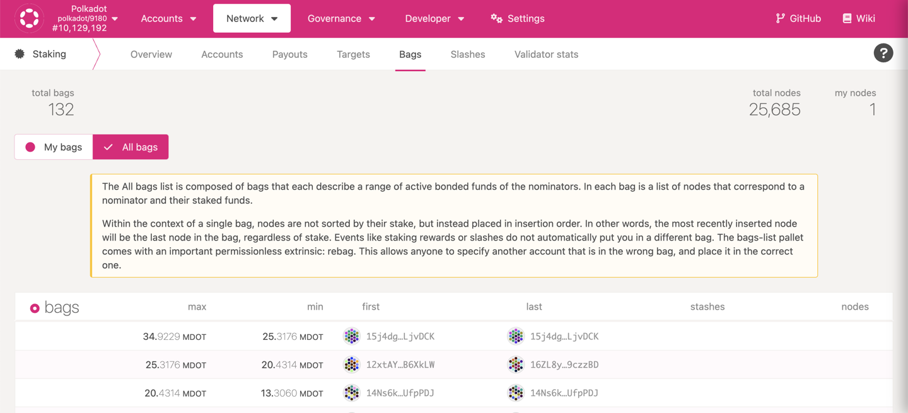
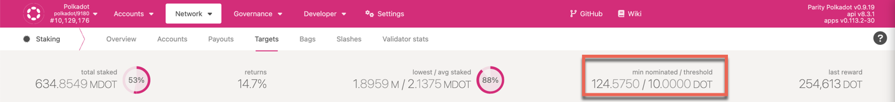
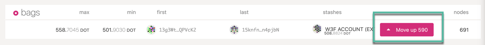
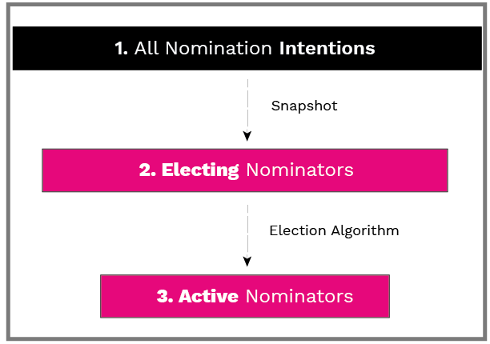
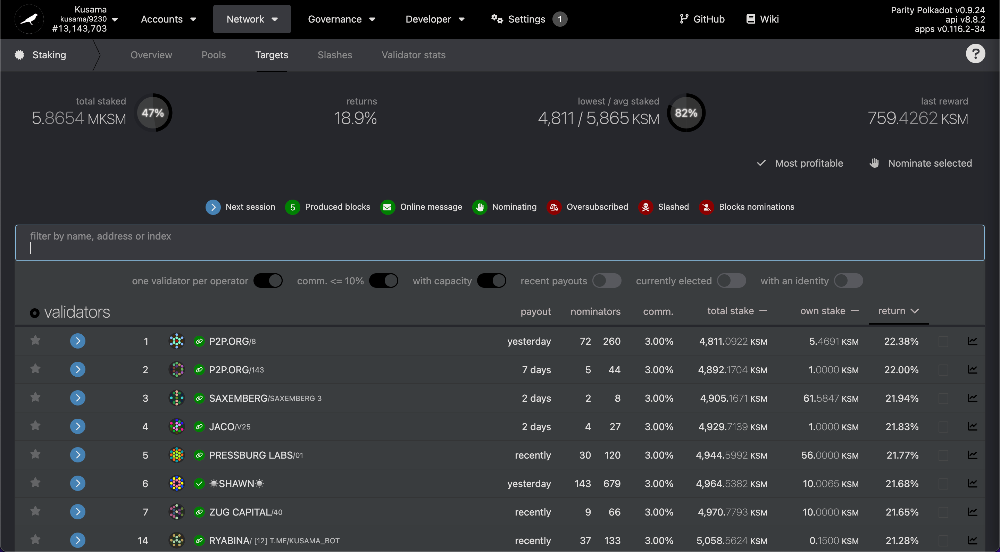

Nominators secure the Relay Chain by selecting good validators and staking DOT.

You may have an account with DOT and want to earn fresh DOT. You could do so as validator, which
requires a node running 24/7. If you do not have such node or do not want to bother, you can still
earn DOT by nominating one or more validators.

By doing so, you become a nominator for the validator(s) of your choice. Pick your validators
carefully - if they do not behave properly, they will get slashed and you will lose DOT as well.
However, if they do follow the rules of the network, then you can share in staking rewards that they
generate.

While your DOT are staked by nominating a validator, they are 'locked' (bonded). You can receive new
DOT in your account but you cannot stake as validator or transfer DOT away from your account. You
can [un-nominate at any time](../maintain/maintain-guides-how-to-unbond.md) to stop staking your funds. Keep in
mind that the un-nomination is effective in the next era, and that un-nominating does not
automatically unbond your funds. There is an unbonding period of 7 days on Kusama and 28 days on
Polkadot before bonded funds can be transferred after issuing an unbond transaction.

### Active vs. Inactive Nomination

When you go to the [Account actions](https://polkadot.js.org/apps/#/staking/actions) under staking
page, you should see your bonded accounts and nomination status. If not, you can follow
[this](../maintain/maintain-guides-how-to-nominate-polkadot.md) guide to configure it first. Your nominations
will be effective in the next era; eras are roughly 6 hours on Kusama and 24 hours on Polkadot.

Suppose you have nominated five validator candidates, and three out of five were elected to the
active validator set, then you should see two of your nominations as "waiting", and most likely one
as "active" and the rest as "inactive". Active or inactive nomination means your nominated
validators have been elected to be in the validator set, whereas waiting means they did not get
elected. Generally, you will only have a single validator have an active nomination, which means
that you are directly supporting it with your stake this era and thus potentially receiving staking
rewards. Inactive nominators were validators that were elected for this era but which you are not
actively supporting. Every era, a new election will take place and you may be assigned a different
active nomination from among the validators you have selected.

If you are committing a very large amount of stake, then you may have more than one active
nomination. However, the election algorithm attempts to minimize this situation, and it should not
occur often, so you should almost always see only a single active nomination per era. See the
[section on Phragmén optimization](learn-phragmen.md#optimizations) for more details.

### Bags-list

Nominating accounts are placed in a semi-sorted list called bags-list. This sorting functionality is extremely 
important for the [long-term improvements](https://gist.github.com/kianenigma/aa835946455b9a3f167821b9d05ba376) 
of the staking/election system. Bags-list allows up to 50,000 nominators to set their *intention* to nominate, 
of which, the stake of the top 22,500 nominators is considered for elections that eventually determine the active validators. The bags-list
can be previewed on [Polkadot JS Apps > Network > Staking > Bags > All Bags](https://polkadot.js.org/apps/#/staking/bags).

:::info Minimum DOT required to earn staking rewards

Minimum DOT required to submit intent to nominate is 10 DOT, but the minimum active nomination required to earn
staking rewards is dynamic and may be much higher, which can be viewed on [Polkadot JS Apps > Network > Staking > Targets page](https://polkadot.js.org/apps/#/staking/targets).

:::

Bonding additional tokens or unbonding the staked tokens will automatically place the nominating account in the 
appropriate bag. While the system tries its best to ensure nominators are always represented in the correct bag, 
certain changes in bonded funds (e.g. a slash in the negative direction, or rewards in the positive direction) can 
cause an account to be in the wrong bag, and for operational safety reasons the system will not automatically
self-adjust.

:::caution `bagsList.putInFrontOf` and `bagsList.rebag` extrinsics

The nominator accounts in a bag are sorted based on their insertion order, not by their nomination stake. 
`bagsList.putInFrontOf` extrinsic can be issued to move up in the bag, which might be very useful for the 
accounts in the last bag eligible for receiving staking rewards. Also, balance changes due to staking rewards or 
slashing do not automatically re-bag the account. Whenever applicable, Polkadot JS Apps UI prompts the nominator account to rebag or move-up and the instructions are available in this [support article](https://support.polkadot.network/support/solutions/articles/65000181018-i-have-more-than-the-minimum-bonded-but-i-m-not-getting-rewards).

:::

To demonstrate how bags-list works, let's imagine a simple bag system with 7 accounts and 3 bags:

Alice: 10 DOT, Bob: 11 DOT, Charlie: 15 DOT, Dave: 20 DOT, Eve: 100 DOT, Frank 1000 DOT, Georgina: 2000 DOT

Bag1: Max 2000, Min 1000 - Frank, Georgina

Bag2: Max 1000, Min 20 - Eve, Dave

Bag3: Max 20, Min 10 - Alice, Bob, Charlie

The bags are iterated based on _insertion_ order, not _amount at stake_. So if only five nominating 
accounts are picked for the electing set, it will be Frank, Georgina, Eve, Dave, Alice. Even though Alice has only 10 
DOT, she is first in line in Bag3.

Charlie can put himself in front (move up in the bag) using the , since he has 15 DOT (more than Alice does at 10).
Now if nothing changes for the next era, Frank, Georgina, Eve, Dave, and Charlie will get rewards. Bag3 now has: 
Charlie, Alice, Bob. The `bagsList.putInFrontOf` extrinsic can be issued through Polkadot JS Apps UI by clicking on 
the Move up button.

Alice gets upset, but she cannot move herself up, since Charlie has more DOT than her. Bob _could_ move himself 
in front of Alice, since he has 11 DOT (> 10), but he still wouldn't get rewards.

Let us consider a hypothetical scenario where Charlie set the staking rewards to be bonded automatically and Charlie's 
stash crosses 20 DOT after rewards from several staking eras. As balance changes due to staking rewards or 
slashing do not automatically re-bag the account, Charlie has to issue `bagsList.rebag` extrinsic to place his nominator
node in the right bag. The re-bag button will appear on Polkadot JS Apps UI right beside the stash account in the bag.

### Staking Election Stages

The staking election system has 3 stages for both validators and nominators, namely "intention", 
"electable/electing", and "active".

- **intention to nominate:** an account that has stated the intention to nominate; also called simply 
a "nominator".
- **electing nominator:** a nominator who is selected to be a part of the input to the [NPoS election 
algorithm](learn-phragmen.md). This selection is based on stake, and is done using the 
[bags-list pallet](https://paritytech.github.io/substrate/master/pallet_bags_list/).
- **active nominator:** a nominator who came out of the NPoS election algorithm backing an active validator, 
sharing their rewards (if among the top 256 backers) and slashes.

### Required Minimum Stake

Due to the way the [Phragmen algorithm](learn-phragmen.md) generates the solution set, and due to
the fact that the solution set must fit in a single block, a minimum number of DOT will be required to 
nominate with, in order to receive staking rewards, can change between the eras.

- **min-intention-threshold:** minimum stake to declare the intention to nominate. This parameter can be 
updated via on-chain governance and the most recent and up to date version can be found on 
[chain state](https://polkadot.js.org/apps/#/chainstate) (select **state query > staking > minimumNominatorBond**)

- **min-electing:** minimum stake among the electing nominators. Since this is almost always the same as 
“min-active”, it might not be reported.

- **min-active:** minimum stake among the active nominators. If your stake falls below this dynamic threshold in
a given era, you will not receive staking rewards for that era.

Thus, for **nominator counters**, we have:

- count of nominator intentions, and max possible nominator intentions (50,000).
- count of electing nominators, and maximum possible electing nominators (22,500). 	
- count of active nominators, and maximum possible active nominators (22,500).

### Oversubscribed Validators

Validators can only pay out to a certain number of nominators per era. This is currently set to
{{ polkadot_max_nominators }}, but can be modified via governance. If more than
{{ polkadot_max_nominators }} nominators nominate the same validator, it is "oversubscribed", and
only the top {{ polkadot_max_nominators }} staked nominators (ranked by amount of stake) are paid
rewards. Other nominators will receive no rewards for that era, although their stake will still be
used to calculate entry into the active validator set.

Although it is difficult to determine exactly how many nominators will nominate a given validator in
the next era, one can estimate based on the current number of nominators. A validator with only 5
nominators in this era, for instance, is unlikely to have more than {{ polkadot_max_nominators }} in
the next era. An already-oversubscribed validator with 1000 nominators this era, however, is very
likely to be oversubscribed in the next era as well.

### The Election Solution Set

Determining which validators are in the active set and which nominators are nominating them creates
a very large graph mapping nominators to their respective validators. This "solution set" is
computed off-chain and submitted to the chain, which means it must fit in a single block. If there
are a large number of nominators, this means that some nominators must be eliminated. Currently,
nominators are sorted by amount of DOT staked and those with more DOT are prioritized. This means
that if you are staking with a small amount of DOT, you may not receive rewards. This minimal amount
is dynamic based on the number of validators, number of nominators, amount nominated, and other
factors.

### Receiving Rewards

As long as you have nominated more than one validator candidate, at least one of them got elected,
and you are nominating with enough stake to get into the solution set, your bonded stake will be
fully distributed to one or more validators. That being said, you may not receive rewards if you
nominated very few validator candidates and no one got elected, or your stake is small and you only
selected oversubscribed validators, or the validator you are nominating has 100% commission. It is
generally wise to choose as many trustworthy validators as you can (up to {{ polkadot_max_nominations }}) 
to reduce the risk of none of your nominated validators being elected.

:::info Not receiving Staking Rewards?

To explore the possible reasons for not receiving staking rewards, check out the [Staking FAQ](learn-staking-faq#3-why-am-i-not-receiving-staking-rewards)

:::

Rewards are *lazy* - somebody must trigger a payout for a validator for rewards to go all of the
validator's nominators. Any account can do this, although in practice validator operators often do
this as a service to their nominators. See the page on [Simple Payouts](learn-simple-payouts.md) for
more information and instructions for claiming rewards.

### What to Take Into Consideration When Nominating

One thing to keep in mind as a nominator is the validator's commission. The commission is the
percentage of the validator reward which is taken by the validator before the rewards are split
among the nominators. As a nominator, you may think that the lowest commission is best. However,
this is not always true. Validators must be able to run at break-even in order to sustainably
continue operation. Independent validators that rely on the commission to cover their server costs
help to keep the network decentralized. Commission is just one piece of the puzzle that you should
consider when picking validators to nominate.

As a nominator, if you only want to know the profit each validator made for each era, you can go to
the [Targets](https://polkadot.js.org/apps/#/staking/targets) section under the staking page by
inputting the number of tokens you would like to stake to check it. Then, nominate those who have a
higher profit. However, that does not guarantee the right way to evaluate the validators' overall
performance.

It is worth taking into consideration "own stake" of a validator. This refers to the quantity of DOT
the validator has put up at stake themselves. A higher "own stake" amount can be considered
as having more "skin in the game". This can imply increased trustworthiness. However, a validator not
having a large amount of "own stake" is not automatically untrustworthy, as the validator could be
nominating from a different address.

### Filter Out Validators With Undesirable Traits

On the Targets page, you can filter out validators that have traits that may indicate an issue with
you nominating them. You can turn these filters on and off to help narrow down which validators you
should nominate. It is important to note that these traits aren't necessarily "bad"; however,
depending on your validator selection methodology, they may be characteristics that you would be
interested in filtering.

* **one validator per operator**: Do not show groups of validators run by a single operator.
* **comm. < 20%**: Do not show any validators with a commission of 20% or higher.
* **with capacity**: Do not show any validators who are currently operating
  [at capacity](../general/glossary.md#capacity) (i.e., could potentially be oversubscribed).
* **recent payouts**: Only show validators that have recently caused a
  [payout to be issued](learn-simple-payouts.md). Note that anyone can cause a payout to occur; it
  does not have to be the operator of a validator.
* **currently elected**: Only show validators that are currently in the active set (i.e., they have been
  elected to produce blocks this era).
* **with an identity**: Only show validators that have set an [identity](learn-identity.md).
  Note that this identity does not have to be verified by a registrar for the validator to show up
  in the list.

### Review Your Validators' History

How the validator acted in the past may be a good indicator of how they will act in the future. An
example of problematic behavior would be if a validator is regularly offline, their nominators most
likely would get fewer rewards than others. More importantly, when many validators are
[unreachable](learn-staking.md#unresponsiveness), those nominators who staked with them will be
slashed.

Thus, to be a smart nominator, it would be better to query their
[histories](https://polkadot.js.org/apps/#/staking/query/) to see statistics such as blocks
produced, rewards and slashes, and [identity](learn-identity.md) (if they have it set). Moreover, a
nominator should do comprehensive research on their validator candidates - they should go over the
validators' websites to see who they are, what kind of infrastructure setup they are using,
reputation, the vision behind the validator, and more.

### Be Aware of The Risks of Single Operators with Multiple Validators

Recall that slashing is an additive function; the more validators that are offline or equivocate in
a given session, the harsher the penalties. Since validators that are controlled by a single entity
are more at risk of a "synchronized" failure, nominating them implies a greater risk of having a
large slash of your nominated funds. Generally, it is safer to nominate validators whose behavior is
independent from others in as many ways as possible (different hardware, geographic location, owner,
etc.).

### Avoiding Oversubscribed Validators

If you are not nominating with a large number of DOTs, you should try to avoid
[oversubscribed](../general/glossary.md#oversubscribed) validators. It is not always easy to calculate if the
validator selected will be oversubscribed in the next session; one way to avoid choosing potentially
oversubscribed validators is to filter out any that are [at capacity](../general/glossary.md#capacity) on the
Targets page.

Finally, if you have a very small amount of DOTs, you may not be able to have your nomination fit
into the election set. The nominator to validator mapping has to fit in a single block, and if there
are too many nominators, the lowest-staked nominations will be dropped. This value is obviously
dynamic and will vary over time. If you review the lowest amount of nominations that are occurring
on current validators, you can get a good idea of how many DOTs will likely be necessary to have
your nomination earn you rewards. You can read the blog post
["Polkadot Staking: An Update"](https://polkadot.network/polkadot-staking-an-update/) for more
details.

:::note Explainer videos on Nominating

These concepts have been further explained in the
[Why Nominate on Polkadot & Kusama video](https://www.youtube.com/watch?v=weG_uzdSs1E&list=PLOyWqupZ-WGuAuS00rK-pebTMAOxW41W8&index=4)
and
[What to Consider when Nominating Validators on Polkadot and Kusama](https://www.youtube.com/watch?v=K-a4CgVchvU&list=PLOyWqupZ-WGuAuS00rK-pebTMAOxW41W8&index=9)
and
[Nominating/Staking on Polkadot and Kusama](https://youtu.be/FCXC0CDhyS4)

:::

### Guides

- [Be a Nominator (Polkadot)](../maintain/maintain-guides-how-to-nominate-polkadot.md) - Guide on nominating on
  the Kusama canary network.
- [Stop Being a Nominator (all networks)](../maintain/maintain-guides-how-to-unbond.md) - Guide on stopping
  nominations and withdrawing tokens.
