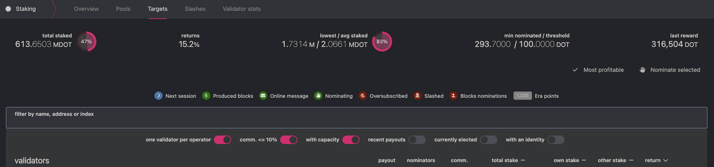
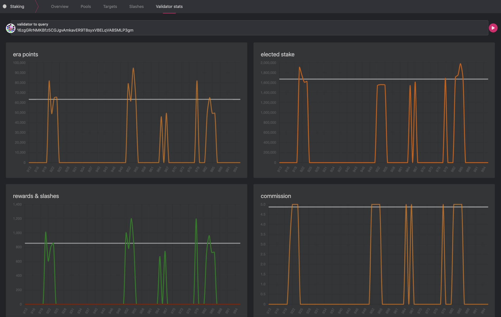

!!!tip "New to Staking?"
    Start your staking journey or explore more information about staking on [Polkadot's Home Page](https://polkadot.network/staking/). You can learn how staking works by reading [this dedicated page](../learn/learn-staking.md).
    
    Discover the new [**Staking Dashboard**](https://staking.polkadot.cloud/#/overview) that makes staking much easier and check this [extensive article list](https://support.polkadot.network/support/solutions/articles/65000182104) to help you get started.
    
    You can now [stake natively with just 1 DOT and earn staking rewards](https://polkadot.network/blog/nomination-pools-are-live-stake-natively-with-just-1-dot/).

!!!info "Stake through Nomination Pools"
    The minimum amount required to become an active nominator (i.e. the [minimum active bond](../general/chain-state-values.md#minimum-active-bond)) and earn rewards may change from era to era. If you have less tokens than the minimum active nomination and still want to participate in staking, you can join the nomination pools with a [smaller amount of tokens](../general/chain-state-values.md#minimum-bond-to-participate-in-staking). For additional information, see
    [this blog post](https://polkadot.network/blog/nomination-pools-are-live-stake-natively-with-just-1-dot/).
    Check the wiki doc on [nomination pools](learn-nomination-pools.md) for more information.

If you landed on this page, you decided to understand how you can be a good nominator. Note, this
page is not for [nomination pool](./learn-nomination-pools.md) members, although pool members might
gain essential knowledge about how to choose nomination pools.

The information provided on this page is complementary to that on the
[**Staking Page**](./learn-staking.md) and [**Advanced Staking Page**](./learn-staking-advanced.md).
Make sure you read those pages as well before nominating.

## Who are Nominators?

Nominators are one type of staking participant. They appoint their stake to the validators, the
second type of participant. By appointing their stake, they can elect the active set of validators
and share in the rewards that are paid out.

While the [validators](../maintain/maintain-guides-how-to-validate-polkadot.md) are active
participants in the network that engage in the block production and finality mechanisms, nominators
take a slightly more passive role. Being a nominator does not require running a node of your own or
worrying about online uptime. However, a good nominator performs due diligence on the validators
that they elect. When looking for validators to nominate, a nominator should pay attention to their
own reward percentage for nominating a specific validator - as well as the risk that they bear of
being [slashed](./learn-offenses.md) if the validator gets slashed.

## Why Nominate?

- You become a network participant, a group of diverse professionals and enthusiasts around the
  world aspiring to build and foster the next-gen Internet, Web3: a decentralized, privacy-focused,
  and trustless internet.
- You are an essential piece of the puzzle, keeping the network secure. The bonded balance can be
  used to vote in [Polkadot OpenGov](./learn-polkadot-opengov.md) and shape the network's future
  direction.
- You will start to understand how Polkadot works at a technical-level. When you feel comfortable
  with your nomination skills and knowledge, you can open your
  [nomination pool](./learn-nomination-pools.md), help others secure the network and earn rewards,
  and build your reputation as a trusted nomination pool operator. If you like to be more involved,
  the next step is to become a [validator](./learn-validator.md).
- By getting [staking](./learn-staking.md) rewards you keep up with or (likely) stay ahead of
  network inflation.

Nominators secure the relay chain by staking native tokens (DOT on Polkadot or KSM on Kusama) and
nominating validators. You may have an account with DOT and want to earn fresh DOT. You could do so
as a validator, which requires experience setting up a node and running and maintaining it 24/7.

On Polkadot, you can also earn DOT by nominating one or more validators. Doing so makes you a
nominator for the validator(s) you chose. Pick your validators carefully -
[if they do not behave properly, they will get slashed, and you will lose some DOT](./learn-offenses.md).
However, if they follow the network rules, you can share the staking rewards they generate.

While your tokens are staked for nominations, they are 'locked' (bonded). You can
[stop nominating at any time](./learn-guides-nominator.md#stop-nominating), but remember that the
action is effective in the next era and does not automatically unbond your funds. Unbonding is a
separate action, and it takes effect after the
[unbonding period](../general/chain-state-values.md#unbonding-duration). A staking lock will be
visible on the Polkadot-JS UI during the unbonding period, and after it, the staking lock can be
unlocked, and the bonded funds become free balance you can transfer.

!!!info "Fast Unstaking"
    If you accidentally bonded your tokens or your bonded tokens never backed any active validator, you can now unbond them immediately.

If your bonded balance did not back any validators in the last 28 days on Polkadot (7 days on
Kusama), you are eligible to perform fast unstaking. The
[staking dashboard](https://staking.polkadot.cloud/#/overview) will automatically check if you
qualify. For more information, visit the
["Fast Unstake" section in this support article](https://support.polkadot.network/support/solutions/articles/65000169433-can-i-transfer-dot-without-unbonding-and-waiting-28-days-).

## Setting-up Accounts

### Stash & Staking Proxy

Nominators are recommended to set up separate stash and staking proxy accounts. Explanation and the
reasoning for generating distinct accounts for this purpose is elaborated in the
[keys section](../learn/learn-cryptography.md#keys).

You can generate your stash and staking proxy account via any of the recommended methods, which are
detailed on the [account generation](../learn/learn-accounts.md#account-generation) page. The first
thing you need to do before becoming a nominator is to make sure you have a
[**stash account**](./learn-staking.md#stash-account-and-staking-proxy) where you can transfer funds
you want to use for staking. For these accounts, it is recommended to use a "cold wallet" solution
such as [Ledger](../general/ledger.md) or [Polkadot Vault](../general/polkadot-vault.md).

After setting up the stash account, it is recommended to have a
[**staking proxy**](./learn-staking-advanced.md#staking-proxies). Although you can be a nominator
with just a stash account, having a staking proxy is good practice for security reasons.

A staking proxy of the stash will be able to sign for all staking-related transactions as well. The
stash will be fully isolated (except if the user decides to change the staking proxy of the stash or
to attach different proxies to the stash).

### Rewards Payout Account

As a nominator, you will be asked to choose an account where rewards will be paid. You can select
one of the following options:

- back to staking: rewards are compounded to the bonded amount.
- to stash: rewards are sent to the stash account as a free balance.
- to another account: rewards are sent to a user-defined account (not stash).

Starting with runtime version v23 natively included in the client version
[0.8.23](https://github.com/paritytech/polkadot/releases/tag/v0.8.23), payouts can go to any custom
address. If you'd like to redirect payments to an account that is neither the staking proxy nor the
stash account, set one up. Note that setting an exchange address as the recipient of the staking
rewards is extremely unsafe.

!!!info
    Being a nominator is made simpler by using the [**Staking Dashboard**](https://staking.polkadot.cloud/#/overview) that will guide you step by step through specifying rewards destination and bonded amount, and nominating validators (more on this below). Note that staking proxies are not currently supported on the dashboard.

## Nominating with the Polkadot-JS UI

### Targets Page

There are many factors to consider when deciding which of your nominations. One helpful tool to
choose validators is the Staking [Targets](https://polkadot.js.org/apps/#/staking/targets) table in
the Polkadot-JS UI. This allows sorting validators using various metrics. Below are the relevant
metrics shown as an example, followed by a brief description of each.

| validator | payout   | nominators             | comm. | total stake | own stake | return |
| --------- | -------- | ---------------------- | ----- | ----------- | --------- | ------ |
| A         | recently | 1 (`active`) 4 (`all`) | 3%    | 1.6 MDOT    | 8500 DOT  | 17.8%  |

- **payout**: How recently the validator made its last reward payout to nominators.
- **nominators**: This column consists of two number values. The **active** count (left number) is
  the number of nominators whose stake is baking the validator in the current era. In this case
  Validator A has one active nominator. The total or **all** count (right number) is the number of
  all nominators who nominated Validator A. This includes the active count and all the other
  nominators whose stake in the current era is baking other validators.

  Every nominator can select up to
  [a maximum number of validators](../general/chain-state-values.md#maximum-votes-per-nominator),
  which contributes towards maximizing the probability of having the nominator’s stake applied to
  the validators active set. Nominating too few validators could result in the nominators not
  receiving their rewards when none of them make it to the active set or when those validators stop
  validating. The election algorithm attempts to maximize the overall network stake while minimizing
  the variance of the active stake across the validators. For additional information on the election
  process, check out the research behind
  [nominated proof-of-stake](https://research.web3.foundation/Polkadot/protocols/NPoS).

- **comm.**: Total commission kept by the validator (100% means the validator will keep all rewards
  , and thus nominators will not receive them). A validator's commission is the percentage of the
  validator reward taken by the validator before the rewards are split among the nominators. As a
  nominator, you may think that choosing validators with the lowest commission is best. However,
  validators must be able to run at break-even to continue operations sustainably. Independent
  validators that rely on the commission to cover their server costs help to keep the network
  decentralized. Some validators, operated by central exchanges, etc., keep 100% of the commission
  to payout their staking service clients and therefore do not provide any rewards to external
  nominators. The commission is just one piece of the puzzle you should consider when picking
  nominating validators.
- **total stake**: The total amount of tokens staked by nominators and the validator (i.e. own
  stake, see below).
- **own stake**: The amount of tokens the validator has put up as a stake. A higher own stake can be
  considered as having more "skin in the game". This can imply increased trustworthiness. However, a
  validator not having a large amount of "own stake" is not automatically untrustworthy, as the
  validator could nominate from a different address.
- **return**: Average annual yield paid out to nominators (i.e. number of rewards divided by the
  number of bonded tokens). Note that nominating those with a higher yield may not guarantee similar
  future performance.

On the Targets page, you can use different filters to select validators with specific traits (where
a trait is a combination of the metrics above). Available filters are:

- **one validator per operator**: Do not show groups of validators run by a single operator. It
  shows small operators only who will likely have a higher commission and higher self-stake.
  Nominating only small operators might not always guarantee staking rewards, but it helps to keep
  the network more resilient to attacks.

!!!info "Validator vs Operator"
    A validator is the node, the physical equipment with installed software that allows to produce new blocks and earn rewards. An operator is the entity responsible for setting up, running and maintaining the node. An operator can have multiple validators under different sub-identities. For example, `ZUG CAPITAL/07` is one of the numerous validators belonging to the operator Zug Capital.

- **comm. < 20%**: Do not show any validators with a commission of 20% or higher.
- **recent payouts**: Only show validators that have recently caused a
  [payout to be issued](learn-staking-advanced.md). Note that anyone can cause a payout to occur; it
  does not have to be the operator of a validator.
- **currently elected**: Only show validators in the active set (i.e., they have been elected to
  produce blocks in the current era).
- **with an identity**: Only show validators that have set an [identity](learn-identity.md). Note
  that this identity does not have to be verified by a registrar for the validator to appear in the
  list.

!!!warning "Single Operators with Multiple Validators"
    Recall that [slashing](./learn-offenses.md) is an additive function; the more validators equivocating in a given session, the harsher the penalties. Since validators that are controlled by a single operator are more at risk of a "synchronized" failure, nominating them implies a greater risk of having a large slash of your nominated funds. Generally, it is safer to nominate validators whose behavior is independent of others in many ways (different hardware, geographic location, owner, etc.).

### Bags-list

!!!info
    On Polkadot and Kusama, the instance of the pallet [Bags-List](https://paritytech.github.io/substrate/master/pallet_bags_list/) is named as `voterList`.

Nominating accounts are placed in a semi-sorted list called bags-list. This sorting functionality is
extremely important for the long-term improvements of the staking/election system. Bags-list allows
an unlimited number nominators to set their intention to nominate, of which only a portion of it
(currently 22500) is considered for [electing set](#staking-election-stages) that eventually
determines the active validators.

The nominator accounts in a bag are sorted based on their insertion order, not by their nomination
stake. The `voterList.putInFrontOf` extrinsic can be issued to move up in the bag, which might be
very useful for the accounts in the last bag eligible for receiving staking rewards. Balance changes
due to staking rewards or slashing do not automatically rebag the account. Whenever applicable,
Polkadot JS Apps UI prompts the nominator account to rebag or move up by calling the
`voterList.rebag` extrinsic.

For guidelines about how to rebag or move your account within a bag, see the followings:

- The "Bags List" Section on
  [this Support Page](https://support.polkadot.network/support/solutions/articles/65000181018-i-have-more-than-the-minimum-bonded-but-i-m-not-getting-rewards).
- The [Bags List Section](./learn-staking-advanced.md#bags-list) in Advanced Staking Concepts.
- The [dedicated technical explainer video](https://youtu.be/hIIZRJLrBZA).

### Validator Stats

Nominators can query [validator histories](https://polkadot.js.org/apps/#/staking/query/) to see
statistics such as era points, elected stake, rewards and slashes, and commission. It is good
practice to do comprehensive research on validator candidates. This could include (but should not be
limited to) checking the validators' [identity](learn-identity.md) (if they have set one) and going
over the validators' websites to see who they are, what kind of infrastructure setup they are using,
reputation, the vision behind the validator, and more.

Any problematic behavior must be taken seriously. An example of problematic behavior will be if a
validator is regularly offline. In this case, nominators will get fewer rewards.

## Nominating with the Staking Dashboard

If you are a beginner, please watch the video below for detailed instructions.

The [Polkadot Staking Dashboard](../general/dashboards/staking-dashboard.md) allows to choose pre-selected
lists of validators based on user preference, or to manually select validators similarly as in the
Polkadot-JS UI.

Pre-selected choices are:

- Optimal Selection: Selects a mix of majority active and inactive validators.
- Active Low Commission: Gets a set of active validators with low commission.
- From Favorites: Gets a set of your favorite validators.

## Staking Election Stages

The staking election system has three stages for both validators and nominators, namely "intention",
"electable/electing", and "active".

- **intention to nominate:** an account that has stated the intention to nominate; also called
  simply a "nominator".
- **electing nominator:** a nominator who is selected to be a part of the input to the
  [NPoS election algorithm](learn-phragmen.md). This selection is based on stake and is made using
  the [bags-list](./learn-staking-advanced.md#bags-list).
- **active nominator:** a nominator who came out of the NPoS election algorithm backing an active
  validator. When slashing occurs, all the active nominators backing the validator get slashed.

### The Election Solution Set

Determining which validators are in the active set and which nominators are nominating them creates
a very large graph mapping nominators to their respective validators. This "solution set" is
computed off-chain and submitted to the chain, which means it must fit in a single block. If there
are a large number of nominators, this means that some nominators must be eliminated. Currently,
nominators are sorted by the amount of DOT staked, and those with more DOT are prioritized. This
means that you may not receive rewards if you are staking with a small amount of DOT. This minimal
amount is dynamic based on the number of validators, nominators, amount nominated, and other
factors.

## Receiving Rewards

As long as you have nominated more than one validator candidate, at least one of them got elected,
and you are nominating with enough stake to get into the solution set, your bonded stake will be
fully distributed to one or more validators. That being said, you may not receive rewards if you
nominated very few validator candidates and no one got elected, or your stake is small, and you are
not part of the [top 22,500 nominators](./learn-staking-advanced.md#bags-list), or the validator you
are nominating has 100% commission. It is generally wise to choose as many trustworthy validators as
you can to reduce the risk of none of your nominated validators being elected.

!!!info "Not receiving Staking Rewards?"
    To explore the possible reasons for not receiving staking rewards, check out the followings:
    - The [Staking FAQ](https://support.polkadot.network/support/solutions/articles/65000181959-staking-faq-s) on the Support Pages.
    - The ["Why am I not receiving staking rewards?"](https://www.reddit.com/r/Polkadot/comments/10kurje/why_am_i_not_receiving_staking_rewards/) Reddit article.
    - The ["Why am I not receiving staking rewards?"](./learn-staking.md#why-am-i-not-receiving-rewards) section on the Staking Page.

Rewards are _lazy_ - somebody must trigger a payout for a validator for rewards to go to all of the
validator's nominators. Any account can do this, although validator operators often do this as a
service to their nominators. See the page on [Simple Payouts](learn-staking-advanced.md) for more
information and instructions for claiming rewards.

!!!note "Explainer videos on Nominating"
    These concepts have been further explained in the following videos:
    - [Why Nominate on Polkadot & Kusama](https://www.youtube.com/watch?v=weG_uzdSs1E&list=PLOyWqupZ-WGuAuS00rK-pebTMAOxW41W8&index=4)
    - [What to Consider when Nominating Validators on Polkadot and Kusama](https://www.youtube.com/watch?v=K-a4CgVchvU&list=PLOyWqupZ-WGuAuS00rK-pebTMAOxW41W8&index=9)
    - [Nominating/Staking on Polkadot and Kusama](https://youtu.be/FCXC0CDhyS4)

## Good Nominator Practices

### Required Minimum Stake

Due to the way the [Phragmen algorithm](learn-phragmen.md) generates the solution set and due to the
fact that the solution set must fit in a single block, a minimum number of DOT will be required to
nominate with to receive staking rewards can change between the eras.

- **min-intention-threshold:** minimum stake to declare the intention to nominate. This parameter
  can be updated via on-chain governance, and the most recent and up-to-date version can be found on
  [chain state](https://polkadot.js.org/apps/#/chainstate) (select **state query > staking >
  minimumNominatorBond**)

- **min-electing:** minimum stake among the electing nominators. Since this is almost always the
  same as “min-active”, it might not be reported.

- **min-active:** minimum stake among the active nominators. If your stake falls below this dynamic
  threshold in a given era, you will not receive staking rewards for that era.

Thus, for **nominator counters**, we have:

- count of nominator intentions and
  [max possible nominator intentions](../general/chain-state-values.md#maximum-number-of-nominators)
- count of electing nominators, and maximum possible electing nominators (22500 on Polkadot and
  12500 on Kusama)
- count of active nominators and maximum possible active nominators (22500 on Polkadot and 12500 on
  Kusama)

### Active vs. Inactive Nomination

When you go to the [Account actions](https://polkadot.js.org/apps/#/staking/actions) under staking
page, you should see your bonded accounts and nomination status. If not, you can follow
[this](./learn-guides-nominator.md#nominate-using-polkadot-js) guide to configure it first. Your
nominations will be effective in the next era; eras are roughly 24 hours on Polkadot (6 hours on
Kusama).

Suppose you have nominated five validator candidates, and three out of five were elected to the
active validator set; then you should see two of your nominations as "waiting", and most likely one
as "active" and the rest as "inactive". Active or inactive nomination means your nominated
validators have been elected to be in the validator set, whereas waiting means they did not get
elected. Generally, you will only have a single validator have an active nomination, which means
that you are directly supporting it with your stake this era and thus potentially receiving staking
rewards. Inactive nominators were validators elected for this era but which you are not actively
supporting. Every era, a new election will take place, and you may be assigned a different active
nomination from the validators you selected.

If you are committing a very large stake, you may have more than one active nomination. However, the
election algorithm attempts to minimize this situation, and it should not occur often, so you should
almost always see only a single active nomination per era. See the
[section on Phragmén optimization](learn-phragmen.md#optimizations) for more details.

### Minimum Active Nomination to Receive Staking Rewards

!!!info "Minimum DOT required to earn staking rewards"
    The [minimum number of tokens required to submit intent to nominate](../general/chain-state-values.md#minimum-bond-to-participate-in-staking) differs from the [minimum active nomination](../general/chain-state-values.md#minimum-active-bond) required to earn staking rewards.

## Guides

- [Be a Nominator (Polkadot)](./learn-guides-nominator.md#nominate-a-validator) - Guide on
  nominating on the Kusama canary network.
- [Stop Being a Nominator (all networks)](./learn-guides-nominator.md#stop-nominating) - Guide on
  stopping nominations and withdrawing tokens.
