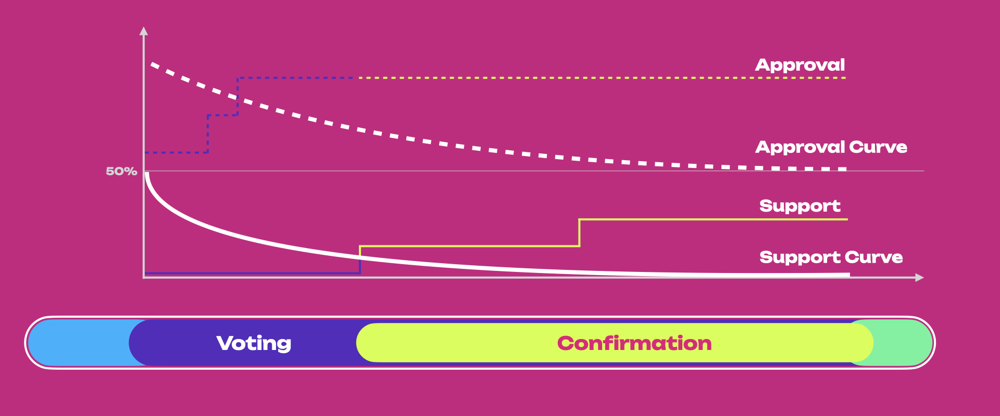

import RPC from "./../../components/RPC-Connection";

import VLTable from "./../../components/Voluntary-Locking";

import Fellowship from "./../../components/Fellowship";

:::caution The content in this document is subject to change

The governance protocol has already undergone iterations (see
[Governance V1](./learn-governance.md)). Governance is a constantly evolving protocol at this stage
in its lifecycle. As updates for OpenGov are making their way to the networks, plans for future
updates are already in development.

:::

:::info Participating in OpenGov

For participating in OpenGov, please refer to this
[dedicated Wiki page](../maintain/maintain-guides-opengov.md).

**OpenGov is live on Kusama, and once rigorously tested, it will be deployed on Polkadot.**

:::

## Premise

{{ polkadot: Polkadot :polkadot }}{{ kusama: Kusama :kusama }} uses a sophisticated governance
mechanism that allows it to evolve gracefully overtime at the ultimate behest of its assembled
stakeholders. The stated goal is to ensure that the majority of the stake can always command the
network.

{{ polkadot: Polkadot :polkadot }}{{ kusama: Kusama :kusama }} brings together various novel
mechanisms, including an amorphous (abstract) form of state-transition function stored on-chain
defined in a platform-agnostic language (i.e. [WebAssembly](learn-wasm.md)), and several on-chain
voting mechanisms such as referenda and batch approval voting. All changes to the protocol must be
agreed upon by stake-weighted referenda.

{{ polkadot: Polkadot :polkadot }}{{ kusama: Kusama :kusama }}'s first governance system
([Governance V1](./learn-governance.md)) included three main components.

- The [Technical Committee](./learn-governance.md#technical-committee): A technocratic committee to
  manage upgrade timelines.
- The [Council](./learn-governance.md#council): An approval-voted, elected executive "government" to
  manage parameters, admin, and spending proposals.
- The Public: All token holders.

Over the first few years of operation, Governance V1 ensured the appropriate usage of treasury funds
and enabled timely upgrades and fixes. Like most early technologies, protocols must evolve as they
mature to improve their shortcomings and keep up with modern advancements. In Governance V1, all
referenda carried the same weight as only one referendum could be voted on at a time (except for
emergency proposals), and the voting period could last multiple weeks. Also, an
[alternating voting timetable](./learn-governance.md#alternating-voting-timetable) allowed to vote
either for a public referendum or a council motion every
{{ polkadot: 28 days :polkadot }}{{ kusama: 7 days :kusama }}. This resulted in the system favoring
careful consideration of very few proposals instead of broad consideration of many.

OpenGov changes how the practical means of day-to-day decisions are made, making the repercussions
of referenda better scoped and agile to increase the number of collective decisions the system can
make at any given time.

The following content is focused on what the new OpenGov version brings to the governance on
{{ polkadot: Polkadot :polkadot }}{{ kusama: Kusama :kusama }}, and on the main differences with
previous governance versions. We recommend learning about [Governance v1](./learn-governance.md) to
better understand the need for and the direction of OpenGov.

## Summary

In Governance v1, active token holders (public) and the council together administrated network's
upgrade decisions. Whether the public or the council initiated the proposal, it would eventually
have to go through a referendum to let all holders (weighted by stake and conviction) make the
decision.

The Council fulfilled its role as the representative of the public, guardian of the treasury and
initiator of legislation, but it was often seen as a centralized entity. To further decentralize
{{ polkadot: Polkadot :polkadot }}{{ kusama: Kusama :kusama }}, OpenGov proposes the following main
changes:

- Migrating all responsibilities of the Council to the public via a direct democracy voting system.
- Dissolving the current [Council](./learn-governance.md#council) collective
- Allowing users to delegate voting power in more ways to community members
- Dissolving the [Technical Committee](./learn-governance.md#technical-committee) and establishing
  the broader [Fellowship](#fellowship)

In the next section, you can find a summary table with the main differences between Governance V1
and OpenGov. More details for each comparison can be found in the subsequent sections of this page.

### Comparison Table

| Governance V1                                                                                                                                                                                                                                                                                                                                  | OpenGov                                                                                                                                                                                                                                                   | OpenGov Benefit                                                                                                                                                  |
| ---------------------------------------------------------------------------------------------------------------------------------------------------------------------------------------------------------------------------------------------------------------------------------------------------------------------------------------------- | --------------------------------------------------------------------------------------------------------------------------------------------------------------------------------------------------------------------------------------------------------- | ---------------------------------------------------------------------------------------------------------------------------------------------------------------- |
| Includes the [Council](./learn-governance.md#council), the [Technical Committee](./learn-governance.md#technical-committee), and the Public (i.e. token holders).                                                                                                                                                                              | Includes the Public and the [Fellowship](#fellowship).                                                                                                                                                                                                    | Simpler and more decentralized structure.                                                                                                                        |
| Referenda executed only from one origin (Root). Referenda in this origin must be carefully scrutinized. Therefore, there is only one track (i.e. only one referendum at a time can be executed).                                                                                                                                               | Referenda executed from [multiple origins](../maintain/maintain-guides-opengov.md#origins-and-tracks-info), each with a different track that shapes proposals’ timelines. Depending on the origin, multiple referenda within the same track are possible. | Possibility to categorize proposals (based on importance and urgency) and execute them simultaneously within and between origin tracks.                          |
| Proposals can be submitted by either the Council or the Public.                                                                                                                                                                                                                                                                                | The public submits proposals.                                                                                                                                                                                                                             | More democratic.                                                                                                                                                 |
| Uses [Adaptive Quorum Biasing](./learn-governance.md#adaptive-quorum-biasing) to define the approval threshold based on turnout. Given the same turnout, council-initiated referenda require fewer Aye votes to pass compared to public referenda.                                                                                             | Uses origin-specific approval and support curves defining the amount of approval and support (i.e. turnout) needed as a function of time. The same curves are applied to all referenda within the same origin track.                                      | Referenda timeline depends on the origin and not on who submitted the proposal (i.e. Council or Public). This is a more democratic and equalitarian system.      |
| Uses [alternating voting timetable](./learn-governance.md#alternating-voting-timetable) allowing voters to cast votes for either council or public referenda every 28 eras.                                                                                                                                                                    | Multiple referenda can be voted at the same time.                                                                                                                                                                                                         | More flexible and agile governance system.                                                                                                                       |
| Except for emergency proposals, all referenda have fixed voting and enactment periods of 28 eras.                                                                                                                                                                                                                                              | Periods' length is customizable and has pre-defined limits for each origin. The same limits apply to all tracks with the same origin. For example, the track in the origin Root will be longer than the track within the Small Tipper origin.             | Referenda’s timeline is tailored to their importance and urgency. Flexible enactment period based on origin.                                                     |
| Emergency proposals turned referenda can be simultaneously voted on and executed with other referenda and have shorter enactment periods. They must be proposed by the Technical Committee and approved by the Council.                                                                                                                        | No emergency proposals. The Fellowship can whitelist proposals that will have their origin with shorter lead-in, confirmation, and enactment periods.                                                                                                     | Fellowship is a more decentralized entity when compared to the Technical Committee. Whitelisting a proposal requires a majority of approval from the fellowship. |
| Only the [most-endorsed proposal](./learn-governance.md#endorsing-proposals) is able to transit from Launch to Voting period. The time for the transition is indeterminate, and (with no possibility of canceling endorsements) proposers and endorsers might wait a long time before a referendum is tabled, and getting their deposits back. | All proposals will eventually be voted on (given track capacity and deposit are met and the Lead-in period has ended).                                                                                                                                    | It allows all proposals to get a chance to be voted on in a timely predictive manner.                                                                            |
| Only _aye_ or _nay_ votes possible.                                                                                                                                                                                                                                                                                                            | Voters can have the additional voting options of abstaining or splitting votes.                                                                                                                                                                           | More ways to engage in voting and increase turnout.                                                                                                              |
| Voters can decide to delegate votes to another account.                                                                                                                                                                                                                                                                                        | Voters can use [multirole delegations](#multirole-delegation) and delegate votes to different accounts depending on origins.                                                                                                                              | More agile delegations tailored by expertise.                                                                                                                    |

## Proposals

:::info Starting a proposal in Governance v1

See [this page](./learn-governance.md#proposals) for more information about starting referenda in
Governance v1.

:::

In OpenGov, anyone can start a referendum at any time and do so as often as they wish. Previous
features were expanded and improved, most notably [**Origins and Tracks**](#origins-and-tracks) help
aid in the flow and processing of the submitted referenda.

### Cancelling and Blacklisting

:::info Cancelling Referenda in Governance v1

See [this page](./learn-governance.md#cancelling-proposals) for more information about cancelling
referenda in Governance v1.

:::

In OpenGov, there is a special operation called **Cancellation** for intervening with a proposal
already being voted on. The operation will immediately reject an ongoing referendum regardless of
its status. There is also a provision to ensure the deposit of the proposer is slashed if the
proposal is malicious or spam.

Cancellation is a governance operation the network must vote on to be executed. Cancellation comes
with [its own Origin and Track](../maintain/maintain-guides-opengov.md#referendum-canceller) which
has a low lead-time and Approval/Support curves with slightly sharper reductions in their thresholds
for passing, given that it is invoked with a sense of urgency.

:::info Blacklisting

Blacklisting referenda in OpenGov is
[the same as in Governance v1](./learn-governance.md#blacklisting-proposals).

:::

## Referenda

:::info Public and Council Referenda in Governance v1

With the Council's dissolution, [council referenda](./learn-governance.md#council-referenda) are no
longer present in OpenGov.

See [this page](./learn-governance.md#public-referenda) for more information about public referenda
in Governance v1.

**In OpenGov all referenda are public.** The [Fellowship](#fellowship) has the option to
[whitelist](#whitelisting) referenda that can be then proposed in the track with
[whitelist origin](../maintain/maintain-guides-opengov.md#whitelisted-caller).

:::

### Referenda Timeline

:::info Voting timetable in Governance v1

See [this page](./learn-governance.md#referenda-timeline) for more information about the voting
timetable in Governance v1.

:::

The figure above provides a summary view of the referenda timeline for OpenGov.

In (1), when a referendum is initially created, the community can immediately vote on it. However,
it is not immediately in a state where it can end or otherwise have its votes counted, be approved,
and ultimately enacted. Instead, the proposal will stay within a **Lead-in Period** until it
fulfills three criteria:

- Proposals must stay within the lead-in period for a pre-defined minimum amount of time. This helps
  mitigate against the possibility of "decision sniping" where an attacker controlling a substantial
  amount of voting power might seek to have a proposal passed immediately after proposing, not
  allowing the overall voting population adequate time to consider and participate.
- There must be enough room for the decision within the origin. Different origins have their limit
  on the number of proposals that can be decided simultaneously. Tracks that have more potent
  abilities will have lower limits. For example, the Root level Origin has a limit of one, implying
  that only a single proposal may be decided on at once.
- A decision deposit must be submitted. Creating a referendum is cheap as the deposit value consists
  of only the value required for the on-chain storage needed to track it. But, having a referendum
  reviewed and decided upon carries the risk of using up the limited spots available in the
  referenda queue. Having a more significant but refundable deposit requirement makes sense to help
  mitigate spam.

Until they are in the lead-in period, proposals remain undecided. Once the criteria above are met,
the referendum moves to the _deciding_ state. The votes of the referendum are now counted towards
the outcome.

In (2), the proposal enters the **Deciding Period** where votes can be cast. For a proposal to be
approved, votes must satisfy the approval and support criteria for at least the **Confirmation
Period**; otherwise, the proposal is automatically rejected. A rejected proposal can be resubmitted
anytime and as many times as needed.

In (3), approved proposals will enter the **Enactment Period**, after which proposed changes will be
executed.

Note how the length of the lead-in, deciding, confirmation, and enactment periods vary depending on
the origin. Root origin has more extended periods than the other origins. Also, the number of
referenda within each track differs, with the Root origin track only accepting one. proposal at a
time (see below).

This directly affects the number of proposals that can be voted on and executed simultaneously.
Continuing the comparison between Root and Small Tipper, Small Tipper will allow many proposals on
its track to be executed simultaneously. In contrast, Root will allow only one proposal in its
track. Once the track capacity is filled, additional proposals in the lead-in period will queue
until place is available to enter the deciding period.

### Origins and Tracks

An **Origin** is a specific level of privilege that will determine the **Track** of all referenda
executed with that origin. The track is basically a pipeline in which the proposal lives and
proceeds and is independent from other origins' tracks. The proposer of the referenda now selects an
appropriate Origin for their request based on the proposal’s requirements.

Although the track structure is the same for all origins, track parameters are not. Such parameters
include:

- **Maximum Deciding or Capacity**: the limit for the number of referenda that can be decided at
  once (i.e. the number of tracks within each origin).
- **Decision deposit**: the amount of funds that must be placed on deposit to enter the Decision
  Period (note that more requirements must be met to enter the Decision Period).
- **Preparation Period**: the minimum amount of voting time needed before entering the Decision
  Period (given capacity and deposit are met).
- **Decision Period**: the maximum time to approve a proposal. The proposal will be accepted if
  approved by the end of the period.
- **Confirmation Period**: the minimum amount of time (within the Decision Period) the approval and
  support criteria must hold before the proposal is approved and moved to the enactment period.
- **Minimum Enactment Period**: the minimum amount of waiting time before the proposed changes are
  applied
- **Approval Curve**: the curve describing the minimum % of _aye_ votes as a function of time within
  the Decision Period. The approval % is the portion of _aye_ votes (adjusted for conviction) over
  the total votes (_aye_, _nay_, and _abstained_).
- **Support Curve**: the curve describing the minimum % of all votes as a function of time within
  the Decision Period. The support % is defined as the portion of all votes without conviction (i.e.
  _aye_, _nay_ and _abstained_) over the total possible amount of votes in the system. Support is a
  measure of turnout.

For example, a runtime upgrade (requiring a `set_code` call, if approved) does not have the same
implications for the ecosystem as the approval of a treasury tip (`reportAwesome` call), and
therefore different Origins for these two actions are needed in which different deposits, turnouts
(i.e. support), approvals, and a minimum [enactment](#enactment) periods will be predetermined on
the pallet.

For detailed information about origin and tracks, and parameter values in Kusama, see
[this page](../maintain/maintain-guides-opengov.md#origins-and-tracks-info).

### Approval and Support

:::info Adaptive Quorum Biasing is deprecated

In OpenGov, [Adaptive quorum biasing](./learn-governance.md#adaptive-quorum-biasing) used in
Governance V1 has been replaced with the **Approval and Support system**.

:::

The figure above provides a summary view of how the approval and support system works during the
Decision Period.

Once the proposal exits the Lead-in Period and enters the Voting Period, to be approved, it must
satisfy the approval and support criteria for the **Confirmation Period**.

- **Approval** is defined as the share of approval (_aye_ votes) vote-weight (after adjustment for
  [conviction](#voluntary-locking)) against the total vote-weight (for all approval, rejection, and
  abstained).
- **Support** is the total number of votes (ignoring any adjustment for conviction) compared to the
  total possible votes that could be made in the system.

The figure shows that even if the approval criteria are satisfied (i.e. % approval is greater than
the approval curve), the proposal only enters the confirmation period once the support criteria are
satisfied (i.e. % support is greater than the support curve). If the referendum meets the criteria
for the confirmation period, then the proposal is approved and scheduled for enactment. The
Enactment Period can be specified when the referendum is proposed but is also subject to a minimum
value based on the Track. More powerful Tracks enforce a larger Enactment Period to ensure the
network has ample time to prepare for any changes the proposal may bring.

Different Origins' tracks have different Confirmation Periods and requirements for approval and
support. For additional details on the various origins and tracks, check out
[this table](./../maintain/maintain-guides-opengov.md#origins-and-tracks). Configuring the amount of
support and overall approval required for it to pass is now possible. With proposals that use less
privileged origins, it is far more reasonable to drop the required support (i.e. turnout) to a more
realistic amount earlier than those which use highly privileged classes such as `Root`. Classes with
more significance can be made to require higher approval early on, to avoid controversy.

### Enactment

:::info Enactment in Governance v1

See [this page](./learn-governance.md#enactment) for more information about enactment in Governance
v1.

:::

In OpenGov, the proposer suggests the enactment period, but there are also minimums set for each
Origin Track. For example, root Origin approvals require a more extended period because of the
importance of the changes they bring to the network.

## Voting on a Referendum

In Governance V1, voters could cast only an _aye_ or _nay_ vote. In OpenGov, voters can additionally
cast a _abstain_ and _split_ votes.
[Vote splitting](../maintain/maintain-guides-opengov.md#voting-on-referenda) allows voters to
allocate different votes for _aye_, _nay_, and _abstain_.

### Voluntary Locking

:::info Voluntary Locking

Voluntary locking in OpenGov is
[the same as in Governance v1](./learn-governance.md#voluntary-locking).

:::

### Multirole Delegation

In OpenGov, an alternate strategy was required to replace the Council in its previous duties as a
body delegated by voters to compensate for the fact that many choose not to take part in day-to-day
of governance. OpenGov builds on the
[vote delegation feature from Governance v1](./learn-governance.md#delegations) where a voter can
delegate their voting power to another voter. It does so by introducing a feature known as
**multirole delegation**, where voters can specify a different delegate for every class of
referendum in the system. Delegation can be done per track, and accounts can choose to select
different delegates (or no delegation) for each track.

For example, a voter could delegate one entity for managing a less potent referenda class, choose a
different delegate for another class with more powerful consequences and still retain full voting
power over any remaining classes.

Occasional delegation and undelegation calls are fee-free: creating an incentive for token holders
to use this feature and ensure that wallets can do it “by default” without any cost to end-users. It
is worth noting that a user delegating their voting power does not imply that the delegate will have
control over the funds of the delegating account: they can vote with a user's voting power: but they
won't be able to transfer your balance, nominate a different set of validators or execute any call
other than voting on the defined call/s by the user.

With the new delegation features, the goal is to ensure the required turnouts for proposals to be
enacted are reached while maintaining the anonymity of voters and keeping the overall design
censorship-free.

For a step-by-step outline of how to delegate voting power in OpenGov, check out the
[Delegating Voting Power](./../maintain/maintain-guides-opengov.md#delegating-voting-power) section
on the [OpenGov Maintenance](./../maintain/maintain-guides-opengov.md) page.

## Fellowship

:::info From Technical Committee to the Fellowship

In OpenGov, the Fellowship replaces the
[Technical Committee](./learn-governance.md#technical-committee). It will serve both the Polkadot
and Kusama networks.

:::

The Fellowship is a mostly self-governing expert body with a primary goal of representing humans who
embody and contain the technical knowledge base of the Kusama and/or Polkadot networks and
protocols. This is accomplished by associating a rank with members to categorize the degree to which
the system expects their opinion to be well-informed, of a sound technical basis, and in line with
the interests of Polkadot and/or Kusama.

Unlike the Technical Committee in Governance V1, the Fellowship is designed to be far broader in
membership (i.e. to work well with even tens of thousands of members) and with far lower barriers to
entry (both in terms of administrative process flow and expectations of expertise).

The mechanism by which the Fellowship votes is the same as what is used for Polkadot and Kusama
stakeholder voting for a proposed referendum. Members of the Fellowship can vote on any given
Fellowship proposal and the aggregated opinion of the members (weighted by their rank) constitutes
the Fellowship's considered opinion.

{{ kusama: <Fellowship network="kusama" defaultValue="Loading Kusama Fellows..."/> :kusama }}

### Ranking System

To prevent a small group of participants from gaining effective control over the network, this
system will adhere to three main principles:

- The Fellowship must never have hard power over the network: it cannot change the parameters,
  conduct rescues or move assets. Their only power in governance is reducing the effective timeline
  on which a referendum takes place through [whitelisting](#whitelisting).
- The Fellowship weights those with a higher rank more in the aggregate opinion. However, the weight
  should not be so high as to make a small number of higher members’ opinions be insurmountable
  compared to a coherent opinion from lower-ranked membership.
- The Fellowship should be designed to grow and develop its membership, aggregate levels of
  expertise and ensure that its overall decision-making capacity strengthens over time.

To support these conditions, the Fellowship will have a constitution that outlines the requirements
and expectations for individuals to attain and retain any given rank. Higher ranks can vote and
promote lower ranks based on this constitution.

**Demotion** occurs automatically after a given period has elapsed, and the member is unable to
defend their position to their peers.

**Suspension** can happen only through a referendum, which ensures that the Fellowship's bias alone
does not necessarily result in expulsion.

To prevent the Fellowship from becoming a cabal (popularity with Fellowship peers alone should not
be enough to gain access to a top rank), gaining access to the top tiers of the ranks will require a
referendum.

### Whitelisting

In OpenGov, it allows the Fellowship to authorize a new origin (known as Whitelisted-Root) to be
executed with Root-level privileges and will only work with specified commands that have been
approved by the Fellowship.

The [Whitelist](https://paritytech.github.io/substrate/master/pallet_whitelist/) pallet allows one
Origin to escalate the privilege level of another Origin for a certain operation. The pallet
verifies two things:

- The origin is the Whitelisted-Root (i.e. that the referendum passed on this track)
- The Fellowship has indeed whitelisted the proposal.

If both conditions are true, the operation executes with Root-level privileges.

This system enables the ability to have a new parallel Track (Whitelisted-Root Origin), whose
parameters allow for a shorter voting turnaround. Through an open and transparent process, a body of
global experts on the {{ polkadot: Polkadot :polkadot }}{{ kusama: Kusama :kusama }} protocol have
determined that the action is both safe and time-critical.

### Becoming a Fellowship Member

Currently, the only way to become a fellowship member is through an existing member who submits a
`fellowshipCollective.addMember` extrinsic. See more information on
[this Kusama SubSquare discussion](https://kusama.subsquare.io/post/6), which points to
[these guidelines](https://docs.google.com/document/d/1nHa-7Na4u52CTZzq87HaKNptGjyQDWm9H7s7GRjJpMU/edit).

Future plans include that public members can apply to become a Fellowship candidate by placing a
small deposit (which will be returned once they become members). Their candidacy will go through a
referendum to be approved to become a member.

## Resources

- [Democracy Pallet](https://github.com/paritytech/substrate/tree/master/frame/democracy/src)
- [Governance v2](https://medium.com/polkadot-network/gov2-polkadots-next-generation-of-decentralised-governance-4d9ef657d11b)
- [Polkadot Direction](https://matrix.to/#/#Polkadot-Direction:parity.io)
- [Kusama Direction](https://matrix.to/#/#Kusama-Direction:parity.io)
- [PolkAssembly](https://polkadot.polkassembly.io/)
