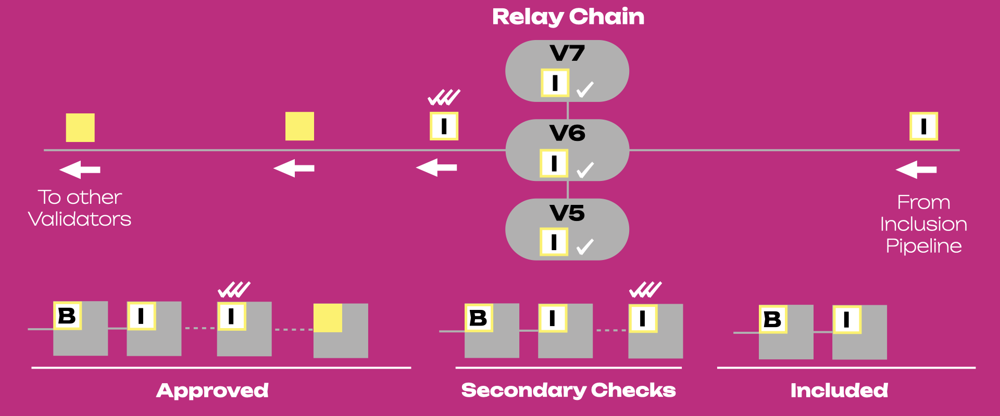
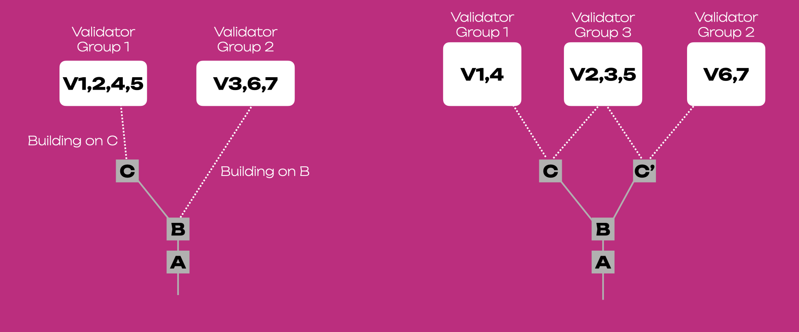

:::info

This page is a summary of the
[Protocol Overview chapter in **The Polkadot Parachain Host Implementer's Guide**](https://paritytech.github.io/polkadot/book/protocol-overview.html)
and the
[Availability and Validity (AnV) chapter in **The Polkadot Protocol Specification**](https://spec.polkadot.network/#chapter-anv).

:::

The Parachains' Protocol aims to carry a parachain's candidate block from authoring to inclusion
through a process that can be carried out repeatedly and in parallel for each parachain connected to
the Relay Chain.

:::note Candidate block

A candidate block is a new block from a parachain collator that may or may not be valid and must go
through validity checks before being included into the Relay Chain.

:::

The Availability and Validity (AnV) Protocol allows the network to be efficiently sharded among
parachains while maintaining strong security guarantees.

We will explain in-depth how the two protocols are interconnected in the following sections.

## Main Actors

### [Validators](../learn/learn-validator.md)

They are responsible for validating the proposed parachain's blocks by checking the
**Proof-of-Validity** (PoV) of the blocks and ensuring the PoV remains available for a designated
period. They have "skin in the game", meaning they have funds bonded on-chain that can be partially
or fully confiscated by the network in case of misbehavior.

### [Collators](../learn/learn-collator.md)

They create the PoV that validators know how to check. Creating PoV requires familiarity with
transaction format and block authoring rules of a specific parachain, as well as having access to
its full state.

### Fishermen: Deprecated

The idea of Fishermen is that they are full nodes of parachains, like collators, but perform a
different role in relation to the {{ polkadot: Polkadot :polkadot }}{{ kusama: Kusama :kusama }}
network. Instead of packaging the state transitions and producing the next parachain blocks as
collators do, fishermen will watch this process and ensure no invalid state transitions are
included.

**Fishermen are not available on Polkadot or Kusama and are not planned for formal implementation,
despite previous proposals in the
[AnV protocol](https://w3f-research.readthedocs.io/en/latest/polkadot/Availability_and_Validity.html).**

To address the motivation behind the Fishermen design consideration, the current secondary backing
checkers perform a similar role in relation to the
{{ polkadot: Polkadot :polkadot }}{{ kusama: Kusama :kusama }} network. From a security standpoint,
security is based on having at least one honest validator either among parachain validators or
secondary checker.

## Protocols' Summary

### Parachain Protocol

The parachain protocol is divided into three main phases:

1. Collators send the parachain block (parablock) with PoV to the set of Validators assigned to the
   parachain (i.e. para-validators).
2. Validators verify if the parablock follows the state transition rules of the parachain and sign
   statements that can have a positive or negative outcome.
3. With enough positive statements, the block is added to the Relay Chain.

The figure below shows a representation of a parachain with collators and validators. The figure
also shows the journey of a block (white square) through the three main steps of the parachain
protocol, as well as the sections where the [**Inclusion Pipeline**](#inclusion-pipeline) and the
[**Approval Process**](#approval-process) take place (see following Sections).

### AnV Protocol

The AnV Protocol is divided into five different phases, three within the
[Inclusion Pipeline](#inclusion-pipeline) and two within the [Approval Process](#approval-process):

- **Inclusion Pipeline**
  1.  [Parachain phase](#parachain-phase)
  2.  [Relay Chain submission phase](#relay-chain-submission-phase)
  3.  [Availability and unavailability phase](#availability-and-unavailability-phase)
- **Approval Process**
  1.  Secondary GRANDPA approval validity checks.
  2.  Invocation of a Byzantine Fault Tolerant (BFT) _finality gadget_ to cement the chain.

The two protocols are thus tightly connected: phases of the AnV protocol are essentially
sub-sections of the Parachain Protocol.

## Inclusion Pipeline

### Overview

The inclusion pipeline of the Parachain Protocol is the path of a parachain block (or parablock)
from its creation to its inclusion into the Relay Chain. This pipeline includes Phases 1-3 of the
AnV Protocol.

The figure above shows the path of a candidate block through the Inclusion pipeline. The block
changes its status through this path as follows:

- Candidate: A block together with its PoV is put forward by a collator to a para-validator (in this
  case V1). The candidate block is shown as white square with one white tick mark at the side (PoV
  from the collator). Note the candidate is not valid yet and can still fail to be included in the
  Relay Chain.
- Seconded: The block is put forward by the para-validator V1 to other para-validators (in this case
  V2 and V3). The seconded block is shown as white square with a white tick mark and two yellow tick
  marks on top of it. The yellow marks show the PoV from the para-validators.
- Backable: The block validity is attested by a majority of the para-validators. The backable block
  is shown as white square with a white tick mark and three yellow tick marks on top of it. The
  yellow marks show the PoV from the para-validators, while the white mark the PoV from the
  collator.
- Backed: The block is backed and noted in a fork on the Relay Chain by a relay chain block author
  (in this case V4). The backed block is shown as square with white background and yellow border.
  The backed block can still fail to be included in the Relay Chain. Note that for simplicity here
  the backed parachain block is represented as a block of the Relay Chain, but in reality a relay
  chain block contains many parachian blocks.
- Pending availability: The block is backed but not considered available yet.
- Included: The block is backed and considered available (we have a parablock). Parablocks are shown
  as square with white background and yellow border enclosing a "P".

### Parachain Phase

The parachain phase of AnV Protocol is when a para-validator established connection with a collator,
which proposes a candidate block together with its Proof.of-Validity (PoV) to that para-validator.

A para-validator needs to check if the candidate block follows the
[state transition](../learn/learn-parachains.md#state-transitions) rules of the parachain. Because
states are stored within Merke trees, a para-validator can verify state transitions without having
access to the entire state, but it need:

- The block candidate (list of state transitions)
- The values in the parachain's database that the block modifies
- The hashes of the unaffected points in the Merke tree

This set of information is the proof-of-validity (PoV).

:::info Polkadot guarantees valid state transitions, not valid states

{{ polkadot: Polkadot :polkadot }}{{ kusama: Kusama :kusama }} validators do not inspect every value
in a parachain's state, only those that are modified. This insures that the modification is valid.

:::

Once a para-validator has the PoV, it gossips this information to the other para-validators.
Para-validator check the candidate block against the PoV. The verification succeeds when more than
half of the para-validators agrees that the block represents a valid state transition. The
para-validators can then start to construct the **candidate receipt** (this is what goes into the
Relay Chain block) and an **erasure coding** that will be sent to all validators in the network.
However, if the verification fails, the para-validators immediately reject the candidate block as
invalid.

:::info The Parachain Phase is made up by four phases of the Inclusion Pipeline

1. Validators are assigned to parachains by the **Validator Assignment** routine.
2. A collator produces the parachain block (known as parachain candidate or candidate) along with
   PoV.
3. The collator forwards the candidate and PoV to validators assigned to the same parachain via the
   **Collator Distribution** subsystem.
4. The validators assigned to the parachain participate in the **Candidate Backing** subsystem.
   Candidates that gather enough signed validity statements are considered **"backable"** and their
   backing is the set of signed statements.

:::

### Relay Chain Submission Phase

The backable block is sent to the Relay Chain. The relay chain validators then check the candidate
block against the PoV. If the verification succeeds, then the validators will pass the candidate
block to the other validators in the gossip network. However, if the verification fails, the
validators immediately reject the candidate block as invalid.

Validators need to determine their assignments for each parachain and issue approvals for valid
candidates, respectively disputes for invalid candidates. Since it cannot be expected that each
validator verifies every single parachain candidate, this mechanism ensures that enough honest
validators are selected to verify parachain candidates in order prevent the finalization of invalid
blocks. If an honest validator detects an invalid block which was approved by one or more
validators, the honest validator must issue a disputes which wil cause escalations, resulting in
consequences for all malicious parties.

When more than half of the parachain validators agree that a particular parachain block candidate is
a valid state transition, they prepare a _candidate receipt_. The candidate receipt is what will
eventually be included into the Relay Chain state. It includes:

- The parachain ID.
- The collator's ID and signature.
- A hash of the parent block's candidate receipt.
- A Merkle root of the block's erasure-coded pieces.
- A Merkle root of any outgoing messages.
- A hash of the block.
- The state root of the parachain before block execution.
- The state root of the parachain after block execution.

This information is **constant size** while the actual PoV block of the parachain can be variable
length. It is enough information for anyone that obtains the full PoV block to verify the state
transition contained inside of it.

:::info The Relay Chain Submission Phase is made up by two phases of the Inclusion Pipeline

1. A relay chain block author (selected by [BABE](./learn-consensus.md#block-production-babe)) can
   note up to 1 backable candidate for each parachain to be included in the Relay Chain block
   alongside its backing. Once included in the Relay Chain the candidate is considered backable in
   that fork of the Relay Chain.
2. Once backable in the Relay Chain, the candidate is considered to be in "pending availability"
   status. It can only be considered a part of the parachain once it is **proven available**.

:::

### Availability and Unavailability Phase

During the availability and unavailability phases, the validators gossip the
[erasure coded](#erasure-codes) pieces among the network. At least 1/3 + 1 validators must report
that they possess their piece of the code word. Once this threshold of validators has been reached,
the network can consider the PoV block of the parachain _available_.

The Relay Chain Availability and Unavailability Phase is made up by two phases of the Inclusion
Pipeline:

1. In the following relay chain blocks, the validators will participate in the **Availability
   Distribution** subsystem to ensure availability of the candidate. The subsequent relay chain
   blocks will note information regarding the candidate's availability.
2. Once the relay chain state machine has enough information to consider the candidate's PoV as
   being available, the candidate is considered part of the parachain and is graduated to being a
   full parachain block.

Once the parablock is considered available and part of the parachain, it is still "pending
approval". The Inclusion Pipeline must conclude for a specific parachain before a new block can be
accepted on that parachain. After inclusion, the Approval Process starts, and it can run for many
parachain blocks at once.

The candidate can fail to be included in the parachain in any of the following ways:

- The collator is not able to propagate the block to any of the assigned validators.
- The candidate is not backed by validators participating to the Candidate Backing subsystem.
- The candidate is not selected by a relay chain block author.
- The candidate's PoV is not considered available within a timeout, and it is discarded from the
  Relay Chain.

Signed negative statements will lead to a dispute, and if there are false negatives, whoever will be
on the wrong side (once the dispute is resolved) will be slashed. False positives can also happen;
those actors responsible for it will also be slashed. To detect false positives, PoV information
must be available after the block has been added to the Relay Chain so that validators can check the
work. PoVs are typically between 1 MB and 10 MB in size and are not included in the Relay Chain
blocks. However, as a part of the data availability scheme, they are made available on the network
for a certain period so that the validators can perform the required checks.

## Approval Process

Once the parablock is considered available and part of the parachain, is still "pending approval".
At this stage the parablock is tentatively included in the parachain, although more confirmation is
necessary. In fact, the validators assigned to the parachain (i.e. the parachain validators) are
sampled from a validator set which is assumed to be 1/3 dishonest in the worst-case scenario. In
this case, it is likely that the majority of the random para-validators sampled for a specific
parachain are dishonest and can back a candidate wrongly. To address this, the **Approval Process**
allows detecting misbehavior after-the-fact without allocating more para-validators, which would
ultimately reduce the system's throughput. As a parablock can accept children blocks after being
considered available, failure to pass the approval process will invalidate the parablock as well as
its descendants (children blocks). Only the validators who backed the block in question will be
slashed, not those who backed the descendants.

The approval pipeline can be divided into the following steps:

1. Parablocks that have been included by the Inclusion Pipeline are pending approval for a time
   window known as the **secondary checking window**.
2. During the secondary checking window, validators (secondary checkers) randomly self-select to
   perform secondary checks on each of the parablock.
3. Secondary checkers acquire the parablock with PoV and re-run the validation function.
4. Secondary checkers gossip the results of their checks. Contradictory results lead to escalation
   in which all validators are required to check the block. The validators on the losing side will
   be slashed.
5. At the end of the process the parablock is either approved or rejected.

The figure below shows the path of a parachain block when it exits the Inclusion Pipeline and it
enters the Approval Process. The parablock becomes accepted when it is backed, available and
**undisputed**. Thr parablock is checked a second time by a subset of validators (V5, V6 and V7),
and if there are no contradictory results the block is approved and gossiped to other relay chain
validators. Note the parablock after secondary checks is shown as a square with white background a
yellow border enclosing a "P", and three white ticks (one for each secondary check). Approved
para-blocks are shown as yellow squares that become grey in color.

:::info

More information can be found in the dedicated sections about the
[approval process](https://paritytech.github.io/polkadot/book/protocol-approval.html) and
[disputes](https://paritytech.github.io/polkadot/book/protocol-disputes.html).

:::

## Network Asynchrony

We have mentioned how a relay chain block author must select the candidate and note it on the Relay
Chain (we say the block is backed). The relay chain block author is selected by
[BABE](./learn-consensus.md#block-production-babe), which is a forkful algorithm. This means that
different block authors are chosen at the same time and they may not work on the same block parent
(i.e. the representations in the previous figures are simplistic). Also, the sets of validators and
parachains are not fixed, and the validators' assignments to parachains is also flexible.

We say that the network is **asynchronous** since there will be validators who have received a
block, and other validators who did not. Thus, the network is variable and it exists in multiple
states. In the figure below (_left_) the Group 1 received block C while Group 2 did not due to
network asynchrony. Validators in Group 2 can build another block on top of B, called C'. Assume
that afterwards, some validators become aware of both C and C' while others remain aware of one of
them (_right_). Validators in Group 3 must be aware of the network state in each head (C and C') and
they may contribute to some or full extent on both. It is possible that due to network asynchrony
two forks may grow in parallel for some time, but eventually one fork will be chosen by the finality
gadget. In the absence of an adversarial network it is unlikely that two forks will coexist for some
time as there will be validators aware of both chain heads.

## Erasure Codes

Erasure coding transforms a message into a longer _code_ that allows for the original message to be
recovered from a subset of the code and in absence of some portion of the code. A code is the
original message padded with some extra data that enables the reconstruction of the code in the case
of erasures.

The type of erasure codes used by {{ polkadot: Polkadot :polkadot }}{{ kusama: Kusama :kusama }}'s
availability scheme are
[Reed-Solomon](https://en.wikipedia.org/wiki/Reed%E2%80%93Solomon_error_correction) codes, which
already enjoys a battle-tested application in technology outside the blockchain industry. One
example is found in the compact disk industry. CDs use Reed-Solomon codes to correct any missing
data due to inconsistencies on the disk face such as dust particles or scratches.

In {{ polkadot: Polkadot :polkadot }}{{ kusama: Kusama :kusama }}, the erasure codes are used to
keep parachain state available to the system without requiring all validators to keep tabs on all
the parachains. Instead, validators share smaller pieces of the data and can later reconstruct the
entire data under the assumption that 1/3+1 of the validators can provide their pieces of the data.

:::note

The 1/3+1 threshold of validators that must be responsive in order to construct the full parachain
state data corresponds to {{ polkadot: Polkadot :polkadot }}{{ kusama: Kusama :kusama }}'s security
assumption in regard to Byzantine nodes.

:::

## Further Resources

- [Path of a Parachain Block](https://polkadot.network/the-path-of-a-parachain-block/) - Article by
  Parity analyst Joe Petrowski expounding on the validity checks that a parachain block must pass in
  order to progress the parachain.
- [Availability and Validity](https://github.com/w3f/research/tree/85cd4adfccb7d435f21cd9fd249cd1b7f5167537/docs/papers/AnV) -
  Paper by the W3F Research Team that specifies the availability and validity protocol in detail.
