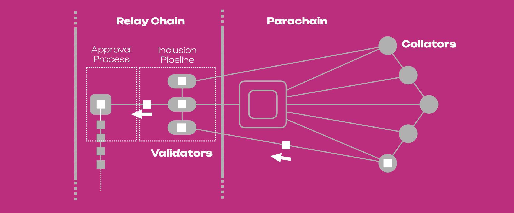

:::info

This page is a summary of the [Protocol Overview chapter in **The Polkadot Parachain Host Implementer's Guide**](https://paritytech.github.io/polkadot/book/protocol-overview.html)

:::

The aim of the protocol is to carry a parachain's block from authoring to inclusion through a process that can be carried out repeatedly and in parallel for each parachain connected to the relay chain.

## Main Actors

### Validators

They are responsible for validating proposed parachain's blocks by checking the **Proof-of-Validity** (PoV) of the blocks and ensuring the PoV remains available. They have "skin in the game", meaning they have funds bonded on-chain that can be partially or fully confiscated in case of misbehavior.

### Collators

They create the PoV that validators know how to check. Creating PoV requires familiarity with transaction format and block authoring rules of a specific parachain, as well as having access to its full state.

### Fishermen

They catch misbehaving validators in exchange for a bounty. Collators and validators can behave as fishermen.

## Summary View

The parachains' protocol can be summarized into three main steps:

1. Collators send to validators parachain blocks with their PoV for check.
2. Validators validate the block using the PoV, signing statements that can have positive or negative.
3. With enough positive statements the block can be added to the relay chain.

The figure below shows a representation of a parachain with collators and validators. The figure also shows the journey of a block through the three main steps, as well as the sections where the [Inclusion Pipeline](#inclusion-pipeline) and the [Approval Process](#approval-process) take place (see next Sections).

Negative statements will lead to a dispute, and if there are false negatives whoever will be on the wrong side (once the dispute is resolved) will be slashed. False positives can also happen, those actors responsible for it will also be slashed and whoever reported the case will get a bounty. In order to detect false positives, PoV information must be available after the block has been added to the relay chain so that validators can check the work. PoVs are expected to be between 1 MB and 10 MB; as a consequence they are not included in blocks but they are part of the data availability scheme in which validators must prove that the inputs to their work will remain available.

## Inclusion Pipeline

The inclusion pipeline is the path of a parachain block (or parablock) from its creation ot its inclusion into the relay chain. Here below there are the checkpoints of that path.

1. Validators are assigned to parachains by the **Validator Assignment** routine.
2. A collator produces the parachain block (known as parachain candidate, or candidate) along with PoV.
3. The collator forwards the candidate and PoV to validators assigned to the same parachain via the **Collator Distribution** subsystem.
4. The validators assigned to the parachain participate to the **Candidate Backing** subsystem. Candidates that gather enough signed validity statement are considered **"backable"** and their backing is the set of signed statements.
5. A relay chain block author (selected by [BABE][]) can note up to 1 backable candidate for each parachain to be included in the relay chain block alongside its backing. Once included in the relay chain the candidate is considered backable in the fork of the relay chain.
6. Once backable in the relay chain, the candidate is considered to be "pending availability", i.e. it is not considered to be part of the parachain until it is **proven available**.
7. In the following relay chain blocks, the validators will participate to the **Availability Distribution** subsystem to ensure availability of the candidate. That is, information regarding the availability of the candidate will be noted in the subsequent relay chain blocks.
8. Once the relay chain state machine has enough information to consider the candidate's PoV as being available, the candidate is considered to be part of the parachain and is graduated to being a full parachain block.

The figure above shows the path of a candidate block through the Inclusion pipeline. The block changes its status through this path as follows:

- Candidate: A block is put forward by a collator to a validator (in this case V1).
- Seconded: The block is put forward by V1 to other validators (in this case V2 and V3).
- Backable: The block validity is attested by a majority of the validators.
- Backed: The block is backed and noted in a fork on the relay chain by a relay chain block author (in this case V4).
- Pending availability: The block is backed but not considered available yet.
- Included: The block is backed and considered available (we have a parablock).

Once the parablock is considered available and part of the parachain, it is still "pending approval". The Inclusion Pipeline must conclude for a specific parachain before a new block can be accepted on that parachain. After inclusion, the Approval Process starts, and it can run for many parachain blocks at once.

The candidate can fail to be included in the parachain in any of the following ways:
- The collator is not able to propagate the block to any of the assigned validators.
- The candidate is not backed by validators participating to the Candidate Backing subsystem.
- The candidate is not selected by a relay chain block author.
- The candidate's PoV is not considered available within a timeout, and it is discarded frm the relay chain.

## Approval Process

Once the parablock is considered available and part of the parachain, is still "pending approval". At this stage the parablock is tentatively included in the parachain, although more confirmation is necessary. In fact, the validators in the parachain (i.e. the parachain validators) are sampled from a validator set which is assumed to be 1/3 dishonest. This means that there is a chance to randomly sample parachain validators for a parachain that are majority or fully dishonest and can back a candidate wrongly. The **Approval Process** allows to detect misbehavior after-the-fact without allocating more validators that would ultimately reduce the throughput of the system. Because after being considered available a parablock will accept children blocks, failure to pass the approval process will invalidate the parablock and its descendants. Only the validators who backed the block in question will be slashed, not the validators who backed the descendants.

The approval pipeline can be divided into the following steps:
1. Parablocks that have been included by the Inclusion Pipeline are pending approval for a time window known as the **secondary checking window**.
2. During the secondary checking window, validators (secondary checkers) randomly self-select to perform secondary checks on the parablock.
3. Secondary checkers acquire the parablock with PoV and re-run the validation function.
4. Secondary checkers gossip the results of their checks. Contradictory results lead to escalation in which all validators are required to check the block. The validators on the losing side will be slashed.
5. At the end of the process the parablock is either approved or rejected.

The figure below shows the path of a parachain block when it exits the Inclusion Pipeline and it enters the Approval Process. The parablock becomes accepted when it is backed, available and **undisputed**. Thr parablock is checked a second time by a subset of validators (V5, V6 and V7), and if there are no contradictory results the block is approved and gossiped to other relay chain validators.

:::info

More information can be found in the dedicated sections about the [approval process](https://paritytech.github.io/polkadot/book/protocol-approval.html) and [disputes](https://paritytech.github.io/polkadot/book/protocol-disputes.html). 

:::

## Network Asynchrony

We have mentioned how a relay chain block author must select the candidate and note it on the relay chain (we say the block is backed). The relay chain block author is selected by BABE, which is a forkful algorithm. This means that different block authors are chosen at the same time and they may not work on the same block parent (i.e. the representations in the previous figures are simplistic). Also, the sets of validators and parachains are not fixed, and the validators' assignments to parachains is also flexible. 

We say that the network is **asynchronous** since there will be validators who gave received a block, and other validators who did not. Thus, the network is variable and it exists in multiple states. In the figure below (*left*) the Group 1 received block C while Group 2 did not due to network asynchrony. Validators in Group 2 can build another block on top of B, called C'. Assume that afterwards, some validators become aware of both C and C' while others remain aware of one of them (*right*). Validators in Group 3 must be aware of the network state in each head (C and C') and they may contribute to some or full extent on both. It is possible that due to network asynchrony two forks may grow in parallel for some time.

[BABE]: ./learn-consensus.md#block-production-babe