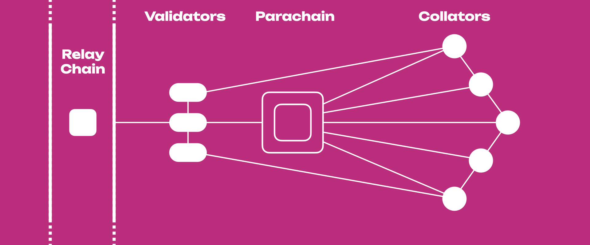

:::info Testing on Rococo

For information on how to participate in the crowdloan and parachain auction testing on Rococo,
please see the
{{ polkadot: [Rococo Content](../build/build-parachains.md##testing-a-parachains:-rococo-testnet) :polkadot }}
{{ kusama: [Rococo Content](../build/build-parachains.md##testing-a-parachains:-rococo-testnet) :kusama }}
on the parachain development guide.

:::

## Definition of a Parachain

A parachain is an application-specific data structure that is globally coherent and can be validated
by the validators of the Relay Chain. They take their name from the concept of parallelized chains
that run parallel to the Relay Chain. Most commonly, a parachain will take the form of a blockchain,
but there is no specific need for them to be actual blockchains.

Due to their parallel nature, they are able to parallelize transaction processing and achieve
scalability of the {{ polkadot: Polkadot :polkadot }}{{ kusama: Kusama :kusama }} system. They
[inherit the security](#shared-security) of the entire network and can communicate with other
parachains through the [XCM](learn-xcm.md) format.

Parachains are maintained by a network maintainer known as a [collator](learn-collator.md). The role
of the collator node is to maintain a full node of the parachain, retain all necessary information
of the parachain, and produce new block candidates to pass to the Relay Chain validators for
verification and inclusion in the shared state of
{{ polkadot: Polkadot :polkadot. }}{{ kusama: Kusama. :kusama }} The incentivization of a collator
node is an implementation detail of the parachain. They are not required to be staked on the Relay
Chain or own the native token unless stipulated by the parachain implementation.

The {{ polkadot: Polkadot :polkadot }}{{ kusama: Kusama :kusama }} Host requires that the state
transitions performed on parachains be specified as a [Wasm](learn-wasm.md) executable. Proofs of
new state transitions that occur on a parachain must be validated against the registered state
transition function (STF) that is stored on the Relay Chain by the validators before
{{ polkadot: Polkadot :polkadot }}{{ kusama: Kusama :kusama }} acknowledges a state transition has
occurred on a parachain. The key constraint regarding the logic of a parachain is that it must be
verifiable by the Relay Chain validators. Verification most commonly takes the form of a bundled
proof of a state transition known as a Proof-of-Verification (PoV) block, which is submitted to the
validators from one or more of the parachain collators to be checked.

## Why Parachains?

Parachains are a solution to two fundamental problems in blockchains:

- **Scalability**: Having one blockchain for many purposes makes it difficult to scale as future
  implementations and upgrades will likely advantage some purposes and disadvantage others. On the
  other hand, having different blockchains will allow them to implement features themselves without
  affecting other chains.
- **Flexibility**: It is reasonable to state a blockchain either will be really good in solving one
  problem or not so good trying to solve many problems. A blockchain able to specialize in solving a
  specific problem has more leverage towards itself and its users. Parachains are purpose-built
  blockchains highly specialized and able to take advantage from each other by cooperation.

### Shared Security

Shared security, sometimes referred in documentation as _pooled security_, is one of the unique
value propositions for chains considering to become a [parachain](learn-parachains.md) and join the
{{ polkadot: Polkadot :polkadot }}{{ kusama: Kusama :kusama }} network. On a high level, shared
security means that all parachains that are connected to the
{{ polkadot: Polkadot :polkadot }}{{ kusama: Kusama :kusama }} Relay Chain by leasing a parachain
slot will benefit from the economic security provided by the Relay Chain
[validators](learn-validator.md).

The notion of shared security is different from inter-chain protocols that build on an architecture
of bridges. For bridge protocols, each chain is considered sovereign and must maintain its own
validator set and economic security. One concern in these protocols is on the point of scalability
of security. For example, one suggestion to scale blockchains is that of _scale by altcoins,_ which
suggests that transaction volumes will filter down to lower market cap altcoins as the bigger ones
fill their blocks. A major flaw in this idea is that the lower market cap coins will have less
economic security attached, and be easier to attack. A real life example of a 51% attack occurred
recently (
[Ethereum Classic attack on January 10, 2019](https://cointelegraph.com/news/ethereum-classic-51-attack-the-reality-of-proof-of-work)
), in which an unknown attacker double spent 219_500 ETC (~1.1 million USD). This was followed by
two more 51% attacks on ETC.

{{ polkadot: Polkadot :polkadot }}{{ kusama: Kusama :kusama }} overcomes security scalability
concerns since it gravitates all the economic incentives to the Relay Chain and allows the
parachains to tap into stronger guarantees at genesis. Sovereign chains must expend much more effort
to grow the value of their coin so that it is sufficiently secure against well-funded attackers.

### PoW vs Parachain Model

Let's compare the standard sovereign security model that exists on current proof-of-work (PoW)
chains to that of the shared security of
{{ polkadot: Polkadot. :polkadot }}{{ kusama: Kusama. :kusama }} Chains that are secured by their
own security model like Bitcoin, Zcash, and their derivatives all must bootstrap their own
independent network of miners and maintain a competitive portion of honest hashing power. Since
mining is becoming a larger industry that increasingly centralizes on key players, it is becoming
more real that a single actor may control enough hash power to attack a chain.

This means that smaller chains that cannot maintain a secure amount of hash power on their networks
could potentially be attacked by a large mining cartel at the simple whim of redirecting its hash
power away from Bitcoin and toward a new and less secure chain.
[51% attacks are viable today](https://www.crypto51.app) with attacks having been reported on
Ethereum Classic (see above),
[Verge](https://coincentral.com/verge-suffers-51-attack-hard-forks-in-response/),
[Bitcoin Gold](https://bitcoingold.org/responding-to-attacks/), and other cryptocurrencies.

On {{ polkadot: Polkadot :polkadot }}{{ kusama: Kusama :kusama }}, this disparity between chain
security will not be present. When a parachain connects to
{{ polkadot: Polkadot :polkadot }}{{ kusama: Kusama :kusama }}, the relay chain validators become
the securers of that parachain's state transitions. The parachain will only have the overhead of
needing to run a few collator nodes to keep the validators informed with the latest state
transitions and proofs/witness. Validators will then check these for the parachains to which they
are assigned. In this way, new parachains instantly benefit from the overall security of
{{ polkadot: Polkadot :polkadot }}{{ kusama: Kusama :kusama }} even if they have just been launched.

## Parachain Economies

Parachains may have their own economies with their own native tokens. Schemes such as Proof-of-Stake
are usually used to select the validator set to handle validation and finalization; parachains will
not be required to do either of those things. However, since
{{ polkadot: Polkadot :polkadot }}{{ kusama: Kusama :kusama }} is not overly particular about what
the parachain can implement, it may be the choice of the parachain to implement a staking token, but
it's not generally necessary.

Collators may be incentivized through inflation of a native parachain token. There may be other ways
to incentivize the collator nodes that do not involve inflating the native parachain token.

Transaction fees in a native parachain token can also be an implementation choice of parachains.
{{ polkadot: Polkadot :polkadot }}{{ kusama: Kusama :kusama }} makes no hard and fast rules for how
the parachains decide on original validity of transactions. For example, a parachain may be
implemented so that transactions must pay a minimum fee to collators to be valid. The Relay Chain
will enforce this validity. Similarly, a parachain could not include that in their implementation,
and {{ polkadot: Polkadot :polkadot }}{{ kusama: Kusama :kusama }} would still enforce its validity.

Parachains are not required to have their own token. If they do, it is up to the parachain to make
the economic case for their token, not
{{ polkadot: Polkadot :polkadot }}{{ kusama: Kusama :kusama }}.

## Parachain Hubs

While {{ polkadot: Polkadot :polkadot }}{{ kusama: Kusama :kusama }} enables crosschain
functionality amongst the parachains, it necessitates that there is some latency between the
dispatch of a message from one parachain until the destination parachain receives the message. In
the optimistic scenario, the latency for this message should be at least two blocks - one block for
the message to be dispatched and one block for the receiving parachain to process and produce a
block that acts upon the message. However, in some cases, we may see that the latency for messages
is higher if many messages are in queue to be processed or if no nodes are running both of the
parachain networks that can quickly gossip the message across the networks.

Due to the necessary latency involved in sending crosschain messages, some parachains plan to become
_hubs_ for an entire industry. For example, a parachain project [Acala](https://acala.network) is
planning to become a hub for decentralized finance (DeFi) applications. Many DeFi applications take
advantage of a property known as _composability_ which means that functions of one application can
be synergistically composed with others to create new applications. One example of this includes
flash loans, which borrow funds to execute some on-chain logic as long as the loan is repaid at the
end of the transaction.

An issue with crosschain latency means that composability property weakens among parachains compared
to a single blockchain. **This implication is common to all sharded blockchain designs, including
Polkadot, Eth2.0, and others.** The solution to this is the introduction of parachain hubs, which
maintain the stronger property of single block composability.

## Parachain Slot Acquisition

{{ polkadot: Polkadot :polkadot }}{{ kusama: Kusama :kusama }} supports a limited number of
parachains, currently estimated to be about 100. As the number of slots is limited, there are
several ways to allocate them:

- Governance granted parachains, or "common good" parachains
- Auction granted parachains
- Parathreads

["Common Good" parachains](#common-good-parachains) are allocated by
{{ polkadot: Polkadot :polkadot }}{{ kusama: Kusama :kusama }}'s on-chain
[governance](learn-governance.md) system, and are deemed as a "common good" for the network, such as
bridges to other networks or chains. They are usually considered system-level chains or public
utility chains. These typically do not have an economic model and help remove transactions from the
Relay Chain, allowing for more efficient parachain processing.

[Auction granted parachains](learn-auction.md) are granted in a permissionless auction. Parachain
teams can either bid with their own {{ polkadot: DOT :polkadot }}{{ kusama: KSM :kusama }} tokens,
or source them from the community using the [crowdloan functionality](learn-crowdloans.md).

[Parathreads](learn-parathreads.md) have the same API as parachains, but are scheduled for execution
on a pay-as-you-go basis with an auction for each block.

### Parachain Lease Expiration

When a parachain wins an auction, the tokens that it bids get reserved until the lease's end.
Reserved balances are non-transferrable and cannot be used for staking. At the end of the lease, the
tokens are unreserved. Parachains that have not secured a new lease to extend their slot will
automatically become parathreads.

## Common Good Parachains

"Common Good" parachains are parachain slots reserved for functionality that benefits the ecosystem
as a whole. By allocating a subset of parachain slots to common good chains, the entire network can
realize the benefit of valuable parachains that would otherwise be underfunded due to the free-rider
problem. They are not allocated via the parachain auction process but by the on-chain
[governance](learn-governance.md) system. Generally, a common good parachain's lease would not
expire; it would only be removed via governance.

See the
[Polkadot blog article](https://polkadot.network/common-good-parachains-an-introduction-to-governance-allocated-parachain-slots/)
and the [common good parachains](learn-common-good-chains.md) page for more information.

## Parachains' Use Cases

Note that we still have to see the true potential of parachains and what it is listed below are just
a few examples.

- **Encrypted Consortium Chains**: These are possibly private chains that do not leak any
  information to the public, but still can be interacted with trustlessly due to the nature of the
  XCMP protocol.
- **High-Frequency Chains**: These are chains that can compute many transactions in a short amount
  of time by taking certain trade-offs or making optimizations.
- **Privacy Chains**: These are chains that do not leak any information to the public through use of
  novel cryptography.
- **Smart Contract Chains**: These are chains that can have additional logic implemented on them
  through the deployment of code known as _smart contracts_.

## Parachain Host

{{ polkadot: Polkadot :polkadot }}{{ kusama: Kusama :kusama }} includes a blockchain called a relay
chain. A blockchain is a
[Directed Acyclic Graph](https://en.wikipedia.org/wiki/Directed_acyclic_graph) (DAG) of state
transitions, where every added block can be viewed as the head of the chain or fork with cumulative
state. All paths through the DAG terminate at the Genesis Block. A blockchain is a tree as each
block can have only one parent.

A blockchain network is made of nodes that have a view of many forks of the chain, and must decide
which fork to follow. To construct the parachain host we need to answer two categories of questions
addressed by two different components:

- What is the state transition function of the blockchain? This is handled by the **Runtime**, which
  defines the state transition logic of the chain. The Runtime logic is divided into:

  - **Modules** encapsulate particular behavior of the system and consist of:
    - Storage
    - Routines are invoked by entry points, other modules, upon block initialization or closing.
      Routines can alter the storage of a module.
    - The entry point defines the means by which new information is introduced to a module and can
      limit the origin from which they are called (user, root, parachain).
  - **API** provides means for the node-side behavior to extract meaningful information from the
    state of a single fork.

  :::info

  The Polkadot Parachain Host Implementers' Guide provides details about
  [Runtime Architecture](https://paritytech.github.io/polkadot/book/runtime/index.html) and
  [Runtime API](https://paritytech.github.io/polkadot/book/runtime-api/index.html).

  :::

- Being aware of various forks of the blockchain, what behaviors should a node take? What
  information should a node extract from the state of which forks, and how should that information
  be used? This is handled by the **Node-side behavior**, which defines all activities that a node
  undertakes given its view of the blockchain. The node-side behavior can be divided into two
  categories:

  - **Networking behaviors**, these relate to how information is distributed between nodes, but not
    how the information is used afterwards.
  - **Core behaviors**, these relate to internal work that a specific node does. Such behavior cares
    about that information is _distributed_ and _received_, but not how these two are achieved.

  These two categories often interact but they can be heavily abstracted from each other. The
  node-side behavior is split into various **subsystems**, which perform a particular category of
  work. Subsystems can communicate with each other through an
  [Overseer](https://paritytech.github.io/polkadot/book/node/overseer.html) that prevents race
  conditions.

  :::info

  The Polkadot Parachain Host Implementers' Guide provides details about
  [node architecture](https://paritytech.github.io/polkadot/book/node/index.html) the main
  subsystems:

  - [Collator subsystem](https://paritytech.github.io/polkadot/book/node/collators/index.html)
  - [Backing subsystem](https://paritytech.github.io/polkadot/book/node/backing/index.html)
  - [Availability subsystem](https://paritytech.github.io/polkadot/book/node/availability/index.html)
  - [Approval subsystem](https://paritytech.github.io/polkadot/book/node/approval/index.html)
  - [Dispute subsystem](https://paritytech.github.io/polkadot/book/node/disputes/index.html)
  - [Utility subsystem](https://paritytech.github.io/polkadot/book/node/utility/index.html)

  :::

The Runtime and Node-side behavior are dependent from each other. The Runtime depends on Node-side
behavior to author blocks, and to include [extrinsics](./learn-extrinsics.md) which trigger the
correct entry points. The Node-side behavior relies on the Runtime APIs to extract information
necessary to determine which action to take.

## Resources

- [Polkadot: The Parachain](https://medium.com/polkadot-network/polkadot-the-parachain-3808040a769a) -
  Blog post by Polkadot co-founder Rob Habermeier who introduced parachains in 2017 as "a simpler
  form of blockchain, which attaches to the security provided by a Relay Chain rather than providing
  its own. The Relay Chain provides security to attached parachains, but also provides a guarantee
  of secure message-passing between them."
- [The Path of a Parachain Block](https://polkadot.network/the-path-of-a-parachain-block/) - A
  technical walk-through of how parachains interact with the Relay Chain.
