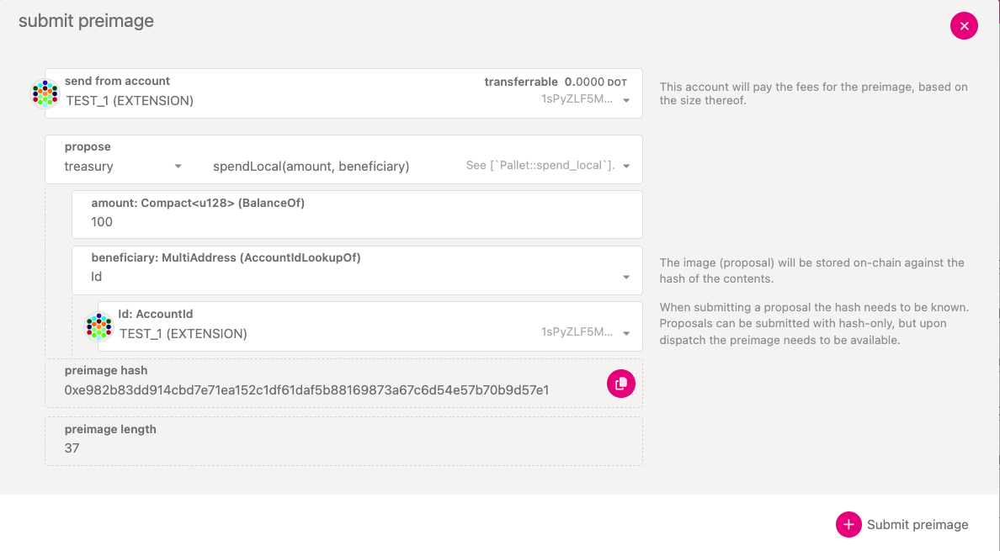

import RPC from "./../../components/RPC-Connection";

The Treasury is a pot of funds collected through a portion of block production rewards, transaction
fees, slashing, and [staking inefficiencies](learn-staking.md#inflation).

Treasury funds are held in a [system account](./learn-account-advanced.md#system-accounts) that
cannot be controlled by any external account; only the system internal logic can access it.

## Treasury Inflow and Outflow

Tokens that are deposited into the Treasury (i.e. the inflow) is determined by the following
mechanisms:

- **Transaction fees:** 80% of the transaction fees of every submitted extrinsic is diverted to the
  Treasury, while 20% is given to the block producers.
- **Staking inefficiencies:** the network knows an exogenously determined parameter called ideal
  staking rate. The APY for stakers (nominators & validators) decreases whenever the actual staking
  rate is not equal to the ideal staking rate. To keep inflation constant at 10%, the system does
  not creates less tokens, rather some share of the overall reward for stakers is diverted to the
  Treasury (more information
  [here](https://research.web3.foundation/Polkadot/overview/token-economics)).
- **Slashes:** whenever validators and nominators are slashed, a share of the slashed tokens are
  diverted to Treasury. They are typically rare and unpredictable events.
- **Transfers:** everyone can send funds to the Treasury directly. This is a rare event and
  typically due to grantees reimbursing some of the amount they got allocated for various reasons.

The outflow is determined by the following mechanisms:

- **Burned tokens:** at the end of each spending period lasting
  {{ polkadot: 24 days on Polkadot, 1% :polkadot }}{{ kusama: 6 days on Kusama, 0.2% :kusama }} of
  the available funds are burned, respectively.
- **Treasury proposals & Bounties:** they make up the largest share of outflow tokens to the
  community and need to be approved by governance. Then, payouts occur at the end of a spending
  period.
- **Tips:** smaller payouts directly to grantees that can happen within a spending period.

## Treasury Tracks

OpenGov allows for managing funds through six tracks, each with its own
[origin and track parameters](../maintain/maintain-guides-polkadot-opengov.md#origins-and-tracks-info).

- Treasurer
- Big Spender
- Medium Spender
- Small Spender
- Big Tipper
- Small Tipper

:::info How to access Treasury funds?

Access to Treasury funds requires successful enactment of referendum in the respective treasury
track on-chain. Learn how to create a referendum
[here](../maintain/maintain-guides-polkadot-opengov.md#create-a-referenda-proposal-using-polkadot-js-ui).

:::

### Treasurer

This track can be used for treasury spending requests up to
{{ polkadot: 10M DOT :polkadot }}{{ kusama:  333333.33 KSM  :kusama }} per referendum. Each
referendum requires a decision deposit of
{{ polkadot: 1000 DOT :polkadot }}{{ kusama:  33.33 KSM  :kusama }}.

### Big Spender

This track can be used for treasury spending requests up to
{{ polkadot: 1M DOT :polkadot }}{{ kusama:  33333.33 KSM  :kusama }} per referendum. Each referendum
requires a decision deposit of {{ polkadot: 400 DOT :polkadot }}{{ kusama:  13.33 KSM  :kusama }}.

### Medium Spender

This track can be used for treasury spending requests up to
{{ polkadot: 100K DOT :polkadot }}{{ kusama:  3333.33 KSM  :kusama }} per referendum. Each
referendum requires a decision deposit of
{{ polkadot: 200 DOT :polkadot }}{{ kusama:  6.66 KSM  :kusama }}.

### Small Spender

This track can be used for treasury spending requests up to
{{ polkadot: 10K DOT :polkadot }}{{ kusama:  333.33 KSM  :kusama }} per referendum. Each referendum
requires a decision deposit of {{ polkadot: 100 DOT :polkadot }}{{ kusama:  3.33 KSM  :kusama }}.

### Big Tipper

This track can be used for treasury spending requests up to
{{ polkadot: 1000 DOT :polkadot }}{{ kusama:  33.33 KSM  :kusama }} per referendum. Each referendum
requires a decision deposit of {{ polkadot: 10 DOT :polkadot }}{{ kusama:  0.33 KSM  :kusama }}.

### Small Tipper

This track can be used for treasury spending requests up to
{{ polkadot: 100 DOT :polkadot }}{{ kusama:  8.25 KSM  :kusama }} per referendum. Each referendum
requires a decision deposit of {{ polkadot: 1 DOT :polkadot }}{{ kusama:  0.033 KSM  :kusama }}.

## Creating a Treasury Proposal

Your proposal should address a problem, outline a goal, give a detailed account of how you will
reach that goal, and include any ongoing maintenance needs. As much as possible, you should itemize
the tasks to be completed so fees can be evaluated and milestones can be followed. You can check the
[guidelines for a successful proposal](https://docs.google.com/document/d/1CzEnurqwqLBOGrJI9CQORiGW9m6QyPOSshhzJdR57Pk)
and fill out the Treasury proposal template provided for Kusama, which is applicable for Polkadot as
well.

### Announcing the Proposal

To minimize storage on chain, proposals don't contain contextual information. When a user submits a
proposal, they will probably need to find an off-chain way to explain the proposal. Most discussion
takes place on the following platforms:

- Many community members participate in discussion in the
  {{ polkadot: [Polkadot Watercooler](https://matrix.to/#/#polkadot-watercooler:web3.foundation) and :polkadot }}
  {{ kusama: [Kusama Direction room](https://matrix.to/#/#Kusama-Direction:parity.io) and the :kusama }}
  {{ polkadot: [Polkadot Direction room](https://matrix.to/#/#Polkadot-Direction:parity.io). :polkadot }}
  {{ kusama: [Kusama Watercooler](https://matrix.to/#/#kusamawatercooler:polkadot.builders). :kusama }}
- The [Polkassembly](https://polkassembly.io) and [SubSquare](https://www.subsquare.io/) discussion
  platforms automatically read proposals from the chain, turning them into discussion threads and
  allow users to log in with their Web3 address. It also offers a sentiment gauge poll to get a feel
  for a proposal before committing to a vote.

Spreading the word about the proposal's explanation to the community is ultimately up to the
proposer.

:::tip Use Accounts with Verified On-Chain Identity for Treasury Proposals

To ensure legitimacy, it is required that the account linked to the Treasury proposal has an
[identity set](https://support.polkadot.network/support/solutions/articles/65000181981-how-to-set-and-clear-an-identity)
and is
[verified by an on-chain registrar](https://support.polkadot.network/support/solutions/articles/65000181990-how-to-request-and-cancel-identity-judgement).

:::

### Submit Treasury Proposal Preimage

The example below shows how to create a preimage for a transaction that requests 100 DOT from
Treasury.

- Navigate to [Polkadot-JS UI > Governance > Preimages](https://polkadot.js.org/apps/#/preimages) and then click on Add Preimage.
- Select the account which will be used to submit the preimage.
- Choose `treasury` pallet in the "propose" dropdown and the `spend(amount, beneficiary)`call
- Enter the DOT amount.
- Enter the AccountID of the beneficiary (which has a verified on-chain identity).
- Submit preimage
- Sign and submit the transaction by paying the specified transaction fees.

:::info Preimage Submission Deposit

A deposit is required for the preimage to be stored on chain. The deposit amount required for a
preimage with a treasury spend transaction is around
{{ polkadot: 41 DOT :polkadot }}{{ kusama:  1.4 KSM  :kusama }}. Ensure you have enough account
balance to pay for the submission deposit and the transaction fees.

:::

After successful submission of the preimage, it is displayed on Polkadot-JS UI > Governance >
Preimages page. Every preimage is associated with a unique preimage hash (highlighted in a box in
the image below). Take a note of this preimage hash, which is required to submit a referendum.

### Submit a Treasury Track Referendum

The example below shows how to submit a Treasury track referendum.

- Navigate to Polkadot-JS UI > Governance > Referenda and then click on Submit proposal.
- Select the account which will be used to submit the proposal.
- Choose the appropriate submission track (The example below selected Small Spender track).
- Enter the preimage hash of the treasury spend transaction.(If the preimage exists on-chain, the
  preimage length box is automatically populated)
- Click on Submit proposal.
- Sign and submit the transaction.

Once your submission is executed, your referendum will appear under your chosen track on the
Polkadot-JS UI referenda page.

### Place a Decision Deposit for the Treasury Track Referendum

For the referendum to move from preparing phase to the deciding phase, a decision deposit needs to
be placed. The decision deposit values for each individual [Treasury Tracks](#treasury-tracks) are
listed in a section above in this document.

### Claiming the Preimage and Decision Deposits

After the referendum finishes its life cycle (and gets approved or rejected or timed out), the
deposits can be claimed. For claiming the preimage deposit, navigate to Polkadot-JS UI >
Governance > Preimages and click on unnote button shown on the preimage you submitted. Similarly, to
claim the decision deposit, navigate to Polkadot-JS UI > Governance > Referenda and scroll down to
the end of the page to click on the referenda with the decision depoit and claim it.
