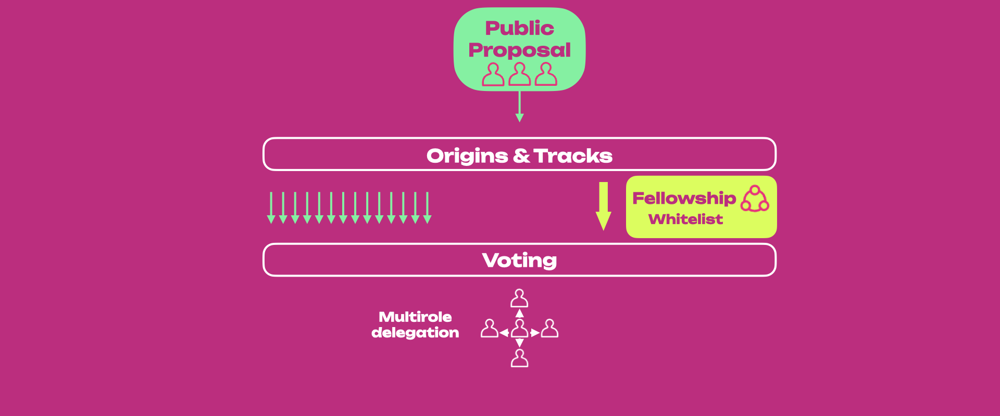

<!-- MessageBox -->
<div id="messageBox" class="floating-message-box">
  <p>
    Before voting or delegating in Polkadot OpenGov, get familiar with
    <a href="./learn-account-balances#locks" target="_blank" rel="noopener noreferrer">
      balances and locks.
    </a>
  </p>
  <button class="close-messagebox" aria-label="Close message">✖</button>
</div>

!!!caution "The content in this document is subject to change"
    The governance protocol has already undergone iterations (see [Governance V1](./archive/learn-governance.md)). Governance is a constantly evolving protocol at this stage in its lifecycle.
    
    For additional support about Polkadot OpenGov, see the [dedicated support pages](https://support.polkadot.network/support/solutions/65000105211).

Polkadot uses a sophisticated governance mechanism that allows it to evolve gracefully overtime at
the ultimate behest of its assembled stakeholders. The goal is to ensure that most of the stake can
always command the network.

Polkadot brings together various novel mechanisms, including an amorphous (abstract) form of
state-transition function stored on-chain defined in a platform-agnostic language (i.e.
[WebAssembly](learn-wasm.md)), and several on-chain voting mechanisms such as referenda and batch
approval voting. All changes to the protocol must be agreed upon by stake-weighted referenda.

Here below there links to useful tools about Polkadot OpenGov.

<div class="grid cards" markdown>

- **[OpenGov.Watch](https://www.opengov.watch/)** - OpenGov Watch website.
- **[OpenGov Tracker](https://ogtracker.io/)** - OpenGov Tracker website.
- **[OpenGov Portal](https://opengovwatch.notion.site/Polkadot-OpenGov-Portal-f8baf91a46864144ae96c47173a10225)** - OpenGov Portal on Notion.

</div>

## Premise

Polkadot's first governance system ([Governance V1](./archive/learn-governance.md)) included three
main components.

- The [Technical Committee](./archive/learn-governance.md#technical-committee): A technocratic
  committee to manage upgrade timelines.
- The [Council](./archive/learn-governance.md#council): An approval-voted, elected executive
  "government" to manage parameters, admin, and spending proposals.
- The Public: All token holders.

Over the first few years of operation, Governance V1 ensured the appropriate usage of treasury funds
and enabled timely upgrades and fixes. Like most early technologies, protocols must evolve as they
mature to improve their shortcomings and keep up with modern advancements. In Governance V1, all
referenda carried the same weight as only one referendum could be voted on at a time (except for
emergency proposals), and the voting period could last multiple weeks. Also, an
[alternating voting timetable](./archive/learn-governance.md#alternating-voting-timetable) allowed
to vote either for a public referendum or a council motion every 28 days (7 days on Kusama). This
resulted in the system favoring careful consideration of very few proposals instead of broad
consideration of many.

Polkadot OpenGov changes how the practical means of day-to-day decisions are made, making the
repercussions of referenda better scoped and agile to increase the number of collective decisions
the system can make at any given time.

The following content is focused on Polkadot OpenGov, and on the main differences with previous
governance versions. We recommend learning about [Governance v1](./archive/learn-governance.md) to
better understand the need for and the direction of Polkadot OpenGov.

## Summary

In Governance v1, active token holders (public) and the Council administrated the network's upgrade
decisions. Whether the public or the council initiated the proposal, it would eventually have to go
through a referendum to let all holders (weighted by stake and conviction) make the decision.

The Council fulfilled its role as the representative of the public, guardian of the treasury and
initiator of legislation, but it was often seen as a centralized entity. To further decentralize the
network, Polkadot OpenGov proposes the following main changes:

- Migrating all responsibilities of the Council to the public via a direct democracy voting system.
- Dissolving the current [Council](./archive/learn-governance.md#council) collective
- Allowing users to delegate voting power in more ways to community members
- Dissolving the [Technical Committee](./archive/learn-governance.md#technical-committee) and
  establishing the broader [Polkadot Technical Fellowship](./learn-polkadot-technical-fellowship.md)

The figure below shows an overview of Polkadot OpenGov's structure.

!!!info
    See [this page](./archive/learn-governance.md#governance-summary) for a comparison with the structure of Governance V1.



In Polkadot OpenGov, all the proposals are initiated by the public. The proposal will enter a
Lead-in period (for more information, see [Referenda Timeline](#referenda-timeline)), after which it
will follow a specific [Track](#origins-and-tracks) which has a dedicated Origin. There are
[15 Origins](./learn-polkadot-opengov-origins.md#origins-and-tracks-info), each with a different
track. The origins and tracks parameters are preset values that set the duration of a referendum as
well as how many referenda can be voted on simultaneously. For example, a treasury proposal can now
be submitted in different tracks depending on the amount requested. A proposal for a small tip will
need to be submitted to the Small Tipper track, while a proposal requiring substantial funds will
need to be submitted to the Medium or Big Spender track.

The [Polkadot Technical Fellowship](./learn-polkadot-technical-fellowship.md) can decide to
[whitelist](./learn-polkadot-technical-fellowship.md#whitelisting) a proposal that will be enacted through the Whitelist Caller origin.
Those proposals will have a shorter Lead-in, Confirmation, and Enactment period when compared to the
Root Origin track.

Each track has its own preset [Approval and Support](#approval-and-support) curves based on the
origin's privileges. When both the approval and support criteria are satisfied for a specific period
(called the confirmation period), the referendum passes and will be executed after the enactment
period.

All referenda within each track and across tracks can be voted on simultaneously (assuming the
track's maximum capacity is not reached).

Polkadot OpenGov also comes with multi-role delegations where the token holder can assign voting
power on different tracks to different entities who are experts in judging the referenda submitted
to those tracks. For example, suppose a token holder does not have the technical background to
consider the merits and vote on the referenda submitted to the Root track. In that case, they can
delegate their voting power just for the Root track to a trusted expert who (according to them) acts
in the best interest of the network protocol. In this way, token holders do not need to be
up-to-date with governance matters and can still make their votes count through delegates.

## Gov1 vs. Polkadot OpenGov

| Governance V1                                                                                                                                                                                                                                                                                                                                          | Polkadot OpenGov                                                                                                                                                                                                                                       | Polkadot OpenGov Benefit                                                                                                                                           |
| ------------------------------------------------------------------------------------------------------------------------------------------------------------------------------------------------------------------------------------------------------------------------------------------------------------------------------------------------------ | ------------------------------------------------------------------------------------------------------------------------------------------------------------------------------------------------------------------------------------------------------ | ------------------------------------------------------------------------------------------------------------------------------------------------------------------ |
| Includes the [Council](./archive/learn-governance.md#council), the [Technical Committee](./archive/learn-governance.md#technical-committee), and the Public (i.e. token holders).                                                                                                                                                                      | Includes the Public and the [Technical Fellowship](./learn-polkadot-technical-fellowship.md).                                                                                                                                                          | Simpler and more decentralized structure.                                                                                                                          |
| Referenda executed only from one origin (Root). Referenda in this origin must be carefully scrutinized. Therefore, there is only one track (i.e., only one referendum at a time can be executed).                                                                                                                                                      | Referenda executed from [multiple origins](./learn-polkadot-opengov-origins.md#origins-and-tracks-info), each with a different track that shapes proposals’ timelines. Depending on the origin, multiple referenda within the same track are possible. | Possibility to categorize proposals (based on importance and urgency) and execute them simultaneously within and between origin tracks.                            |
| Proposals can be submitted by either the Council or the Public.                                                                                                                                                                                                                                                                                        | The public submits proposals.                                                                                                                                                                                                                          | More democratic.                                                                                                                                                   |
| Uses [Adaptive Quorum Biasing](./archive/learn-governance.md#adaptive-quorum-biasing) to define the approval threshold based on turnout. Given the same turnout, council-initiated referenda require fewer Aye votes to pass compared to public referenda.                                                                                             | Uses origin-specific approval and support curves defining the amount of approval and support (i.e. turnout) needed as a function of time. The same curves are applied to all referenda within the same origin track.                                   | Referenda timeline depends on the origin and not on who submitted the proposal (i.e. Council or Public). This is a more democratic and equalitarian system.        |
| Uses [alternating voting timetable](./archive/learn-governance.md#alternating-voting-timetable) allowing voters to cast votes for either council or public referenda every 28 eras.                                                                                                                                                                    | Multiple referenda can be voted at the same time.                                                                                                                                                                                                      | More flexible and agile governance system.                                                                                                                         |
| Except for emergency proposals, all referenda have fixed voting and enactment periods of 28 eras.                                                                                                                                                                                                                                                      | Periods' length is customizable and has pre-defined limits for each origin. The same limits apply to all tracks with the same origin. For example, the track in the origin Root will be longer than the track within the Small Tipper origin.          | Referenda’s timeline is tailored to their importance and urgency. Flexible enactment period based on origin.                                                       |
| Emergency proposals turned referenda can be simultaneously voted on and executed with other referenda and have shorter enactment periods. They must be proposed by the Technical Committee and approved by the Council.                                                                                                                                | No emergency proposals. The Technical Fellowship can whitelist proposals that will have their origin with shorter lead-in, confirmation, and enactment periods.                                                                                        | The Technical Fellowship is a more decentralized entity than the Technical Committee. Whitelisting a proposal requires a majority of approval from the fellowship. |
| Only the [most-endorsed proposal](./archive/learn-governance.md#endorsing-proposals) is able to transit from Launch to Voting period. The time for the transition is indeterminate, and (with no possibility of canceling endorsements) proposers and endorsers might wait a long time before a referendum is tabled, and getting their deposits back. | All proposals will eventually be voted on (given track capacity and deposit are met and the Lead-in period has ended).                                                                                                                                 | It allows all proposals to get a chance to be voted on in a timely, predictive manner.                                                                             |
| Only _aye_ or _nay_ votes possible.                                                                                                                                                                                                                                                                                                                    | Voters can have the additional voting options of abstaining or splitting votes.                                                                                                                                                                        | More ways to engage in voting and increase turnout.                                                                                                                |
| Voters can decide to delegate votes to another account.                                                                                                                                                                                                                                                                                                | Voters can use [multirole delegations](#multirole-delegation) and delegate votes to different accounts depending on origins.                                                                                                                           | More agile delegations tailored by expertise.                                                                                                                      |

## Referenda

!!!info "Public and Council Referenda in Governance v1"
    With the Council's dissolution, [council referenda](./archive/learn-governance.md#council-referenda) are no longer present in Polkadot OpenGov.

See [this page](./archive/learn-governance.md#public-referenda) for more information about public
referenda in Governance v1.

**In Polkadot OpenGov all referenda are public.** Anyone can start a referendum at any time and do
so as often as they wish. Previous features were expanded and improved, most notably
[**Origins and Tracks**](#origins-and-tracks) help facilitate the flow and processing of the
submitted referenda. The [Technical Fellowship](./learn-polkadot-technical-fellowship.md) has the
option to [whitelist](./learn-polkadot-technical-fellowship.md#whitelisting) referenda that can be then proposed in the track with
[whitelist origin](./learn-polkadot-opengov-origins.md#whitelisted-caller).

### Referenda Timeline

!!!info "Voting timetable in Governance v1"
    See [this page](./archive/learn-governance.md#referenda-timeline) for more information about the voting timetable in Governance v1.


The figure above provides a summary view of the referenda timeline for Polkadot OpenGov.

In (1), when a referendum is initially created, the community can immediately vote on it. However,
it is not immediately in a state where it can end or otherwise have its votes counted, approved, and
ultimately enacted. Instead, the proposal will stay within a **Lead-in Period** until it fulfills
three criteria:

- Proposals must stay within the lead-in period for a pre-defined minimum amount of time. This helps
  mitigate against the possibility of "decision sniping" where an attacker controlling a substantial
  amount of voting power might seek to have a proposal passed immediately after proposing, not
  allowing the overall voting population adequate time to consider and participate.
- There must be enough room for the decision within the origin. Different origins have their limit
  on the number of proposals that can be decided simultaneously. Tracks that have more potent
  abilities will have lower limits. For example, the Root level Origin has a limit of one, implying
  that only a single proposal may be decided on at once.
- A decision deposit must be submitted. Creating a referendum is cheap as the deposit value consists
  of only the value required for the on-chain storage needed to track it. But, having a referendum
  reviewed and decided upon carries the risk of using up the limited spots available in the
  referenda queue. Having a more significant but refundable deposit requirement makes sense to help
  mitigate spam. Failing to submit the decision deposit will lead to a referendum _timeout_.

!!!info "Decision Deposit Amounts"
    In Polkadot OpenGov, someone must submit the Decision Deposit for a referendum to enter its Decision Period. The number of tokens required for the Decision Deposit depends on the track’s privilege level. The higher the privilege, the higher the deposit. For example, malicious referenda posted on the Small Tipper track inflict low economic damage to the network. In contrast, malicious referenda on the Root track can inflict more significant harm, such as changing the entire network's runtime.

Until they are in the lead-in period, proposals remain undecided. Once the criteria above are met,
the referendum moves to the _deciding_ state. The votes of the referendum are now counted towards
the outcome.

In (2), the proposal enters the **Decision Period**, where voting can continue. For a proposal to be
approved, votes must satisfy the approval and support criteria for at least the **Confirmation
Period**; otherwise, the proposal is automatically rejected. A rejected proposal can be resubmitted
anytime and as many times as needed.

In (3), approved proposals will enter the **Enactment Period**, after which proposed changes will be
executed.

Note how the length of the lead-in, decision, confirmation, and enactment periods vary depending on
the track. Root origin track has more extended periods than the other tracks. Also, the number of
referenda within each track differs, with the Root origin track only accepting one proposal at a
time (see below).


This directly affects the number of proposals that can be voted on and executed simultaneously.
Continuing the comparison between Root and Small Tipper, Small Tipper will allow many proposals on
its track to be executed simultaneously. In contrast, Root will allow only one proposal to be on its
track. Once the track capacity is filled, additional proposals in the lead-in period will queue
until place is available to enter the decision period.

For examples of collectives, see the [Polkadot Alliance](https://polkadot.polkassembly.io/referendum/94) and the [Polkadot Technical Fellowship](./learn-polkadot-technical-fellowship.md).

### Origins and Tracks

An **Origin** is a specific level of privilege that will determine the **Track** of all referenda
executed with that origin. The track is a pipeline in which the proposal lives and proceeds,
independent of other origins' tracks. The proposer of the referenda now selects an appropriate
Origin for their request based on the proposal’s requirements.

Although the track structure is the same for all origins, track parameters are not. Such parameters
include:

- **Maximum Deciding or Capacity**: the limit for the number of referenda that can be decided at
  once (i.e., the number of tracks within each origin).
- **Decision deposit**: the amount of funds that must be placed on deposit to enter the Decision
  Period (note that more requirements must be met to enter the Decision Period).
- **Preparation Period**: the minimum amount of voting time needed before entering the Decision
  Period (given capacity and deposit are met).
- **Decision Period**: the time interval during which a proposal's outcome can be decided.
- **Confirmation Period**: the minimum amount of time the approval and support criteria must hold
  before the proposal is approved and moved to the enactment period. The confirmation period should
  start before the end of the decision period.

!!!info "Example Scenario of an Edge Case"
    A referendum may enter the confirmation period just one block before the decision period ends. In this scenario, the referendum will pass if it satisfies approval and support thresholds for the minimum confirmation period (track-dependent).

- **Voting Period**: The period in which voting is allowed on a referendum, which includes
  preparation, decision, and confirmation periods.
- **Minimum Enactment Period**: the minimum amount of waiting time before the proposed changes are
  applied
- **Approval Curve**: the curve describing the minimum % of _aye_ votes as a function of time within
  the Decision Period. The approval % is the portion of _aye_ votes (adjusted for conviction) over
  the total votes (_aye_, _nay_, and _abstained_).
- **Support Curve**: the curve describing the minimum % of all votes in support of a proposal as a
  function of time within the Decision Period. The support % is defined as the portion of all votes
  (_aye_ and _abstained_) without conviction over the total possible amount of votes in the system
  (i.e., the total active issuance).

For example, a runtime upgrade (requiring a `set_code` call, if approved) does not have the same
implications for the ecosystem as the approval of a treasury tip (`reportAwesome` call) and
therefore, different Origins for these two actions are needed in which different deposits, support,
approval, and a minimum [enactment](#enactment) periods will be predetermined on the pallet.

For detailed information about origin and tracks, and parameter values in Kusama, see
[this page](./learn-polkadot-opengov-origins.md#origins-and-tracks-info).

### Voluntary Locking (Conviction Voting)

!!!info "Conviction Voting Locks created during Gov 1"
    Conviction voting locks in Governance v1 will not be carried over to OpenGov. Voting with conviction in OpenGov will create a new lock (as this will use the `convictionVoting` pallet), while any existing lock under Governance v1 (using the deprecated `democracy` pallet) will be left to expire. Delegations under Governance v1 will need to be re-issued under OpenGov.

Polkadot utilizes an idea called voluntary locking that allows token holders to increase their
voting power by declaring how long they are willing to lock up their tokens; hence, the number of
votes for each token holder will be calculated by the following formula:

```
votes = tokens * conviction_multiplier
```

The conviction multiplier increases the vote multiplier by one every time the number of lock periods
double.

| Lock Periods | Vote Multiplier  | Length in Days   |
|-----|------|------|
|0|0.1|0|
|1|1|7|
|2|2|14|
|4|3|28|
|8|4|56|
|16|5|112|
|32|6|224|

The maximum number of "doublings" of the
[lock period](../general/chain-state-values.md) is set to 6 (and thus
32 lock periods in total). For additional information regarding the timeline of governance events, see the [origins and tracks information](./learn-polkadot-opengov-origins.md#origins-and-tracks-info).

Votes are always "counted" at the same time (at the end of the voting period), no matter how long
the tokens are locked.

See below an example that shows how voluntary locking works.

Peter: Votes `No` with 10 DOT for a 32-week lock period => 10 x 6 = 60 Votes

Logan: Votes `Yes` with 20 DOT for one week lock period => 20 x 1 = 20 Votes

Kevin: Votes `Yes` with 15 DOT for a 2-week lock period => 15 x 2 = 30 Votes

Even though both Logan and Kevin vote with more DOT than Peter, the lock period for both of them is
less than Peter’s, leading to their voting power counting as less.

!!!info "Staked tokens can be used in governance"
    While the tokens are locked, you can still use them for voting and [staking](./learn-staking.md). You are only prohibited from transferring these tokens to another account. **See the section about [OpenGov locks](#voting-on-a-referendum), and learn more about locks on the [Balances page](./learn-account-balances.md#locks).**

### Approval and Support

!!!info "Adaptive Quorum Biasing is deprecated"
    In Polkadot OpenGov, [Adaptive quorum biasing](./archive/learn-governance.md#adaptive-quorum-biasing) used in Governance V1 has been replaced with the **Approval and Support system**.


The figure above provides a summary view of how the approval and support system works during the
Decision Period.

Once the proposal exits the Lead-in Period and enters the Voting Period, to be approved, it must
satisfy the approval and support criteria for the **Confirmation Period**.

- **Approval** is defined as the share of [conviction](#voluntary-locking-conviction-voting)-weighted _aye_ votes
  against the conviction-weighted total of _aye_ and _nay_ votes. The code implementation can be
  viewed
  [here](https://github.com/paritytech/polkadot-sdk/blob/f2fbba3be1d7deaf7cfc731cea00552c212ddfcf/substrate/frame/conviction-voting/src/types.rs#L77)
- **Support** is the total number of _aye_ and _abstain_ votes (ignoring any adjustment for
  conviction) compared to the total possible votes ([active issuance](learn-DOT.md#token-issuance))
  that could be made in the system. In case of _split_ votes, only _aye_ and _abstain_ will count.

For example, let us consider a hypothetical example where the total active issuance is 100 DOT.

- An account A votes "Aye" with 10 DOT with 4x conviction
- An account B votes "Nay" with 5 DOT with 2x conviction
- An account C votes "Abstain" with 20 DOT. (no conviction can be applied to "Abstain" votes)

In this scenario, only 35 DOT from the total active issuance participated in voting on the
referendum. Now, let us calculate the Approval and Support values for that referendum.

- Approval is calculated as (Aye') / (Aye' + Nay’), where Aye' and Nay' are the votes after applying
  the conviction multiplier. Hence, Approval = (10 x 4) / (10 x 4 + 5 x 2) = 40/50 which is 80%.
- Support is calculated as (Aye + Abstain) / (total active issuance), where "Aye" and "Abstain" are
  the votes without the conviction multiplier. Hence, Support = (10 + 20) / 100 which is 30%.

!!!info "Nay votes are not counted towards Support"
    Support is a measure of voters who turned out either in favor of the referenda or consciously abstained from it. Support does not include _nay_ votes. This avoids edge situations where _nay_ votes could push a referendum into a confirming state. For example, imagine current approval is high (near 100%, way above the approval curve), and current support is just below the support curve. A _nay_ could bump support above the support curve but not reduce approval below the approval curve. Therefore, someone voting against a proposal would make it pass. Hence, a decrease in % of current approval through new votes does not directly translate into increasing support because Support needs to consider _nay_ votes.

The figure above shows the following:

- Even if the approval threshold is reached (i.e., % of current approval is greater than the
  approval curve), the proposal only enters the confirmation period once the support threshold is
  also reached (i.e., % current support is greater than the underlying support curve).
- If the referendum meets the approval and support thresholds for the duration of the confirmation
  period, the proposal will be approved and will be scheduled for enactment. Each track has a
  default minimum Enactment Period, and the approved referendum needs to wait till the end of it to
  be executed. Powerful Tracks like `Root` enforce a larger Enactment Period to ensure the network
  has ample time to prepare for any changes the proposal may bring. The referendum proposers can
  also set the enactment period higher than its default value.
- A referendum may exit the confirmation period when the thresholds are no longer met due to new
  _Nay_ votes or a change of existing _Aye_ or _Abstain_ votes to _Nay_ . Each time it exits, the
  confirmation period clock is reset. For example, suppose the confirmation period is 20 minutes,
  and a referendum enters it just for 5 min before exiting. The next time it enters, it must be
  confirmed for 20 minutes (not 15 minutes).
- It is possible that a referendum meets the approval and support thresholds almost at the end of
  the decision period. In this case, even though the decision period elapses, the referendum can
  pass if it stays confirming for the duration of the track-specific confirmation period. It is
  rejected immediately if it exits the confirmation period after the decision period elapses.
- The approval curve starts at 100% and gradually decreases to 50%, but never below 50%. Assuming
  all the active token supply has voted on a proposal, the conviction vote-weighted support should
  always be above 50% to pass.


Note that support may not increase monotonically, as shown in the figure, as people might switch
votes.

Different Origins' tracks have different Confirmation Periods and requirements for approval and
support. For additional details on the various origins and tracks, check out
[this table](./learn-polkadot-opengov-origins.md#origins-and-tracks-info). With proposals that use
less privileged origins, it is far more reasonable to drop the required support to a more realistic
amount earlier than those which use highly privileged classes such as `Root`.

### Enactment

!!!info "Enactment in Governance v1"
    See [this page](./archive/learn-governance.md#enactment) for more information about enactment in Governance v1.

In Polkadot OpenGov, the proposer suggests the enactment period, but there is also a minimum set for
each Origin Track. For example, `root` Origin approvals require an extended period because of the
importance of the changes they bring to the network.

### Cancelling, Killing & Blacklisting

!!!info "Cancelling Referenda in Governance v1"
    See [this page](./archive/learn-governance.md#cancelling-proposals) for more information about cancelling referenda in Governance v1.

Polkadot OpenGov has two origins dedicated to rejecting ongoing referenda:
[Referendum Canceller](./learn-polkadot-opengov-origins.md#referendum-canceller) and
[Referendum Killer](./learn-polkadot-opengov-origins.md#referendum-killer).

Referendum Canceller aims to cancel an already ongoing referendum. When this origin cancels a
referendum, the Submission and Decision Deposit are refunded to their originators. An example of
when a referendum might be considered to be canceled is if the originator has made some errors in
creating the preimage and did not necessarily do anything malicious. Cancellation has a lower
Decision Period, and Approval and Support criteria are much easier to meet over time than most other
Origins. This is because the cancellation of a referendum usually comes with a sense of urgency.

Referendum Killer aims to instantly kill an ongoing referendum, slashing submission and decision
deposit (the account(s) that posted these deposits will lose those funds). This origin can be
engaged if, for example, a malicious actor submits a referendum on the Root Track to set the code of
the chains' runtime to stop block production.

The Decision Deposit for the Referendum Killer track itself is high to prevent malicious actors from
attempting to slash deposits of good referenda. A subsequent Referendum Killer can kill an existing
Referendum Killer.

For more information about how to cancel or kill a referendum, see the
[advanced how-to guides](./learn-guides-polkadot-opengov.md#cancel-or-kill-a-referendum).

!!!info "Blacklisting"
    Blacklisting referenda in Polkadot OpenGov is [the same as in Governance v1](./archive/learn-governance.md#blacklisting-proposals).

## Voting on a Referendum

If you are a voter, it means that you will vote with your tokens on each single referendum.

In Governance V1, voters could cast only an _aye_ or _nay_ vote. In Polkadot OpenGov, voters can
additionally cast a _abstain_ and _split_ votes.
[Vote splitting](./learn-guides-polkadot-opengov.md#voting-on-referenda) allows voters to allocate
different votes for _aye_, _nay_, and _abstain_. Voting with conviction is not possible when
abstaining or splitting the votes.

!!!info "Only the last vote counts"
    Voting a second time replaces your original vote, e.g. voting with 10 DOT, then a second extrinsic to vote with 5 DOT, means that you are voting with 5 DOT, not 10 DOT.

Note that to successfully cast votes you need to have the
[existential deposit](./learn-accounts.md#existential-deposit-and-reaping) and some additional funds
to pay for transaction fees.

In general, you can remove your vote:

- While a referendum is ongoing (your vote does not count)
- After a referendum ended (your vote counts)

If you voted without conviction, there's no conviction lock in either case. If you voted with
conviction, you only get a conviction lock if the referendum ended and you voted with the winning
side.


!!!info "Revoke your delegation on a track if you like to vote on your own"
    If you want to vote on a referendum on a specific track on your own, you will need to revoke any existing [delegation](#multirole-delegation) on that track (i.e. undelegate). You can have a conviction lock on the track, but you cannot have an active delegation.

### Voting Without Conviction

If you vote without conviction, the referendum is ongoing, and you remove the vote, you can unlock
your tokens immediately. If the referendum ended, you can remove your vote and unlock your tokens
immediately, regardless of whether you are on the winning or losing side of the referendum. The
governance app or interface you used for participating in Polkadot OpenGov should show an option to
unlock your tokens.

### Voting with Conviction

If you voted with conviction, the referendum is ongoing, and you removed the vote, you can unlock
your tokens immediately. If the referendum ended and you are on the losing side, you can remove your
vote and unlock the tokens immediately. However, if you are on the winning side of the referendum,
you will get a conviction lock.

Conviction locks are calculated from the time the referendum ended but are applied when you remove
the vote.

For example, if you voted with conviction 1x with 10 DOT, those 10 DOT will be locked for 7 days
after the referendum ends (assuming you are on the winning side). If you remove the vote 3 days
after the referendum ended, your tokens will be locked for 4 more days. If you remove it on the 8th
day after the end of the referendum, the tokens can be unlocked right away (after you remove the
vote). When you remove the vote, the lock expiration block is calculated and added to the chain
state.

If you voted on multiple referenda, and you are on the winning side of all those referenda, you will
get multiple conviction voting locks for all those referenda. **Locks do not stack**; the length and
size of the lock decides. This means that - assuming you used the same conviction on the same number
of tokens - when the conviction lock on the latest referendum (see below, Ref 4) expires, you will
be able to unlock your tokens. In the meantime, the previous locks (1 to 3) might have expired, and
you can remove those locks (after removing the votes).


When you delegate your votes, the locking mechanism differs slightly. Please check the next section
on Multirole Delegation for more information.

## Multirole Delegation

Polkadot OpenGov builds on the
[vote delegation feature from Governance v1](./archive/learn-governance.md#delegations) where a
voter can delegate their voting power to another voter. It does so by introducing a feature known as
**multirole delegation**, where voters can specify a different delegate for every class of
referendum in the system. Delegation can be done per track, and accounts can choose to select
different delegates (or no delegation) for each track.

For example, a voter could delegate one entity for managing a less potent referenda class, choose a
different delegate for another class with more powerful consequences and still retain full voting
power over any remaining classes.

Contrary to solo voting, with delegations, any conviction locks are applied as soon as you
undelegate, regardless of whether your delegated votes were used for voting during that time. If
your delegated votes were used in any ongoing referenda, they would be removed from those referenda
when you undelegate. Alternatively, after undelegating, you can delegate to another person or modify
your delegation. The only way to modify the delegation is to undelegate and delegate again. You do
not have to do this yourself; wallets and extensions should have implemented UI to modify delegation
without you knowing this.

If you delegate without conviction and you undelegate, you can unlock your tokens immediately.
Alternatively, after undelegating, you can always delegate to another person or modify your
delegation.


In the case you delegated with 1x conviction, you undelegate and re-delegate with 2x conviction; the
time you undelegate again, you will have created two conviction locks: one for the 1x and one for
the 2x conviction. If you re-delegate immediately with 1x conviction and undelegate, you will get a
second 1x conviction lock, but the 2x conviction lock will be the one deciding when your token can
be unlocked.


!!!info
    If the account delegated votes to different delegates using different convictions, then after undelegating those delegates, there will be different unlocking periods with lengths dependent on the conviction multipliers.

**Before delegating a specific track, you must remove any [vote](#voting-on-a-referendum) on that
track.**

It is worth noting that a user delegating their voting power does not imply that the delegate will
have control over the funds of the delegating user's account. That delegate's account can vote with
a user's voting power but won't be able to transfer balances, nominate a different set of
validators, or execute any call other than voting on the tracks defined by the user.

The goal of delegations is to ensure the required support for proposals to be enacted is reached
while keeping the overall design censorship-free. Also, voters might not have the technical
knowledge to judge some referenda or might not have the time to read all referenda. Delegations
allow voters to participate in OpenGov hands-free by delegating their voting power to trusted
entities.

## Resources

- [Democracy Pallet](https://github.com/paritytech/polkadot-sdk/tree/master/substrate/frame/democracy/src)
- [Governance v2](https://medium.com/polkadot-network/gov2-polkadots-next-generation-of-decentralised-governance-4d9ef657d11b)
- [Polkadot Direction](https://matrix.to/#/#Polkadot-Direction:parity.io)
- [Kusama Direction](https://matrix.to/#/#Kusama-Direction:parity.io)
- [PolkAssembly](https://polkadot.polkassembly.io/)

---

!!!info "Polkadot-JS Guides"
    If you are an advanced user, see the [Polkadot-JS guides about OpenGov](./learn-guides-polkadot-opengov.md).
