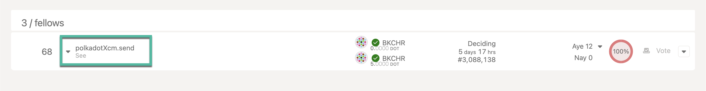

The Technical Fellowship is a self-governing body of experts and developers of Polkadot and Kusama
networks protocols. It operates on-chain through the Polkadot
[Collectives](https://polkadot.js.org/apps/?rpc=wss%3A%2F%2Fpolkadot-collectives-rpc.polkadot.io#/fellowship/referenda)
system chain and off-chain through the [Polkadot Fellows](https://github.com/polkadot-fellows)
repository.

!!!info "Historical Context"
    The Polkadot Technical Fellowship was established in 2022 and plays an important role in the Polkadot OpenGov. This fellowship replaced the Technical Committee from Polkadot's Governance V1, and will be serving both the Polkadot and Kusama networks. This Fellowship is designed to be far broader in membership (i.e. to work well with even tens of thousands of members) and with far lower barriers to entry both in terms of administrative process flow and levels of expertise. For more information, read through the [Fellowship Manifesto](https://github.com/polkadot-fellows/manifesto/blob/0c3df46d76625980b8b48742cb86f4d8fa6dda8d/manifesto.pdf).

Apart from the collectives system chain and the GitHub repository, the Polkadot Technical Fellowship
also uses multiple public avenues to discuss updates related to the Polkadot protocol. Their public
discussions can be viewed on [this chatroom](https://matrix.to/#/#fellowship-members:parity.io) and
their monthly meetings are posted to this OpenDev - Polkadot Fellowship Core Dev Call
[YouTube playlist.](https://www.youtube.com/watch?v=5P6Axm4JrmQ&list=PLtyd7v_I7PGlDJCCCLGLjJ0yv33JAEE_-)

## Technical Fellowship Referenda

The fellowship's governance model has multiple tracks with their own approval and support
parameters, where the votes are weighted by the rank of the member. Members of the Fellowship can
vote on any given Fellowship proposal and the aggregated opinion of the members (weighted by their
rank) constitutes the Fellowship's collective opinion. The list of current and historic fellowship
referenda can be viewed on [Polkassembly](https://collectives.polkassembly.io/) or
[Subsquare.](https://collectives.subsquare.io/) The fellowship governance is primarily used for its
membership management, [approving RFCs](https://github.com/polkadot-fellows/RFCs) and whitelisting
Polkadot OpenGov proposals created on the whitelist track.

### Whitelisting

Polkadot OpenGov allows the Technical Fellowship to authorize an origin known as
"Whitelisted-Caller" to execute with Root-level privileges for calls approved by the Fellowship
(currently only level-three fellows and above can vote for whitelist calls). Note that the
fellowship cannot unanimously change the network parameters, conduct rescues or move assets. The
whitelisted proposals still have to go through the whole life cycle of an OpenGov referendum and can
only be enacted when the referendum passes successfully.

The whitelisting process starts as a fellowship referenda with embedded XCM call from the
collectives system chain to the Polkadot relay chain. For instance,
[the Polkadot Fellowship referenda 68](https://collectives.polkassembly.io/referenda/68) was used to
**whitelist** [the Polkadot OpenGov referenda 440](https://polkadot.polkassembly.io/referenda/440).



!!!info "Submitting Whitelisted Proposals"
    For more information about how to submit a whitelisted proposal see the [dedicated advanced how-to guides](./learn-guides-polkadot-opengov.md#submitting-a-referendum-on-the-whitelisted-caller-track).

## Technical Fellowship Ranking and Salary

The Fellowship [manifesto](https://github.com/polkadot-fellows/manifesto) outlines the requirements
and expectations for individuals to attain and retain any given rank, ranging between 0 to 9. By
default, an active account on the collectives system chain has no assigned rank and can be inducted
into the Polkadot Technical Fellowship starting with rank 0. The Fellowship Manifesto states that
members should receive a monthly allowance on par with gross income in OECD countries. A
[fellowship RFC](https://github.com/polkadot-fellows/RFCs/pull/50) was proposed with concrete
amounts for each ranked members.

| Dan  |      Title      | Annual Salary |
| :--: | :-------------: | :-----------: |
|  I   |     Member      |    $10,000    |
|  II  |   Proficient    |    $20,000    |
| III  |     Fellow      |    $80,000    |
|  IV  |    Architect    |   $120,000    |
|  V   | Architect Adept |   $160,000    |
|  VI  | Grand Architect |   $200,000    |
| VII  |   Free Master   |   $200,000    |
| VIII | Master Constant |   $200,000    |
|  IX  |  Grand Master   |   $200,000    |

## Membership Management

The Polkadot technical Fellowship was initially
[seeded](https://github.com/polkadot-fellows/seeding) with its members and their corresponding
ranks, and got [added on to Polkadot's Collectives](https://polkadot-old.polkassembly.io/motion/403)
system chain. Membership requests will go through the fellowship governance and the
procedure is outlined in the section below.

### Becoming a Member

As a member of the Polkadot Technical Fellowship, you are expected to faithfully uphold the below
tenets:

- Sincerely uphold the interests of Polkadot and avoid actions which clearly work against it.
- Respect the philosophy and principles of Polkadot.
- Respect the operational procedures, norms and voting conventions of the Fellowship.
- Respect fellow Members and the wider community.

!!!tip "Register your interest"
    For new fellowship inductions, Polkassembly has created an interface (still in beta) to [apply for the Polkadot Technical Fellowship.](https://collectives.polkassembly.io/join-fellowship?network=collectives) This initiative is funded by Polkadot treasury through [OpenGov referendum 373](https://polkadot-old.polkassembly.io/treasury/574)

The full set of instructions to be inducted to the Polkadot Technical Fellowship are available on
[the fellowship dashboard](https://polkadot-fellows.xyz/#/membership).

### Rank Updates

The Polkadot Technical Fellowship members are expected to provide a periodic evidence to request for
retaining their rank or to get promoted to a higher rank. Any fellowship member upto rank 4 can be
promoted to the next rank through a fellowship referenda that can be voted by the members who are 2
ranks higher. For instance, the fellowship
[referenda 64](https://collectives.subsquare.io/fellowship/referenda/64) which promotes a member
from rank 1 to rank 2 can only be voted by members whose ranks are greater than or equal to 3.
Promotion of the Polkadot Fellowship members from rank 5 needs to be done through an OpenGov
referendum. For more information, check the rank updates section on
[the fellowship dashboard](https://polkadot-fellows.xyz/#/membership).

## Cumulative Rank-Based Voting

As specified in the [manifesto](https://github.com/polkadot-fellows/manifesto/blob/main/manifesto.pdf), when it comes to governance voting, the Polkadot Technical Fellowship uses a **cumulative rank-voting** system, where the **weight of a vote increases non-linearly with the member's rank**. The weight function `w(r)` is defined as:

```
w(r) = r(r + 1) / 2
```

where `r` is the member rank. For example, a member with rank 3 has a voting weight of 6, while rank 5 has a weight of 15. Thus, higher-ranked members have significantly more influence than lower-ranked ones.

For votes requiring a **minimum rank** to participate (such as Membership, Promotion, or Continuation votes), the weight calculation is adjusted so that the **lowest eligible rank has a base weight of 1**, and higher ranks scale upward from there. This is formalized as:

```
w'(r, m) = w(r - m + 1)
```

Where `r` is the member's rank and `m` is the minimum rank allowed to vote.

The table below illustrates this system with a minimum voting rank of 2 and a maximum of 6:

| Rank | r - m + 1 | Weight w'(r, 2) |
|------|-----------|-----------------|
| 1    | 0         | 0 *(ineligible)* |
| 2    | 1         | 1               |
| 3    | 2         | 3               |
| 4    | 3         | 6               |
| 5    | 4         | 10              |
| 6    | 5         | 15              |

Note that because of this system, the same rank can have different voting weights, depending on the minimum rank required in that specific vote type (Membership, Promotion, or Continuation). Se the example below taken from an RFC proposal:

| Rank | Amount |
|-----|-------|
|3|1|
|4|3|
|2|1|
|3|3|
|4|6|
|6|15|

Rank 3 has power 1 in one vote and power 3 in another, it means:

- In the first vote, the minimum rank allowed was 3 → w'(3, 3) = w(1) = 1

- In the second vote, the minimum rank was 2 → w'(3, 2) = w(2) = 3

Similarly, for Rank 4 with power of 3 and 6, it means:

- First case: w'(4, 3) = w(2) = 3

- Second case: w'(4, 2) = w(3) = 6

The system is flexible by design to reflect different eligibility levels.
