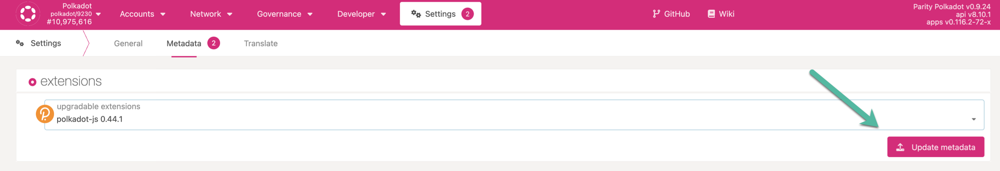
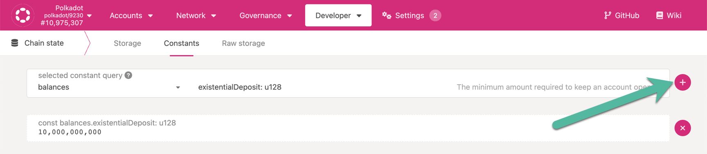

<!-- This page is a WIP -->
<!-- The first version of this page takes motivation from Emre's ELI5 on Polkadot-JS -->

Polkadot-JS is a collection of tools that interfaces with the
{{ polkadot: Polkadot :polkadot }}{{ kusama: Kusama :kusama }} blockchain in a granular way.

## Primary Implementation

Polkadot-JS as a term has multiple moving parts that are worth mentioning.

### [Polkadot-JS UI](https://polkadot.js.org/)

The Polkadot-JS UI is a hosted application that loads in your browser. The UI has a standard DNS
hosted version, which always has the latest features, and an IPFS version that is less frequently
updated but is more decentralized. This is also often referred to as Polkadot-JS Apps, or the Apps
UI.

Polkadot-JS Apps has many capabilities that go beyond basic wallet functions such as account
creation and sending or receiving transactions.

### [Polkadot-JS Extension](https://polkadot.js.org/extension/)

The extension is a simple tool for managing accounts in a browser extension and allowing the signing
of extrinsics using these accounts. The Polkadot-JS extension is not made for users to interact with
on-chain functions as one would find through a wallet app. The extension acts as a robust key-store
and thus acts as an account manager for Substrate-based accounts.

However, it also provides a simple interface for interacting with extension-compliant dApps.

Ensure that the Polkadot-JS Extension installed is updated with the latest metadata of the chain.
You would notice these updates under Settings > Metadata. Click on Update metadata and approve the
update.

#### [Polkadot-JS Phishing List](https://polkadot.js.org/phishing/)

The phishing list website is a community-driven curation of less-than-honest operators. The
Polkadot-JS extension uses this list to warn a user about suspicious URLs and addresses that are
part of the list, and automatically blocks the account address.

### [Polkadot-JS API](https://github.com/polkadot-js/api)

A JavaScript API allowing for programs to interface with the functionality of
{{ polkadot: Polkadot. :polkadot }}{{ kusama: Kusama. :kusama }}

## Polkadot-JS Apps

Polkadot-JS Apps is the native Polkadot/Kusama/Substrate UI for interacting with a node, allowing
access to all features available on Substrate chains. Polkadot-JS Apps also allows developers to to
interface with a local node.

> Note that the UI may not precisely align with the functionality of individual parachains.

Among other things, Polkadot-JS Apps allows a user to:

- [Staking](learn-staking.md)
- [Governance](learn-governance.md)
- [Crowdloans](learn-crowdloans.md)
- [Auctions](learn-auction.md)
- Query chain metadata
- Query on-chain data using RPC calls
- Call extrinsics using your account

### Developers

A developer can utilize Polkadot-JS Apps to test your code's functionality. Interacting with the
Polkadot-JS comes down to either querying on-chain data or issuing an extrinsic.

One important detail to understand while interacting with the underlying
[@polkadot/api](https://www.npmjs.com/package/@polkadot/api) is that most interfaces are generated
automatically when connecting to an available node. This is quite a departure from many other API
designs where the interfaces are commonly static.

When the API connects to a node, it initially retrieves the
[metadata](https://polkadot.js.org/apps/#/runtime) which is used to "decorate" the API based on its
contents. The metadata provides data in the form of `api.<type>.<module>.<section>` and fits into
one of the following categories:

- `consts` - runtime constants (these are not functions so the values are returned directly as they
  are defined by the endpoint)
- `query` - chain state values
- `tx` - all extrinsics

The metadata also provides information on [events](https://polkadot.js.org/docs/substrate/events/),
which can be queried using the `api.query.system.events()` interface.

None of the information contained within the `api.{consts, query, tx}.<module>.<method>` endpoints
are hard-coded in the API. These values are defined by the decoration applied from the initial
metadata response and are therefore completely dynamic. This suggests that when you connect to
different parachains, the metadata and API decoration will change and provide varying interfaces
based on the chain.

#### Querying on-chain data

To populate the Apps UI, the web app queries the Polkadot-JS API. The API then queries a
{{ polkadot: Polkadot :polkadot }}{{ kusama: Kusama :kusama }} node and uses JavaScript to return
information that the UI will display on the screen. You can choose which node to connect to by
changing it in the upper-left-hand corner of the screen.

Let's see how we can query on-chain data with Polkadot-JS UI on the Polkadot network with an example.
To find out the current value for existential deposit, navigate to Developer > Chain state >
Constants and query the balances pallet for existential deposit as shown in the snapshot below. You
need to click on the plus button to execute the query. The value displayed is in
[plancks](learn-DOT#polkadot)

#### Issuing an extrinsic

Extrinsics are pieces of information that come from outside the chain and are included in a block.
Extrinsics can be one of three types: inherents, signed, and unsigned transactions.

Most extrinsics displayed on Polkadot-JS Apps are signed transactions. Inherits are non-signed and
non-gossiped pieces of information included in blocks by the block author, such as timestamps, which
are “true” because a sufficient number of validators have agreed about validity.

Unsigned transactions are information that does not require a signature but will require some sort
of spam prevention, whereas signed transactions are issued by the originator account of a
transaction which contains a signature of that account, which will be subject to a fee to include it
on the chain.

### Considerations

For more user-friendly wallets, check out the supported and treasury-funded wallets on the
[Wallets Page](../build/build-wallets.md)

## Resources

### Beginner's Guide to Polkadot-JS

- [Introduction to Polkadot-JS](https://www.youtube.com/watch?v=4EQqwGFV1D8)
- [Create an account using Polkadot-JS](https://www.youtube.com/watch?v=sy7lvAqyzkY)
- [Network Explorer on Polkadot-JS UI](https://www.youtube.com/watch?v=g4b4IWR6OrE)

### Documentation

- [Official polkadot{.js} docs](https://polkadot.js.org/docs/)
- [Substrate docs on Polkadot-JS](https://docs.substrate.io/reference/command-line-tools/polkadot-apps/)
