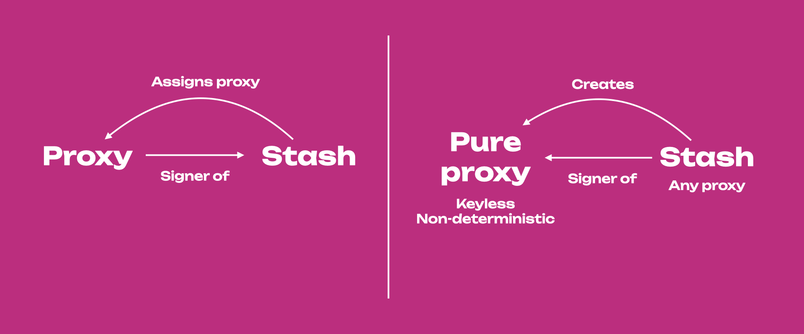
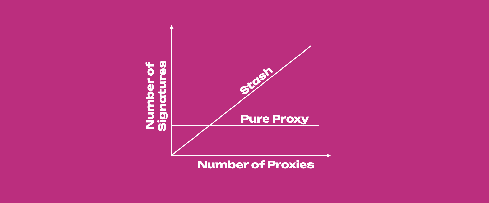
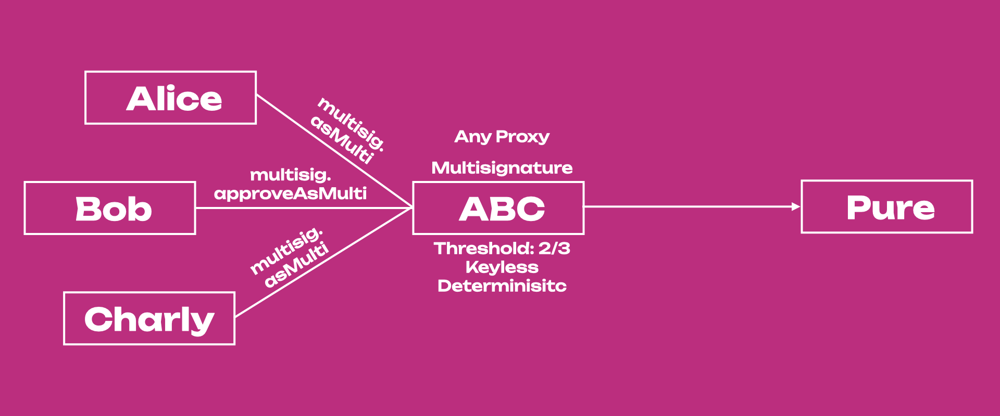

## Anonymous Proxy (Pure Proxy)

:::caution The Account Tab in the Polkadot-JS UI cannot handle complex proxy setups

The Accounts Tab in the Polkadot-JS UI cannot handle complex proxy setups (e.g. a proxy -> multisig
-> a pure proxy which is part of another multisig). These complex setups must be done using the
[Extrinsics Tab](https://polkadot.js.org/apps/#/extrinsics) directly.

**We recommend to use the [Westend Testnet](learn-DOT.md#getting-tokens-on-the-westend-testnet) if
you are testing features for the first time.** By performing the complex proxy setups on the
testnet, you can comfortably replicate the procedure on the main networks.

:::

:::danger Risk of loss of funds

Read carefully the text below and before performing any action using anonymous proxies on
{{ polkadot: Polkadot :polkadot }}{{ kusama: Kusama :kusama }}, experiment on the Westend testnet.

:::

Anonymous proxies (pure proxies) are very different from other proxy types. The proxies we described
so far are _existing accounts_ assigned as proxies by a primary account. These proxies act on behalf
of the primary account, reducing the exposure of the primary account's private key. Remember, the
more often we use an account's private key to sign transactions, the more we expose that key to the
internet, increasing the visibility of that account. The purpose of a proxy is thus to draw the
attention of potential attackers away from the primary account, as proxies' private keys will be
used most of the time to perform actions on behalf of the primary account.

Anonymous proxies (pure proxies) are new accounts that are _created_ (not assigned) by a primary
account. That primary account then acts as _any_ proxy on behalf of the anonymous proxy. Anonymous
proxies are **keyless non-deterministic accounts** as they do not have a private key but they have
an address that is randomly generated. Also, in some sense, nobody owns an anonymous proxy as nobody
has a private key to control them.

:::info Renaming Anonymous Proxies as **Pure Proxies**

Anonymous proxies are not anonymous because they have an address that is spawned by a primary
account acting as _any_ proxy. Even if the _any_ proxy changes, it is still possible to find who
generated the _anonymous_ proxy by going backward using a block explorer. There was thus the need to
change the name of _anonymous_ proxy. People suggested _keyless accounts_ since they do not have a
private key and are proxied accounts. However, multisig accounts are also keyless (but
deterministic). Moreover, even if _anonymous_ proxies are proxied accounts, they can still act as
proxies and control other accounts via proxy calls (see multisig example below). Thus, the name that
has been chosen is **pure proxy**. If you want to know more about the reasoning behind renaming of
pure proxies, see the discussion in [this PR](https://github.com/paritytech/substrate/pull/12283) or
the discussion on
[Polkadot forum](https://forum.polkadot.network/t/parachain-technical-summit-next-steps/51/14).

:::

From now on we will thus use the term pure proxy instead of anonymous proxy.

## Create and Remove Pure Proxy

:::info

To create a **pure proxy** see
[this support article](https://support.polkadot.network/support/solutions/articles/65000182196), or
watch [this technical explainer video](https://www.youtube.com/watch?v=T443RcCYP24).

:::

:::caution Removing Pure Proxies

The procedure for removing a _pure_ proxy is different from the one used to remove other proxies.
Visit the section "Removing an Anonymous Proxy" on
[this support article](https://support.polkadot.network/support/solutions/articles/65000182196), or
watch [this technical explainer video](https://www.youtube.com/watch?v=T443RcCYP24).

:::

:::note Explainer video on Pure Proxies

Learn more about pure proxies from our
[technical explainer video](https://www.youtube.com/watch?v=YkYApbhU3i0).

:::

## Use of Pure Proxy

The use of the _pure proxy_ is strictly bound to the relationship between the _pure proxy_ and the
_any_ proxy. Note that the _any_ proxy does not necessarily be the one who created the _pure proxy_
in the first place. Hence, _pure proxies_ are not really owned by somebody, but they can be
controlled. Once that relationship between the _pure proxy_ and its _any_ proxy is broken, the _pure
proxy_ will be inaccessible (even if visible on the Polkadot-JS UI). Also, _pure proxies_ are
non-deterministic, meaning that if we lose one _pure proxy_, the next one we create from the same
primary account will have a different address.

_Pure proxies_ cannot sign anything because they do not have private keys. However, although they do
not have private keys and cannot sign any transaction directly, they can act as proxies (or better,
proxy channels) within `proxy.proxy` calls (proxy calls). For example, it is possible to have _pure
proxies_ within a multisig. Using proxy calls, it is possible to use the _any_ proxy to call the
_pure_ proxy, which in turn will do a multisig call. More about this later on.

:::danger

Once you remove the relationship with _any_ proxy, the _pure_ proxy will be inaccessible. Also,
_pure_ proxies cannot sign for anything.

:::

## Why Pure Proxy?

Despite their complexity and associated dangers, _pure_ proxies have important benefits that we
discuss below.

### Enhanced Security

_Pure_ proxies cannot be stolen because they do not have private keys. The only accounts that have
full access to the _pure_ proxies are _any_ proxies. Security can be further increased if the _any_
proxy is a multi-signature account.

### Simplified and Secure Account Management

:::info Walk-through tutorial video of Account Management

You can see [this video tutorial](https://www.youtube.com/watch?v=YkYApbhU3i0) that goes through
this scenario. The tutorial requires some familiarity with the Extrinsic Tab of the Polkadot-JS UI.

:::

Probably the greatest benefit of using _pure_ proxies is the management of complex account
relationships at a corporate level. Let's take for example 3 accounts belonging to Charlie, Dan and
Eleanor working for Company X. Charlie holds funds belonging to Company X, but he wants to leave the
company and transfer the economic responsibility to Eleanor. Dan is a staking proxy of Charlie.

**Without _Pure_ Proxy**, Charlie must (see _left_ side of the Figure below):

- Remove Dan as a staking proxy, this step requires 1 signature
- Stop nominating and unbound all funds , this step requires 2 signatures
- Transfer the funds to Eleanor, this step requires 1 signature

Then Eleanor adds Dan as a staking proxy (1 signature). The whole process requires 5 signatures.
Here we are presenting a simple example, in fact, with multi-signature accounts and multiple proxies
the procedure would be more time-consuming and labor-intensive.

**With _Pure_ Proxy** (see _right_ side of the Figure above), Charlie must add Eleanor as _any_
proxy of the _pure_ proxy, and remove himself (or Eleanor can remove him). The process requires just
2 signatures (1 signature to add the new _any_ proxy and 1 signature the remove the old one). The
funds remain in the _pure_ proxy, and it is not necessary to stop nominating or unbond funds. Also,
any proxy relationships with the _pure_ proxy stay in place. Thus, if we use the _pure_ proxy, with
an increasing number of proxies we will always have to sign twice (not necessarily true in
multi-signature accounts). While if we are not using the _pure_ proxy, the more the proxies the more
signatures we need to detach them from the old stash and attach them to the new stash (see Figure
below).

### Multi-signature Account Management

_Pure_ proxies are useful to efficiently manage multi-signature (multisig) accounts. In fact,
multi-signature accounts are deterministic, which means that once a multisig is created the
signatories cannot be changed. If one of the signatories wants to leave the multisig, a new multisig
must be created. This is inconvenient, especially at corporate-level management where the chance of
replacing someone within a multisig can be high. _Pure_ proxies allow keeping the same multisig when
the signatories change.

#### Scenario One: One Pure Proxy within a Multisig

:::info Walk-through tutorial video

You can see [this video tutorial](https://www.youtube.com/watch?v=iGRoGstB_pQ) that goes through
this scenario. The tutorial requires some familiarity with the Extrinsic Tab of the Polkadot-JS UI.

:::

It is possible to put a _pure_ proxy within a multisig, and then transactions will be signed by the
_any_ proxy on behalf of the _pure_ proxy (proxied account). Let's take for example the diagram
below. Alice, Bob and Anon are part of the multisig ABC, a multisig account with threshold 2. P-C is
a _pure_ proxy spawned by Charlie, who now acts as _any_ proxy and thus signs anything on behalf of
P-C. The _pure_ proxy cannot sign directly because it does not have a private key. So, for example,
to send funds from the multisig to Dan, Charly needs to submit a `proxy.proxy` extrinsic to P-C,
which in turn will submit a `multisig.asMulti` extrinsic to ABC containing the call data for the
`balances.transferKeepAlive` extrinsic about the transfer of some funds from ABC to Dan. Alice can
then approve the transfer by submitting a `multisig.asMulti` extrinsic also containing the call data
for the `balances.transferKeepAlive` extrinsic about the transfer of some funds from ABC to Dan.

If Charly wants to leave the multisig, a new _any_ proxy can be added to P-C and Charly can be
removed (by himself or by the new _any_ proxy). Note that the multisig also contains Bob that in
this specific example does not do anything.

:::note Proxy calls

To use a _pure_ proxy within a multisig you need to use the Extrinsic Tab and generate a
`proxy.proxy` extrinsic. If you try to sign a multisig transaction using the _pure_ proxy you will
be prompted with a warning. Remember, you cannot sign something directly if you do not have a
private key.

:::

#### Scenario Two: Multisig made of Pure Proxies

:::info Walk-through Tutorial Video

You can see [this video tutorial](https://www.youtube.com/watch?v=F82C3zDNJyk) that goes through
this scenario. The tutorial requires some familiarity with the Extrinsic Tab of the Polkadot-JS UI.

:::

The diagram below shows a multisig that is made only with _pure_ proxies (P-A, P-B and P-C). In this
situation Alice, Bob or Charly can leave the multisig at any time without the requirement of
creating a new multisig. If for example, Bob leaves the multisig the procedure will require somebody
else to be added as _any_ proxy to P-B, and then Bob can remove himself (or the new _any_ proxy can
remove Bob).

In the diagram above, Alice submits the `proxy.proxy` extrinsic to P-A, which in turn submits the
`multisig.asMulti` extrinsic containing the `balances.transferKeepAlive` extrinsic about the
transfer of some tokens from ABC to Dan. Then, Charly does the same to confirm the transaction. Note
that Charly will need to pay for some weight, for the computation that is necessary to execute the
transaction.

#### Scenario Three: Multisig controlling a Pure Proxy

This setup is used by the [MultiX](./learn-account-multisig.md#multisig-with-multix-tool) tool.

After its creation, a multi-signature account creates a pure proxy that becomes the proxied account.
The multi-signature account behaves as _any_ proxy of the pure. If signatories of the
multi-signature account change, a new multisig can be created, assigned as _any_ proxy of the pure,
and then the old multisig can be removed as a proxy.

Compared to [Scenario Two](#scenario-two-multisig-made-of-pure-proxies), signatories do not need to
create pure proxies here. It is a more practical solution; the number of signatories and threshold
can be changed, but the multisig address will also change. In Scenario Two, if signatories change,
the address of the multisig stays the same. However, changing the number of signatories and
threshold will require the creation of a new multisig.

## Proxy calls

Proxy calls are used by proxies to call proxied accounts. These calls are important for example in
the case of _pure_ proxies, as any attempt to sign transactions with a _pure_ proxy will fail. For
more details see the [dedicated section about anonymous proxies](#anonymous-proxy-pure-proxy).

### Nested Proxy Calls

As the term suggests, nested proxy calls are proxy calls within proxy calls. Such calls are needed
if there are proxied accounts that are proxies themselves. In the example diagram below, Alice has a
stash account that has a _staking_ proxy account, P-C. P-C is a _pure_ proxy, a proxied account
originally spawned by Charly that is now an _any_ proxy of P-C and signs everything on its behalf.

For example, to bond more funds, Charly needs to submit a `prox.proxy` extrinsic to P-C, which in
turn submits a `proxy.proxy` extrinsic to Alice including for example a `staking.bondExtra`
extrinsic, specifying the number of extra tokens that need to be bounded. If Charly wants to leave,
a new account can take his place as any proxy (before Charly leaves!). There is no need to change
the staking proxy account. Also, Alice is the only one who can remove P-C as a staking proxy, and
P-C can only perform staking-related tasks. For example, P-C cannot send funds out from Alice's
account.

Proxy calls can be done using the Extrinsic Tab in the Polkadot-JS UI. Nested proxy calls can be
done by calling each `proxy.proxy` extrinsic separately, or in some cases by just calling the last
`proxy.proxy` extrinsic. In the diagram above, submitting the proxy call from P-C to Alice will
automatically ask for Charly's signature. Thus one proxy call will trigger the second one because
Charly's is the only _any_ proxy of P-C, and P-C cannot sign anything. While if we want to use Bob's
account we will need to submit all three proxy calls.
