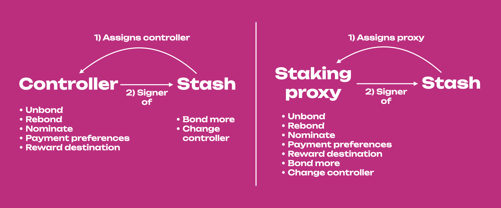
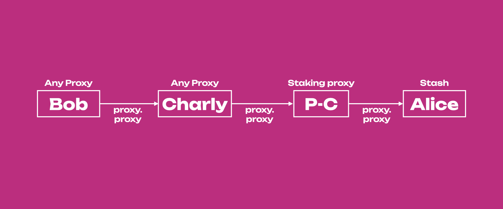
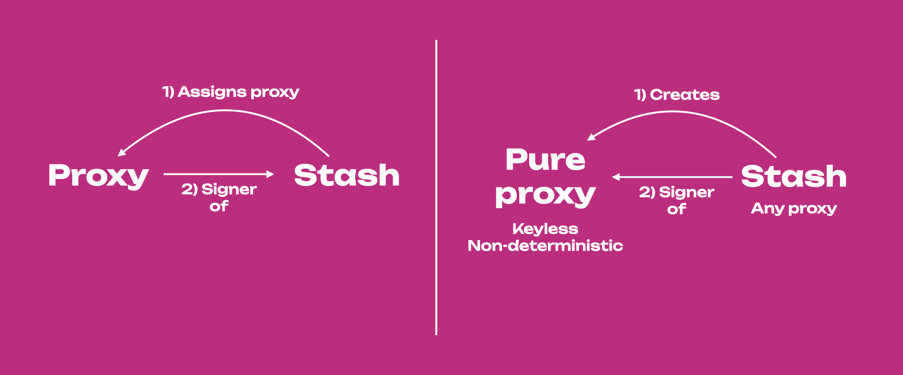
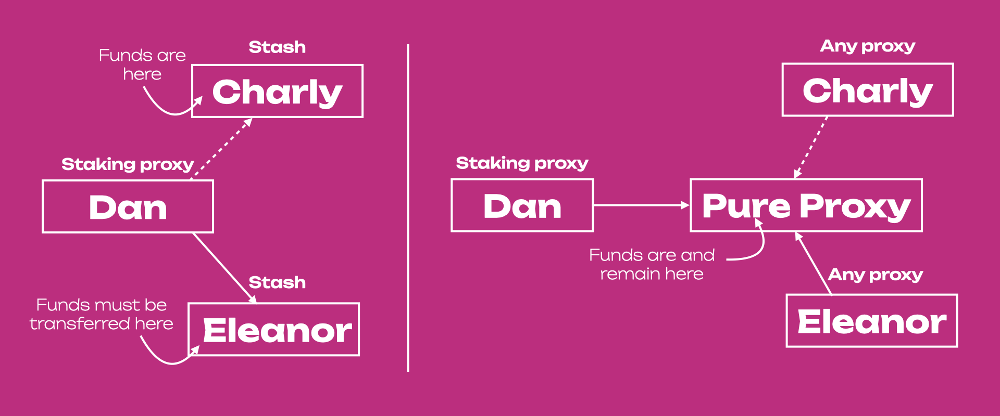
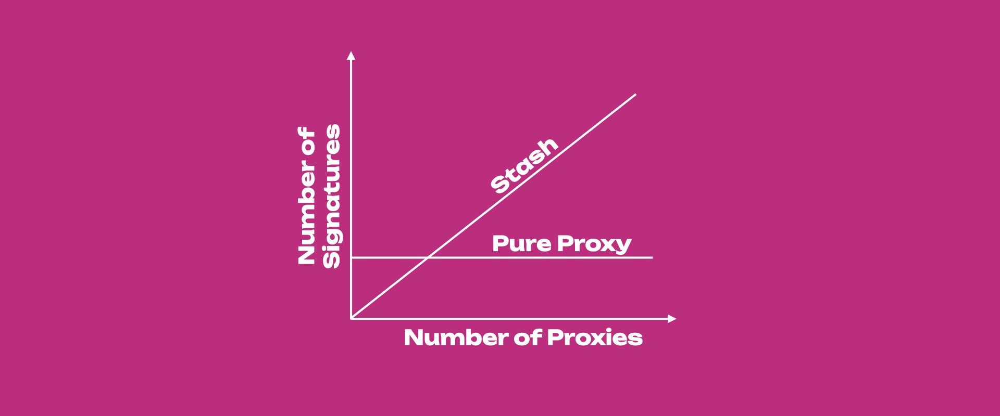
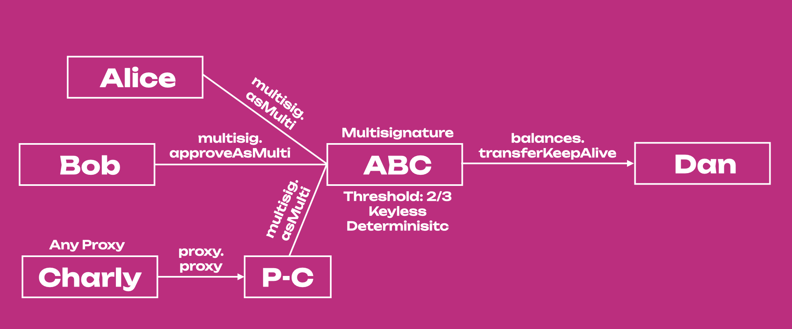

import RPC from "./../../components/RPC-Connection"

Much like controller accounts in
[staking](learn-staking.md#stash-and-controller-accounts-for-staking), proxies allow users to use an
account (it can be in cold storage or a hot wallet) less frequently but actively participate in the
network with the weight of the tokens in that account. Proxies can be viewed as a more powerful and
flexible version of a controller account, i.e. proxies are allowed to perform a limited amount of
actions related to specific [substrate pallets](https://docs.substrate.io/reference/frame-pallets/)
on behalf of another account. The video below contains more information about using proxies.

[](https://www.youtube.com/watch?v=1tcygkq52tU)

## Why use a Proxy?

Proxies are helpful because they let you delegate efficiently and add a layer of security. Rather
than using funds in a single account, smaller accounts with unique roles can complete tasks on
behalf of the main stash account. Proxies can be _hotter_ than the initial account, which can be
kept cold, but the _weight_ of the tokens in the colder account can be used by the hotter accounts.
This increases the security of your accounts by minimizing the number of transactions the cold
account has to make. This also drives attention away from the stash account, although it is possible
to determine the relationship between the proxy and the proxied account.

From the security perspective, we can imagine proxies as bodyguards of a VIP, loyal and ready to
risk their lives to ensure the VIP's protection. But proxies are also useful in other contexts such
as efficient account management at the corporate level. They also provide an elegant solution to
change signatories within multi-signature accounts, and they can be used within proxy calls and
nested proxy calls. In this page we will explore all these interesting use cases of proxies within
the Polkadot ecosystem.

Shown below is an example of how you might use these accounts. Imagine you have one stash account as
your primary token-holding account and don't want to access it very often, but you want to
participate in staking to earn staking rewards. You could set one of your existing accounts as a
staking proxy for that stash account. The stash account is also the controller here, but it does not
matter because you will always use your staking proxy to sign staking-related transactions.



If you just use a controller that is not a staking proxy, the stash account will still have to sign
for some staking-related transactions such as _bond more funds_ and _change controller account_
(Figure _left_). But if you have a staking proxy, everything will be signed by the proxy, making the
stash account even more isolated (Figure _right_). In other words, the account assigned as a staking
proxy of the stash can participate in staking on behalf of that stash. If the proxy is compromised,
it doesn't have access to transfer-related transactions, so the stash account could just set a new
proxy to replace it.

Creating multiple proxy accounts that act for a single account, lets you come up with more granular
security practices around how you protect private keys while still being able to actively
participate in a network.

## Creating Proxy

:::info

To create a **proxy account** read
[this support article](https://support.polkadot.network/support/solutions/articles/65000182179-how-to-create-a-proxy-account).

:::

## Proxy Types

You can set up a proxy account via the proxy pallet. When you set a proxy, you must choose a type of
proxy for the relationship. {{ polkadot: Polkadot :polkadot }}{{ kusama: Kusama :kusama }} offers:

- Any
- Non-transfer
- Governance
- Staking
- Identity Judgement
- Auction

When a proxy account makes a transaction, Polkadot filters the desired transaction to ensure that
the proxy account has the appropriate permission to make that transaction on behalf of the cold
account. For example, staking proxies have permission to do only staking-related transactions.

### Any Proxy

As implied by the name, a proxy type of **Any** allows the proxy account to make any transaction,
including balance transfers. In most cases, this should be avoided as the proxy account is used more
frequently than the cold account and is therefore less secure.

### Non-transfer Proxy

Proxies that are of the type **Non-transfer** are accounts that allow any type of transaction except
[balance transfers](learn-balance-transfers.md) (including [vested](learn-DOT.md/#vesting)
transfers).

### Governance Proxy

The **Governance** type will allow proxies to make transactions related to governance (i.e., from
the Democracy, Council, Treasury, Technical Committee, and Elections pallets).

:::note Explainers on governance proxies

See [Governance](../maintain/maintain-guides-democracy.md#governance-proxies) for more information
on governance proxies or watch our
[technical explainer video that explores this concept](https://www.youtube.com/watch?v=q5qLFhG4SDw&list=PLOyWqupZ-WGuAuS00rK-pebTMAOxW41W8&index=27&ab_channel=Polkadot).

:::

### Staking Proxy

The **Staking** type allows staking-related transactions. Do not confuse a staking proxy with the
controller account. Within the staking pallet, some transactions must come from the stash account,
while others must come from the controller account. The stash account is meant to stay in cold
storage, while the controller account makes day-to-day transactions like setting session keys or
deciding which validators to nominate. The stash account still needs to make some transactions such
as bonding extra funds or designating a new controller account. A proxy doesn't change the _roles_
of stash and controller accounts but does allow the stash to be accessed even less frequently than
using a controller account.

### Identity Judgement Proxy

The **Identity Judgement** proxies are in charge of allowing registrars to make judgments on an
account's identity. If you are unfamiliar with judgment and identities on chain, please refer to
[this page](learn-identity.md#judgements).

### Cancel Proxy

Proxies that are of the type **Cancel** allow accounts to reject and remove any time-delay proxy
announcements.

### Auction Proxy

Proxies that are of the type **Auction** are accounts that allow transactions pertaining to
parachain auctions and crowdloans. The Auction proxy account can sign those transactions on behalf
of an account in cold storage. If you already set up a Non-transfer proxy account, it can do
everything an Auction proxy can do. Before participating in a crowdloan using an Auction proxy, it
is recommended that you check with the respective parachain team for any possible issues pertaining
to the crowdloan rewards distribution.

## Removing Proxy

:::info Removing proxies

Read the section "Removing Proxies" on
[this support page](https://support.polkadot.network/support/solutions/articles/65000182179-how-to-create-a-proxy-account)
to learn how to remove proxies.

:::

## How to view your Proxy

To view your proxy, just go on the _Accounts_ menu in the Polkadot-JS UI, next to the proxied
account you will notice a blue icon. Hover on it, and you will see _Proxy overview_. Click on it and
you will be presented with a list of all proxies for that account.


Additionally, you can head over to the _Chain State_ tab (underneath the _Developer_ menu) on
[Polkadot-JS Apps](https://polkadot.js.org/apps/?rpc=wss%3A%2F%2Frpc.polkadot.io#/chainstate). If
you've created your proxy on a Kusama account, it is required to change your network accordingly
using the top left navigation button. On this page, the proxy pallet should be selected, returning
the announcements and proxies functions. The proxies function will allow you to see your created
proxies for either one account or for all accounts (using the toggle will enable this). Proxy
announcements are what time lock proxies do to announce they are going to conduct an action.


## Proxy Deposits

Proxies require deposits in the native currency (i.e. DOT or KSM) in order to be created. The
deposit is required because adding a proxy requires some storage space on-chain, which must be
replicated across every peer in the network. Due to the costly nature of this, these functions could
open up the network to a Denial-of-Service attack. In order to defend against this attack, proxies
require a deposit to be reserved while the storage space is consumed over the lifetime of the proxy.
When the proxy is removed, so is the storage space, and therefore the deposit is returned.

The deposits are calculated in the runtime, and the function can be found in the runtime code. For
example, the deposits are calculated in Polkadot with the following functions:

```rust
// One storage item; key size 32, value size 8.
pub const ProxyDepositBase: Balance = deposit(1, 8);
// Additional storage item size of 33 bytes.
pub const ProxyDepositFactor: Balance = deposit(0, 33);
```

The `ProxyDepositBase` is the required amount to be reserved for an account to have a proxy list
(creates one new item in storage). For every proxy the account has, an additional amount defined by
the `ProxyDepositFactor` is reserved as well (appends 33 bytes to storage location).

The `ProxyDepositBase` is
{{ polkadot: <RPC network="polkadot" path="consts.proxy.proxyDepositBase" defaultValue={200080000000} filter="humanReadable"/> :polkadot }}
{{ kusama: <RPC network="kusama" path="consts.proxy.proxyDepositBase" defaultValue={66693000000} filter="humanReadable"/> :kusama }}
and the `ProxyDepositFactor` is
{{ polkadot: <RPC network="polkadot" path="consts.proxy.proxyDepositFactor" defaultValue={330000000} filter="humanReadable"/> :polkadot }}{{ kusama: <RPC network="kusama" path="consts.proxy.proxyDepositFactor" defaultValue={110000000} filter="humanReadable"/> :kusama }}.

The required deposit amount for one proxy is equal to:

{{ polkadot: <RPC network="polkadot" path="consts.proxy.proxyDepositBase" defaultValue={200080000000} filter="humanReadable"/> :polkadot }}
{{ kusama: <RPC network="kusama" path="consts.proxy.proxyDepositBase" defaultValue={66693000000} filter="humanReadable"/> :kusama }} +
{{ polkadot: <RPC network="polkadot" path="consts.proxy.proxyDepositFactor" defaultValue={330000000} filter="humanReadable"/> :polkadot }}
{{ kusama: <RPC network="kusama" path="consts.proxy.proxyDepositFactor" defaultValue={110000000} filter="humanReadable"/> :kusama }} \*
num_proxies

## Time-delayed Proxy

We can add a layer of security to proxies by giving them a delay time. The delay will be quantified
in blocks. {{ polkadot: Polkadot :polkadot }}{{ kusama: Kusama :kusama }} has approximately 6
seconds of block time. A delay value of 10 will mean ten blocks, which equals about one minute
delay. The proxy will announce its intended action and will wait for the number of blocks defined in
the delay time before executing it. The proxy will include the hash of the intended function call in
the announcement. Within this time window, the intended action may be canceled by accounts that
control the proxy. Now we can use proxies knowing that any malicious actions can be noticed and
reverted within a delay period.

:::caution The Polkadot-JS UI cannot handle complicated proxy setups

The Polkadot-JS UI cannot handle complicated proxy setups (e.g. a proxy -> multisig -> an anonymous
proxy which is part of another multisig). These complex setups must be done using the
[extrinsics tab](https://polkadot.js.org/apps/#/extrinsics) directly.

These complex proxy setups should only be performed if you are comfortable enough interacting
directly with the chain, as you will be unable to sign extrinsics using the UI.

:::

## Proxy calls

Proxy calls are used by proxies to call proxied accounts. These calls are important for example in the case of
_pure_ proxies, as any attempt to sign transactions with a _pure_ proxy will fail. For more
details see the [dedicated section about anonymous proxies](#anonymous-proxy-pure-proxy).

### Nested Proxy Calls

As the term suggests, nested proxy calls are proxy calls within proxy calls. Such calls are needed
if there are proxied accounts that are proxies themselves. In the example diagram below, Alice has a
stash account that has a _staking_ proxy account, P-C. P-C is a _pure_ proxy, a proxied
account originally spawned by Charly that is now an _any_ proxy of P-C and signs everything on
its behalf.



For example, to bond more funds, Charly needs to submit a `prox.proxy` extrinsic to P-C, which in
turn submits a `proxy.proxy` extrinsic to Alice including for example a `staking.bondExtra` extrinsic,
specifying the number of extra tokens that need to be bounded. If Charly wants to leave, a new account can
take his place as any proxy (before Charly leaves!). There is no need to change the staking proxy
account. Also, Alice is the only one who can remove P-C as a staking proxy, and P-C can only
perform staking-related tasks. For example, P-C cannot send funds out from Alice's account.

Proxy calls can be done using the Extrinsic Tab in the Polkadot-JS UI. Nested proxy calls can be
done by calling each `proxy.proxy` extrinsic separately, or in some cases by just calling the last
`proxy.proxy` extrinsic. In the diagram above, submitting the proxy call from P-C to Alice will automatically ask for Charly's signature. Thus one proxy call will trigger the second one because Charly's is the only _any_ proxy of P-C, and P-C cannot sign anything. While if we want to use Bob's account we will need to submit all three proxy calls.

## Anonymous Proxy (Pure Proxy)

:::danger Risk of loss of funds

Read carefully the text below and before performing any action using anonymous proxies on
{{ polkadot: Polkadot :polkadot }}{{ kusama: Kusama :kusama }}, experiment on the Westend testnet.

:::

Anonymous proxies are very different from other proxy types. The proxies we described so far are
_existing accounts_ assigned as proxies by a primary account. These proxies act on behalf of the
primary account, reducing the exposure of the primary account's private key. Remember, the more
often we use an account's private key to sign transactions, the more we expose that key to the
internet, increasing the visibility of that account. The purpose of a proxy is thus to draw the
attention of potential attackers away from the primary account, as proxies' private keys will be
used most of the time to perform actions on behalf of the primary account.



Anonymous proxies are new accounts that are _created_ (not assigned) by a primary account. That
primary account then acts as _any_ proxy on behalf of the anonymous proxy. Anonymous proxies are **keyless
non-deterministic accounts** as they do not have a private key but they have an address that is
randomly generated. Also, in some sense, nobody owns an anonymous proxy as nobody has a private key to control
them.

:::info Redenomination of anonymous proxies to **pure proxies**

Anonymous proxies are not anonymous because they have an address that is spawned by a primary
account acting as _any_ proxy. Even if the _any_ proxy changes, it is still possible to find who
generated the _anonymous_ proxy by going backward using a block explorer. There was thus the need to change the
name of _anonymous_ proxy. People suggested _keyless accounts_ since they do not have a private key and are
proxied accounts. However, multisig accounts are also keyless (but deterministic). Moreover, even if
_anonymous_ proxies are proxied accounts, they can still act as proxies and control other accounts via proxy
calls (see multisig example below). Thus, the name that has been chosen is **pure proxy**. If you
want to know more about the redenomination of pure proxies you see
[this PR](https://github.com/paritytech/substrate/pull/12283) or the discussion
[here](https://forum.polkadot.network/t/parachain-technical-summit-next-steps/51/14).

:::

From now on we will thus use the term pure proxy instead of anonymous proxy.

### Create and Remove Pure Proxy

:::info

To create a **pure proxy** see
[this support article](https://support.polkadot.network/support/solutions/articles/65000182196), or
watch [this technical explainer video](https://www.youtube.com/watch?v=T443RcCYP24).

:::

:::caution Removing Pure Proxies

The procedure for removing a _pure_ proxy is different from the one used to remove other proxies. Visit the
section "Removing an Anonymous Proxy" on
[this support article](https://support.polkadot.network/support/solutions/articles/65000182196), or
watch [this technical explainer video](https://www.youtube.com/watch?v=T443RcCYP24).

:::

:::note Explainer video on Pure Proxies

Learn more about pure proxies from our
[technical explainer video](https://www.youtube.com/watch?v=YkYApbhU3i0).

:::

### Use of Pure Proxy

The use of the _pure proxy_ is strictly bound to the relationship between the _pure proxy_ and the _any_ proxy.
Note that the _any_ proxy does not necessarily be the one who created the _pure proxy_ in the first place.
Hence, _pure proxies_ are not really owned by somebody, but they can be controlled. Once that relationship
between the _pure proxy_ and its _any_ proxy is broken, the _pure proxy_ will be inaccessible (even if visible
on the Polkadot-JS UI). Also, _pure proxies_ are non-deterministic, meaning that if we lose one
_pure proxy_, the next one we create from the same primary account will have a different address.

_Pure proxies_ cannot sign anything because they do not have private keys. However, although they
do not have private keys and cannot sign any transaction directly, they can act as proxies (or
better, proxy channels) within `proxy.proxy` calls (proxy calls). For example, it is possible to have _pure proxies_
within a multisig. Using proxy calls, it is possible to use the _any_ proxy to call the _pure_ proxy,
which in turn will do a multisig call. More about this later on.

:::danger

Once you remove the relationship with _any_ proxy, the _pure_ proxy will be inaccessible. Also, _pure_ proxies cannot sign for anything.

:::

### Why Pure Proxy?

Despite their complexity and associated dangers, _pure_ proxies have important benefits that we discuss below.

#### Enhanced Security

_Pure_ proxies cannot be stolen because they do not have private keys. The only accounts that have
full access to the _pure_ proxies are _any_ proxies. Security can be further increased if the _any_ proxy is
a multi-signature account.

#### Simplified and Secure Account Management at a Corporate Level

:::info Walk-through tutorial video

You can see [this video tutorial](https://www.youtube.com/watch?v=YkYApbhU3i0) that goes through
this scenario. The tutorial requires some familiarity with the Extrinsic Tab of the Polkadot-JS UI.

:::

Probably the greatest benefit of using _pure_ proxies is the management of complex account
relationships at a corporate level. Let's take for example 3 accounts belonging to Charlie, Dan and
Eleanor working for Company X. Charlie holds funds belonging to Company X, but he wants to leave the
company and transfer the economic responsibility to Eleanor. Dan is a staking proxy of Charlie.

**Without _Pure_ Proxy**, Charlie must (see _left_ side of the Figure below):

- Remove Dan as a staking proxy, this step requires 1 signature
- Stop nominating and unbound all funds , this step requires 2 signatures
- Transfer the funds to Eleanor, this step requires 1 signature

Then Eleanor adds Dan as a staking proxy (1 signature). The whole process requires 5 signatures. Here we are presenting a simple example, in fact, with multi-signature accounts and multiple proxies
the procedure would be more time-consuming and labor-intensive.



**With _Pure_ Proxy** (see _right_ side of the Figure above), Charlie must add Eleanor as _any_ proxy of the
_pure_ proxy, and remove himself (or Eleanor can remove him). The process requires just 2 signatures (1
signature to add the new _any_ proxy and 1 signature the remove the old one). The funds remain in
the _pure_ proxy, and it is not necessary to stop nominating or unbond funds. Also, any proxy
relationships with the _pure_ proxy stay in place. Thus, if we use the _pure_ proxy, with an increasing number
of proxies we will always have to sign twice (not necessarily true in multi-signature accounts).
While if we are not using the _pure_ proxy, the more the proxies the more signatures we need to detach
them from the old stash and attach them to the new stash (see Figure below).



#### Multi-signature Account Management

_Pure_ proxies are useful to efficiently manage multi-signature (multisigs) accounts. In fact,
multisigs are deterministic, which means that once a multisig is created the signatories cannot be
changed. If one of the signatories wants to leave the multisig, a new multisig must be created. This
is inconvenient, especially at corporate-level management where the chance of replacing someone
within a multisig can be high. _Pure_ proxies allow keeping the same multisig when the signatories change.

#### Scenario One: One Anonymous Proxy within a Multisig

:::info Walk-through tutorial video

You can see [this video tutorial](https://www.youtube.com/watch?v=iGRoGstB_pQ) that goes through
this scenario. The tutorial requires some familiarity with the Extrinsic Tab of the Polkadot-JS UI.

:::

It is possible to put a _pure_ proxy within a multisig, and then transactions will be signed by the _any_
proxy on behalf of the _pure_ proxy (proxied account). Let's take for example the diagram below.
Alice, Bob and Anon are part of the multisig ABC, a multisig account with threshold 2. P-C
is a _pure_ proxy spawned by Charlie, who now acts as _any_ proxy and thus signs anything on
behalf of P-C. The _pure_ proxy cannot sign directly because it does not have a private key.
So, for example, to send funds from the multisig to Dan, Charly needs to submit a `proxy.proxy`
extrinsic to P-C, which in turn will submit a `multisig.asMulti` extrinsic to ABC containing
the call data for the `balances.transferKeepAlive` extrinsic about the transfer of some funds from
ABC to Dan. Alice can then approve the transfer by submitting a `multisig.asMulti` extrinsic
also containing the call data for the `balances.transferKeepAlive` extrinsic about the transfer of
some funds from ABC to Dan.



If Charly wants to leave the multisig, a new _any_ proxy can be added to P-C and Charly can be
removed (by himself or by the new _any_ proxy). Note that the multisig also contains Bob that in this
specific example does not do anything.

:::note Proxy calls

To use a _pure_ proxy within a multisig you need to use the Extrinsic Tab and generate a
`proxy.proxy` extrinsic. If you try to sign a multisig transaction using the _pure_ proxy you
will be prompted with a warning. Remember, you cannot sign something directly if you do not have a
private key.

:::

#### Scenario Two: Multisig made of Anonymous Proxies

:::info Walk-through Tutorial Video

You can see this video tutorial that goes through this scenario. The tutorial requires some
familiarity with the Extrinsic Tab of the Polkadot-JS UI.

:::

The diagram below shows a multisig that is made only with _pure_ proxies (P-A, P-B and P-C). In this situation
Alice, Bob or Charly can leave the multisig at any time without the requirement of creating a new
multisig. If for example, Bob leaves the multisig the procedure will require somebody else to be
added as _any_ proxy to P-B, and then Bob can remove himself (or the new _any_ proxy can remove
Bob).


In the diagram above, Alice submits the `proxy.proxy` extrinsic to P-A, which in turn
submits the `multisig.asMulti` extrinsic containing the `balances.transferKeepAlive` extrinsic
about the transfer of some tokens from ABC to Dan. Then, Charly does the same to confirm the
transaction. Note that Charly will need to pay for some weight, for the computation that is
necessary to execute the transaction.
