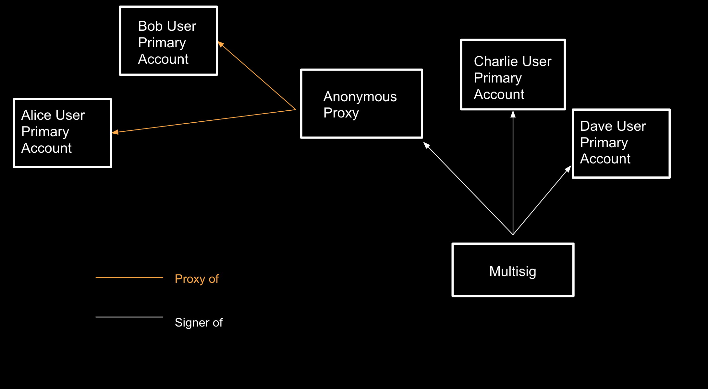

import RPC from "./../../components/RPC-Connection"

Much like controller accounts in
[staking](learn-staking.md), proxies allow users to use an account (it can be a stash account in cold storage or another account in a hot wallet) less frequently but actively
participate in the network with the weight of the tokens in that account. Proxies can be viewed as an "extreme" version of a controller account, i.e. proxies are allowed to perform a limited amount of actions related to specific [substrate pallets](https://docs.substrate.io/reference/frame-pallets/). Check out the video below about proxies.

[](https://www.youtube.com/watch?v=1tcygkq52tU)

## Anonymous Proxies

This proxy category is used to access a designated primary account. That is, it generates an address but no corresponding private key. Normally, a primary
account designates a proxy account, but anonymous proxies are the opposite. The account that creates
the proxy relationship is the proxy account and the new account is the primary. 

:::danger Use extreme care with anonymous proxies. Once you remove the proxy relationship, the proxy account will be inaccessible.

:::


:::note Explainer video on anonymous proxies

Learn more about anonymous proxies from our
[technical explainer video](https://www.youtube.com/watch?v=iWq53zXo7dw&list=PLOyWqupZ-WGuAuS00rK-pebTMAOxW41W8&index=28&ab_channel=Polkadot).

:::

## Time-delayed Proxies

We can add an additional layer of security to proxies by giving them a delay time. The delay will be
quantified in number of blocks. {{ polkadot: Polkadot :polkadot }}{{ kusama: Kusama :kusama }} has 6 
seconds of block-time. A delay value of 10 will mean 10 blocks, which equals to 1 minute of delay.
The proxy will announce it's intended action and wait for the number
of blocks defined in the delay time before executing it. The proxy will include the hash of the
intended function call in the announcement. Within this time window, the intended action may be
cancelled by accounts that control the proxy. Now we can use proxies knowing that any malicious
actions can be noticed and reverted within a delay period.

:::caution The Polkadot-JS UI cannot handle complicated proxy setups

The Polkadot-JS UI cannot handle complicated proxy setups (e.g. a proxy -> multisig 
-> an anonymous proxy which is part of another multisig). These complex setups must be done using the 
[extrinsics tab](https://polkadot.js.org/apps/#/extrinsics) directly.

These complex proxy setups should only be performed if you are comfortable enough interacting directly with 
the chain, as you will be unable to sign extrinsics using the UI.

:::

## Why use a Proxy?

Proxies are great to use for specific purposes because they add in a layer of security. Rather than
using funds in one sole account, smaller accounts with unique roles complete tasks for the main
stash account. This drives attention away from the main account and to proxies.

Anonymous proxies, in particular, can be used for permissionless management. In this example below,
there is a multisig with four different accounts inside. Two of the accounts, Alice and Bob, have an
anonymous proxy attached to them. In the case that the multisig account wanted to add or remove
Alice or Bob or even add in a new account into the anonymous proxy, the anonymous proxy would take
care of that change. If a multisig wanted to modify itself without an anonymous proxy, a whole new
multisig would be created.



## Proxy Types

You can set a proxy account via the Proxy module. When you set a proxy, you must choose a type of
proxy for the relationship. Polkadot offers:

- Any
- Non-transfer
- Governance
- Staking
- Identity Judgement
- Auction

When a proxy account makes a `proxy` transaction, Polkadot filters the desired transaction to ensure
that the proxy account has the appropriate permission to make that transaction on behalf of the cold
account.

### Any

As implied by the name, a proxy type of **Any** allows the proxy account to make any transaction,
including balance transfers. In most cases, this should be avoided as the proxy account is used more
frequently than the cold account and is therefore less secure.

### Non-transfer

Proxies that are of the type **Non-transfer** are accounts that allow any type of transaction except
[balance transfers](learn-balance-transfers.md) (including [vested](learn-DOT.md/#vesting) transfers).

### Governance

The **Governance** type will allow proxies to make transactions related to governance (i.e., from the
Democracy, Council, Treasury, Technical Committee, and Elections pallets).

:::note Explainers on governance proxies

See [Governance](../maintain/maintain-guides-democracy.md#governance-proxies) for more information on
governance proxies or watch our
[technical explainer video that explores this concept](https://www.youtube.com/watch?v=q5qLFhG4SDw&list=PLOyWqupZ-WGuAuS00rK-pebTMAOxW41W8&index=27&ab_channel=Polkadot).

:::

### Staking

The **Staking** type allows staking-related transactions, but do not confuse a staking proxy with the
controller account. Within the staking pallet, some transactions must come from the stash account, while
others must come from the controller account. The stash account is meant to stay in cold storage, while the
controller account makes day-to-day transactions like setting session keys or deciding which
validators to nominate. The stash account still needs to make some transactions such as bonding extra funds or designating a new controller account. A proxy doesn't change the _roles_ of stash and
controller accounts, but does allow the stash to be accessed even less frequently than using a controller account.

### Identity Judgement

The **Identity Judgement** proxies are in charge of allowing registrars to make judgement on an account's
identity. If you are unfamiliar with judgements and identities on chain, please refer to
[this page](learn-identity.md#judgements).

### Cancel

Proxies that are of the type **Cancel** allow accounts to reject and remove any time-delay proxy 
announcements.

### Auction

Proxies that are of the type **Auction** are accounts that allow transactions pertaining to parachain 
auctions and crowdloans. The Auction proxy account can sign those transactions on behalf of an account 
in cold storage. If you already setup a Non-transfer proxy account, it can do everything an Auction 
proxy can do. Before participating in a crowdloan using an Auction proxy, it is recommended that you 
check with the respective parachain team for any possible issues pertaining to the crowdloan rewards 
distribution.

## Creating Proxies

:::info

To create a **proxy account** read [this support article](https://support.polkadot.network/support/solutions/articles/65000182179-how-to-create-a-proxy-account), while to create an **anonymous proxy account** you check out [this other support article](https://support.polkadot.network/support/solutions/articles/65000182196).

:::

## Removing Proxies

:::info Removing proxies

The remove proxies read the section "Removing Proxies" on [this support page](https://support.polkadot.network/support/solutions/articles/65000182179-how-to-create-a-proxy-account).

:::

:::caution Removing anonymous proxies

The procedure for removing an Anonymous Proxy is different. Visit the section "Removing an Anonymous Proxy" on [this support article](https://support.polkadot.network/support/solutions/articles/65000182196).

:::

## How to view your Proxies

To view your proxy, head over to the Chain State (underneath "Developer") page on
[Polkadot-JS Apps](https://polkadot.js.org/apps/?rpc=wss%3A%2F%2Frpc.polkadot.io#/chainstate). If
you've created your proxy on a Kusama account, it is required to change your network accordingly
using the top left navigation button. On this page, the proxy pallet should be selected, returning
the announcements and proxies functions. The proxies function will allow you to see your created
proxies for either one account or for all accounts (using the toggle will enable this). Proxy
announcements are what time lock proxies do to announce they are going to conduct an action.


## Putting It All Together

If the idea of proxy types and their application seems abstract, it is. Here is an example of how
you might use these accounts. Imagine you have one account as your primary token-holding account,
and don't want to access it very often, but you do want to participate in governance and staking.
You could set Governance and Staking proxies.


In this example, the primary account A would only make two transactions to set account B as its
governance proxy and account C as its staking proxy. Now, account B could participate in governance
activity on behalf of A.

Likewise, account C could perform actions typically associated with a stash account, like bonding
funds and setting a Controller, in this case account D. Actions that normally require the Stash,
like bonding extra tokens or setting a new Controller, can all be handled by its proxy account C. In
the case that account C is compromised, it doesn't have access to transfer-related transactions, so
the primary account could just set a new proxy to replace it.

By creating multiple accounts that act for a single account, it lets you come up with more granular
security practices around how you protect private keys while still being able to actively
participate in a network.

## Proxy Deposits

Proxies require deposits in the native currency (i.e. DOT or KSM) in order to be created. The
deposit is required because adding a proxy requires some storage space on-chain, which must be
replicated across every peer in the network. Due to the costly nature of this, these functions could
open up the network to a Denial-of-Service attack. In order to defend against this attack, proxies
require a deposit to be reserved while the storage space is consumed over the life time of the
proxy. When the proxy is removed, so is the storage space, and therefore the deposit is returned.

The deposits are calculated in the runtime, and the function can be found in the runtime code. For
example, the deposits are calculated in Polkadot with the following functions:

```rust
// One storage item; key size 32, value size 8.
pub const ProxyDepositBase: Balance = deposit(1, 8);
// Additional storage item size of 33 bytes.
pub const ProxyDepositFactor: Balance = deposit(0, 33);
```

The `ProxyDepositBase` is the required amount to be reserved for an account to have a proxy list
(creates one new item in storage). For every proxy the account has, an additional amount defined by
the `ProxyDepositFactor` is reserved as well (appends 33 bytes to storage location).

The `ProxyDepositBase` is 
{{ polkadot: <RPC network="polkadot" path="consts.proxy.proxyDepositBase" defaultValue={200080000000} filter="humanReadable"/> :polkadot }}
{{ kusama: <RPC network="kusama" path="consts.proxy.proxyDepositBase" defaultValue={66693000000} filter="humanReadable"/> :kusama }}
and the `ProxyDepositFactor` is 
{{ polkadot: <RPC network="polkadot" path="consts.proxy.proxyDepositFactor" defaultValue={330000000} filter="humanReadable"/> :polkadot }}{{ kusama: <RPC network="kusama" path="consts.proxy.proxyDepositFactor" defaultValue={110000000} filter="humanReadable"/> :kusama }}.

The required deposit amount for one proxy is equal to:

{{ polkadot: <RPC network="polkadot" path="consts.proxy.proxyDepositBase" defaultValue={200080000000} filter="humanReadable"/> :polkadot }}
{{ kusama: <RPC network="kusama" path="consts.proxy.proxyDepositBase" defaultValue={66693000000} filter="humanReadable"/> :kusama }} + 
{{ polkadot: <RPC network="polkadot" path="consts.proxy.proxyDepositFactor" defaultValue={330000000} filter="humanReadable"/> :polkadot }}
{{ kusama: <RPC network="kusama" path="consts.proxy.proxyDepositFactor" defaultValue={110000000} filter="humanReadable"/> :kusama }} * num_proxies

## Resources
[Proxy pallet documentation](https://crates.parity.io/pallet_proxy/index.html)
