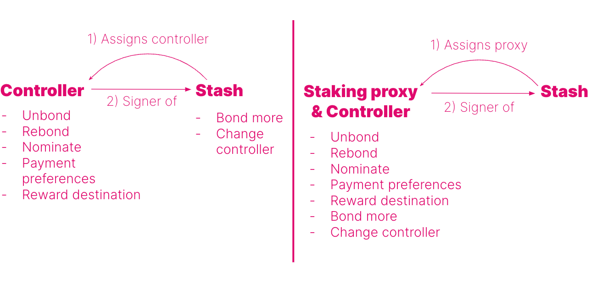
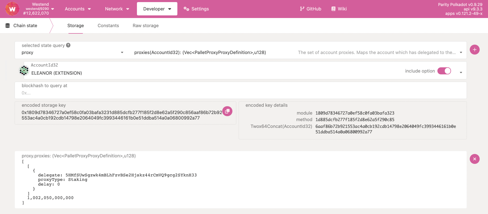
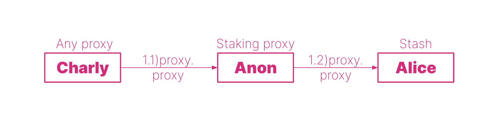
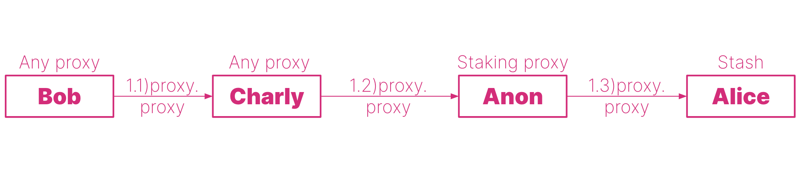
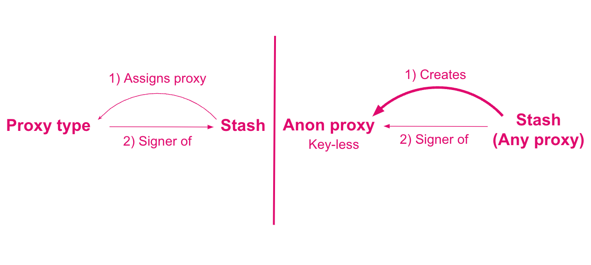
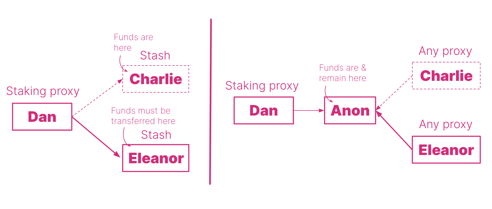
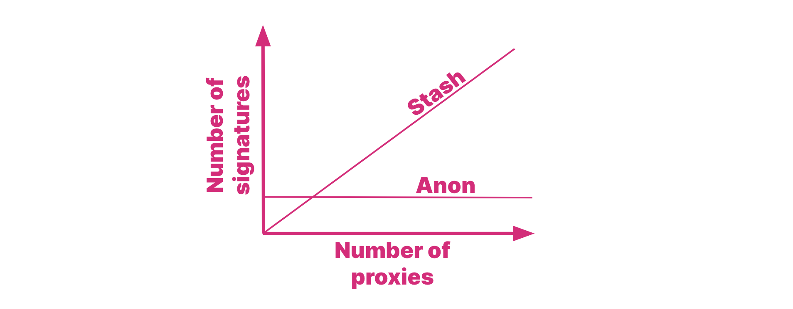
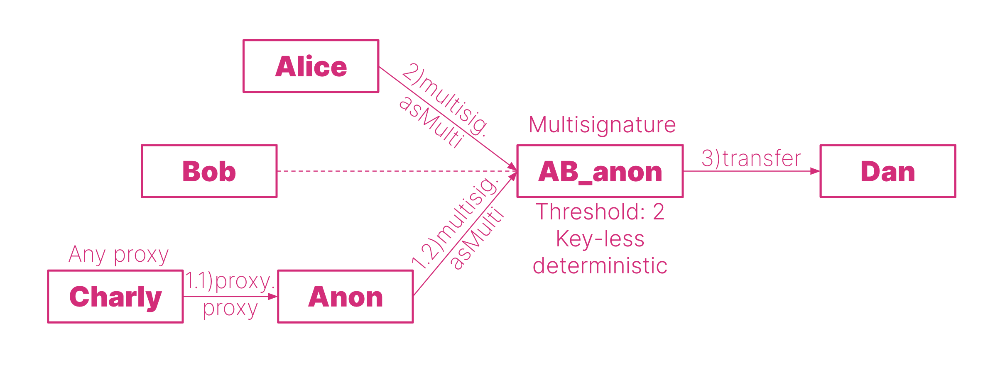

import RPC from "./../../components/RPC-Connection"

Much like controller accounts in
[staking](learn-staking.md#stash-and-controller-accounts-for-staking), proxies allow users to use an account (it can be in cold storage or a hot wallet) less frequently but actively
participate in the network with the weight of the tokens in that account. Proxies can be viewed as a more powerful and flexible version of a controller account, i.e. proxies are allowed to perform a limited amount of actions related to specific [substrate pallets](https://docs.substrate.io/reference/frame-pallets/) on behalf of another account. The video below contains more information about using proxies.

[](https://www.youtube.com/watch?v=1tcygkq52tU)

## Why use a Proxy?

Proxies are helpful because they let you delegate efficiently and add a layer of security. Rather than
using funds in a single account, smaller accounts with unique roles can complete tasks on behalf of the main
stash account.  Proxies can be _hotter_ than the initial account, which can be kept cold, but the _weight_ of the tokens in the colder account can be used by the hotter accounts. This increases the security of your accounts by minimizing the number of transactions the cold account has to make. This also drives attention away from the stash account, although it is possible to determine the relationship between the proxy and the proxied account.

Shown below is an example of how you might use these accounts. Imagine you have one stash account as your primary token-holding account and don't want to access it very often, but you want to participate in staking to earn staking rewards. You could set one of your existing accounts as a staking proxy for that stash account. The stash account is also the controller here, but it does not matter because you will always use your staking proxy to sign staking-related transactions.



If you just use a controller that is not a staking proxy, the stash account will still have to sign for some staking-related transactions such as _bond more funds_ and _change controller account_ (Figure _left_). But if you have a staking proxy, everything will be signed by the proxy, making the stash account even more isolated (Figure _right_). In other words, the account assigned as a staking proxy of the stash can participate in staking on behalf of that stash. If the proxy is compromised, it doesn't have access to transfer-related transactions, so
the stash account could just set a new proxy to replace it.

Creating multiple proxy accounts that act for a single account, lets you come up with more granular
security practices around how you protect private keys while still being able to actively
participate in a network.

## Creating Proxies

:::info

To create a **proxy account** read [this support article](https://support.polkadot.network/support/solutions/articles/65000182179-how-to-create-a-proxy-account).

:::

## Proxy Types

You can set up a proxy account via the proxy pallet. When you set a proxy, you must choose a type of
proxy for the relationship. {{ polkadot: Polkadot :polkadot }}{{ kusama: Kusama :kusama }} offers:

- Any
- Non-transfer
- Governance
- Staking
- Identity Judgement
- Auction

When a proxy account makes a transaction, Polkadot filters the desired transaction to ensure
that the proxy account has the appropriate permission to make that transaction on behalf of the cold
account. For example, staking proxies have permission to do only staking-related transactions.

### Any Proxy

As implied by the name, a proxy type of **Any** allows the proxy account to make any transaction,
including balance transfers. In most cases, this should be avoided as the proxy account is used more
frequently than the cold account and is therefore less secure.

### Non-transfer Proxy

Proxies that are of the type **Non-transfer** are accounts that allow any type of transaction except
[balance transfers](learn-balance-transfers.md) (including [vested](learn-DOT.md/#vesting) transfers).

### Governance

The **Governance** type will allow proxies to make transactions related to governance (i.e., from the
Democracy, Council, Treasury, Technical Committee, and Elections pallets).

:::note Explainers on governance proxies

See [Governance](../maintain/maintain-guides-democracy.md#governance-proxies) for more information on
governance proxies or watch our
[technical explainer video that explores this concept](https://www.youtube.com/watch?v=q5qLFhG4SDw&list=PLOyWqupZ-WGuAuS00rK-pebTMAOxW41W8&index=27&ab_channel=Polkadot).

:::

### Staking

The **Staking** type allows staking-related transactions. Do not confuse a staking proxy with the
controller account. Within the staking pallet, some transactions must come from the stash account, while
others must come from the controller account. The stash account is meant to stay in cold storage, while the
controller account makes day-to-day transactions like setting session keys or deciding which
validators to nominate. The stash account still needs to make some transactions such as bonding extra funds or designating a new controller account. A proxy doesn't change the _roles_ of stash and controller accounts but does allow the stash to be accessed even less frequently than using a controller account.

### Identity Judgement

The **Identity Judgement** proxies are in charge of allowing registrars to make judgments on an account's
identity. If you are unfamiliar with judgment and identities on chain, please refer to
[this page](learn-identity.md#judgements).

### Cancel

Proxies that are of the type **Cancel** allow accounts to reject and remove any time-delay proxy 
announcements.

### Auction

Proxies that are of the type **Auction** are accounts that allow transactions pertaining to parachain 
auctions and crowdloans. The Auction proxy account can sign those transactions on behalf of an account 
in cold storage. If you already set up a Non-transfer proxy account, it can do everything an Auction 
proxy can do. Before participating in a crowdloan using an Auction proxy, it is recommended that you 
check with the respective parachain team for any possible issues pertaining to the crowdloan rewards 
distribution.

## Removing Proxies

:::info Removing proxies

Read the section "Removing Proxies" on [this support page](https://support.polkadot.network/support/solutions/articles/65000182179-how-to-create-a-proxy-account) to learn how to remove proxies.

:::

## How to view your Proxies

To view your proxy, just go on the _Accounts_ menu in the Polkadot-JS UI, next to the proxied account you will notice a blue icon. Hover on it, and you will see _Proxy overview_. Click on it and you will be presented with a list of all proxies for that account.


Additionally, you can head over to the _Chain State_ tab (underneath the _Developer_ menu) on
[Polkadot-JS Apps](https://polkadot.js.org/apps/?rpc=wss%3A%2F%2Frpc.polkadot.io#/chainstate). If
you've created your proxy on a Kusama account, it is required to change your network accordingly
using the top left navigation button. On this page, the proxy pallet should be selected, returning
the announcements and proxies functions. The proxies function will allow you to see your created
proxies for either one account or for all accounts (using the toggle will enable this). Proxy
announcements are what time lock proxies do to announce they are going to conduct an action.



## Proxy Deposits

Proxies require deposits in the native currency (i.e. DOT or KSM) in order to be created. The
deposit is required because adding a proxy requires some storage space on-chain, which must be
replicated across every peer in the network. Due to the costly nature of this, these functions could
open up the network to a Denial-of-Service attack. In order to defend against this attack, proxies
require a deposit to be reserved while the storage space is consumed over the lifetime of the
proxy. When the proxy is removed, so is the storage space, and therefore the deposit is returned.

The deposits are calculated in the runtime, and the function can be found in the runtime code. For
example, the deposits are calculated in Polkadot with the following functions:

```rust
// One storage item; key size 32, value size 8.
pub const ProxyDepositBase: Balance = deposit(1, 8);
// Additional storage item size of 33 bytes.
pub const ProxyDepositFactor: Balance = deposit(0, 33);
```

The `ProxyDepositBase` is the required amount to be reserved for an account to have a proxy list
(creates one new item in storage). For every proxy the account has, an additional amount defined by
the `ProxyDepositFactor` is reserved as well (appends 33 bytes to storage location).

The `ProxyDepositBase` is 
{{ polkadot: <RPC network="polkadot" path="consts.proxy.proxyDepositBase" defaultValue={200080000000} filter="humanReadable"/> :polkadot }}
{{ kusama: <RPC network="kusama" path="consts.proxy.proxyDepositBase" defaultValue={66693000000} filter="humanReadable"/> :kusama }}
and the `ProxyDepositFactor` is 
{{ polkadot: <RPC network="polkadot" path="consts.proxy.proxyDepositFactor" defaultValue={330000000} filter="humanReadable"/> :polkadot }}{{ kusama: <RPC network="kusama" path="consts.proxy.proxyDepositFactor" defaultValue={110000000} filter="humanReadable"/> :kusama }}.

The required deposit amount for one proxy is equal to:

{{ polkadot: <RPC network="polkadot" path="consts.proxy.proxyDepositBase" defaultValue={200080000000} filter="humanReadable"/> :polkadot }}
{{ kusama: <RPC network="kusama" path="consts.proxy.proxyDepositBase" defaultValue={66693000000} filter="humanReadable"/> :kusama }} + 
{{ polkadot: <RPC network="polkadot" path="consts.proxy.proxyDepositFactor" defaultValue={330000000} filter="humanReadable"/> :polkadot }}
{{ kusama: <RPC network="kusama" path="consts.proxy.proxyDepositFactor" defaultValue={110000000} filter="humanReadable"/> :kusama }} * num_proxies

## Time-delayed Proxies

We can add a layer of security to proxies by giving them a delay time. The delay will be
quantified in a number of blocks. {{ polkadot: Polkadot :polkadot }}{{ kusama: Kusama :kusama }} has approximately 6 seconds of block time. A delay value of 10 will mean 10 blocks, which equals approximately 1 minute of delay.
The proxy will announce its intended action and wait for the number
of blocks defined in the delay time before executing it. The proxy will include the hash of the
intended function call in the announcement. Within this time window, the intended action may be canceled by accounts that control the proxy. Now we can use proxies knowing that any malicious
actions can be noticed and reverted within a delay period.

:::caution The Polkadot-JS UI cannot handle complicated proxy setups

The Polkadot-JS UI cannot handle complicated proxy setups (e.g. a proxy -> multisig 
-> an anonymous proxy which is part of another multisig). These complex setups must be done using the 
[extrinsics tab](https://polkadot.js.org/apps/#/extrinsics) directly.

These complex proxy setups should only be performed if you are comfortable enough interacting directly with 
the chain, as you will be unable to sign extrinsics using the UI.

:::

## Proxy calls 

Proxy calls are used by proxies to call proxied accounts. These calls are especially important for anonymous proxies, as any attempt to sign transactions with an anonymous proxy will fail. For more details see the [dedicated section about anonymous proxies](#anonymous-proxies).

:::info Walk-through tutorial video

You can see this video tutorial that goes through the scenarios below. The tutorial requires some familiarity with the Extrinsic Tab of the Polkadot-JS UI.

:::

### Nested Proxy Calls

As the term suggests, nested proxy calls are proxy calls within proxy calls. Such calls are needed if there are proxied accounts that are proxies themselves. In the example diagram below, Alice has a stash account that has a staking proxy account, Anon. Anon is an anonymous proxy, a proxied account originally spawned by Charly that is now a any proxy of Anon and signs everything on its behalf.



In this case, for example to bond more funds, Charly needs to submit a `prox.proxy` extrinsic to Anon, which in turn submits a `proxy.proxy` extrinsic to Alice including a `staking.bondExtra` extrinsic call, specifying the number of tokens that need to be bounded. If Charly wants to leave, a new account can take his place as any proxy (before Charly leaves!). There is no need to change the staking proxy account. Also, Alice is the only one who can remove Anon as a staking proxy, and Anon can only perform staking-related tasks. For example, Anon cannot send funds out from Alice's account.

:::note

Proxy calls can be done using the Extrinsic Tab in the Polkadot-JS UI. Nested proxy calls can be done by calling each `proxy.proxy` extrinsic separately, or in some cases by just calling the last `proxy.proxy` extrinsic. In the diagram above, submitting Extrinsic (1.2) will automatically ask for the signature of Extrinsic (1.1). In the diagram below, submitting Extrinsic (1.3) will still ask for the signature of Extrinsic (1.2) and not (1.1). If you wish to sign with Bob's account you need to manually submit all three extrinsics.

:::



## Anonymous Proxies

:::info

To create an **anonymous proxy account** see [this support article](https://support.polkadot.network/support/solutions/articles/65000182196), or watch [this technical explainer video](https://www.youtube.com/watch?v=T443RcCYP24).

:::

:::note Explainer video on anonymous proxies

Learn more about anonymous proxies from our
[technical explainer video](https://www.youtube.com/watch?v=YkYApbhU3i0).

:::

:::danger Risk of loss of funds

Read carefully the text below and before performing any action using anonymous proxies on {{ polkadot: Polkadot :polkadot }}{{ kusama: Kusama :kusama }}, experiment on the Westend testnet.

:::

Anonymous proxies are very different from other proxy types. Proxies that we described so far are _existing accounts_ assigned as proxies by a primary account. These proxies act on behalf of the primary account reducing the exposure of the primary account's private key. Remember, the more often we use an account's private key to sign for different things, the more we expose that key to the internet, increasing the visibility of that account. The purpose of a proxy is thus to draw the attention of potential attackers away from the primary account, as proxies' private keys will be used most of the time to perform actions on behalf of the primary account. We can imagine proxies as bodyguards of a VIP, loyal and ready to risk their lives to ensure the VIP's protection.



Anonymous proxies are new accounts that are _created_ (not assigned) by a primary account. That primary account then acts as `any proxy` on behalf of the anonymous proxy. Note that, to avoid confusion, in this section we will refer to `Anon` for anonymous proxy. Anon are **key-less anonymous accounts** as they do have an address but do not have a corresponding private key and, in some sense, are anonymous as nobody has a private key to control it. The use of the Anon is strictly bound to the relationship between the Anon and the `Any` proxy (not necessarily the one who created the Anon in the first place). Once that relationship is broken, the Anon will be inaccessible (even if visible on the Polkadot-JS UI). Also, Anon accounts are non-deterministic, this means that if we lose one Anon, the next one we create from the same primary account will have a different address.

Anon accounts cannot sign anything because they do not have private keys. As a consequence, Anon cannot act as proxies (which is admittedly confusing given their original name), and cannot be included in multi-sig. An Anon account acting as a proxy will not be able to sign anything on behalf of the primary account, and an Anon within a multi-sig will be able neither to initiate nor to approve any call.

:::danger 

Once you remove the relationship with `Any` proxy, the Anon will be inaccessible. Also, Anon accounts cannot sign for anything. For example, do not include Anon in a multi-sig account.

:::

:::caution Removing anonymous proxies

The procedure for removing an Anon is different from the one used to remove proxies. Visit the section "Removing an Anonymous Proxy" on [this support article](https://support.polkadot.network/support/solutions/articles/65000182196), or watch [this technical explainer video](https://www.youtube.com/watch?v=T443RcCYP24).

:::

## Why Anonymous Proxies?

Despite their complexity and associated dangers, _Anon_ accounts have important benefits. We discuss these benefits below.

### Enhanced Security
Anon accounts cannot be stolen because they do not have private keys. The only accounts that have full access to the _Anon_ are _Any_ proxies. Security can be further increased if the _Any_ proxy is a multi-signature account.

### Simplified and Secure Account Management at a Corporate Level

:::info Walk-through tutorial video

You can see [this video tutorial](https://www.youtube.com/watch?v=YkYApbhU3i0) that goes through this scenario. The tutorial requires some familiarity with the Extrinsic Tab of the Polkadot-JS UI.

:::

Probably the greatest benefit of using _Anon_ accounts is the management of complex account relationships at a corporate level. Let's take for example 3 accounts belonging to Charlie, Dan and Eleanor working for Company X. Charlie holds funds belonging to Company X, but he wants to leave the company and transfer the economic responsibility to Eleanor. Dan is a staking proxy of Charlie.

**Without Anon**, Charlie must (see _left_ side of the Figure below):
- Remove Dan as a staking proxy, this step requires 1 signature
- Stop nominating and unbound all funds , this step requires 2 signatures
- Transfer the funds to Eleanor, this step requires 1 signature

Then Eleanor adds Dan as a staking proxy (1 signature). The whole process requires 5 signatures; and here we are presenting a simple example, in fact, with multi-signature accounts and multiple proxies the procedure would be more time-consuming and labor-intensive.



**With Anon** (see _right_ side of the Figure above), Charlie must add Eleanor as Any proxy of the Anon, and remove himself (or Eleanor can remove him). The process requires just 2 signatures (1 signature to add the new Any proxy and 1 signature the remove the old one). The funds remain in the Anon, and it is not necessary to stop nominating or unbond funds. Also, any proxy relationships with the Anon stay in place. Thus, if we use the Anon, with an increasing number of proxies we will always have to sign twice (not necessarily true in multi-signature accounts). While if we are not using the Anon, the more the proxies the more signatures we need to detach them from the old stash and attach them to the new stash (see Figure below).



### Multi-signature Account Management

Anonymous proxies are useful to efficiently manage multi-signature (multisigs) accounts. In fact, multisigs are deterministic, which means that once a multisig is created the signatories cannot be changed. If one of the signatories wants to leave the multisig, a new multisig must be created. This is inconvenient, especially at corporate-level management where the chance of replacing someone within a multisig can be high.

#### One Anonymous Proxy within a Multisig

:::info Walk-through tutorial video

You can see [this video tutorial](https://www.youtube.com/watch?v=iGRoGstB_pQ) that goes through this scenario. The tutorial requires some familiarity with the Extrinsic Tab of the Polkadot-JS UI.

:::

It is possible to put an anonymous proxy within a multisig, and then transactions will be signed by the _any proxy(ies)_ on behalf of the anonymous proxy (proxied account). Let's take for example the diagram below. Alice, Bob and Anon are part of the multisig AB_anon, a multisig account with threshold 2. Anon is an anonymous proxy spawned by Charlie, who now acts as any proxy and thus signs anything on behalf of Anon. The anonymous proxy cannot sign directly because it does not have a private key. So, for example, to send funds from the multisig to Dan, Charly needs to submit a `proxy.proxy` extrinsic to Anon, which in turn will submit a `multisg.asMulti` extrinsic to AB_anon containing the call data for the `balances.transferKeepAlive` extrinsic about the transfer of some funds from AB_anon to Dan. Alice can then approve the transfer by submitting a multisig.asMulti extrinsic also containing the call data for the `balances.transferKeepAlive` extrinsic about the transfer of some funds from AB_anon to Dan.



If Charly wants to leave the multisig, a new _any_ proxy can be added to Anon and Charly can be removed (by himself or by the new any proxy). Note that the multisig also contains Bob that in this specific example does not do anything.

:::note Proxy calls

To use an anonymous proxy within a multisig you need to use the Extrinsic Tab and generate a `proxy.proxy` extrinsic. If you try to sign a multisig transaction using the anonymous proxy you will be prompted with a warning. Remember, you cannot sign something directly if you do not have a private key.

:::

#### Multisig made of Anonymous Proxies

:::info Walk-through tutorial video

You can see this video tutorial that goes through this scenario. The tutorial requires some familiarity with the Extrinsic Tab of the Polkadot-JS UI.

:::

The diagram below shows a multisig that is made only with anonymous proxies. In this situation Alice, Bob or Charly can leave the multisig at anytime without the requirement of creating a new multisig. If for example, Bob leaves the multisig the procedure will require somebody else to be added as any proxy to Anon B, and then Bob can remove himself (or the new any proxy can remove Bob).


In the diagram above, Alice submits the `proxy.proxy` Extrinsic (1.1) to Anon A, which in turn submits the `multisig.asMulti` Extrinsic (1.2) containing the `balances.transferKeepAlive` extrinsic about the transfer of some tokens from ABC anon to Dan. Then, Charly does the same to confirm the transaction. Note that Charly will need to pay for some weight, for the computation that is necessary to execute the transaction.