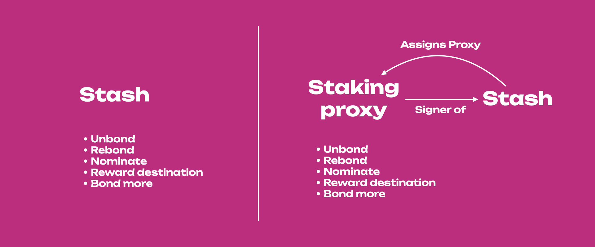

import RPC from "./../../components/RPC-Connection";

Proxies allow users to use an account (it can be in cold storage or a hot wallet) less frequently
but actively participate in the network with the weight of the tokens in that account. Proxies are
allowed to perform a limited amount of actions related to specific
[substrate pallets](https://docs.substrate.io/reference/frame-pallets/) on behalf of another
account. The video below contains more information about using proxies.

## Why use a Proxy?

Proxies are helpful because they let you delegate efficiently and add a layer of security. Rather
than using funds in a single account, smaller accounts with unique roles can complete tasks on
behalf of the main stash account. Proxies can be _hotter_ than the initial account, which can be
kept cold, but the _weight_ of the tokens in the colder account can be used by the hotter accounts.
This increases the security of your accounts by minimizing the number of transactions the cold
account has to make. This also drives attention away from the stash account, although it is possible
to determine the relationship between the proxy and the proxied account.

From the security perspective, we can imagine proxies as bodyguards of a VIP, loyal and ready to
risk their lives to ensure the VIP's protection. But proxies are also useful in other contexts such
as efficient account management at the corporate level. They also provide an elegant solution to
change signatories within multi-signature accounts, and they can be used within proxy calls and
nested proxy calls. In this page we will explore all these interesting use cases of proxies within
the {{ polkadot: Polkadot :polkadot }}{{ kusama: Kusama :kusama }} ecosystem.

Shown below is an example of how you might use these accounts. Imagine you have one stash account as
your primary token-holding account and don't want to access it very often, but you want to
participate in staking to earn staking rewards. You could set one of your existing accounts as a
staking proxy for that stash account, and use your staking proxy to sign all staking-related
transactions.

Having a staking proxy will make the stash account isolated within the staking context. In other
words, the account assigned as a staking proxy can participate in staking on behalf of that stash.
Without the proxy you will need to sign all the staking-related transactions with the stash. If the
proxy is compromised, it doesn't have access to transfer-related transactions, so the stash account
could just set a new proxy to replace it. You can also monitor proxies by
[setting a time-delay](#time-delayed-proxy).

Creating multiple proxy accounts that act for a single account, lets you come up with more granular
security practices around how you protect private keys while still being able to actively
participate in the network.

:::info

The **maximum number of proxies** allowed for a single account is
{{ polkadot: <RPC network="polkadot" path="consts.proxy.maxProxies" defaultValue={32}/>. :polkadot }}
{{ kusama: <RPC network="kusama" path="consts.proxy.maxProxies" defaultValue={32}/>. :kusama }}

You can have the same proxy for multiple accounts.

:::

## Creating Proxy

:::info

To create a **proxy account** read
[this support article](https://support.polkadot.network/support/solutions/articles/65000182179-how-to-create-a-proxy-account).

:::

## Proxy Types

You can set up a proxy account via the proxy pallet. When you set a proxy, you must choose a type of
proxy for the relationship. {{ polkadot: Polkadot :polkadot }}{{ kusama: Kusama :kusama }} offers:

- [Any](#any-proxy)
- [Non-transfer](#non-transfer-proxy)
- [Governance](#governance-proxy)
- [Staking](#staking-proxy)
- [Identity Judgement](#identity-judgement-proxy)
- [Cancel](#cancel-proxy)
- [Auction](#auction-proxy)
- [Nomination pool](#nomination-pools-proxy)

When a proxy account makes a transaction,
{{ polkadot: Polkadot :polkadot }}{{ kusama: Kusama :kusama }} filters the desired transaction to
ensure that the proxy account has the appropriate permission to make that transaction on behalf of
the cold account. For example, staking proxies have permission to do only staking-related
transactions.

:::tip Know how to check the calls and pallets accessible by proxies

For the latest information on the calls and pallets that can be fully accessed by proxies, check the
[source code in the runtime folder](https://github.com/paritytech/polkadot/blob/153543b0c8c582e73f520e5c08cbe33bddfb5f69/runtime/polkadot/src/lib.rs#L1158)
on the [Polkadot repository](https://github.com/paritytech/polkadot)

:::

### Any Proxy

As implied by the name, a proxy type of **Any** allows the proxy account to make any transaction,
including balance transfers. In most cases, this should be avoided as the proxy account is used more
frequently than the cold account and is therefore less secure.

### Non-transfer Proxy

Proxies that are of the type **Non-transfer** are accounts that allow any type of transaction except
[balance transfers](learn-balance-transfers.md) (including [vested](learn-DOT.md/#vesting)
transfers). Hence, this proxy does not have permission to access calls in the Balances and XCM
pallet.

### Governance Proxy

The **Governance** type will allow proxies to make transactions related to governance (i.e., from
the [Democracy](https://paritytech.github.io/substrate/master/pallet_democracy),
[Phragmen Election](https://paritytech.github.io/substrate/master/pallet_elections_phragmen/),
[Treasury](https://paritytech.github.io/substrate/master/pallet_treasury/),
[Bounties](https://paritytech.github.io/substrate/master/pallet_bounties/),
[Tips](https://paritytech.github.io/substrate/master/pallet_tips/),
[Utility](https://paritytech.github.io/substrate/master/pallet_utility/) and
[Child Bounties](https://paritytech.github.io/substrate/master/pallet_child_bounties/) pallets).

:::note Explainers on governance proxies

See [Governance](../maintain/maintain-guides-democracy.md#governance-proxies) for more information
on governance proxies or watch our
[technical explainer video that explores this concept](https://www.youtube.com/watch?v=q5qLFhG4SDw&list=PLOyWqupZ-WGuAuS00rK-pebTMAOxW41W8&index=27&ab_channel=Polkadot).

:::

### Staking Proxy

:::info

Visit the [Advanced Staking Concepts page](./learn-staking-advanced.md/#staking-proxies) for more
detailed information about staking proxies.

:::

The **Staking** type allows all staking-related transactions. The stash account is meant to stay in
cold storage, while the staking proxy account makes day-to-day transactions like setting session
keys or deciding which validators to nominate.

The staking proxy can fully access Staking, Session, Utility and Fast Unstake pallets.

:::caution Do not use Staking proxy for participating in Nomination Pools

Use a [non-transfer](#non-transfer-proxy) instead of a staking proxy to participate in nomination
pools. The staking proxy is not enabled to make successful calls to the nomination pools pallet.

:::

### Identity Judgement Proxy

The **Identity Judgement** proxies are in charge of allowing registrars to make judgments on an
account's identity. If you are unfamiliar with judgment and identities on chain, please refer to
[this page](learn-identity.md#judgements). This proxy can only access `provide_judgement` call from
the Identity pallet along with the calls from the Utility pallet.

### Cancel Proxy

Proxies that are of the type **Cancel** allow accounts to reject and remove any time-delay proxy
announcements. This proxy can only access `reject_announcement` call from the Proxy pallet.

### Auction Proxy

Proxies that are of the type **Auction** are accounts that allow transactions pertaining to
parachain auctions and crowdloans. The Auction proxy account can sign those transactions on behalf
of an account in cold storage. If you already set up a Non-transfer proxy account, it can do
everything an Auction proxy can do. Before participating in a crowdloan using an Auction proxy, it
is recommended that you check with the respective parachain team for any possible issues pertaining
to the crowdloan rewards distribution. Auction proxy can access Auctions, Crowdloan, Registrar and
Slots pallets.

### Nomination Pools Proxy

Proxies that are of the type **Nomination Pools** are accounts that allow transactions pertaining to
[Nomination Pools](./learn-nomination-pools.md).

## Removing Proxy

:::info Removing proxies

Read the section "Removing Proxies" on
[this support page](https://support.polkadot.network/support/solutions/articles/65000182179-how-to-create-a-proxy-account)
to learn how to remove proxies.

:::

## How to view your Proxy

To view your proxy, just go on the _Accounts_ menu in the Polkadot-JS UI, next to the proxied
account you will notice a blue icon. Hover on it, and you will see _Proxy overview_. Click on it and
you will be presented with a list of all proxies for that account.

Additionally, you can head over to the _Chain State_ tab (underneath the _Developer_ menu) on
[Polkadot-JS Apps](https://polkadot.js.org/apps/?rpc=wss%3A%2F%2Frpc.polkadot.io#/chainstate). If
you've created your proxy on a {{ polkadot: Polkadot :polkadot }}{{ kusama: Kusama :kusama }}
account, it is required to change your network accordingly using the top left navigation button. On
this page, the proxy pallet should be selected, returning the announcements and proxies functions.
The proxies function will allow you to see your created proxies for either one account or for all
accounts (using the toggle will enable this). Proxy announcements are what time lock proxies do to
announce they are going to conduct an action.

## Proxy Deposits

Proxies require deposits in the native currency (i.e. DOT or KSM) to be created. The deposit is
required because adding a proxy requires some storage space on-chain, which must be replicated
across every peer in the network. Due to the costly nature of this, these functions could open up
the network to a Denial-of-Service attack. To defend against this attack, proxies require a deposit
to be reserved while the storage space is consumed over the lifetime of the proxy. When the proxy is
removed, so is the storage space, and therefore the deposit is returned.

The required deposit amount for `n` proxies is equal to:

`ProxyDepositBase` + `ProxyDepositFactor` \* `n`

where the `ProxyDepositBase` is the required amount to be reserved for an account to have a proxy
list (creates one new item in storage). For every proxy the account has, an additional amount
defined by the `ProxyDepositFactor` is reserved as well (appends 33 bytes to storage location). The
`ProxyDepositBase` is
{{ polkadot: <RPC network="polkadot" path="consts.proxy.proxyDepositBase" defaultValue={200080000000} filter="humanReadable"/> :polkadot }}
{{ kusama: <RPC network="kusama" path="consts.proxy.proxyDepositBase" defaultValue={666933332400} filter="humanReadable"/> :kusama }}
and the `ProxyDepositFactor` is
{{ polkadot: <RPC network="polkadot" path="consts.proxy.proxyDepositFactor" defaultValue={330000000} filter="humanReadable"/>. :polkadot }}
{{ kusama: <RPC network="kusama" path="consts.proxy.proxyDepositFactor" defaultValue={1099998900} filter="humanReadable"/>. :kusama }}

## Time-delayed Proxy

We can add a layer of security to proxies by giving them a delay time. The delay will be quantified
in blocks. {{ polkadot: Polkadot :polkadot }}{{ kusama: Kusama :kusama }} has approximately 6
seconds of block time. A delay value of 10 will mean ten blocks, which equals about one minute
delay. The proxy will announce its intended action using the `proxy.announce` extrinsic and will
wait for the number of blocks defined in the delay time before executing it. The proxy will include
the hash of the intended function call in the announcement. Within this time window, the intended
action may be canceled by accounts that control the proxy. This can be done by the proxy itself
using the `proxy.removeAnnouncement` extrinsic or by the proxied account using the the
`proxy.rejectAnnouncement` extrinsic. Now we can use proxies knowing that any malicious actions can
be noticed and reverted within a delay period. After the time-delay, the proxy can use the
`proxy.proxyAnnounced` extrinsic to execute the announced call.

:::info

See [this video tutorial](https://youtu.be/3L7Vu2SX0PE) to learn how you can setup and use
time-delayed proxies. The video goes through the example below.

:::

Announcing `n` calls using a time-delayed proxy also requires a deposit of the form:

`announcementDepositBase` + `announcementDepositFactor` \* `n`

where the `announcementDepositBase` is the required amount to be reserved for an account to announce
a proxy call. For every proxy call the account has, an additional amount defined by the
`announcementDepositFactor` is reserved as well. The `announcementDepositBase` is
{{ polkadot: <RPC network="polkadot" path="consts.proxy.announcementDepositBase" defaultValue={200080000000} filter="humanReadable"/> :polkadot }}
{{ kusama: <RPC network="kusama" path="consts.proxy.announcementDepositBase" defaultValue={666933332400} filter="humanReadable"/> :kusama }}
and the `announcementDepositFactor` is
{{ polkadot: <RPC network="polkadot" path="consts.proxy.announcementDepositFactor" defaultValue={660000000} filter="humanReadable"/>. :polkadot }}
{{ kusama: <RPC network="kusama" path="consts.proxy.announcementDepositFactor" defaultValue={2199997800} filter="humanReadable"/>. :kusama }}

Let's take for example the stash account Eleanor setting Bob as a time-delayed staking proxy. In
this way, if Bob submits an extrinsic to change the reward destination, such extrinsic can be
rejected by Eleanor. This implies that Eleanor monitors Bob, and that within the time-delay she can
spot the announced extrinsic. Eleanor can check all the proxy call announcements made by her
account's proxies on-chain. On Polkadot-JS UI, go to Developer > Storage > Proxy > Announcements to
check the hashes for the calls made by the proxy accounts and the block height at which they are
enabled for execution.

:::info

If you try to use `proxy.proxyAnnounced` to execute the call within the time-delay window you will
get an error "Proxy unannounced" since the announcement will be done after the time delay. Also note
that regular `proxy.proxy` calls do not work with time-delayed proxies, you need to announce the
call first and then execute the announced call on a separate transaction.

:::
