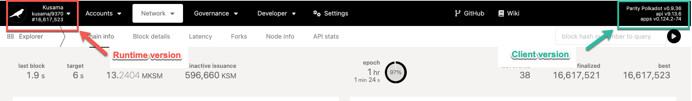

Runtime upgrades allow the relay chain, parachains, and solo blockchains built with the Polkadot SDK
to change their core business logic (referred to as the **runtime**) without the need for a hard
fork.

## Forkless Upgrades

You may have encountered the term "hard fork" before in the blockchain space. A **hard fork** occurs
when a blockchain's logic changes such that nodes that do not include the new changes cannot remain
in consensus with nodes that do. Such changes are backward incompatible. Hard forks can be political
due to the nature of the upgrades and logistically demanding due to the number (potentially
thousands) of nodes in the network that need to upgrade their software. Thus, hard forking is slow,
inefficient, and error-prone due to the levels of offline coordination required and, therefore, the
propensity to bundle many upgrades into one large-scale event.

The usage of [WebAssembly](./learn-wasm.md) in the Polkadot SDK (the framework powering Polkadot,
Kusama and their respective parachains), give the relay chain, its parachains, as well as any other
standalone solo chains built with the Polkadot SDK the ability to upgrade their runtime (the chain's
"business logic") without a hard fork of the respective network.

Rather than encoding the runtime in the nodes, Polkadot nodes contain a WebAssembly
[execution host](learn-polkadot-host.md). They maintain consensus on a very low-level and
well-established instruction set. Upgrades can be small, isolated, and very specific by deploying
WebAssembly on-chain and having nodes auto-enact the new logic at a particular block height.

The runtime is stored on the blockchain itself. Polkadot can upgrade its runtime by upgrading the
logic stored on-chain and removes the coordination challenge of requiring thousands of node
operators to upgrade in advance of a given block number. Polkadot stakeholders propose and approve
upgrades through the [on-chain governance](./learn-polkadot-opengov.md) system, which also enacts
them autonomously once the runtime upgrade referendum is approved through on-chain voting.

As a result of storing the runtime as part of the state, the runtime code itself becomes state
sensitive, and calls to runtime can change the runtime code itself. Therefore, the Polkadot Host
must always ensure it provides the runtime corresponding to the state in which the entry point has
been called.

### Forkless Upgrades - Parachains & Solo Chains

The node architectural design for parachains and solo chains is similar to that of the relay chain,
with the runtime code being a Wasm blob that is stored in chain state. Solo chains built with
Polkadot SDK, which are blockchains that have a native consensus mechanism that is independent of
the relay chain's consensus, can be updated through an on-chain governance system like
[OpenGov](./learn-polkadot-opengov.md) or a simple sudo/multisig setup.

Parachains must notify the relay chain whenever a new upgrade is to be enacted. This is done using
two key extrinsics:

- [`system.authorizeUpgrade`](https://paritytech.github.io/polkadot-sdk/master/frame_system/pallet/struct.Pallet.html#method.authorize_upgrade) -
  notifies the relay chain that an upgrade is to take place, and thus a new state transition
  function is going to be introduced for that parachain to be validated with.
- [`system.applyAuthorizedUpgrade`](https://paritytech.github.io/polkadot-sdk/master/frame_system/pallet/struct.Pallet.html#method.apply_authorized_upgrade) -
  enacts the upgrade, assuming it has been approved.

## Client Releases

The existing runtime logic is followed to update the [Wasm](./learn-wasm.md) runtime stored on the
blockchain to a new version. The upgrade is then included in the blockchain itself, meaning that all
the nodes on the network execute it. Generally, there is no need to upgrade your nodes manually
before the runtime upgrade, as they will automatically start to follow the new logic of the chain.
Nodes only need to be updated when the runtime requires new host functions, or there is a change in
networking or consensus.

Transactions constructed for a given runtime version will not work on later versions. Therefore, a
transaction constructed based on a runtime version will not be valid in later runtime versions. If
you can’t submit a transaction before the upgrade, it is better to wait and construct it afterward.

Although upgrading your nodes is generally not necessary to follow an upgrade, we recommend
following the Polkadot releases and upgrading promptly, especially for high-priority or critical
releases.

!!!info "New Client Releases"
    The details about the latest client releases can be found in the [releases section on the Polkadot repository](https://github.com/paritytech/polkadot-sdk/releases). A detailed analysis for client releases can be viewed on the [Polkadot Forum](https://forum.polkadot.network/tag/release-analysis).

### Runtime vs Client versions

The runtime and client versions are distinct from each other. The runtime versioning typically looks
like `network-xxxx`, whereas the client versioning looks like `vx.x.xx`. For instance, the runtime
version shown on the top left section of Polkadot-JS UI below is `kusama-9370`, and the client
(node) version shown on the top right section is `v0.9.36`.

!!!info "Querying runtime and client versions"
    The runtime version can be queried on-chain through Polkadot-JS UI by navigating to the Developer tab > Chain State > Storage > system and query `lastRuntimeUpgrade()`.
    
    The node version can be queried by navigating to the Developer tab > RPC calls > system and query `version()`.

## Runtime Upgrades for Various Users

### For Infrastructure Providers

Infrastructure services include but are not limited to the following:

- [Validators](../maintain/maintain-guides-how-to-upgrade.md)
- API services
- Node-as-a-Service (NaaS)
- General infrastructure management (e.g. block explorers, custodians)
- [Wallets](../general/wallets-and-extensions.md)

For validators, keeping in sync with the network is key. At times, upgrades will require validators
to upgrade their clients within a specific time frame, for example, if a release includes breaking
changes to networking. It is essential to check the release notes, starting with the upgrade
priority and acting accordingly.

General infrastructure providers, aside from following the runtime releases and upgrading in a
timely manner, should monitor changes to runtime events and auxiliary tooling, such as the
[Substrate API Sidecar](https://github.com/paritytech/substrate-api-sidecar).

Transactions constructed for runtime `n` will not work for any other runtime `>n`. If a runtime
upgrade occurs before broadcasting a previously constructed transaction, you will need to
reconstruct it with the appropriate runtime version and corresponding metadata.

### For [Nominators](./learn-nominator.md)

Runtime upgrades don't require any actions by a nominator, though it is always encouraged to keep
up-to-date and participate with the latest runtime upgrade motions and releases while keeping an eye
on how the nodes on the network are reacting to a new upgrade.

## Monitoring Runtime Changes

You can monitor the chain for upcoming upgrades. The client release notes include the hashes of any
proposals related to any on-chain upgrades for easy matching. We recommend keeping track of the
Polkadot Fellowship's
[runtime upgrades](https://github.com/polkadot-fellows/runtimes/releases/latest) to be aware of
changes in the runtime logic.

Runtime upgrades are voted on and executed via [Polkadot OpenGov](./learn-polkadot-opengov.md). You
should monitor the relay chain as follows to know when the next runtime upgrade will be enacted:

1. Check each block for `referenda (Submitted)` events and check if the `track` is `0` or `1`, which
   correspond to the `Root` and `whitelistedCaller` tracks, respectively. These are the only tracks
   that can enact runtime upgrdes. Log the referendum's `index`; this will help you keep track of
   the its progress. With the index you can look up the details of the proposal in
   [Polkassembly.io](https://polkadot.polkassembly.io/whitelisted-caller?trackStatus=all&page=1) to
   see if it corresponds with a runtime upgrade.
2. Ongoing referenda will have an `enactment` field under `referenda.ReferendumInfoFor` storage.
   This is the block number that, if passed, the system will attempt to schedule the inner
   proposal's execution for. Note that there are some constraints like a minimum enactment period
   that could result in the proposal's execution occurring later. It is not possible for the
   proposal to enact _before_ this block number.
3. Check also for `referenda (DecisionDepositPlaced)` events where `index` matches the one
   previously found. This means that the required deposit has been placed.
4. `referenda (DecisionStarted)` indicates that the decision period has started for the referendum
   of that `index`.
5. `referenda (ConfirmStarted)` indicates that `index`'s referendum has entered the confirmation
   period.
   1. `referenda (Confirmed)` indicates that `index`'s referendum has been confirmed and will enter
      the enactment period. With this and `enactment_moment`, you can calculate when the proposal
      will be enacted.
   2. `referenda (Rejected)` indicates that `index`'s referendum has been rejected and will not be
      enacted.
6. When the runtime upgrades, there will be a `system(CodeUpdated)` event confirming the execution
   of the runtime upgrade.
