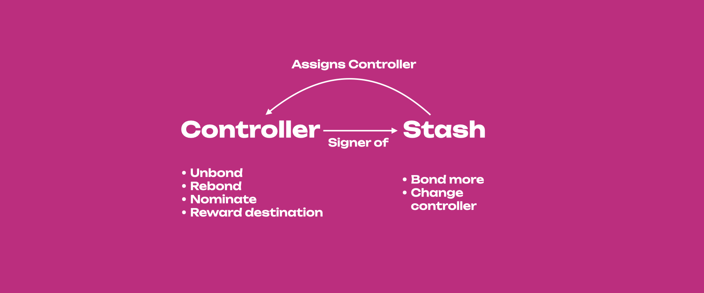
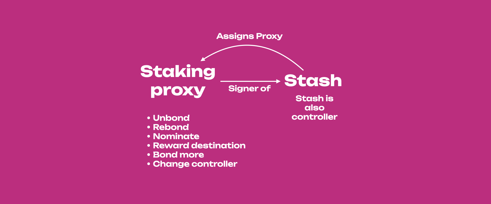
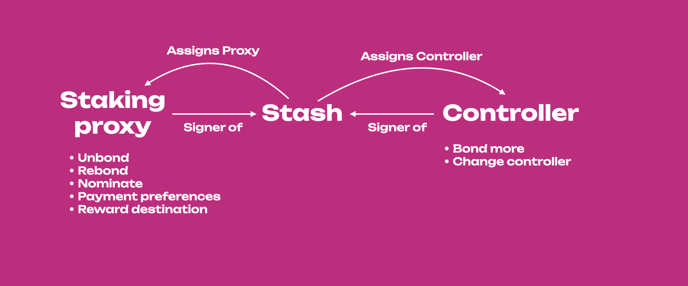
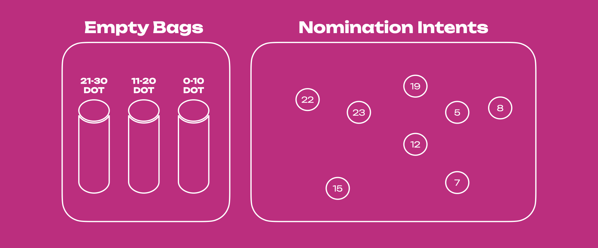
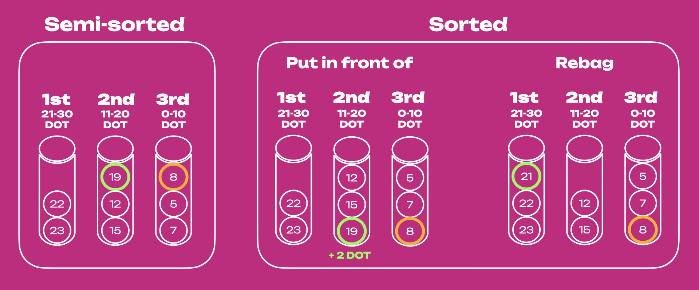
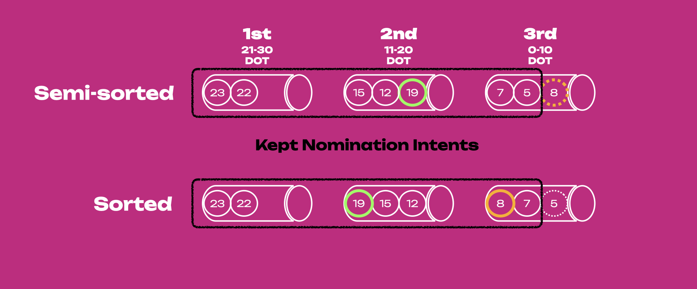
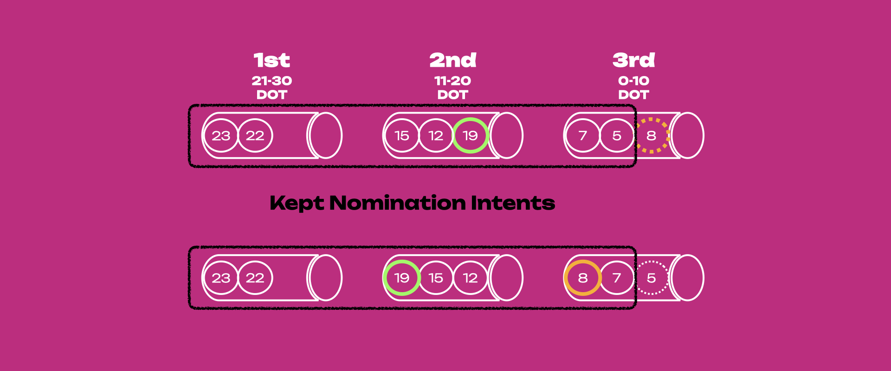
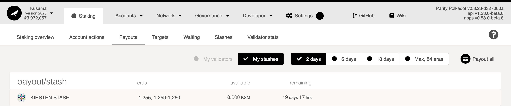
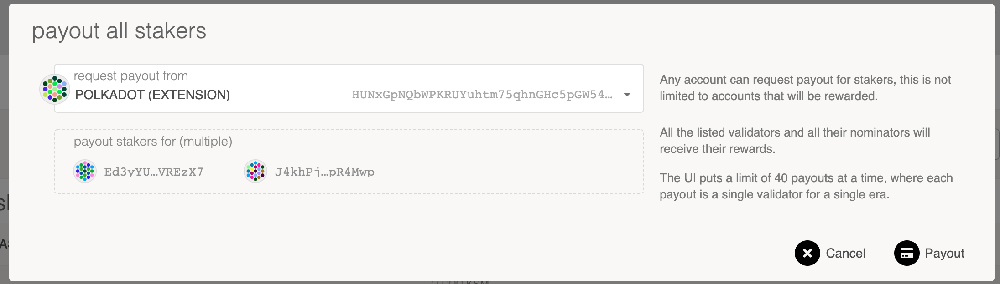
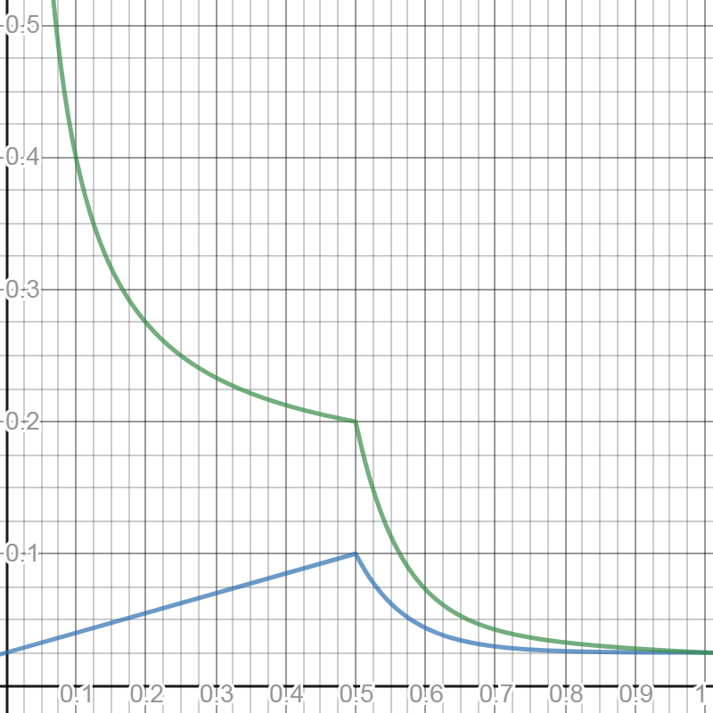

import RPC from "./../../components/RPC-Connection";

:::tip New to Staking?

Start your staking journey or explore more information about staking on
[Polkadot's Home Page](https://polkadot.network/staking/). Discover the new
[Staking Dashboard](https://staking.polkadot.network/#/overview) that makes staking much easier and
check this
[extensive article list](https://support.polkadot.network/support/solutions/articles/65000182104) to
help you get started.
{{ polkadot: You can now [stake natively with just 1 DOT and earn staking rewards](https://polkadot.network/blog/nomination-pools-are-live-stake-natively-with-just-1-dot/). :polkadot }}
{{ kusama: All the examples presented on Polkadot apply to Kusama as well. :kusama }}

:::

This page is meant to be an advanced guide to staking with
{{ polkadot: Polkadot :polkadot }}{{ kusama: Kusama :kusama }}.

## Staking Proxies

:::info Walk-through video tutorial

In this section, we go through a couple of scenarios that show how the permissions to sign for
staking-related actions by stash account, controller account, and staking proxy change according to
their relationship. [This video tutorial](https://www.youtube.com/watch?v=WarVBPBPh0A) goes through
those scenarios using the [Polkadot-JS UI](https://polkadot.js.org/apps/#/accounts).

:::

{{ polkadot: Polkadot :polkadot }}{{ kusama: Kusama :kusama }} makes it possible to create accounts
having special permissions also called **proxy accounts**. For mode details about proxy accounts
visit the [dedicated page](./learn-proxies.md) on this wiki.

Proxy accounts are special accounts which can sign [**extrinsic calls**](./learn-extrinsics.md/#pallets-and-extrinsics)
made to specific [**pallets**](./learn-extrinsics.md/#pallets-and-extrinsics) on behalf of the proxied account. There is
thus the possibility to create staking proxy accounts that can be used to sign only extrinsic calls
to staking, session and utility pallets.

Usually, with the stash-controller setup, the stash still needs to sign for actions that are
performed less often, i.e. bonding more funds and changing the controller (see figure above). The
controller is used to sign for those staking actions that are performed more often such as
nominating. Remember, staking on polkadot is not a set-and-forget action, as a nominator you will
need to monitor the performance of your validators and make changes if needed. Also, each time you
sign with an account, you expose the private key of that account to the internet with consequent
risk of attack. Ideally, accounts with high economic power like the stash must be and remain as
isolated as possible. With a staking proxy, the stash account is even more isolated than when using
a controller. This does not necessarily mean that the staking proxy can sign for all staking-related
transactions. Below we show two main configurations that affect a staking proxy's permissions.

### Stash is also Controller

It is not necessary to have a controller if you have a staking proxy: the stash can also be the
controller, and the account security will not be compromised. In this case, the staking proxy will
be used to sign all staking-relate transactions. Note that to change the staking proxy you will need
to sign with the stash.

This situation is similar to having the controller as a staking proxy. For a practical perspective
we need to use only one account and remember one password to sign for all staking-related
transactions. From a security perspective who controls the staking proxy controls our staking
actions.

It is important to remember that actions that can be performed by the proxy accounts are limited,
and in the case of staking proxy, extrinsic calls to the balances pallet cannot be signed. This
means it is not possible to do balance transfers on the proxied account through a staking proxy.

### Stash is not Controller

If the stash and controller are different accounts, the staking proxy will just be used to bond more
funds and change the controller. Thus the staking proxy will be used to sign for those transactions
that are used less often and that are usually signed by the stash.

From a practical perspective, we now have two accounts and we need to remember two passwords. From a
security perspective, the party who wants to fully control our staking actions must have access to
two accounts.

## Bags List

:::info

On Polkadot and Kusama, the instance of the pallet
[Bags-List](https://paritytech.github.io/substrate/master/pallet_bags_list/) is named as 'voterList'

:::

In {{ polkadot: Polkadot's :polkadot }}{{ kusama: Kusama's :kusama }} NPoS nomination intents are
placed in a semi-sorted list called [bags-list](https://github.com/paritytech/substrate/pull/9507).
{{ kusama: The bags list example below uses DOT for explaining the concepts. :kusama }}The Bags-List
substrate pallet is designed to be self-maintaining, with minimal effort from the blockchain, making
it extremely scalable. The bags list has two primary components, bags and nodes (or nominators'
accounts), with bags containing the nodes with bonded balance within a specific range. In the figure
below the 1st empty bag will contain nominators whose bonded balance is in the range of 21 - 30 DOT,
the 2nd bag 11 - 20 DOT, and the 3rd bag 0-10 DOT. The nomination intents are the nominators'
accounts with bonded tokens (in the example shown below, there are eight nomination intents) that
will be put inside each of those three bags depending on their stake.

The bags list is semi-sorted, meaning that sorting is only partially done. When the nomination
intents are submitted to the network, they are automatically put into each bag based on the number
of bonded tokens, but within each bag, those nodes are arranged based on the time they are inserted
and not based on their stake (see figure below). When the nomination intent of 19 DOT is submitted,
it gets placed at the last spot in the 2nd bag (shown in the yellow circle). The same scenario
applies for the node with 8 DOT (green circle) in the 3rd bag. Placing the node above all nodes with
a lesser stake requires an additional step (more on this later).

The mentioned two nodes (19 DOT and 8 DOT) have the option to move up in their respective bags,
which can put them in front of the nodes with less stake than them (see figure below). This action must be done
manually by submitting the `putInFrontOf` extrinsic within the `voterList` pallet instance.
Moreover, if the node with 19 DOT bonds an additional 2 DOT, that node will be put automatically in
the 1st bag (i.e. automatic `rebag`) because the total number of bonded tokens will now be within the range of the 1st bag. That node with now 21 DOT will be put at the tail end of the 1st bag with the
possibility to manually put itself in front of "older" nodes with less than 21 DOT (if there are
any).

If one decides to send staking rewards to the stash account and automatically bond them (i.e.
compounding the staking rewards), the position within a bag does not change automatically. The same
scenario applies to a slashing event, i.e., when a nominator gets slashed, their position within a
bag does not change. This might result in a scenario where the node is in the wrong bag and needs to
be placed in the right bag. To address this issue, any account on-chain can submit the
permissionless extrinsic `rebag` within the `voterList` pallet instance to update the positions of
the nodes that do not belong to their bag and place them in the correct one. To reiterate, actions
like bonding/unbonding tokens automatically rebag the nominator node, but events like staking
rewards/slashing do not. See the [bags-list](learn-nominator.md#bags-list) section for more
information.

The bags-list is capable of including an unlimited number of nodes, subject to the chain's runtime
storage. In the current staking system configuration, the bags list keeps
{{ polkadot: <RPC network="polkadot" path="query.staking.maxNominatorsCount" defaultValue={50000}/> :polkadot }}
{{ kusama: <RPC network="kusama" path="query.staking.maxNominatorsCount" defaultValue={20000}/> :kusama }}
nomination intents, of which, at most
{{ polkadot: <RPC network="polkadot" path="query.electionProviderMultiPhase.maxElectingVoters" defaultValue={22500}/> :polkadot }}{{ kusama: <RPC network="kusama" path="query.electionProviderMultiPhase.maxElectingVoters" defaultValue={20000}/> :kusama }}
come out as the electing nominators. See
[Staking Election Stages](learn-nominator.md#staking-election-stages) section for more info.

This means that only a portion of the nomination intents is kept. Once the nomination period ends,
the NPoS election system takes all nomination intents and their associated votes as input, and it
outputs a set of validators. The bags are iterated from the most staked to the least staked. If the
accounts are not appropriately sorted, this could leave the last touched bag to only be partially
iterated. Thus, in some edge cases, the order of the members within a bag is important. Continuing
with the example used in the previous figures, there are 8 nomination intents of which only 7 will
be kept. If the bags list stays semi-sorted (i.e. no accounts call the `putInFrontOf` and `rebag`
extrinsics), the nomination of the node with 8 DOT in the 3rd bag will not be considered while that
of the preceding node with 5 DOT will be. Nomination of the node with 8 DOT will be kept only if it
puts itself in front of the one with 5 DOT. Note how the nomination of the node with 19 DOT in the
2nd bag will be considered regardless of changing its position inside the bag. The sorting
functionality of nomination intents using bags is extremely important for the
[long-term improvements](https://gist.github.com/kianenigma/aa835946455b9a3f167821b9d05ba376) of the
staking/election system.

:::caution Minimum active nomination threshold to earn rewards is dynamic

Submitting a nomination intent does not guarantee staking rewards. The stake of the top
{{ polkadot: <RPC network="polkadot" path="query.electionProviderMultiPhase.maxElectingVoters" defaultValue={22500}/> :polkadot }}{{ kusama: <RPC network="kusama" path="query.electionProviderMultiPhase.maxElectingVoters" defaultValue={20000}/>  :kusama }}
nominators is applied to the validators in the active set. To avail of staking rewards, ensure that
the number of tokens bonded is higher than the minimum active bond. For more information, see
the [nominator guide](learn-nominator.md).

:::

The "election solution" which is a connected graph between nominators and validators with the stake
as edge weights, has to meet certain requirements, such as maximizing the amount of stake to
nominate validators and distributing the stake backing validators as evenly as possible. The
objectives of this election mechanism are to maximize the security of the network, and achieve fair
representation of the nominators. If you want to know more about how NPoS works (e.g. election,
running time complexity, etc.), please read
[here](http://research.web3.foundation/en/latest/polkadot/NPoS.html).

## Rewards Distribution

:::info

The general rule for rewards across validators is that two validators get paid essentially the same
amount of tokens for equal work, i.e. they are not paid proportional to their total stakes. There is
a probabilistic component to staking rewards in the form of
[era points](../maintain/maintain-guides-validator-payout.md##era-points) and
[tips](learn-transaction-fees.md#fee-calculation) but these should average out over time.

:::

Validators are paid the same regardless of stake backing them. Validators with less stake will
generally pay more to nominators per-token than the ones with more stake. This gives nominators an
economic incentive to gradually shift their preferences to lower-staked validators that gain a
sufficient amount of reputation. A consequence of this is that the stake across validators will be
as evenly distributed as possible which avoids concentration of power among a few validators. In the
long term, validators will have similar levels of stake, with the stake being higher for validators
with higher reputation. A nominator who is willing to risk more by backing a validator with a lower
reputation will get paid more, provided there are no slashing events.

Before distributing rewards to nominators, validators can create a cut of the reward (a commission)
that is not shared with the nominators. This cut is a percentage of the block reward, not an
absolute value. After the commission gets deducted, the remaining portion is distributed pro-rata
based on their staked value and split between the validator and all of the nominators whose stake
has backed this validator.

For example, assume the block reward for a validator is 10 DOT. A validator may specify
`validator_commission = 50%`, in which case the validator would receive 5 DOT. The remaining 5 DOT
would then be split between the validator and their nominators based on the proportion of stake each
nominator had. Note that for this calculation, validator's self-stake acts just as if they were
another nominator.

Thus, a percentage of the reward goes thus to pay the validator's commission fees and the remainder
is paid pro-rata (i.e. proportional to stake) to the nominators and validator. If a validator's
commission is set to 100%, no tokens will be paid out to any of the nominators. Notice in particular
that the validator is rewarded twice: once in commission fees for validating (if their commission
rate is above 0%), and once for nominating itself with own stake.

The following example should clarify the above. For simplicity, we have the following assumptions:

- These validators do not have a stake of their own.
- They each receive the same number of era points.
- There are no tips for any transactions processed.
- They do NOT charge any commission fees.
- Total reward amount is 100 DOT tokens.
- The current minimum amount of DOT to be a validator is 350 (note that this is _not_ the actual
  value, which fluctuates, but merely an assumption for purposes of this example; to understand how
  the actual minimal stake is calculated, see
  [here](../general/faq.md#what-is-the-minimum-stake-necessary-to-be-elected-as-an-active-validator)).

|               | **Validator A** |                             |         |
| :-----------: | :-------------: | :-------------------------: | :-----: |
| Nominator (4) |   Stake (600)   | Fraction of the Total Stake | Rewards |
|      Jin      |       100       |            0.167            |  16.7   |
|    **Sam**    |       50        |            0.083            |   8.3   |
|     Anson     |       250       |            0.417            |  41.7   |
|     Bobby     |       200       |            0.333            |  33.3   |

|               | **Validator B** |                             |         |
| :-----------: | :-------------: | :-------------------------: | :-----: |
| Nominator (4) |   Stake (400)   | Fraction of the Total Stake | Rewards |
|     Alice     |       100       |            0.25             |   25    |
|     Peter     |       100       |            0.25             |   25    |
|     John      |       150       |            0.375            |  37.5   |
|   **Kitty**   |       50        |            0.125            |  12.5   |

_Both validators A & B have 4 nominators with a total stake 600 and 400 respectively._

Based on the above rewards distribution, nominators of validator B get more rewards per DOT than
those of validator A because A has more overall stake. Sam has staked 50 DOT with validator A, but
he only gets 8.3 in return, whereas Kitty gets 12.5 with the same amount of stake.

To estimate how many tokens you can get each month as a nominator or validator, you can use this
[tool](https://www.stakingrewards.com/earn/polkadot/calculate) as a reference and play around with
it by changing some parameters (e.g. how many days you would like to stake with your DOT, provider
fees, compound rewards, etc.) to have a better estimate. Even though it may not be entirely accurate
since staking participation is changing dynamically, it works well as an indicator.

#### Oversubscription, Commission Fees & Slashes

There is an additional factor to consider in terms of rewards. While there is no limit to the number
of nominators a validator may have, a validator does have a limit to how many nominators to which it
can pay rewards. In {{ polkadot: Polkadot :polkadot }}{{ kusama: Kusama :kusama }} this limit is
currently
{{ polkadot: <RPC network="polkadot" path="consts.staking.maxNominatorRewardedPerValidator" defaultValue={256}/> :polkadot }}{{ kusama: <RPC network="polkadot" path="consts.staking.maxNominatorRewardedPerValidator" defaultValue={256}/> :kusama }},
although this can be modified via runtime upgrade. A validator with more than
{{ polkadot: <RPC network="polkadot" path="consts.staking.maxNominatorRewardedPerValidator" defaultValue={256}/> :polkadot }}{{ kusama: <RPC network="polkadot" path="consts.staking.maxNominatorRewardedPerValidator" defaultValue={256}/> :kusama }}
nominators is _oversubscribed_. When payouts occur, only the top
{{ polkadot: <RPC network="polkadot" path="consts.staking.maxNominatorRewardedPerValidator" defaultValue={256}/> :polkadot }}
nominators as measured by the amount of stake allocated to that validator will receive rewards. All
other nominators are essentially "wasting" their stake - they used their nomination to elect that
validator to the active stake, but receive no rewards in exchange for doing so.

Note that the network slashes a validator for a misbehavior (e.g. validator offline, equivocation,
etc.) the slashed amount is a fixed percentage (and not a fixed amount), which means that validators
with more stake get slashed more DOT. Again, this is done to provide nominators with an economic
incentive to shift their preferences and back less popular validators whom they consider to be
trustworthy.

Also, note that each validator candidate is free to name their desired commission fee (as a
percentage of rewards) to cover operational costs. Since validators are paid the same, validators
with lower commission fees pay more to nominators than validators with higher fees. Thus, each
validator can choose between increasing their fees to earn more, or decreasing their fees to attract
more nominators and increase their chances of being elected. In the long term, we expect that all
validators will need to be cost-efficient to remain competitive, and that validators with higher
reputation will be able to charge slightly higher commission fees (which is fair).

## Slashing

### Unresponsiveness

For every session, validators will send an "I'm online" heartbeat to indicate they are live. If a
validator produces no blocks during an epoch and fails to send the heartbeat, it will be reported as
unresponsive. Slashing may occur depending on the repeated offenses and how many other validators
were unresponsive or offline during the epoch.

Validators should have a well-architected network infrastructure to ensure the node runs to reduce
the risk of slashing or chilling. A high availability setup is desirable, preferably with backup
nodes that kick in **only once the original node is verifiably offline** (to avoid double-signing
and being slashed for equivocation - see below). A comprehensive guide on validator setup is
available [here](../maintain/maintain-guides-secure-validator.md).

Here is the formula for calculating slashing due to unresponsiveness:

    Let x = offenders, n = total no. validators in the active set

    min((3 * (x - (n / 10 + 1))) / n, 1) * 0.07

The examples demonstrate how to calculate the slashing penalty for unresponsiveness.

:::note

In all of the examples, assume that there are 100 validators in the active set.

:::

No slashing would enact if < 10% of all validators are unresponsive.

For example, if exactly 10 validators were unresponsive, the expression 3 _ (x - (n / 10 + 1))) / n
would be 3 _ (10 - (100 / 10 + 1)) / 100 = 3 \* (10 - (10 + 1)) / 100 = -0.03 which is rounded to 0.

:::note

The minimum value between 0 and 1 is 0. 0 multiplied by 0.07 is 0.

:::

If 14 validators are unresponsive, then slashing would occur, as > 10% of validators are
unresponsive.

The slashing penalty would be min((3 _ (14 - (100 / 10 + 1))) / 100, 1) _ 0.07 = min((3 _ (14 -
11))/100, 1) _ 0.07 = min(0.09, 1) \* 0.07 = 0.6%

Similarly, if one-third of the validator set (around 33/100) are unresponsive, the slashing penalty
would be about 5%.

The maximum slashing that can occur due to unresponsiveness is 7%. After around 45% of the
validators go offline, the expression 3 _ (x - (n / 10 + 1))) / n will go beyond 1. Hence, min((3 _
(x - (n / 10 + 1))) / n, 1) \* 0.07 will be ceiled to 7%.

### Equivocation

**GRANDPA Equivocation**: A validator signs two or more votes in the same round on different chains.

**BABE Equivocation**: A validator produces two or more blocks on the Relay Chain in the same time
slot.

Both GRANDPA and BABE equivocation use the same formula for calculating the slashing penalty:

    Let x = offenders, n = total no. validators in the active set

    min( (3 * x / n )^2, 1)

As an example, assume that there are 100 validators in the active set, and one of them equivocates
in a slot (for our purposes, it does not matter whether it was a BABE or GRANDPA equivocation). This
is unlikely to be an attack on the network, but much more likely to be a misconfiguration of a
validator. The penalty would be min(3 \* 1 / 100)^2, 1) = 0.0009, or a 0.09% slash for that
validator (i.e., the stake held by the validator and its nominators).

Now assume that there is a group running several validators, and all of them have an issue in the
same slot. The penalty would be min((3 \* 5 / 100)^2, 1) = 0.0225, or a 2.25% slash. If 20
validators equivocate, this is a much more serious offense and possibly indicates a coordinated
attack on the network, and so the slash will be much greater - min((3 \* 20 / 100)^2, 1) = 0.36, or
a 36% slash on all of these validators and their nominators. All slashed validators will also be
chilled.

From the example above, the risk of nominating or running many validators in the active set are
apparent. While rewards grow linearly (two validators will get you approximately twice as many
staking rewards as one), slashing grows exponentially. A single validator equivocating causes a
0.09% slash, two validators equivocating does not cause a 0.09 \* 2 = 0.18% slash, but rather a
0.36% slash - 4x as much as the single validator.

Validators may run their nodes on multiple machines to make sure they can still perform validation
work in case one of their nodes goes down, but validator operators should be extremely careful in
setting these up. If they do not have good coordination to manage signing machines, equivocation is
possible, and equivocation offenses are slashed at much higher rates than equivalent offline
offenses.

If a validator is reported for any one of the offenses they will be removed from the validator set
([chilled](#chilling)) and they will not be paid while they are out. They will be considered
inactive immediately and will lose their nominators. They need to re-issue intent to validate and
again gather support from nominators.

### Slashing Across Eras

There are 3 main difficulties to account for with slashing in NPoS:

- A nominator can nominate multiple validators and be slashed via any of them.
- Until slashed, the stake is reused from era to era. Nominating with N coins for E eras in a row
  does not mean you have N\*E coins to be slashed - you've only ever had N.
- Slashable offenses can be found after the fact and out of order.

To balance this, we only slash for the maximum slash a participant can receive in some time period,
rather than the sum. This ensures protection from overslashing. Likewise, the period over which
maximum slashes are computed is finite and the validator is chilled with nominations withdrawn after
a slashing event, as stated in the previous section. This prevents rage-quit attacks in which, once
caught misbehaving, a participant deliberately misbehaves more because their slashing amount is
already maxed out.

## Simple Payouts

Polkadot and Kusama make stakers claim their rewards for past eras by submitting a transaction. This
naturally leads to spreading out reward distribution, as people make transactions at disparate
times, rather than updating the accounts of all stakers in a single block.

Even if everyone submitted a reward claim at the same time, the fact that they are individual
transactions would allow the block construction algorithm to process only a limited number per block
and ensure that the network maintains a constant block time. If all rewards were sent out in one
block, this could cause serious issues with the stability of the network.

Simple payouts require one transaction per validator, per [era](../general/glossary.md##era), to
claim rewards. The reason Polkadot requires this is to avoid an attack where someone has several
thousand accounts nominating a single validator. The major cost in reward distribution is mutating
the accounts in storage, and Polkadot cannot pay out several thousand accounts in a single
transaction.

### Claiming Rewards

Polkadot stores the last 84 eras of reward information (e.g. maps of era number to validator points,
staking rewards, nomination exposure, etc.). Rewards will not be claimable more than 84 eras after
they were earned. This means that all rewards must be claimed within a maximum of 84 eras, although
under certain circumstances (described below) this may be as low as 28 eras.

If a validator kills their stash, any remaining rewards will no longer be claimable. Before doing
this, however, they would need to first stop validating and then unbond the funds in their stash,
which takes 28 eras. If a validator were to immediately chill and start unbonding after rewards are
calculated, and nobody issued a payout for that era from that validator in the next 28 eras, the
reward would no longer be claimable.

:::info 

In order to be absolutely sure that staking rewards can be claimed, users should trigger a
payout before 28 eras have passed.

:::

Anyone can trigger a payout for any validator, as long as they are willing to pay the transaction
fee. Someone must submit a transaction with a validator ID and an era index. Polkadot will
automatically calculate that validator's reward, find the top
{{ polkadot: <RPC network="polkadot" path="query.staking.maxNominatorRewardedPerValidator" defaultValue={256}/> :polkadot }}
{{ kusama: <RPC network="kusama" path="query.staking.maxNominatorRewardedPerValidator" defaultValue={256}/> :kusama }}
nominators for that era, and distribute the rewards pro rata.

:::note 

The Staking system only applies the highest
{{ polkadot: <RPC network="polkadot" path="query.staking.maxNominatorRewardedPerValidator" defaultValue={256}/> :polkadot }}
{{ kusama: <RPC network="kusama" path="query.staking.maxNominatorRewardedPerValidator" defaultValue={256}/> :kusama }}
nominations to each validator to reduce the complexity of the staking set.

:::

These details are handled for you automatically if you use the
[Polkadot-JS UI](https://polkadot.js.org/apps/#/staking/payout), which also allows you to submit
batches of eras at once.

To claim rewards on Polkadot-JS UI, you will need to be in the "Payouts" tab underneath "Staking",
which will list all the pending payouts for your stashes.

To then claim your reward, select the "Payout all" button. This will prompt you to select your stash
accounts for payout.

Once you are done with payout, another screen will appear asking for you to sign and submit the
transaction.

### FAQ and Cautionary Notes

1. Rewards expire after 84 eras. On Polkadot, that's about 84 days. On Kusama, it is approximately
   21 days. Validators should claim all pending rewards before killing their stash in the event the
   validator decides to `chill` -> `unbonds all` -> `withdraws unbonded`. Nominators will not miss
   out on rewards if they claim the pending rewards for a validator within 28 days. Essentially, the
   deadline to ensure you get staking rewards is 28 eras. If the validator verifies its intent and
   does not unbond and withdraw, the 84 era timeline holds.
2. Claiming rewards (or neglecting to claim rewards) does not affect nominations in any way.
   Nominations will persist after claiming rewards or after the rewards expire.
3. Rewards are not minted until they are claimed. Therefore, if your reward destination is "stash,
   increasing amount at stake", then your staked amount does not reflect your rewards until you
   claim them. If you want to maximize compounding, then you will need to claim often or nominate
   validators which regularly claim for you.
4. Staking operations at the end of an era are closed to allow the off-chain validator election to
   take place. See [Off-chain Phragmén](learn-phragmen.md#off-chain-phragmen) for more information.

## Inflation

{{ polkadot: DOT is an inflationary token. In fact, there is no maximum number of DOT. On Polkadot
network, inflation is
[set to be 10% annually](https://github.com/paritytech/polkadot/blob/756ccc35e93d1a78e3c71a0e67ae4da5f1d09f69/runtime/polkadot/src/lib.rs#L576),
with validator rewards being a function of the amount staked and the remainder going to the
treasury.

:::info

DOT went through [redenomination](../general/redenomination.md) in 2020 that saw the DOT token
supply increase by 100 times. The current token supply on Polkadot is
<RPC network="polkadot" path="query.balances.totalIssuance" defaultValue={12230666300429914781} filter="humanReadable"/>
(Over 1.2 Billion DOT).

::: :polkadot }}

{{ kusama: KSM is inflationary; there is no maximum number of KSM. On Kusama network, inflation is [set to be 10% annually](https://github.com/paritytech/polkadot/blob/756ccc35e93d1a78e3c71a0e67ae4da5f1d09f69/runtime/kusama/src/lib.rs#L535), with validator rewards being a function of the amount staked
and the remainder going to the treasury. The current token supply on Kusama is <RPC network="kusama" path="query.balances.totalIssuance" defaultValue={12619256191792480093}/>
(Over 12 Million KSM). :kusama }}

There is an _ideal staking rate_ that the network tries to maintain. The goal is to have the _system
staking rate_ meet the _ideal staking rate_. The system staking rate would be the total amount
staked over the total token supply, where the total amount staked is the stake of all validators and
nominators on the network. The ideal staking rate accounts for having sufficient backing of
{{ polkadot: DOT :polkadot }} {{ kusama: KSM :kusama }} to prevent the possible compromise of
security while keeping the native token liquid.
{{ polkadot: DOT :polkadot }}{{ kusama: KSM :kusama }} is inflated according to the system staking
rate of the entire network.

:::info

According to the inflation model, this would suggest that if you do not use your
{{ polkadot: DOT :polkadot }}{{ kusama: KSM :kusama }} for staking, your tokens dilute over time.

:::

The ideal staking rate on Polkadot also varies with the number of parachains (50% is the current
estimation of all DOT that should be staked, per parachain slot).

:::info The ideal staking rate varies based on the number of parachains

The current staking rate on Polkadot still assumes the absence of parachains, with the suggested
ideal staking rate of 75%. You can track the progress on the issue to adjust it
[here](https://github.com/paritytech/polkadot/pull/5872). This has already been adjusted on Kusama,
which has an ideal staking rate of approximately 50% with 50 parachains. When the number of slots
reaches 60, the ideal staking rate is 45%.
[Here](https://github.com/paritytech/polkadot/blob/master/runtime/kusama/src/lib.rs#L535) is the
code for reference. This code assumes that the number of slots auctioned correspond to the number of
parachains on the relaychain, which may not be true as new slots can be occupied by old parachains
that are renewing their lease. You can also track the progress on resolving this specific issue
[here](https://github.com/paritytech/polkadot/pull/5872).

:::

If the amount of tokens staked goes below the ideal rate, then staking rewards for nominators go up,
incentivizing them to stake more tokens on the network. On the contrary, if it goes above the ideal
rate, staking rewards drop. This is a result of the change in the percentage of staking rewards that
go to the Treasury.

Source: <a href="https://w3f-research.readthedocs.io/en/latest/polkadot/overview/2-token-economics.html">Research - Web3 Foundation</a>

- **x-axis**: Proportion of {{ polkadot: DOT :polkadot }}{{ kusama: KSM :kusama }} staked
- **y-axis**: Inflation, annualized percentage
- **Blue line**: Annual inflation rate of NPoS, i.e. total amount of tokens minted to pay validators
  and nominators.
- **Green line**: Annual rewards rate for stakers. For instance, 0.2 corresponds to 20% of annual
  returns on the staked tokens.

You can determine the staking rewards by looking at the top bar of the staking overview on
[Polkadot-JS UI](https://polkadot.js.org/apps/#/staking).

The above chart shows the inflation model of the network. Depending on the staking participation,
the distribution of the inflation to validators/nominators versus the treasury will change
dynamically to provide incentives to participate (or not participate) in staking.

For instance, assuming that the ideal staking rate is 50%, all of the inflation would go to the
validators/nominators if 50% of all KSM / DOT are staked. Any deviation from the 50% - positive or
negative - sends the proportional remainder to the treasury and effectively reduces staking rewards.

For those who are interested in knowing more about the design of the inflation model for the
network, please see
[here](https://w3f-research.readthedocs.io/en/latest/polkadot/overview/2-token-economics.html).
