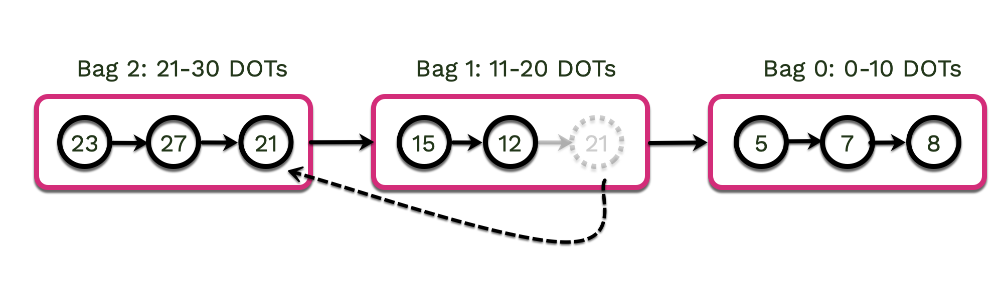
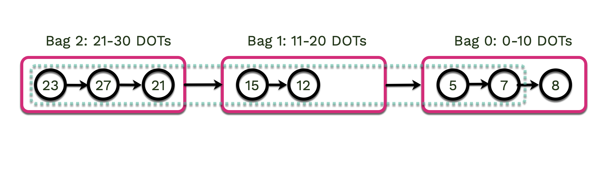

import RPC from "./../../components/RPC-Connection"

This page is meant to be an advanced guide to staking with Polkadot. If you are a nominator in a nominator pool

## Staking Proxies

{{ polkadot: Polkadot :polkadot }}{{ kusama: Kusama :kusama }} is built using
[substrate](https://substrate.io/), a modular system to efficiently build blockchains. Within each module or **pallet**, one can **call** different
functions that have similar logic. For example, the staking pallet contains all functionalities
related to staking such as bonding or unbonding funds. The combined information of pallets and calls
constitutes an **extrinsic**, i.e. a transaction that is executed from outside the chain but that
triggers an event on the chain. Continuing with the staking example, within the staking pallet
a nominator can bond funds and nominate some validators. The signature of such
extrinsic might lead to an event on the chain such as a reward payout to that nominator at the end of an era; this is an event inside the chain. This way of having
transactions categorized within pallets and functionalities makes it possible to create accounts
having special permissions also called **proxy accounts**.

In {{ polkadot: Polkadot :polkadot }}{{ kusama: Kusama :kusama }} proxy accounts are special
accounts which can sign extrinsic calls made to specific pallets on behalf of the proxied account. There is thus the
possibility to create staking proxy accounts that can be used to sign only extrinsic calls to staking,
session and utility pallets. This makes the stash account even more isolated than using a controller
account since one can bond / unbond / bond more funds using the staking proxy account. However,
it is important to remember that actions that can be performed by the proxy accounts are limited, and in the case of staking
proxy, extrinsic calls to the balances pallet cannot be signed. This means it is not possible to do balance transfers
on the proxied account through a staking proxy.

## Bags List

The nomination intents are placed in a so-called
[bags-list](https://github.com/paritytech/substrate/pull/9507).
{{ kusama: The bags list example below uses DOT for explaining the concepts. :kusama }}The bags list
has two primary components, bags and nodes. The list is composed of bags that each describe a range
of active bonded funds (e.g. the 1st bag will have nominators who staked 0 → 10 DOT, 2nd bag 11 → 20
DOT, etc). Each bag contains nodes that correspond to nominators and their staked funds.

The bags-list pallet is designed to be self-maintaining, with minimal effort from the blockchain,
making it extremely scalable. Let us explore the sorting functionality of the bags list with an
example. In the bags list below, there are 8 nodes (corresponding to 8 accounts with staked funds)
placed in 3 bags. It can be observed that the list of nodes within the bags is arranged based on
their insertion order and not based on the number of tokens bonded. For instance, the nodes in bag 1
are arranged in this order: 15 → 12 → 19.

Let's say the nominator with the stake of 19 DOT bonds 2 DOT additionally. This action would place
that nominator node in bag 2, right after the node with 27 DOT.

Once the nomination period ends, the NPoS election mechanism takes the nomination intents and their
associated votes as input, and it outputs a set of validators. The bags are iterated from the most
staked to the least staked. This could leave the last touched bag to only be partially iterated.
This means that in some edge cases, the order of members within a bag is also important. Recall that
within each bag, the iteration order is simply the insertion order. If only 7 nodes must be picked
for the electing set, the nodes with 5 and 7 DOT will be selected while the node with 8 DOT will be
left out.

If one receives staking rewards and the amount of staked tokens within the stash account increases
over time, the position within a bag changes and may also result in a change of bag. This may also
happen if accounts within the bag bond more tokens or unbond tokens, one's account position and the
position of other accounts in the bags list might change. These changes are not done automatically.
The `voterList` pallet comes with the extrinsic `putInFrontOf` which helps the node to move up in the
bag. Also, the pallet comes with an important permissionless extrinsic: `rebag`. This
allows anyone to specify another account that is in the wrong bag, and place it in the correct one.
Actions like bonding/unbonding tokens automatically rebags the nominator node, but events like
staking rewards/slashing do not. See the [bags-list](learn-nominator.md#bags-list) section for
more information.

This sorting functionality using bags is extremely important for the
[long-term improvements](https://gist.github.com/kianenigma/aa835946455b9a3f167821b9d05ba376) of the
staking/election system. The bags-list is capable of including an unlimited number of nodes, subject
to the chain's runtime storage. In the current staking system configuration, the bags list keeps
{{ polkadot: <RPC network="polkadot" path="query.staking.maxNominatorsCount" defaultValue={50000}/> :polkadot }}
{{ kusama: <RPC network="kusama" path="query.staking.maxNominatorsCount" defaultValue={20000}/> :kusama }}
nomination intents, of which, at most {{ polkadot: <RPC network="polkadot" path="query.electionProviderMultiPhase.maxElectingVoters" defaultValue={22500}/> :polkadot }}{{ kusama: <RPC network="kusama" path="query.electionProviderMultiPhase.maxElectingVoters" defaultValue={20000}/> :kusama }}
come out as the electing nominators. See
[Staking Election Stages](learn-nominator.md#staking-election-stages) section for more info.

:::caution Minimum active nomination threshold to earn rewards is dynamic

Once again, submitting a nomination intent does not guarantee staking rewards. The stake of the top
{{ polkadot: <RPC network="polkadot" path="query.electionProviderMultiPhase.maxElectingVoters" defaultValue={22500}/> :polkadot }}{{ kusama: <RPC network="kusama" path="query.electionProviderMultiPhase.maxElectingVoters" defaultValue={20000}/>  :kusama }} nominators is applied to the
validators in the active set. To avail of staking rewards, ensure that the number of tokens bonded is
higher than the minimum active nomination. For more information, see the
[nominator guide](learn-nominator.md)

:::

The "election solution" which is a connected graph between nominators and validators with the stake as edge weights, has to meet certain requirements, such as maximizing the
amount of stake to nominate validators and distributing the stake backing validators as evenly as
possible. The objectives of this election mechanism are to maximize the security of the network, and
achieve fair representation of the nominators. If you want to know more about how NPoS works (e.g.
election, running time complexity, etc.), please read
[here](http://research.web3.foundation/en/latest/polkadot/NPoS.html).